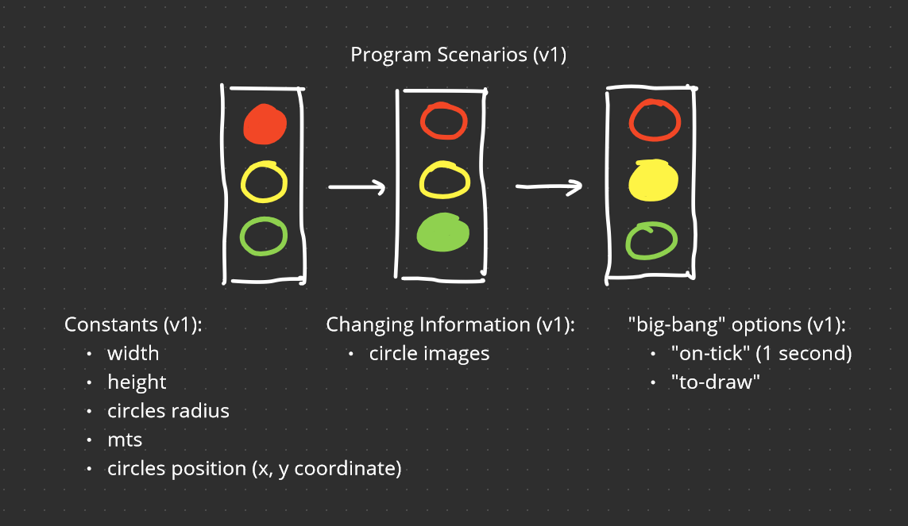

# 0: Introduction

## Welcome

What makes it hard to write programs? When you’re asked to write a program you’re typically given a poorly formed problem. The question is:

> What do we want our problem to do?
> 

The second thing that makes programming hard is that oftentimes the program is too big for us to solve in one go. The question is:

> How do we break down a problem?
> 

That whole trip from poorly-formed problem to well-structured solution that’s systematic design. The course uses a specially designed programming language called Beginner Student Language, BSL.

## Grading

$$
Lecture Questions (25\%) + Quizzes (25\%) + Final Project (50\%) = Final Grade (100\%)
$$

## Course Team

Notes:

- MOOC → Massive Open Online Course
- TA → Teaching Assistant

# 1a: Beginning Student Language

## Module Overview

Learning Goals:

- Be able to write expressions that operate on primitive data including numbers, strings, images and booleans.
- Be able to write constant and function definitions.
- Be able to write out the step-by-step of evaluation of simple expressions including function calls.
- Be able to use the stepper to automatically step through the evaluation of an expression.
- Be able to use the Dr. Racket help desk to discover new primitives.

## Expressions

[expressions.rkt](https://github.com/squxq/How-to-Code-Simple-Data/blob/week-01a/course/week-01a/expressions/expressions.rkt)

The top part of Racket here is called the Definitions Area, and the bottom part is called the Interaction Area. And the way Racket works is we give it expressions, and it evaluates the expression to produce the value. 

```racket
(+ 3 4) ; expression
; outputs 7 -> value
```

To form an expression:

$$
(<primitive> <expression>...)
$$

Note that some primitives can only take in a certain number of expressions. We can make expressions that are even more complicated than that or use other primitive operators.

```racket
(+ 3 (* 2 3))
; outputs 9
```

And there's another rule that says expressions can be actual values. So numbers themselves can be expressions. 

```racket
(/ 12 (* 2 3))
; outputs 2

(sqr 3)
; outputs 9

(sqrt 16)
; outputs 4
```

We've seen several primitives that operate on numbers, primitives like plus, and times, and divide, and minus, and square, and square root.

### Question 1: Pythag

[pythag-starter.no-image.rkt](https://github.com/squxq/How-to-Code-Simple-Data/blob/week-01a/course/week-01a/expressions/pythag-starter.no-image.rkt)

> Assume that the two short sides of a right triangle have length 3 and 4.
> 
> 
> What is the length of the long side? Recall that the Pythagorean Theorem tells us that:
> 
> Write a BSL expression that produces the value of? for this triangle where the other two sides have lengths 3 and 4.
> 

```racket
(sqrt (+ (sqr 3) (sqr 4)))
; outputs 5
```

An irrational number cannot be written as a/b, where a and b are integers; that means its decimal representation is infinitely long (and not repeating like the decimal of 1/3).

```racket
(sqrt 2)
; outputs #i1.4142135623730951
```

The #i means: “This number is close to this, but not exactly this”.

### Question 2: Arithmetic Expression

[arithmetic-expression-starter.no-image.rkt](https://github.com/squxq/How-to-Code-Simple-Data/blob/master/course/week-01a/expressions/arithmetic-expression-starter.no-image.rkt)

> Write the BSL expression that represents the arithmetic expression (7 - 2) * 4 which equals 20.
Do not just write 20! Instead, write BSL expression that clearly mirrors  (7 - 2) * 4.
> 

```racket
(* (- 7 2) 4)
; outputs 20
```

### Question 3: More Arithmetic Expression

[more-arithmetic-expression-starter.no-image.rkt](https://github.com/squxq/How-to-Code-Simple-Data/blob/week-01a/course/week-01a/expressions/more-arithmetic-expression-starter.no-image.rkt)

> Write two expressions that multiply the numbers 3, 5, and 7.
The first should take advantage of the fact that * can accept more than 2 arguments.
The second should build up the result by first multiplying 3 times 5 and then multiplying the result of that by 7.
> 

```racket
(* 3 5 7)
; outputs 105

(* (* 3 5) 7)
; outputs 105
```

### Question 4: Even More Arithmetic Expression

[even-more-arithmetic-expression-starter.no-image.rkt](https://github.com/squxq/How-to-Code-Simple-Data/blob/week-01a/course/week-01a/expressions/even-more-arithmetic-expression-starter.no-image.rkt)

> Write the BSL expression that represents the arithmetic expression:
> 
> 
> (6 + 3) * (9 - 7)
> which equals 18.  Do not just write 18! Instead, write a BSL expression that clearly
> mirrors the arithmetic expression.
> 

```racket
(* (+ 6 3) (- 9 7))
; outputs 18
```

## Evaluation

[evaluation.rkt](https://github.com/squxq/How-to-Code-Simple-Data/blob/week-01a/course/week-01a/evaluation/evaluation.rkt)

An expression, like this one, because it starts with an open parenthesis and the name of a primitive operation, is called a primitive call, or a call to a primitive.

```racket
(+ 2 (* 3 4) (- (+ 1 2) 3))
; outputs 14
; + is an operator, all the expressions that follow the operator are the operands
```

The step-by-step process takes that expression and produces the value 14. The first thing that happens in Racket is to evaluate this entire expression. It seems it’s a primitive call because it starts with an open parenthesis and a primitive operator. The rule for evaluating a primitive call is that all operands must first be reduced to values.

```racket
; expression
(+ 2 (* 3 4) (- (+ 1 2) 3))

; step 1
(+ 2 12      (- (+ 1 2) 3))
; step 2
(+ 2 12      (- 3       3))
; step 3
(+ 2 12                  0)
; step 4 - output
14
```

The intuition to take away from this is that evaluation of an expression in general proceeds from left to right and from inside to outside.

The repeated application of the first evaluation rule, the primitive call rule, can evaluate numerical expressions of arbitrary complexity and leads to a left to right, inside to outside evaluation order.

### Question 5: Evaluation Prims

[evaluation-prims-starter.no-image.rkt](https://github.com/squxq/How-to-Code-Simple-Data/blob/week-01a/course/week-01a/evaluation/evaluation-prims-starter.no-image.rkt)

> Write out the step-by-step evaluation for the following expression:
> 
> 
> (+ (* 2 3) (/ 8 2))
> 

```racket
; expression
(+ (* 2 3) (/ 8 2))

; step 1
(+ 6       (/ 8 2))
; step 2
(+ 6             4)
; step 3 - output
10
```

> Write out the step-by-step evaluation for the following expression:
> 
> 
> (* (string-length "foo") 2)
> 

```racket
; expression
(* (string-length "foo") 2)

; step 1
(* 3                     2)
; step 2 - output
6
```

## Strings and Images

[strings.rkt](https://github.com/squxq/How-to-Code-Simple-Data/blob/week-01a/course/week-01a/strings%26images/strings.rkt)

[images.rkt](https://github.com/squxq/How-to-Code-Simple-Data/blob/week-01a/course/week-01a/strings%26images/images.rkt)

To form a string, for example: “Our team is number 1@!”, we do:

$$
"<any\ characters\ except\ for\ double\ quote>"
$$

```racket
"apple"
; outputs "apple"
```

One thing we could do with strings is put them together. So let's say I have two strings, Ada, which is someone's first name, and Lovelace, which is someone's last name, I can put them together like that:

```racket
(string-append "Ada" " " "Lovelace")
; outputs "Ada Lovelace"
```

And there I get Ada Lovelace. She's very famous as a computer scientist. In the 1840s and the 1840s, she wrote the first computer program ever written. It was written for a machine that, at the time, only existed on paper. The machine itself didn't run until quite recently, but she wrote the program in the 1840s.

```racket
"123" ; This is a string that happens to have the characters 1, 2, and 3 in it. 

123 ; And this is the number, 123.

(+ 1 123) ; In particular, I could take the number and add 1 to it.
; outputs 124

; (+ 1 "123") - I can't take the string and add 1 to it.
; outputs +: expects a number, given "123
```

There are other string primitives, for example, string-length is a primitive which tells us how long a string is. There's another operation called substring, which is going to let me take out parts of the string.

```racket
(string-length "apple")
; outputs 5

           "0123456789" ; Racket uses zero-based indexing.
(substring "Caribou" 2 4)
; outputs "ri"

(substring "0123456789" 2 4)
; outputs "23"

(substring "Caribou" 0 3)
; outputs "Car"
```

DrRacket has lots of different kinds of image functions. For me to use them I have to type, at the top of any file:

```racket
(require 2htdp/image)
```

There's lots and lots of primitives that operate on images, throughout the course I will have the opportunity to use many of them. Here are some basic image primitives:

```racket
(circle 10 "solid" "red") 
; creates a red solid (filled) circle with radius 5

(rectangle 30 60 "outline" "blue")
; creates a blue outlined rectangle with dimensions 30x60

(text "hello" 24 "orange")
; creates an orange text in font 24 that says: "hello"

(above (circle 10 "solid" "red")
       (circle 20 "solid" "yellow")
       (circle 30 "solid" "green"))
; creates 3 circles each one of top of another

(beside (circle 10 "solid" "red")
       (circle 20 "solid" "yellow")
       (circle 30 "solid" "green"))
; creates 3 circles side by side from left to right

(overlay (circle 10 "solid" "red")
       (circle 20 "solid" "yellow")
       (circle 30 "solid" "green"))
; creates 3 circles stacked on top of each other
```

### Question 6: Tile

[tile-starter.no-image.rkt](https://github.com/squxq/How-to-Code-Simple-Data/blob/week-01a/course/week-01a/strings%26images/tile-starter.no-image.rkt)

[tile-starter.rkt](https://github.com/squxq/How-to-Code-Simple-Data/blob/week-01a/course/week-01a/strings%26images/tile-starter.rkt)

> Use the DrRacket square, beside and above functions to create an image like this one (open image file):
> 
> 
> If you prefer to be more creative feel free to do so. You can use other DrRacket image
> 
> functions to make a more interesting or more attractive image.
> 

```racket
(above (beside (square 60 "solid" "blue") (square 60 "solid" "yellow"))
       (beside (square 60 "solid" "yellow") (square 60 "solid" "blue")))

(above (beside (overlay/align "right" "bottom"
                              (square 20 "solid" "blue")
                              (square 40 "solid" "yellow")
                              (square 60 "solid" "blue")) (overlay/align "left" "bottom"
                              (square 20 "solid" "yellow")
                              (square 40 "solid" "blue")
                              (square 60 "solid" "yellow"))) 
       (beside (overlay/align "right" "top"
                              (square 20 "solid" "yellow")
                              (square 40 "solid" "blue")
                              (square 60 "solid" "yellow")) (overlay/align "left" "top"
                              (square 20 "solid" "blue")
                              (square 40 "solid" "yellow")
                              (square 60 "solid" "blue"))))

(above (beside (overlay/xy (square 40 "solid" "yellow") 20 20 (square 40 "solid" "blue"))
               (overlay/xy (square 40 "solid" "blue") -20 20 (square 40 "solid" "yellow")))
       (beside (overlay/xy (square 40 "solid" "yellow") -20 20 (square 40 "solid" "blue"))
               (overlay/xy (square 40 "solid" "blue") 20 20 (square 40 "solid" "yellow"))))

(above (beside (above (beside (crop 30 30 30 30 (circle 30 "solid" "blue"))
               (crop 0 30 30 30 (circle 30 "solid" "yellow")))
       (beside (crop 30 0 30 30 (circle 30 "solid" "yellow"))
               (crop 0 0 30 30 (circle 30 "solid" "blue"))))
               (above (beside (crop 30 30 30 30 (circle 30 "solid" "blue"))
               (crop 0 30 30 30 (circle 30 "solid" "yellow")))
       (beside (crop 30 0 30 30 (circle 30 "solid" "yellow"))
               (crop 0 0 30 30 (circle 30 "solid" "blue")))))
       (beside (above (beside (crop 30 30 30 30 (circle 30 "solid" "blue"))
               (crop 0 30 30 30 (circle 30 "solid" "yellow")))
       (beside (crop 30 0 30 30 (circle 30 "solid" "yellow"))
               (crop 0 0 30 30 (circle 30 "solid" "blue"))))
               (above (beside (crop 30 30 30 30 (circle 30 "solid" "blue"))
               (crop 0 30 30 30 (circle 30 "solid" "yellow")))
       (beside (crop 30 0 30 30 (circle 30 "solid" "yellow"))
               (crop 0 0 30 30 (circle 30 "solid" "blue"))))))
```

### Question 7: Glue

[glue-starter.no-image.rkt](https://github.com/squxq/How-to-Code-Simple-Data/blob/week-01a/course/week-01a/strings%26images/glue-starter.no-image.rkt)

> Write an expression that sticks the strings "Super" "Glue" together into a single string
"Super Glue" with a space between the two words.
> 

```racket
(string-append "Super" " " "Glue")
; outputs "Super Glue"
```

### Question 8: CFlag

[cflag-starter.no-image.rkt](https://github.com/squxq/How-to-Code-Simple-Data/blob/week-01a/course/week-01a/strings%26images/cflag-starter.no-image.rkt)

[cflag-starter.rkt](https://github.com/squxq/How-to-Code-Simple-Data/blob/week-01a/course/week-01a/strings%26images/cflag-starter.rkt)

> The background for the Canadian Flag (without the maple leaf) is this (open the image file):
> 
> 
> Write an expression to produce that background. (If you want to get the
> details right, officially the overall flag has proportions 1:2, and the
> band widths are in the ratio 1:2:1.)
> 

```racket
(define (canRect w h color)
  (rectangle w h "solid" color))

; problem solution
(beside (canRect 10 20 "red") (canRect 20 20 "white") (canRect 10 20 "red"))

; 1st try on a maple leaf
(beside (canRect 10 20 "red") (overlay (star 10 "solid" "red") (canRect 20 20 "white")) (canRect 10 20 "red"))

; complete canadian flag
(beside (canRect 100 200 "red") 
        (overlay (scale 1/8 (bitmap/url "https://upload.wikimedia.org/wikipedia/commons/thumb/f/fd/Maple_Leaf.svg/1200px-Maple_Leaf.svg.png")) 
                 (canRect 200 200 "white")) (canRect 100 200 "red"))
```

### Question 9: Triangle

[triangle-starter.no-image.rkt](https://github.com/squxq/How-to-Code-Simple-Data/blob/master/course/week-01a/strings%26images/triangle-starter.no-image.rkt)

[triangle-starter.rkt](https://github.com/squxq/How-to-Code-Simple-Data/blob/master/course/week-01a/strings%26images/triangle-starter.rkt)

> Write an expression that uses triangle, overlay, and rotate to produce an image similar to this (open image file):
> 
> 
> You can consult the DrRacket help desk for information on how to use triangle and overlay.
> Don't worry about the exact size of the triangles.
> 

```racket
; triangles for visual reference
(triangle 40 "solid" "green")
(triangle 40 "solid" "yellow")
; outputs 2 equilateral triangles with size 40 solid green and yellow

(overlay (triangle 40 "solid" "green") (rotate 180 (triangle 40 "solid" "yellow")))
; outputs 2 overlayed triangles like the previous ones, this time, the yellow one is rotated 180deg
```

### Question 10: Overlay

[overlay-starter.no-image.rkt](https://github.com/squxq/How-to-Code-Simple-Data/blob/master/course/week-01a/strings%26images/overlay-starter.no-image.rkt)

[overlay-starter.rkt](https://github.com/squxq/How-to-Code-Simple-Data/blob/master/course/week-01a/strings%26images/overlay-starter.rkt)

> Write an expression that uses star and overlay to produce an image similar to this (open image file):
> 
> 
> You can consult the DrRacket help desk for information on how to use star and overlay.
> Don't worry about the exact size of the stars.
> 

```racket
; stars for visual reference
(star 10 "solid" "blue")
(star 25 "solid" "yellow")
(star 40 "solid" "blue")
; outputs 3 solid (filled) stars, 2 blue and 1 yellow

(overlay (star 10 "solid" "blue") (star 25 "solid" "yellow") (star 40 "solid" "blue"))
; outputs the previous 3 stars on top of each other (overlayed)
```

### Question 11: Debug Rectangle

[debug-rectangle-starter.no-image.rkt](https://github.com/squxq/How-to-Code-Simple-Data/blob/master/course/week-01a/strings%26images/debug-rectangle-starter.no-image.rkt)

> Uncomment the code below and fix the error(s):
> 
> 
> (rectangle 10 solid red)
> 

```racket
(rectangle 10 solid red)
; outputs solid: this variable is not defined

(rectangle 10 "solid" red)
; outputs red: this variable is not defined

(rectangle 10 "solid" "red")
; outputs rectangle: expects 4 arguments, but found only 3

(rectangle 10 20 "solid" "red")
; outputs the red rectangle
```

## Constant Definitions

[constantDefinitions.no-image.rkt](https://github.com/squxq/How-to-Code-Simple-Data/blob/week-01a/course/week-01a/constantDefinitions/constantDefinitions.no-image.rkt)

Constant definitions are more than just a convenience. They help make programs that are easy for other people to read and change, and those two properties - readability and changeability are two of the most important properties a program can have. 

```racket
(define WIDTH 400)
(define HEIGHT 600)

; expression
(* WIDTH HEIGHT)

; step 1
(* 400 HEIGHT)
; step 2
(* 400 600)
; step 3 - outputs 
240000
```

We often put the names of constants in upper case. Defining a constant doesn’t produce a value. To form a constant definition:

$$
(define\ <name>\ <expression>)\\
name = sequence\ of\ characters\ including: \\ a..z\ \ A..Z\ \ 0..9\ \ !\ \ @\ \ ^\ \ *\ \ _\ \ +\ \ -\ \ =\ \ ?\ \ <\ \ >\ 
$$

Evaluation rules for constant definitions:

- To evaluate a constant definition: evaluate the expression and record the resulting value as the value of the constant with the given name;
- To evaluate a defined constant name: the value is the recorded value.

```racket
(define IMG_CAT "alt: img_cat") ; images are values and all values are expressions
; alt: img_cat

; rotate is for images only
; (define RCAT (rotate -10 IMG_CAT))
; (define LCAT (rotate 10 IMG_CAT))

(define RCAT "alt: img_cat_rotated_right")
(define LCAT "alt: img_cat_rotated_left")

RCAT
; outputs the IMG_CAT rotated 10deg to the right

LCAT
; outputs the IMG_CAT rotated 10deg to the left
```

It is only possible to define a constant name one time.

## Function Definitions

[functionDefinitions.rkt](https://github.com/squxq/How-to-Code-Simple-Data/blob/week-01a/course/week-01a/functionDefinitions/functionDefinitions.rkt)

Functions are the mechanisms in the BSL that are going to produce a different value each time they run. Is easy to be bothered by the amount of redundancy in the following expression:

```racket
; all the (circle 40 "solid" ...) is unchanging
(above (circle 40 "solid" "red") ; only "red" is changing 
       (circle 40 "solid" "yellow") ; only "yellow" is changing
       (circle 40 "solid" "green")) ; only "green" is changing
```

Creating a function definition comes down to:

$$
(define\ (<function\ name>\ <argument\ (parameter)>...) <expression\ (body)>)\\
parameters\ (from\ math\ functions)\ stand\ for\ varying\ value\\
$$

To form a function call expression:

$$
(<function\ name>\ <expression(operand)>...)\\
the\ number\ of\ expressions\ correspond\ to\ the\ number\ of\ parameters
$$

A function can be used repeatedly with any value each time.

```racket
(define (bulb c)
				(circle 40 "solid" c))

(bulb "red")
; outputs a red circle

(bulb "yellow")
; outputs a yellow circle

(bulb "green")
; outputs a green circle
```

In the end, this expression is more concise than the original expression. It reduces duplication and gives the code more meaning.

To evaluate function definitions:

- To evaluate function definitions: simply record definition;
- To evaluate function call: first, reduce operands to values (called arguments). Then replace the function call with the body of the function in which every occurrence of the parameter(s) is replaced by the corresponding argument.

```racket
; expression
(bulb (string-append "re" "d"))

; step 1 - function call
(bulb "red")

; step 2 - replace function call function body
(circle 40 "solid" "red")

; step 3 - primitive call
; outputs a solid red circle with radius 20
```

Just as an aside, to understand how powerful functions are, one of the most important theoretical results in computer science says that if I have a language that just has functions, just functions, no strings, no numbers, I could actually write any program that can be written in any language.

### Question 12: Function Writing

[function-writing-starter.no-image.rkt](https://github.com/squxq/How-to-Code-Simple-Data/blob/master/course/week-01a/functionDefinitions/function-writing-starter.no-image.rkt)

> Write a function that consumes two numbers and produces the larger of the two.
> 

```racket
(define (larger a b)
  (if (> a b)
      a
      (if (< a b)
          b
          "Both numbers are equal")))

(larger 9 4)
; outputs 9, 9 > 4

(larger 4 9)
; outputs 9, 4 < 9

(larger 4 4)
; outputs "Both numbers are equal"
```

## Booleans and If Expressions

[booleans.rkt](https://github.com/squxq/How-to-Code-Simple-Data/blob/week-01a/course/week-01a/booleans%26ifExpressions/booleans.rkt)

[ifExpressions.no-image.rkt](https://github.com/squxq/How-to-Code-Simple-Data/blob/week-01a/course/week-01a/booleans%26ifExpressions/ifExpressions.no-image.rkt)

In computer programs, true-false questions turn out to be fundamental. A boolean represents the answer to true-false questions. There are two boolean values:

```racket
true ; outputs true

false ; outputs false
```

The primitives that produce a true-false value are often called predicates. Therefore, the greater-than and greater-than-or-equal-to primitives are predicates.

```racket
(define WIDTH 100)
(define HEIGHT 100)

(> WIDTH HEIGHT) ; > is a predicate
; outputs false - WIDTH = HEIGHT

(>= WIDTH HEIGHT) ; >= is a predicate
; outputs true

(= 1 2)
; outputs false - 1 < 2

(= 1 1)
; outputs true

(> 3 9)
; outputs false - 3 < 9

(string=? "foo" "bar")
; outputs false - those two strings are not equal

(define I1 (rectangle 10 20 "solid" "red"))
(define I2 (rectangle 20 10 "solid" "blue"))

(< (image-width I1)
	 (image-width I2))
; outputs true - the width of I1 = 10 and the width of I2 = 20, 10 < 20
```

To form an if expression:

$$
(if\ <expression> - question\\
<expression> - true\ answer\\
<expression>) - false\ answer\\
The\ question\ expression\ must\ produce\ a\ boolean\ value.
$$

```racket
(if (< (image-width I1) (image-height I1)) ; here I1 and I2 can be changed
    "tall"
    "wide") ; when the "tall" expression is outputed "wide" gets highlighted and vice-versa
; if the constant used is I1, it outputs "tall" - 10 < 20
; if the constant used is I2, it outputs "wide" - 20 > 10
```

To evaluate an if expression:

- If the question expression is not a value evaluate it, and replace with value.
- If the question is true replace entire if expression with true answer expression.
- If the question is false replace entire if expression with false answer expression.
- If the question is a value other than true or false, produce an error.

```racket
; expression
(if (< (image-width I2)
       (image-height I2))
    (image-width I2)
    (image-height I2))

; step 1
(if (< 20 ; (image-width "alt: solid blue rectangle with dimensions 20x10")
       (image-height I2))
    (image-width I2)
	  (image-height I2))

; step 2
(if (< 20
       (image-height I2))
    (image-width I2)
	  (image-height I2))

; step 3
(if (< 20
       10; (image-height "alt: solid blue rectangle with dimensions 20x10")
       )
    (image-width I2)
	  (image-height I2))

; step 4
(if (< 20
       10)
    (image-width I2)
	  (image-height I2))

; step 5
(if false
    (image-width I2)
	  (image-height I2))

; step 6
(image-height I2)

; step 7
10 ; (image-height "alt: solid blue rectangle with dimensions 20x10".)

; step 8
10
```

Notes: 

- ctrl-D or cmd-D hides the definitions area.
- ctrl-E or cmd-E hides the interactions area.

```racket
(> (image-height I1) (image-height I2))
; outputs true

(> (image-width I1) (image-width I2))
; outputs true
```

In the case of me wanting to know if I1 was both taller and skinnier than I2 we would use another primitive called “and”:

```racket
(and (> (image-height I1) (image-height I2)) 
     (< (image-width I1) (image-width I2)))
; outputs true
```

To form “and” expression:

$$
(and\ <expression>\ <expression>...)\\
All\ <expressions>\ must\ produce\ boolean.
$$

To evaluate “and” expression, evaluate <expression> one at a time:

- If an <expression> produces false immediately produce false.
- If all <expression> produce true, then produce true.

There are also the primitives “or” and “not”.

### Question 13: Compare Images

[compare-images-starter.no-image.rkt](https://github.com/squxq/How-to-Code-Simple-Data/blob/week-01a/course/week-01a/booleans%26ifExpressions/compare-images-starter.no-image.rkt)

> Based on the two constants provided, write three expressions to determine whether:
> 
> 
> 1) IMAGE1 is taller than IMAGE2
> 2) IMAGE1 is narrower than IMAGE2
> 3) IMAGE1 has both the same width AND height as IMAGE2
> 

```racket
(define IMAGE1 (rectangle 10 15 "solid" "red"))
(define IMAGE2 (rectangle 15 10 "solid" "red"))

IMAGE1
IMAGE2
; outputs the images for visual reference

; expression 1)
(if (> (image-height IMAGE1) (image-height IMAGE2))
    "IMAGE1 is taller than IMAGE2"
    "IMAGE1 is not taller than IMAGE2")

; expression 2)
(if (< (image-width IMAGE1) (image-width IMAGE2))
    "IMAGE1 is narrower than IMAGE2"
    "IMAGE1 is not narrower than IMAGE2")

; expression 3)
(if (and (= (image-width IMAGE1) (image-width IMAGE2)) (= (image-width IMAGE1) (image-width IMAGE2)))
    "IMAGE1 has both the same width AND height as IMAGE2"
    "IMAGE1 does not have both the same width AND height as IMAGE2")
```

## Using the Stepper

[stepper.rkt](https://github.com/squxq/How-to-Code-Simple-Data/blob/week-01a/course/week-01a/stepper/stepper.rkt)

The Stepper is a functionality built into Dr. Racket that can help you understand the step-by-step evaluation of complex expressions. It’s essentially a debugger. I can access the stepper by clicking, in the top right corner, on a button that says: Step >|. Below is the code used to test the Dr. Racket Stepper:

```racket
(+ (* 3 2) 1)
; outputs 7

(define (max-dim img)
  (if (> (image-width img) (image-height img))
      (image-width img)
      (image-height img)))

(max-dim (rectangle 10 20 "solid" "blue"))
; outputs 20
```

### Question 14: Foo Evaluation

[foo-evaluation-starter.no-image.rkt](https://github.com/squxq/How-to-Code-Simple-Data/blob/master/course/week-01a/stepper/foo-evaluation-starter.no-image.rkt)

> Given the following function definition:
> 
> 
> (define (foo s)
>   (if (string=? (substring s 0 1) "a")
>       (string-append s "a")
>       s))
> 
> Write out the step-by-step evaluation of the expression:
> 
> (foo (substring "abcde" 0 3))
> 
> Be sure to show every intermediate evaluation step.
> 

```racket
(define (foo s)
  (if (string=? (substring s 0 1) "a")
      (string-append s "a")
      s))

; expression
(foo (substring "abcde" 0 3))

; step 1
(foo "abc")

; step 2
(if (string=? (substring "abc" 0 1) "a")
    (string-append "abc" "a")
    "abc")

; step 3
(if (string=? "a" "a")
    (string-append "abc" "a")
    "abc")

; step 4
(if true (string-append "abc" "a") "abc")

; step 5
(string-append "abc" "a")

; step 6 - output
"abca"
```

### Question 15: More Foo Evaluation

[more-foo-evaluation-starter.no-image.rkt](https://github.com/squxq/How-to-Code-Simple-Data/blob/week-01a/course/week-01a/stepper/more-foo-evaluation-starter.no-image.rkt)

> Given the following function definition:
> 
> 
> (define (foo n)
>   (* n n))
> 
> Write out the step-by-step evaluation of the expression:
> 
> (foo (+ 3 4))
> 
> Be sure to show every intermediate evaluation step.
> 

```racket
(define (foo n)
  (* n n))

; expression
(foo (+ 3 4))

; step 1
(foo 7)

; step 2
(* 7 7)

; step 3 - output
49
```

### Question 16: Even More Foo Evaluation

[even-more-foo-evaluation-starter.no-image.rkt](https://github.com/squxq/How-to-Code-Simple-Data/blob/week-01a/course/week-01a/stepper/even-more-foo-evaluation-starter.no-image.rkt)

> Given the following function definition:
> 
> 
> (define (farfle s)
>   (string-append s s))
> 
> Write out the step-by-step evaluation of the expression:
> 
> (farfle (substring "abcdef" 0 2))
> 
> Be sure to show every intermediate evaluation step.
> 

```racket
(define (farfle s)
  (string-append s s))

; expression
(farfle (substring "abcdef" 0 2))

; step 1
(farfle "ab")

; step 2
(string-append "ab" "ab")

; step 3 - output
"abab"
```

### Question 17: Booble Evaluation

[bobble-evaluation-starter.no-image.rkt](https://github.com/squxq/How-to-Code-Simple-Data/blob/master/course/week-01a/stepper/bobble-evaluation-starter.no-image.rkt)

> Given the following function definition:
> 
> 
> (define (bobble s)
>   (if (<= (string-length s) 6)
>       (string-append s "ible")
>       s))
> 
> Write out the step-by-step evaluation of the expression:
> 
> (bobble (substring "fungus" 0 4))
> 
> Be sure to show every intermediate evaluation step (including the original expression
> and the final result, our answer has 7 steps).
> 

```racket
(define (booble s)
  (if (<= (string-length s) 6)
      (string-append s "ible")
      s))

; expression
(booble (substring "fungus" 0 4))

; step 1
(booble "fung")

; step 2
(if (<= (string-length "fung") 6)
    (string-append "fung" "ible")
    "fung")

; step 3
(if (<= 4 6) (string-append "fung" "ible") "fung")

; step 4
(if true (string-append "fung" "ible") "fung")

; step 5
(string-append "fung" "ible")

; step 6 - output
"fungible"
```

## Discovering Primitives

[discoveringPrimitives.rkt](https://github.com/squxq/How-to-Code-Simple-Data/blob/week-01a/course/week-01a/discoveringPrimitives/discoveringPrimitives.rkt)

There are two general techniques for discovering new primitives. The first one is to make a lucky guess. What happens after I’ve been programming for a while with a language, I start to get a pretty good sense of what the naming conventions are.

```racket
(triangle 40 "solid" "purple")
; outputs a filled purple equilateral triangle with sides being 40
```

In the example above, if I am not sure what any of the arguments mean, let’s say the number 40, right-click on Windows, or control-click on Mac, then select: Search in Help Desk for “triangle” (in this case). This brings up the Dr. Racket documentation for “triangle”.

The other technique is called “search and scroll”, where I look up the documentation for a related function and then scroll around looking for the thing I want.

```racket
(/ 3 4)
; outputs 0.75 but I would like to round the number

; after searching the documentation
(round (/ 3 4))
; outputs 1
```

# 1b: How to Design Functions

## Module Overview

### Learning Goals:

- Be able to use the How to Design Functions (HtDF) recipe to design functions that operate on primitive data.
- Be able to read a complete function design and identify its different elements.
- Be able to evaluate the different elements for clarity, simplicity and consistency with each other.
- Be able to evaluate the entire design for how well it solves the given problem.

Design methods often make simple problems harder to solve. This pays back later by making really hard problems much easier to solve.

## Full Speed HtDF Recipe

[fullSpeedHtDFRecipe.no-image.rkt](https://github.com/squxq/How-to-Code-Simple-Data/blob/week-01b/course/week-01b/fullSpeedHtDFRecipe/fullSpeedHtDFRecipe.no-image.rkt)

The HtDF, how to design functions, recipe systematizes the design of a function, so it tells me what to do first, second, and third, all the way through the design of a function, so we end up with a high-quality function. 

What a design recipe does is it makes hard problems easier. It lets us take a big, hard problem, break it down, and work through it in a systematic fashion. The price we pay for that is that it makes easy problems cumbersome.

The HtDF recipe consists of the following steps:

1. [Signature, purpose and stub.](https://courses.edx.org/courses/course-v1:UBCx+HtC1x+2T2017/77860a93562d40bda45e452ea064998b/#S1)
2. [Define examples, wrap each in check-expect.](https://courses.edx.org/courses/course-v1:UBCx+HtC1x+2T2017/77860a93562d40bda45e452ea064998b/#S2)
3. [Template and inventory.](https://courses.edx.org/courses/course-v1:UBCx+HtC1x+2T2017/77860a93562d40bda45e452ea064998b/#S3)
4. [Code the function body.](https://courses.edx.org/courses/course-v1:UBCx+HtC1x+2T2017/77860a93562d40bda45e452ea064998b/#S4)
5. [Test and debug until correct](https://courses.edx.org/courses/course-v1:UBCx+HtC1x+2T2017/77860a93562d40bda45e452ea064998b/#S5)

```racket
; step 1
; Number -> Number ; signature
; produce 2 times the given number ; purpose
; (define (double n) 0) ; stub

; step 2  
(check-expect (double 3) 6)
(check-expect (double 4.2) (* 2 4.2))
; if the examples run it tells me that they are well-formed

; step 3
; (define (double n)
;   (... n))

; step 4 - with a copy of the template
(define (double n)
  (* 2 n))

; step 5
; run the code and check for test errors
```

## Slow Motion HtDF Recipe

[slowMotionHtDFRecipe.rkt](https://github.com/squxq/How-to-Code-Simple-Data/blob/week-01b/course/week-01b/slowMotionHtDFRecipe/slowMotionHtDFRecipe.rkt)

The first step of the recipe is to write the signature. The job of the signature is to tell me what type of data a function consumes and what type of data it produces. To form a signature:

$$
Type...\ -> Type\\
For\ now,\ primitive\ types\ are:\\
Number,\ Integer,\ Natural,\ String,\ Image,\ Boolean
$$

In this case:

```racket
; step 1 - signature, purpose and stub
;; Number -> Number ; signature
```

Now, the purpose. The job of the purpose is to give me a succinct (1 line) description of what the function produces given what it consumes.

```racket
;; produce 2 times the given number ; purpose
```

The signature and the purpose are permanently commented out so we start each line with ;;(SPACE) to distinguish them from other comments.

The stub is like a piece of scaffolding that we’re going to put in place for a short period of time. So it only lasts a short while, but it will do an important piece of work.

Stub is a function that:

- Has correct function name;
- Has correct number of parameters;
- Produces dummy result of correct type.

```racket
(define (double n) 0) ; stub
```

The second step involves creating examples and tests because they’re going to serve both roles. Sometimes it’s easier to design a general function if I start with some very specific examples of what it’s going to do.

Examples/tests:

- Examples help us understand what function must do.
- Multiple examples to illustrate behavior.
- Wrapping in “check-expect” means they will also serve as unit tests for the completed function.

```racket
; step 2 - define examples (also known as [unit] tests), wrap each in check-expect
(check-expect (double 3) 6)
(check-expect (double 4.2) 8.4)
; Number -> real numbers, integers, natural, etc.
; These two examples serve to really illustrate that I don't just mean integers.
; run the code and check if both tests run, although they will fail that goal is to see if they are well-formed
```

To make sure that the examples, the “check-expects” are well-formed, is where the stub is going to help. By running a program with “check-expects” in it, Dr. Racket checks to see if each one matches the stub’s result. The point here is to see if all the tests run.

Every step of the recipe helps with the steps after it.

The next step of the recipe is the template, sometimes called inventory. The role of the template is to give us the outline of the function. The body of the template is the outline of the function. For now, the body of the template is (… x), where x is the parameter to the function.

```racket
; step 3 - template and inventory
(define (double n)
	(... n))
```

In the next step, coding the function body, I’m going to use what I’ve written before to help me know how to finish the function body. One thing that might be useful sometimes is to elaborate the examples.

```racket
; step 4 - code the function body
(define (double n)
	(* 2 n))
```

The last step is to run the tests, by running the program.

```racket
; step 5 - test and debug until correct
; simply run the program and fix possible issues (errors and warnings)
```

## A Simple Practice Example

[simplePracticeExample.no-image.rkt](https://github.com/squxq/How-to-Code-Simple-Data/blob/week-01b/course/week-01b/simplePracticeExample/simplePracticeExample.no-image.rkt)

Purpose statements are often cumbersome the first time I write them, so it is a good idea to try and rewrite them. Labeling stub and template is always a good practice.

### Question 18: A First HtDF Problem

[firstHtDFProblem.no-image.rkt](https://github.com/squxq/How-to-Code-Simple-Data/blob/week-01b/course/week-01b/simplePracticeExample/firstHtDFProblem.no-image.rkt)

> Design a function that pluralizes a given word. (Pluralize means to convert the word to its plural form.) For simplicity, you may assume that just adding s is enough to pluralize a word.
> 

```racket
; step 1 - signature, purpose and stub
;; String -> String ; signature
;; pluralize given word (only adding s) ; purpose
;(define (pluralize word) "word") ; stub

; step 2 define examples/tests
(check-expect (pluralize "toast") "toasts")
(check-expect (pluralize "school") "schools")

; step 3 - template and inventory
;(define (pluralize word)
;  (... word))

; step 4 - code the function body
(define (pluralize word)
  (string-append word "s"))

; step 5
; run the code and check for test errors
```

Here is a more challenging version of the problem where there are taken into account more plural noun rules:

```racket
; More challenging version
;; String -> String
;; pluralize given word (all pluran noun rules)
;(define (plural word) "word")

(check-expect (plural "cat") "cats")
(check-expect (plural "house") "houses")
; add -s to the end

(check-expect (plural "iris") "irises")
(check-expect (plural "truss") "trusses")
(check-expect (plural "marsh") "marshes")
(check-expect (plural "lunch") "lunches")
(check-expect (plural "tax") "taxes")
(check-expect (plural "blitz") "blitzes")
; if the singular noun ends in -s, -ss, -sh, -ch, -x, -z, add -es - if statement

(check-expect (plural "roof") "roofs")
(check-expect (plural "belief") "beliefs")
(check-expect (plural "chef") "chefs")
(check-expect (plural "chief") "chiefs")
; if the noun ends with -f or -ef, add an -s

(check-expect (plural "city") "cities")
(check-expect (plural "puppy") "puppies")
; if the singular noun ends in -y and the letter before -y is a consonant, change the ending to -ies - if statement

(check-expect (plural "ray") "rays")
(check-expect (plural "boy") "boys")
; if the singular noun ends in -y and the letter before -y is a vowel, add -s

(check-expect (plural "cactus") "cacti")
(check-expect (plural "focus") "foci")
; if the singular noun ends in -us the plural ending is frequently -i - if statement

(check-expect (plural "analysis") "analyses")
(check-expect (plural "allipsis") "allipses")
; if the singular noun ends in -is, the plural ending is -es - if statement

(check-expect (plural "phenomenon") "phenomena")
(check-expect (plural "criterion") "criteria")
; if the singular noun ends in -on, the plural ending is usually -a - if statement

; step 3 - template and inventory
;(define (plural word)
;  (... word))

; step 4 - code the function body
(define esArr (list "s" "ss" "sh" "ch" "x" "z"))
(define vowels (list "a" "e" "i" "o" "u"))

(define (plural word)
  (cond
    ; Check for words ending in "us" except for "us" itself
    ((string=? (substring word (- (string-length word) 2) (string-length word)) "us")
     (string-append (substring word 0 (- (string-length word) 2)) "i"))
    
    ; Check for words ending in "is" except for "iris"
    ((and (string=? (substring word (- (string-length word) 2) (string-length word)) "is")
          (not (string=? word "iris")))
     (string-append (substring word 0 (- (string-length word) 2)) "es"))
    
    ; Check for words ending in certain suffixes
    ((or (member (substring word (- (string-length word) 1) (string-length word)) esArr)
         (member (substring word (- (string-length word) 2) (string-length word)) esArr))
     (string-append word "es"))
    
    ; Check for words ending in "y" after a consonant
    ((and (not (member (substring word (- (string-length word) 2) (- (string-length word) 1)) vowels))
          (string=? (substring word (- (string-length word) 1) (string-length word)) "y"))
     (string-append (substring word 0 (- (string-length word) 1)) "ies"))
    
    ; Check for words ending in "on"
    ((string=? (substring word (- (string-length word) 2) (string-length word)) "on")
     (string-append (substring word 0 (- (string-length word) 2)) "a"))
    
    ; Default case: just add "s" to the word
    (else (string-append word "s"))))

; step 5
; run the code and check for test errors
```

## When Tests are Incorrect

[whenTestsIncorrect.no-image.rkt](https://github.com/squxq/How-to-Code-Simple-Data/blob/week-01b/course/week-01b/whenTestsIncorrect/whenTestsIncorrect.no-image.rkt)

The purpose needs to tell me something more specific than the signature about exactly what we do with the given number and exactly what the number we produce means.

```racket
;; Number -> Number
;; given the length of one side of the square, produce the area of the square

; this is not a good purpose, because it repeats the signature
;; given number produce number

;(define (area s) 0) ; stub
; a good dummy value to produce is 0

(check-expect (area 3) 3) ; for now, pretend you didn't notice this mistake
(check-expect (area 3.2) (* 3.2 3.2))

;(define (area s) ; template
; 	(... s))

(define (area s)
	(* s s))
```

When running this program a failing test comes up: Actual value 9 differs from 3, the expected value. By clicking it, it directs us to the corresponding test where I can spot that the test is wrong: the area of a square with side 3, is 9 not 3 as mentioned in the test.

```racket
(check-expect (area 3) 9)
```

If a test fails (a “check-expect” fails), it could be that:

- The function definition is wrong.
- The test is wrong.
- They are both wrong.

Note: always check the test before fixing the function definition. If a test is wrong and I make the function conform to it, then the function will be wrong.

## Varying Recipe Order

[varyingRecipeOrder.no-image.rkt](https://github.com/squxq/How-to-Code-Simple-Data/blob/week-01b/course/week-01b/varyingRecipeOrder/varyingRecipeOrder.no-image.rkt)

The “How to Design Functions” recipe is not intended to be what’s called a waterfall process. There is some flexibility following the steps of the process.

```racket
;; Image -> Number ; not the most specific signature
;; produce image's width * height (area)

;(define (image-area img) 0) ; stub

(check-expect (image-area (rectangle 2 3 "solid" "red")) (* 2 3))

;(define (image-area img) ; template
; 	(... img))

(define (image-area img)
	(* (image-width img) (image-height img)))
```

Images are always sized in pixels and pixels are always a natural number. If the image’s width and height are always going to be a natural number and I multiply those two, the function returns a Natural, not a Number. When writing the signature for a function, you always want to use the most specific types that are correct (Natural is more specific than Number).

```racket
; this would turn out to be a better signature simply because it's more specific
;; Image -> Natural
```

## Poorly Formed Problems

[poorlyFormedProblems.no-image.rkt](https://github.com/squxq/How-to-Code-Simple-Data/blob/week-01b/course/week-01b/poorlyFormedProblems/poorlyFormedProblems.no-image.rkt)

Design is the process of going from a poorly formed problem to a well-structured solution. When designing functions which produce a boolean, the purpose specifies how to interpret the output.

```racket
;; Image -> Boolean
;; produce true if the image is tall

; functions that produce a boolean have a name that ends in a question mark

;(define (tall? img) false) ; stub

(check-expect (tall? (rectangle 2 3 "solid" "red")) true)
```

How many tests does this function need? For now, I will assume that it only needs the above test. That won’t turn out to be right, but I’ll see what happens.

```racket
;(define (tall? img)
; 	(... img))

(define (tall? img)
	(if (> (image-height img) (image-width img))
		true
		false)) ; highlighted
```

The test passed but is the function properly tested? One clue that I haven’t, Dr Racket is giving us in the way it’s colored the keyword false.

The highlighting means that after running all the “check-expects” in this file, this part of the program was never evaluated. The tests do not have complete code coverage. Code coverage means: giving all my tests, how much of the code is being evaluated. At a minimum, my tests should have complete code coverage. After all the tests are run there should be no unexecuted code.

```racket
(check-expect (tall? (rectangle 3 2 "solid" "red")) false)
```

What if the image width and height are the same? This is a thing that happens in function and program design all the time. Partway through the design process there’s a boundary condition, or corner case, that I haven’t quite thought of.

Thinking of a new case, or a new subtlety part way through the design is common. When it happens:

- Write an example (test) right away.
- Update all affected parts of design, often this involves purpose and/or function definition.
- It sometimes involves existing tests or even the signature.

```racket
(check-expect (tall? (rectangle 3 3 "solid" "red")) false)

; new purpose
;; produce true if the image is tall (height is greater than width)
```

A minor detail:

$$
(if\ <anything>\ true\ false)\ \ \ \ \ <=>\ \ \ \ \ <anything>
$$

So by definition:

```racket
; it's possible to rewrite the function definition as:
(define (tall? img)
	(> (image-height img) (image-width img)))
```

### Question 19: Summon

[summon-starter.no-image.rkt](https://github.com/squxq/How-to-Code-Simple-Data/blob/week-01b/course/week-01b/poorlyFormedProblems/summon-starter.no-image.rkt)

> Design a function that generates a summoning charm. For example:

   (summon "Firebolt") should produce "accio Firebolt"
   (summon "portkey")  should produce "accio portkey"
   (summon "broom")    should produce "accio broom"
> 
> 
> See [http://harrypotter.wikia.com/wiki/Summoning_Charm](http://harrypotter.wikia.com/wiki/Summoning_Charm) for background on
> summoning charms.
> 
> Remember, when we say DESIGN, we mean follow the recipe.
> 
> Follow the HtDF recipe and leave behind commented-out versions of the stub and template.
> 

```racket
;; String -> String
;; if string is not empty append "accio " to given string, else return empty string

; stub
;(define (summon word) "")

; tests
(check-expect (summon "Firebolt") "accio Firebolt")
(check-expect (summon "portkey") "accio portkey")
(check-expect (summon "broom") "accio broom")

; template
;(define (summon word)
;  (... word))

; function definition
;(define (summon word)
;  (string-append "accio " word))

; what if string is empty?

; tests
(check-expect (summon "") "")

; re-designing function
(define (summon word)
  (if (> (string-length word) 0)
      (string-append "accio " word)
      ""))
```

### Question 20: Less than Five

[less-than-five-starter.no-image.rkt](https://github.com/squxq/How-to-Code-Simple-Data/blob/week-01b/course/week-01b/poorlyFormedProblems/less-than-five-starter.no-image.rkt)

> DESIGN function that consumes a string and determines whether its length is
less than 5.  Follow the HtDF recipe and leave behind commented-out versions
of the stub and template.
> 

```racket
;; String -> Boolean
;; return true if given string length is less than five

; stub
;(define (less5? s) "")

; tests
(check-expect (less5? "home") true) ; word length less than 5
(check-expect (less5? "toast") false) ; word length equal to 5
(check-expect (less5? "gregarious") false) ; word length greater than 5

; template
;(define (less5? s)
;  (... s))

; function definition
(define (less5? s)
  (< (string-length s) 5))
```

### Question 21: Boxify

[boxify-starter.no-image.rkt](https://github.com/squxq/How-to-Code-Simple-Data/blob/week-01b/course/week-01b/poorlyFormedProblems/boxify-starter.no-image.rkt)

[boxify-starter.rkt](https://github.com/squxq/How-to-Code-Simple-Data/blob/week-01b/course/week-01b/poorlyFormedProblems/boxify-starter.rkt)

> Use the How to Design Functions (HtDF) recipe to design a function that consumes an image,
and appears to put a box around it. Note that you can do this by creating an "outline"
rectangle that is bigger than the image, and then using overlay to put it on top of the image.
For example:

(boxify (ellipse 60 30 "solid" "red")) should produce (open image file):
(overlay (ellipse 60 30 "solid" "red") (rectangle 62 32 "outline" "black"))
> 
> 
> 
> Remember, when we say DESIGN, we mean follow the recipe.
> 
> Leave behind commented out versions of the stub and template.
> 

```racket
;; Image -> Image
;; create a outline rectangle bigger than the given image

; stub
;(define (boxify img) (rectangle 20 10 "ouline" "black"))

; tests
(check-expect (boxify (ellipse 60 30 "solid" "red")) (overlay (ellipse 60 30 "solid" "red") (rectangle 62 32 "outline" "black"))) ; open image file

(define TRIANGLE (triangle 40 "solid" "red"))
(check-expect (boxify (triangle 40 "solid" "red")) (overlay TRIANGLE (rectangle (+ (image-width TRIANGLE) 2) (+ (image-height TRIANGLE) 2) "outline" "black"))) ; open image file

; template
;(define (boxify img)
;  (... img))

; function definition
(define (boxify img)
  (overlay img (rectangle (+ (image-width img) 2) (+ (image-height img) 2) "outline" "black")))
```

### Question 22: Pluralize Stubs

[pluralize-stubs-starter.no-image.rkt](https://github.com/squxq/How-to-Code-Simple-Data/blob/week-01b/course/week-01b/poorlyFormedProblems/pluralize-stubs-starter.no-image.rkt)

> You are working on designing a function and have completed your signature and purpose.

Write three stubs with different bodies that are consistent with the signature and purpose below.
Put the three stubs in a comment box.

;; String -> String
;; pluralizes str by appending "s" to the end
> 

```racket
; stubs
;(define (pluralize str) "")
;(define (pluralize str) "houses")
;(define (pluralize str) "gardens")

; tests
(check-expect (pluralize "house") "houses")
(check-expect (pluralize "garden") "gardens")
; for strings that are not empty
(check-expect (pluralize "") "")

; template
;(define (pluralize str)
;  (... str))

; function definition
(define (pluralize str)
  (if (> (string-length str) 0)
      (string-append str "s")
      ""))
```

### Question 23: Blue Triangle

[blue-triangle-starter.no-image.rkt](https://github.com/squxq/How-to-Code-Simple-Data/blob/week-01b/course/week-01b/poorlyFormedProblems/blue-triangle-starter.no-image.rkt)

> Design a function that consumes a number and produces a blue solid triangle of that size.

You should use The How to Design Functions (HtDF) recipe, and your complete design should include
signature, purpose, commented out stub, examples/tests, commented out template and the completed function.
> 

```racket
;; Natural -> Image ; its a Natural because pixels are Natural Numbers
;; return a blue solid triangle with side size of given natural number (pixels)

; stub
;(define (generateTriangle num) (triangle 40 "solid" "blue"))

; tests
(check-expect (generateTriangle 20) (triangle 20 "solid" "blue"))
(check-expect (generateTriangle 0) "Must provide a Natural number.")
(check-expect (generateTriangle -10) "Must provide a Natural number.")

; template
;(define (generateTriangle num)
;  (... num))

; function definition
(define (generateTriangle num)
  (if (> num 0)
      (triangle num "solid" "blue")
      "Must provide a Natural number."))
```

### Question 24: Double Error

[double-error-starter.no-image.rkt](https://github.com/squxq/How-to-Code-Simple-Data/blob/week-01b/course/week-01b/poorlyFormedProblems/double-error-starter.no-image.rkt)

> There may be more than one problem with this function design. Uncomment
the function design below, and make the minimal changes required to
resolve the error that occurs when you run it.
> 

```racket
;;; Number -> Number
;;; doubles n ; bad purpose
;(check-expect (double 0) 0)
;(check-expect (double 4) 8)
;(check-expect (double 3.3) (* 2 3.3))
;(check-expect (double -1) -2)
;
;#;
;(define (double n) 0) ; stub
;
;; no template
;
;(define (double n)
;  (* (2 n)))
;; outputs function call: expected a function after the open parenthesis, but found a number

;; Number -> Number
;; multiplies given number by 2 ; better purpose

(check-expect (double 0) 0)
(check-expect (double 4) 8)
(check-expect (double 3.3) (* 2 3.3))
(check-expect (double -1) -2)

#;
(define (double n) 0) ; stub

; template
;(define (double n)
;  (... n))

(define (double n)
  (* 2 n))
```

### Question 25: Make Box

[make-box-starter.no-image.rkt](https://github.com/squxq/How-to-Code-Simple-Data/blob/week-01b/course/week-01b/poorlyFormedProblems/make-box-starter.no-image.rkt)

> You might want to create boxes of different colors.

Use the How to Design Functions (HtDF) recipe to design a function that consumes a color, and creates a
solid 10x10 square of that colour.  Follow the HtDF recipe and leave behind commented-out versions of
the stub and template.
> 

```racket
; Strings, symbols, and color structs are allowed as colors.
; (image-color? x) -> boolean, x: any/c

;; Color <String, Symbol, Color Structs> -> Image
;; Return a solid 10x10 Square of given color

; stub
;(define (generateSquare color) (square 10 "solid" "red"))

; tests
(check-expect (generateSquare "red") (square 10 "solid" "red"))
(check-expect (generateSquare "Red") (square 10 "solid" "Red"))
; colors are not case sensitive, so both "red" and "Red" are allowed
(check-expect (generateSquare "light orange") (square 10 "solid" "light orange"))
(check-expect (generateSquare "lightorange") (square 10 "solid" "lightorange"))
; Spaces are not considered, so "light orange" is the same as "lightorange"
; the complete list of colors is the same as the colors allowed in color-database<%>
(check-expect (generateSquare "transparent") (square 10 "solid" "transparent"))
; and the color "transparent"
(check-expect (generateSquare "light brown") (square 10 "solid" "light brown"))
; and the additional variants of the colors: Brown, Cyan, Goldenrod, Gray, Green, Orange, Pink, Purple, Red, Turquoise, and Yellow, like "light brown"

;(struct color (red green blue alpha)
;  #:extra-constructor-name make-color)
;  red : (integer-in 0 255)
;  green : (integer-in 0 255)
;  blue : (integer-in 0 255)
;  alpha : (integer-in 0 255)

(check-expect (generateSquare (make-color 255 0 255)) (square 10 "solid" (make-color 255 0 255)))
; colors as color struct using the constructor make-color

(check-expect (generateSquare "hello") "Please provide a valid color.")
(check-expect (generateSquare "") "Please provide a valid color.")
; for Strings that are not valid colors

; template
;(define (generateSquare color)
;  (... color))

; function definition
(define (generateSquare color)
  (if (image-color? color)
      (square 10 "solid" color)
      "Please provide a valid color."))
```

### Question 26: Ensure Question

[ensure-question-starter.no-image.rkt](https://github.com/squxq/How-to-Code-Simple-Data/blob/week-01b/course/week-01b/poorlyFormedProblems/ensure-question-starter.no-image.rkt)

> Use the How to Design Functions (HtDF) recipe to design a function that consumes a string, and adds "?"
to the end unless the string already ends in "?".

For this question, assume the string has length > 0. Follow the HtDF recipe and leave behind commented
out versions of the stub and template.
> 

```racket
;; String -> String
;; if the given string does not end in "?" append "?"

; important information
; assume the string has length > 0

; stub
;(define (questionMark str) "")

; tests
(check-expect (questionMark "hello") "hello?")
; in case the string does not end in "?"
(check-expect (questionMark "how are you?") "how are you?")
; in case the string already ends in "?"

; template
;(define (questionMark str)
;  (... str))

; function definition
(define (questionMark str)
  (if (not (string=? (substring str (- (string-length str) 1) (string-length str)) "?"))
      (string-append str "?")
      str))
```

### Question 27: Cartesian

[cartesian-starter.no-image.rkt](https://github.com/squxq/How-to-Code-Simple-Data/blob/week-01b/course/week-01b/poorlyFormedProblems/cartesian-starter.no-image.rkt)

[cartesian-starter.rkt](https://github.com/squxq/How-to-Code-Simple-Data/blob/week-01b/course/week-01b/poorlyFormedProblems/cartesian-starter.rkt)

> In interactive games it is often useful to be able to determine the distance between two points on
the screen. We can describe those points using Cartesian coordinates as four numbers: x1, y1 and x2, y2.
The formula for the distance between those points is (open image file):
> 
> 
> d=√((x2 – x1)2 + (y2 – y1)2)
> 
> Use the How to Design Functions (HtDF) recipe to design a function called distance that consumes
> four numbers representing two points and produces the distance between the two points.
> 
> Use (distance 3 0 0 4), which should produce 5 as your first example/test. Once your function works with
> that test, try (distance 1 0 0 1) which should produce (sqrt 2). Read the error message carefully and use
> the help desk to figure out how to use check-within for this case.
> 
> Remember, when we say DESIGN, we mean follow the recipe.
> 
> Leave behind commented out versions of the stub and template.
> 
> NOTE:
> 
> The signature for such a function is:
> 
> ;; Number Number Number Number -> Number
> 
> The template for such a function is:
> 
> ; (define (distance x1 y1 x2 y2)
> ;   (... x1 y1 x2 y2))
> 

```racket
;; Number Number Number Number -> Number
;; return the distance of 2 points: (x1, y1) and (x2, y2) with the given coordinates x1 y1 x2 y2 (in this given order)

; stub
;(define (distance x1 y1 x2 y2) 0)

; tests
(check-expect (distance 3 0 0 4) 5)
(check-within (distance 1 0 0 1) (sqrt 2) #i1e-10)

; template
;(define (distance x1 y1 x2 y2)
;  (... x1 y1 x2 y2))

; function definition
(define (distance x1 y1 x2 y2)
  (sqrt (+ (expt (- x2 x1) 2) (expt (- y2 y1) 2))))
```

## Quiz

[quiz.no-image.rkt](https://github.com/squxq/How-to-Code-Simple-Data/blob/week-01b/course/week-01b/quiz/quiz.no-image.rkt)

This design quiz will have 3 phases:

- In step one you will design a solution to a given problem.
- In step two you will watch the assessment tutorial video (in the next tab).
- In step three you will do a self-assessment of your solution.

> Design a function that consumes two images and produces true if the first is larger than the second.
> 

```racket
;; Image Image -> Boolean
;; return true if the first given image area is greater than the second

; stub
;(define (firstLarger? img1 img2) true)

; tests
(check-expect (firstLarger? (square 10 "solid" "red") (square 20 "solid" "red")) false) ; first is smaller than second
(check-expect (firstLarger? (square 10 "solid" "red") (square 10 "solid" "red")) false) ; first is as big as the second
(check-expect (firstLarger? (square 20 "solid" "red") (square 10 "solid" "red")) true) ; first is bigger than second

(check-expect (firstLarger? "not an image" "not an image") "Please provide two valid images.")
; at least one of the arguments is not an image

; template
;(define (firstLarger? img1 img2)
;  (... img1 img2))

; function definition
(define (firstLarger? img1 img2)
  (if (and (image? img1) (image? img2))
      (> (* (image-width img1) (image-height img1)) (* (image-width img2) (image-height img2)))
      "Please provide two valid images."))
```

Your design will be assessed using the following rubric:

- Is the program "commit ready"?

- The file should be neat and tidy, no tests or code should be commented out other than stubs and templates and all scratch work should be removed. The indentation should conform to course conventions and typing CMD-I (CTL-I on Windows) should not move anything. (But note that limitations of the peer tool mean that indentation can only be self-assessed.)
- Is the design complete? All HtDF design elements should be present, and each element should be well-formed.
- Does the design have high internal quality? The signature should be correct, the purpose should be clear and succinct, the examples should be sufficient to test and explain the function. The function name should be well chosen and should describe what the function does, not how it does it. The stub should match the signature. The template should be correct. The function body should be clear. When the program is run all the tests should pass, and those tests should cover the entire program.
- Does the design satisfy the problem requirements? The function design should satisfy the problem statement. If there is any ambiguity in the problem statement the function design should identify and resolve that ambiguity.

# 02: How to Design Data

## Module Overview

While systems tend to have more function designs than data designs, the design of the data turns out to drive the design of the functions. So data design is a critical part of program design.

### Learning Goals:

- Be able to use the How to Design Data Definitions (HtDD) recipe to design data definitions for atomic data.
- Be able to identify problem domain information that should be
represented as simple atomic data, intervals, enumerations, itemizations and mixed data itemizations.
- Be able to use the Data Driven Templates recipe to generate templates for functions operating on atomic data.
- Be able to use the How to Design Functions (HtDF) recipe to design functions operating on atomic data.

## Cond Expressions

[condExpressions.no-image.rkt](https://github.com/squxq/How-to-Code-Simple-Data/blob/week-02/course/week-02/condExpressions/condExpressions.no-image.rkt)

The design of data turns out to be a point of leverage in designing programs because when I design data, I make decisions about all the functions that later operate on that data. This section covers “cond” expressions, which are an expression in Racket that are going to let us program conditional behavior where there are more than just two cases.

```racket
(define I1 (rectangle 10 20 "solid" "red"))
(define I2 (rectangle 20 20 "solid" "red"))
(define I3 (rectangle 20 10 "solid" "red"))

;; Image -> String
;; produce shape of image, one of "tall", "square" or "wide"
(check-expect (aspect-ratio I1) "tall")
(check-expect (aspect-ratio I2) "square")
(check-expect (aspect-ratio I3) "wide")

;(define (aspect-ratio img) "")  ;stub

;(define (aspect-ratio img)      ;template
;  (... img))

(define (aspect-ratio img)  
  (if (> (image-height img) (image-width img))
      "tall"
      (if (= (image-height img) (image-width img))
          "square"
          "wide")))
```

There is something, in the previous function that I’m not entirely happy about. There are three cases: the tall case, the square case, and the wide case. Those three cases are parallel/corresponding cases, but using the “if” statement, 2 cases are “inside the false answer” of the first.

There is this mechanism called “cond”, that’s what’s called a multi-armed conditional. That is something I can use when I want to make an expression that has different behavior depending on the answer to predicates and there are more than two different options.

```racket
(define (aspect-ratio img)
	(cond [(> (image-height img) (image-width img) "tall"]
				[(= (image-height img) (image-width img) "square"]
				[else "wide"]))

; both () and [] are equivalent, but by convention, we use [] around question/answer pairs in cond.
; this makes the cond easier to read.
```

Note: #; comments out the entire expression or definition that follows it

To form “cond” expression:

$$
(cond\ [<expression>\ <expression>]...)\\
Each\ question\ must\ evaluate\ to\ a\ boolean.\ Last\ question\ can\ be\ else.
$$

> Given the following definition:
> 
> 
> 
> (define (absval n)
>   (cond [(> n 0) n]
>         [(< n 0) (* -1 n)]
>         [else 0]))
> 
> Hand step the execution of:
> 
> (absval -3)
> 

To evaluate a “cond” expression:

- If there are no question/answer pairs, signal an error.
- If the first question is not a value, evaluate it and replace it with its value. That is, replace the entire “cond” with a new “cond” in which the first question has been replaced by its value.
- If the first question is true or else, replace the entire “cond” expression with the first answer.
- If the first question is false drop the first question/answer pair. That is, replace the “cond” with a new “cond” that does not have the first question/answer pair.
- Since the first question is not, true or false, signal an error.

```racket
; expression
(cond [(> 1 2) "bigger"]
	[(= 1 2) "equal"]
	[(< 1 2) "smaller"])

; step 1
(cond [false "bigger"]
	[(= 1 2) "equal"]
	[(< 1 2) "smaller"])

; step 2
(cond [(= 1 2) "equal"]
	[(< 1 2) "smaller"])

; step 3
(cond [false "equal"]
	[(< 1 2) "smaller"])

; step 4
(cond [(< 1 2) "smaller"])

; step 5
(cond [true "smaller"])

; step 6 - smaller
"smaller"
```

Rules for function calls, “if” and “cond” all work by trying to reduce the program to a simpler program that does not have that construct:

- Function call is replaced with body;.
- “if” is replaced with true or false question.
- “cond” is replaced with one answer.

### Question 28: Problem 1

[problem-01.no-image.rkt](https://github.com/squxq/How-to-Code-Simple-Data/blob/week-02/course/week-02/condExpressions/problem-01.no-image.rkt)

> Given the following definition:
> 
> 
> 
> (define (absval n)
>   (cond [(> n 0) n]
>         [(< n 0) (* -1 n)]
>         [else 0]))
> 
> Hand step the execution of:
> 
> (absval -3)
> 

```racket
(define (absval n)
  (cond [(> n 0) n]
        [(< n 0) (* -1 n)]
        [else 0]))

(absval -3)

; step 1
(cond ((> -3 0) -3) ((< -3 0) (* -1 -3)) (else 0))

; step 2
(cond (#false -3) ((< -3 0) (* -1 -3)) (else 0))

; step 3
(cond ((< -3 0) (* -1 -3)) (else 0))

; step 4
(cond (#true (* -1 -3)) (else 0))

; step 5
(* -1 -3)

; step 6 - output
3
```

## Data Definitions

[dataDefinitions.no-image.rkt](https://github.com/squxq/How-to-Code-Simple-Data/blob/week-02/course/week-02/dataDefinitions/dataDefinitions.no-image.rkt)

Suppose you are working on a program someone else wrote that simulates traffic. In the program, there are traffic lights and cars and streets and things like that. While reading the program you come across this function:

```racket
(define (next-color c)
  (cond [(= c 0) 2]
        [(= c 1) 0]
        [(= c 2) 1]))
```

What does it do? The name is a hint, it seems to produce the "next color". But it’s hard to be sure.

Surely if the programmer had followed the HtDF recipe this would be better, wouldn't it? Suppose instead the code looked like this.

```racket
;; Natural -> Natural
;; produce next color of traffic light
(check-expect (next-color 0) 2)
(check-expect (next-color 1) 0)
(check-expect (next-color 2) 1)

;(define (next-color c) 0)  ;stub

;(define (next-color c)     ;template
;  (... c))

(define (next-color c)
  (cond [(= c 0) 2]
        [(= c 1) 0]
        [(= c 2) 1]))
```

That's a little better. At least it is now clear that the function does produce the next color. And the tests make it clear that the function is really supposed to produce 2 when it is called with 0. But what are the 0, 1, and 2 about? And what about calling the function with 3? The signature says that is OK, but the cond in the body will signal an error in that case.

```racket
;; Data definitions:

;; TLColor is one of:
;;  - 0
;;  - 1
;;  - 2
;; interp. 0 means red, 1 yellow, 2 green               
#;
(define (fn-for-tlcolor c)
  (cond [(= c 0) (...)]
        [(= c 1) (...)]
        [(= c 2) (...)]))

;; Functions

;; TLColor -> TLColor
;; produce next color of traffic light
(check-expect (next-color 0) 2)
(check-expect (next-color 1) 0)
(check-expect (next-color 2) 1)

;(define (next-color c) 0)  ;stub

; Template from TLColor

(define (next-color c)
  (cond [(= c 0) 2]
        [(= c 1) 0]
        [(= c 2) 1]))
```

In any program, we have what we call the problem domain. In this case, the problem domain has to do with traffic and simulation of traffic, traffic lights, cars, etc. But inside the program, we don’t have red lights or green lights, we have data. When we design a program, we represent information in the problem domain using data in the program. Data in the program can be interpreted as information in the program's domain.

Data definitions will describe how we are representing information as data. The data definition starts with a type comment which defines a new type name and shows how to form data of that type. Interpretation explains how to interpret data of this type as information thereby establishing the information/data correspondence. There is also a template skeleton for one-argument functions that consume of this type.

```racket
;; A small part of a traffic simulation.

;; Data definitions:

;; TLColor is one of:
;;  - "red"
;;  - "yellow"
;;  - "green"
;; interp. "red" means red, "yellow" yellow, "green" green
#;
(define (fn-for-tlcolor c)
  (cond [(string=? c "red") (...)]
        [(string=? c "yellow") (...)]
        [(string=? c "green") (...)]))

;; Functions

;; TLColor -> TLColor
;; produce next color of traffic light
(check-expect (next-color "red") "green")
(check-expect (next-color "yellow") "red")
(check-expect (next-color "green") "yellow")

;(define (next-color c) "red")  ;stub

; Template from TLColor

(define (next-color c)
  (cond [(string=? c "red")    "green"]
        [(string=? c "yellow") "red"]
        [(string=? c "green")  "yellow"]))
```

Data definition describes:

- How to form data of a new type.
- How to represent information as data.
- How to interpret data as information.
- Template for operating on data.

Data definition simplifies function:

- Restricts data consumed.
- Restricts data produced.
- Helps generate examples.
- Provides template.

## Atomic Non-Distinct

[atomicNonDistinct.no-image.rkt](https://github.com/squxq/How-to-Code-Simple-Data/blob/week-02/course/week-02/atomicNonDistinct/atomicNonDistinct.no-image.rkt)

> Imagine that you are designing a program that, among other things, has information about the names of cities in its problem domain.
> 
> 
> Design a data definition to represent the name of a city.
> 

The first key thing that we do when we design a data definition is to work out the form of the information we’re trying to represent. In this scenario, we are trying to represent city names, Vancouver and Boston. This information is atomic, which means I can’t take it apart into pieces that are meaningfully part of the same problem domain.

```racket
;INFORMATION:        DATA          
;
;Vancouver           "Vancouver"
;
;Boston              "Boston"
```

The first step of the recipe is to identify the inherent structure of the information.

Once that is done, a data definition consists of four or five elements:

1. A possible **structure definition** (not until compound data)
2. A **type comment** that defines a new type name and describes how to form data of that type.
3. An **interpretation** that describes the correspondence between information and data.
4. One or more **examples** of the data.
5. A **template** for a 1 argument function operating on data of this type.

```racket
;; CityName is String ; type comment
;; interp. the name of a city ; interpretation

; examples
(define CN1 "Boston")
(define CN2 "Vancouver")

; template
#;
(define (fn-for-city-name cn)
  (... cn))

;; Template rules used:
;; atomic non-distinct: String
```

## HtDF With Non-Primitive Data

[HtDFNonPrimitiveData.no-image.rkt](https://github.com/squxq/How-to-Code-Simple-Data/blob/week-02/course/week-02/HtDFNonPrimitiveData/HtDFNonPrimitiveData.no-image.rkt)

Data defined by my own data definition is called non-primitive data. The goal is to design a function with non-primitive data. We will be doing this with the previous section data definition:

```racket
;; Data definitions:

;; CityName is String
;; interp. the name of a city
(define CN1 "Boston")
(define CN2 "Vancouver")
#;
(define (fn-for-city-name cn)
  (... cn))

;; Template rules used:              For the first part of the course
;;   atomic non-distinct: String     we want you to list the template
;;                                   rules used after each template.
;;
```

Following the HtDF recipe:

```racket
;; Functions:

;; CityName -> Boolean
;; produce true if given city is the best in the world

(define (best? cn) false) ; stub
```

For the examples/tests we need at least one test that produces true and one that produces false.

```racket
; tests
(check-expect (best? "Boston") false)
(check-expect (best? "Hogsmeade") true)
```

Templates tell me everything I have available to work with, not what I must work with. So oftentimes I’ll be deleting parts out of templates.

```racket
; took template from CityName
(define (best? cn)
  (string=? cn "Hogsmeade"))
```

### Question 29: Problem 1

[problem-01.no-image.rkt](https://github.com/squxq/How-to-Code-Simple-Data/blob/week-02/course/week-02/HtDFNonPrimitiveData/problem-01.no-image.rkt)

[problem-01.rkt](https://github.com/squxq/How-to-Code-Simple-Data/blob/week-02/course/week-02/HtDFNonPrimitiveData/problem-01.rkt)

> You are working on an extension to DrRacket.
The extension operates on the icons displayed in the DrRacket user interface.
This includes (open image file) and (open image file) and the other icons you see.
> 
> 
> Create a data definition for a non-primitive data type called Icon and a function definition to
> 
> determine what command each Icon is responsible for. Follow the HtDF and HtDD recipes.
> 

```racket
;; Data Definitions

;; Icon is Image
;; interp. the image of an icon
(define I1 [open image file])
(define I2 [open image file])

#;
(define (fn-for-icon icon)
  (... icon))

;; Template rules used:
;; atomic non-distinct: Image

;; Functions

;; Icon -> String
;; given one of the two possible icons produce its related command

;(define (icon-cmd icon) "debug") ;stub

;; tests
(check-expect (icon-cmd [open image file]) "stepper")
(check-expect (icon-cmd [open image file]) "run")

;; took template from Icon
(define (icon-cmd icon)
  (cond [(image=? icon [open image file]) "stepper"]
        [(image=? icon [open image file]) "run"]))
```

## HtDF X Structure of Data Orthogonality

Some of the power of working with a systematic design process is that there’s always the next step of the recipe, which tells me what I need to write and where I should be looking to figure out how to write it. We also produce uniformly structured code. Code that’s easy for other programmers to read and code that has an appropriate number of tests.

Because the design method itself is structured so that the how-to-design function is orthogonal, as we learn more forms of data, the function recipe continues to work unchanged.

The HtDF (and HtDW) recipes work with all forms of data. The recipe is mostly orthogonal (at right angle) to any form of data so I get the cross-product easily.

## Interval

[interval.no-image.rkt](https://github.com/squxq/How-to-Code-Simple-Data/blob/week-02/course/week-02/interval/interval.no-image.rkt)

> Imagine that you are designing a program to manage ticket sales for a
theatre. (Also imagine that the theatre is perfectly rectangular in shape!)
> 
> 
> Design a data definition to represent a seat number in a row, where each
> row has 32 seats. (Just the seat number, not the row number.)
> 

Notes:

- [] brackets mean inclusive at that end of the interval.
- () parenthesis mean exclusive.
- Natural is integers starting at 1, so 1, 2, …
- Number includes all real numbers.

```racket
;; Note: Natural [1, 32) does not include 32

;; Data Definitions:

;; SeatNum is Natural[1, 32]
```

Anything that would help me understand exactly what the numbers 1, 32, and the numbers in between mean is that I would put in the interpretation.

```racket
;; interp. seat numbers in a row, 1 and 32 are aisle seats
```

I should always have at least one example, and more if they’re illustrative.

```racket
; examples
(define SN1 1) ;aisle
(define SN2 12) ;middle
(define SN3 32) ;aisle

#;
(define (fn-for-seat-num sn)
  (... sn))

;; Template rules used:
;; - atomic non-distinct: Natural[1, 32]
```

### Question: 30: Style Rules

[style-rules-starter.no-image.rkt](https://github.com/squxq/How-to-Code-Simple-Data/blob/week-02/course/week-02/interval/style-rules-starter.no-image.rkt)

> You're redesigning the SeatNum data definition from lecture, and you're not
sure if you've done it correctly. When you ask a TA for feedback, she tells
you that you haven't followed our style rules and she asks you to re-format
your data definition before she gives you feedback.

a) Why is it important to follow style rules?

b) Fix the data definition below so that it follows our style rules. Be sure to
consult the style rules page so that you make ALL the required changes, of which
there are quite a number.
> 

```racket
;Following style rules in programming is essential because it enhances code readability,
;eases collaboration among developers, and simplifies code maintenance. Consistent style
;improves code quality, facilitates effective code reviews, and allows for the automation
;of error detection and correction. It also ensures portability, supports career advancement,
;encourages adherence to best practices, aids in documentation, and promotes consistency
;across projects, making it a fundamental aspect of professional software development.

;; Data Defnitions:

;; SeatNum is Natural[1,32]
;; interp. the number of a seat in a row, 1 and 32 are aisle seats

;; Examples:
(define SN1 1)
(define SN2 15)
(define SN3 32)

;; Template:
#;
(define (fn-for-seat-num sn)
  (... sn))

;; Template rules used:
;; - atomic non-distinct: Natural[1,32]
```

## Enumeration

[enumeration.no-image.rkt](https://github.com/squxq/How-to-Code-Simple-Data/blob/week-02/course/week-02/enumeration/enumeration.no-image.rkt)

> As part of designing a system to keep track of student grades, you
are asked to design a data definition to represent the letter grade
in a course, which is one of A, B or C.
> 

The key thing about the information in this problem is that there are three distinct values: A, B, or C.

```racket
;; LetterGrade is on of:
;; - "A"
;; - "B"
;; - "C"
```

For enumerations,especially those with strings as data, the interpretations tend to be straightforward.

```racket
;; interp. the letter grade in the course
```

Because it’s an enumeration, there are only three values, so we know what the examples are before getting to the enumeration stage. Examples are redundant for enumerations.

```racket
;; <examples are redundant for enumeration>
```

The body of the template is a “cond” statement with one clause per subclass of “one of”, in this case: A, B, or C. For each question and answer expression, I’m going to form it by following the rule in the question or answer column of this table for the corresponding case.

“A” is an atomic distinct value, which means there is a single specific value.

```racket
(define (fn-for-letter-grade lg)
  (cond [(string=? lg "A") (...)] ;because "A" is atomic distinct we don't need lg after
        [(string=? lg "B") (...)] ;in this case of the "cond", lg will always be "A"
        [(string=? lg "C") (...)]))

;; Template rules used:
;; - one of: 3 cases
;; - atomic distinct value: "A"
;; - atomic distinct value: "B"
;; - atomic distinct value: "C"
```

This is an enumeration because the domain information consists of two or more distinct values.

### Question: 31: Letter Grade Error

[letter-grade-error-starter.no-image.rkt](https://github.com/squxq/How-to-Code-Simple-Data/blob/week-02/course/week-02/enumeration/letter-grade-error-starter.no-image.rkt)

> You're working with a revised version of the LetterGrade data definition that
you saw in lecture to design a function that produces true if a given LetterGrade
represents a passing grade in a course. You're working through HtDF and have
completed the signature, purpose, stub and examples, but you're getting an
error message.  Uncomment the code in the box below and revise it until
all the tests run (even though several tests still fail).
> 

```racket
;; Data Definitions:

;; LetterGrade is one of: 
;;  - "A"
;;  - "B"
;;  - "C"
;;  - "D"
;;  - "F"
;; interp. a grade in a course
;; <examples are redundant for enumerations>
#;
(define (fn-for-letter-grade lg)
  (cond [(string=? "A" lg) (...)]
        [(string=? "B" lg) (...)]
        [(string=? "C" lg) (...)]
        [(string=? "D" lg) (...)]
        [(string=? "F" lg) (...)]))

;; LetterGrade -> Boolean
;; produce true if the LetterGrade represents a passing grade

;; Stub:
#;
(define (pass? lg) true)

;; Tests:
(check-expect (pass? "A") true)
(check-expect (pass? "B") true)
(check-expect (pass? "C") true)
(check-expect (pass? "D") true)
(check-expect (pass? "F") false)

;; <took tamplate from LetterGrade>
(define (pass? lg)
  (cond [(string=? "A" lg) true]
        [(string=? "B" lg) true]
        [(string=? "C" lg) true]
        [(string=? "D" lg) true]
        [(string=? "F" lg) false]))
```

## Itemization

[itemization.no-image.rkt](https://github.com/squxq/How-to-Code-Simple-Data/blob/week-02/course/week-02/itemization/itemization.no-image.rkt)

In this HtDD problem, the type comment is going to end up with a “one of”, but not all of the subclasses are going to be single distinct values. This is what’s called itemization.

> Consider designing the system for controlling a New Year's Eve
display. Design a data definition to represent the current state
of the countdown, which falls into one of three categories:
> 
> - not yet started
> - from 10 to 1 seconds before midnight
> - complete (Happy New Year!)

The previous problem, the letter grade problem, also had 3 categories, but here the categories are different. The first one is distinct, the second one is not since it can be a number from 10 all the way to 1. The third category is distinct.

Use an itemization when domain information is comprised of 2 or more subclasses, at least one of which is not a distinct data item.

```racket
;; Countdown is one of:
;; - false
;; - Natural[1, 10]
;; - "Complete!"
;; interp.
;;   false           means countdown has not yet started
;;   Natural[1, 10]  means countdown is running and how many seconds left
;;   "Complete!"     means countdown is over

;; examples
(define CD1 false)
(define CD2 10) ;just started running
(define CD3 3) ;almost over
(define CD4 "Complete!")
```

This is a mixed data itemization: Boolean, Natural, String. In a mixed data itemization template, the type-specific predicates (i.e. ≤) must be guarded against being called on the wrong type of data. It is permissible to use else for the last question for itemization’s and large enumerations. For the template:

```racket
;; Template v1
(define (fn-for-countdown c)
  (cond [(false? c) (...)]
        [(and (number? c) (<= 1 c) (<= c 10)) (... c)]
        [else (...)]))

;; Template rules used:
;; - one of: 3 cases
;; - atomic distinct: false
;; - atomic non-distinct: Natural[1, 10]
;; - atomic distinct: "Complete!"
```

The reason we are allowed to put else in the last question is because we assume the function is called with arguments that match its signature. In other programming languages this will be enforced automatically.

Because there can be different data types in the itemization, we end up having to put a guard to make sure that we don’t accidentally hand the string complete to this “less than or equal to”: (number? c). The template can be simplified tho:

```racket
;; Template v2
(define (fn-for-countdown c)
  (cond [(false? c) (...)]
        [(number? c) (... c)]
        [else (...)]))
```

If all the remaining cases are the same data type, the you don’t need the guards.

There are two rules for simplifying mixed data itemization templates:

- If a given subclass is the last subclass of its type, we can reduce the test to just the guard, i.e. (number? c).
- If all remaining subclasses are of the same type, then we can eliminate all of the guards.

### Question 32: TLight with Fail

[tlight-w-fail-starter.no-image.rkt](https://github.com/squxq/How-to-Code-Simple-Data/blob/week-02/course/week-02/itemization/tlight-w-fail-starter.no-image.rkt)

> Design a data definition for a traffic light that can either be disabled,
or be one of red, yellow, or green.
> 

```racket
;; Data Definitions:

;; TLight is one of:
;; - false
;; - "red"
;; - "yellow"
;; - "green"
;; interp. false means the light is disabled, otherwise the color of the light

;; Examples:
(define TL1 false)
(define TL2 "red")
(define TL3 "yellow")
(define TL4 "green")

;; Template
(define (fn-for-tlight tl)
  (cond [(false? tl) (...)]
        [(string=? tl "red") (...)]
        [(string=? tl "yellow") (...)]
        [(string=? tl "green") (...)]))

;; Template rules used:
;; - one of: 4 cases
;; - atomic distinct: false
;; - atomic distinct: "red"
;; - atomic distinct: "yellow"
;; - atomic distinct: "green"
```

## HtDF with Interval

[aisle-starter.no-image.rkt](https://github.com/squxq/How-to-Code-Simple-Data/blob/week-02/course/week-02/interval/aisle-starter.no-image.rkt)

Given the data definition SeatNum from the Interval section:

> Using the SeatNum data definition below design a function
that produces true if the given seat number is on the aisle.
> 

```racket
;; Data definitions:

;; SeatNum is Natural[1, 32]
;; Interp. Seat numbers in a row, 1 and 32 are aisle seats
(define SN1  1) ;aisle
(define SN2 12) ;middle
(define SN3 32) ;aisle
#;
(define (fn-for-seat-num sn)
  (... sn)) 

;; Template rules used:
;;  atomic non-distinct: Natural[1, 32]

;; Functions:

;; SeatNum -> Boolean
;; produce true if the given seat number is on the aisle

(define (aisle? sn) false) ;stub
```

I know that I have an interval with two closed endpoints, so I know that what I’m going to need are three tests. Two for the endpoints and one for the middle, which doesn’t need to be right in the middle; we just need to check the behavior for numbers in the interval that are not endpoints:

```racket
;; Examples
(check-expect (aisle? SN1) true)
(check-expect (aisle? SN2) false)
(check-expect (aisle? SN3) true)

;; <Took template from SeatNum>
(define (aisle? sn)
  (or (= sn 1) (= sn 32)))
```

### Question 33: Employees

[employees-starter.no-image.rkt](https://github.com/squxq/How-to-Code-Simple-Data/blob/week-02/course/week-02/interval/employees-starter.no-image.rkt)

> You work in the Human Resources department at a ski lodge.
Because the lodge is busier at certain times of year,
the number of employees fluctuates.
There are always more than 10, but the maximum is 50.

Design a data definition to represent the number of ski lodge employees.
Call it Employees.
> 
> 
> Design a function that will calculate the total payroll for the quarter.
> Each employee is paid $1,500 per quarter. Call it calculate-payroll.
> 

```racket
;; =================
;; Data definitions:

;; Employees is Natural[10, 50]
;; interp. number of ski lodge employees, 10 is the minimum and 50 is the maximum number of employees

; examples
(define E1 10) ;minimum number of employees in a less busier time of the year
(define E2 30) ;middle number of employees in a moderate time of the year
(define E3 50) ; maximum number of employees in a very busy time of the year

#;
(define (fn-for-employees e)
  (... e))

;; Template rules used:
;; - atomic non-distinct: Natural[10, 50]

;; =================
;; Functions:

;; Note: the function output is a Natural, because: Natural * Natural = Natural

;; Employees -> Natural
;; calculate the total payroll for all employees in a quarter, each of them is paid $1,500

#;
(define (calculate-payroll e) 0) ;stub

;; tests
(check-expect (calculate-payroll E1) 15000)
(check-expect (calculate-payroll E2) 45000)
(check-expect (calculate-payroll E3) 75000)

;; Took template from Employees:
(define (calculate-payroll e)
  (* e 1500))
```

## HtDF with Enumeration

[bump-up-starter.no-image.rkt](https://github.com/squxq/How-to-Code-Simple-Data/blob/week-02/course/week-02/enumeration/bump-up-starter.no-image.rkt)

In these examples, we have a single data definition and a single function that goes with it. In normal programs, there tends to be many function that consume data defined by a single data defined by a single data definition. We do not normally design a separate data definition for each function.

Given the data definition LetterGrade from the Enumeration section:

> Using the LetterGrade data definition below design a function that
consumes a letter grade and produces the next highest letter grade.
Call your function bump-up.
> 

```racket
;; Data definitions:

;; LetterGrade is one of: 
;;  - "A"
;;  - "B"
;;  - "C"
;; interp. the letter grade in a course
;; <examples are redundant for enumerations>
#;
(define (fn-for-letter-grade lg)
  (cond [(string=? lg "A") (...)]
        [(string=? lg "B") (...)]
        [(string=? lg "C") (...)]))

;; Template rules used:
;;  one-of: 3 cases
;;  atomic distinct: "A"
;;  atomic distinct: "B"
;;  atomic distinct: "C"

;; Functions:

;; LetterGrade -> LetterGrade
;; produce the next highest letter grade (no change for "A")

(define (bump-up lg) "A") ;stub
```

I need to have at least as many tests as there are cases in the enumeration:

```racket
;; Tests:
(check-expect (bump-up "A") "A")
(check-expect (bump-up "B") "A")
(check-expect (bump-up "C") "B")

;; <use template from LetterGrade>
(define (bump-up lg)
  (cond [(string=? lg "A") "A"]
        [(string=? lg "B") "A"]
        [(string=? lg "C") "B"]))
```

We should check the well-formedness of templates before we comment them out because we want templates to be bug-free, so that when we copy them we don’t copy bugs.

### Question 34: Demolish

[demolish-starter.no-image.rkt](https://github.com/squxq/How-to-Code-Simple-Data/blob/week-02/course/week-02/enumeration/demolish-starter.no-image.rkt)

> You are assigned to develop a system that will classify
buildings in downtown Vancouver based on how old they are.
According to city guidelines, there are three different classification levels:
new, old, and heritage.

Design a data definition to represent these classification levels.
Call it BuildingStatus.

The city wants to demolish all buildings classified as "old".
You are hired to design a function called demolish?
that determines whether a building should be torn down or not.
> 

```racket
;; =================
;; Data definitions:

;; BuildingStatus is one of:
;; - "new"
;; - "old"
;; - "heritage"
;; interp. classification levels of buildings based on how old they are
;; <examples are redundant for enumeration>

;; Template:
#;
(define (fn-for-building-status status)
  (cond [(string=? status "new") (...)]
        [(string=? status "old") (...)]
        [(string=? status "heritage") (...)]))

;; Template rules used:
;; - one of: 3 cases
;; - atomic distinct value: "new"
;; - atomic distinct value: "old"
;; - atomic distinct value: "heritage"

;; =================
;; Functions:

;; BuildingStatus -> Boolean
;; produces true if given building status is "old", else false

#;
(define (demolish? status) false) ;stub

;; tests
(check-expect (demolish? "new") false)
(check-expect (demolish? "old") true)
(check-expect (demolish? "heritage") false)

;; Took template from BuildingStatus.
(define (demolish? status)
  (cond [(string=? status "new") false]
        [(string=? status "old") true]
        [(string=? status "heritage") false]))
```

### Question 35: Season

[season-starter.no-image.rkt](https://github.com/squxq/How-to-Code-Simple-Data/blob/week-02/course/week-02/enumeration/season-starter.no-image.rkt)

> Consider the problem of designing a function called next-season 
that takes the given season and produces the season that follows.
> 

```racket
;; Data Definitions

;; Season is one of:
;; - "spring"
;; - "summer"
;; - "fall"
;; - "winter"
;; interp. the four seasons of the year

;; <examples are redundant for enumeration>

#;
(define (fn-for-season s)
  (cond [(string=? "spring" s) (...)]
        [(string=? "summer" s) (...)]
        [(string=? "fall" s) (...)]
        [(string=? "winter" s) (...)]))

;; Template rules used:
;; - one of: 4 cases
;; - atomic distinct: "spring"
;; - atomic distinct: "summer"
;; - atomic distinct: "fall"
;; - atomic distinct: "winter"

;; Function Definitions

;; Season -> Season
;; produce the next season after the given season

#;
(define (next-season s) "spring") ;stub

;; Tests:
(check-expect (next-season "spring") "summer")
(check-expect (next-season "summer") "fall")
(check-expect (next-season "fall") "winter")
(check-expect (next-season "winter") "spring")

;; <used template from Season>
(define (next-season s)
  (cond [(string=? "spring" s) "summer"]
        [(string=? "summer" s) "fall"]
        [(string=? "fall" s) "winter"]
        [(string=? "winter" s) "spring"]))
```

### Question 36: Bike Route

[bike-route-starter.no-image.rkt](https://github.com/squxq/How-to-Code-Simple-Data/blob/week-02/course/week-02/enumeration/bike-route-starter.no-image.rkt)

> Suppose you are developing a route planning tool for bicycling in Vancouver.
There are four varieties of designated bike routes:

1) Separated Bikeway
2) Local Street Bikeway
3) Painted Bike Lane
4) Painted Shared-Use Lane

Use the HtDD recipe to design a data definition for varieties of bike routes (call it BikeRoute)
> 

```racket
;; Data Definitions:

;; BikeRoute is one of:
;; - "Separated Bikeway"
;; - "Local Street Bikeway"
;; - "Painted Bike Lane"
;; - "Painted Shared-Use Lane"
;; interp. varieties of bike routes

;; <Examples are redundant for enumerations.>

;; Template
#;
(define (fn-for-bike-route br)
  (cond [(string=? br "Separated Bikeway") (...)]
        [(string=? br "Local Street Bikeway") (...)]
        [(string=? br "Painted Bike Lane") (...)]
        [(string=? br "Painted Shared-Use Lane") (...)]))

;; Template rules used:
;; - one of: 4 cases
;; - atomic distinct: "Separated Bikeway"
;; - atomic distinct: "Local Street Bikeway"
;; - atomic distinct: "Painted Bike Lane"
;; - atomic distinct: "Painted Shared-Use Lane"
```

> Separated bikeways and painted bike lanes are exclusively designated for bicycles, while
local street bikeways and shared-use lanes must be shared with cars and/or pedestrians.

Design a function called 'exclusive?' that takes a bike route and indicates whether it
is exclusively designated for bicycles.
> 

```racket
;; Function Definitions:

;; BikeRoute -> Boolean
;; produce true if bike route is exclusive (only bicycles allowed); else false

;; Stub:
#;
(define (exclusive? br) false)

;; Tests:
(check-expect (exclusive? "Separated Bikeway") true)
(check-expect (exclusive? "Local Street Bikeway") false)
(check-expect (exclusive? "Painted Bike Lane") true)
(check-expect (exclusive? "Painted Shared-Use Lane") false)

;; <Used template from BikeRoute>
(define (exclusive? br)
  (cond [(string=? br "Separated Bikeway") true]
        [(string=? br "Local Street Bikeway") false]
        [(string=? br "Painted Bike Lane") true]
        [(string=? br "Painted Shared-Use Lane") false]))
```

### Question 37: Direction

[direction-starter.no-image.rkt](https://github.com/squxq/How-to-Code-Simple-Data/blob/week-02/course/week-02/enumeration/direction-starter.no-image.rkt)

> Given the data definition below, design a function named left
that consumes a compass direction and produces the direction
that results from making a 90 degree left turn.
> 

```racket
;; =================
;; Data definitions:

;; Direction is one of:
;;  - "N"
;;  - "S"
;;  - "E"
;;  - "W"
;; interp. a compass direction that a player can be facing
;; <examples are redundant for enumerations>
#;
(define (fn-for-direction d)
  (cond [(string=? d "N") (...)]
        [(string=? d "S") (...)]
        [(string=? d "E") (...)]
        [(string=? d "W") (...)]))

;; Template rules used:
;; - one of: 4 cases
;; - atomic distinct: "N"
;; - atomic distinct: "S"
;; - atomic distinct: "E"
;; - atomic distinct: "W"

;; =================
;; Functions:

;; Direction -> Direction
;; produce the direction that results from making a 90 degree left turn, i.e. N -> W

;; Stub:
#;
(define (left d) "N")

;; Tests:
(check-expect (left "N") "W")
(check-expect (left "S") "E")
(check-expect (left "E") "N")
(check-expect (left "W") "S")

;; <took template from Direction>
(define (left d)
  (cond [(string=? d "N") "W"]
        [(string=? d "S") "E"]
        [(string=? d "E") "N"]
        [(string=? d "W") "S"]))
```

### Question 38: Dinner

[dinner-starter.no-image.rkt](https://github.com/squxq/How-to-Code-Simple-Data/blob/week-02/course/week-02/enumeration/dinner-starter.no-image.rkt)

> You are working on a system that will automate delivery for
YesItCanFly! airlines catering service.
There are three dinner options for each passenger, chicken, pasta
or no dinner at all.

Design a data definition to represent a dinner order. Call the type
DinnerOrder.
> 

```racket
;; =================
;; Data definitions:

;; DinnerOrder is one of:
;; - "chicken"
;; - "pasta"
;; - false
;; interp. the dinner order, false being no dinner order

;; <examples are redundant for enumerations>

;; Template:
#;
(define (fn-for-dinner-order do)
  (cond [(and (string? do) (string=? do "chicken")) (...)]
        [(and (string? do) (string=? do "pasta")) (...)]
        [else (...)]))

;; Template rules used:
;; - one of: 3 cases
;; - atomic distinct: "chicken"
;; - atomic distinct: "pasta"
;; - atomic distinct: false
```

> Design the function dinner-order-to-msg that consumes a dinner order
and produces a message for the flight attendants saying what the
passenger ordered.

For example, calling dinner-order-to-msg for a chicken dinner would
produce "The passenger ordered chicken."
> 

```racket
;; DinnerOrder -> String
;; produce message with given dinner order

;; Stub:
#;
(define (dinner-order-to-msg do) "")

;; Tests:
(check-expect (dinner-order-to-msg "chicken") "The passenger ordered chicken.")
(check-expect (dinner-order-to-msg "pasta") "The passenger ordered pasta.")
(check-expect (dinner-order-to-msg false) "The passenger didn't make an order.")

;; <took template from DinnerOrder>
(define (dinner-order-to-msg do)
  (cond [(and (string? do) (string=? do "chicken")) "The passenger ordered chicken."]
        [(and (string? do) (string=? do "pasta")) "The passenger ordered pasta."]
        [else "The passenger didn't make an order."]))
```

## HtDF with Itemization

[countdown-to-display-starter.no-image.rkt](https://github.com/squxq/How-to-Code-Simple-Data/blob/week-02/course/week-02/itemization/countdown-to-display-starter.no-image.rkt)

Given the data definition Countdown from the Itemization section:

> You are asked to contribute to the design for a very simple New Year's
Eve countdown display. You already have the data definition given below.
You need to design a function that consumes Countdown and produces an
image showing the current status of the countdown.
> 

```racket
;; Data definitions:

;; Countdown is one of:
;;  - false
;;  - Natural[1, 10]
;;  - "complete"
;; interp.
;;    false           means countdown has not yet started
;;    Natural[1, 10]  means countdown is running and how many seconds left
;;    "complete"      means countdown is over
(define CD1 false)
(define CD2 10)          ;just started running
(define CD3  1)          ;almost over
(define CD4 "complete")
#;
(define (fn-for-countdown c)
  (cond [(false? c) (...)]
        [(and (number? c) (<= 1 c) (<= c 10)) (... c)]
        [else (...)]))

;; Template rules used:
;;  - one of: 3 cases
;;  - atomic distinct: false
;;  - atomic non-distinct: Natural[1, 10]
;;  - atomic distinct: "complete"

;; Functions:

;; Countdown -> Image
;; produce image of current state of countdown

(define (countdown-to-image c) (square 0 "solid" "white")) ;stub

;; Tests
(check-expect (countdown-to-image false) (square 0 "solid" "white"))
(check-expect (countdown-to-image 5) (text (number->string 5) 24 "black"))
(check-expect (countdown-to-image "complete") (text "happy New Year!!!" 24 "red"))
```

Note that we are making lots of decisions about the function’s behavior while we are working on the examples. This is great, it means that it will be all worked out before we get to the potentially more difficult code the body step.

```racket
;; <used template from Countdown>
(define (countdown-to-image c)
  (cond [(false? c) (square 0 "solid" "white")]
        [(and (number? c) (<= 1 c) (<= c 10)) (text (number->string c) 24 "black")]
        [else (text "happy New Year!!!" 24 "red")]))
```

To rename the “countdown-to-image” function:

1. Click “Check Syntax”.
2. Hover definition or call to see relation between definitions and uses.
3. Hover a function (or constant) name, control-click (MAC), right-click (Windows) and choose “Rename”.

### Question 39: Rocket

[rocket-starter.no-image.rkt](https://github.com/squxq/How-to-Code-Simple-Data/blob/week-02/course/week-02/itemization/rocket-starter.no-image.rkt)

> You are designing a program to track a rocket's journey as it descends
100 kilometers to Earth. You are only interested in the descent from
100 kilometers to touchdown. Once the rocket has landed it is done.

Design a data definition to represent the rocket's remaining descent.
Call it RocketDescent.
> 
> 
> Design a function that will output the rocket's remaining descent distance
> in a short string that can be broadcast on Twitter.
> When the descent is over, the message should be "The rocket has landed!".
> Call your function rocket-descent-to-msg.
> 

```racket
;; =================
;; Data definitions:

;; RocketDescent is one of:
;; - false
;; - Number[1, 100]
;; interp. false if the rocket has landed, a real number from 1 to 100 for the remaining kms

;; Examples
(define RD1 false) ;the rocket has landed
(define RD2 5) ;the rocket is almost landing
(define RD3 65) ;the rocket is midway through the landing
(define RD4 100) ;the rocket has just start landing

;; Template:
#;
(define (fn-for-rocket-descent rd)
  (cond [(false? rd) (...)]
        [(number? rd) (... a)]))

;; Template rules used:
;; - one of: 2 cases
;; - atomic distinct: false
;; - atomic non-distinct: Number[1, 100]

;; =================
;; Functions:

;; RocketDescent -> String
;; return the rocket's remaining descent distance if it has not landed yet, else produce "The rocket has landed!"

#;
(define (rocket-descent-to-msg rd) "") ;stub

;; Tests:
(check-expect (rocket-descent-to-msg false) "The rocket has landed!")
(check-expect (rocket-descent-to-msg 5) "The rocket's remaining descent distance is: 5.")
(check-expect (rocket-descent-to-msg 65) "The rocket's remaining descent distance is: 65.")
(check-expect (rocket-descent-to-msg 100) "The rocket's remaining descent distance is: 100.")

;; Took template from RocketDescent
(define (rocket-descent-to-msg rd)
  (cond [(false? rd) "The rocket has landed!"]
        [(number? rd) (string-append "The rocket's remaining descent distance is: " (number->string rd) ".")]))
```

### Question 40: Rocket Error

[rocket-error-starter.rkt](https://github.com/squxq/How-to-Code-Simple-Data/blob/week-02/course/week-02/itemization/rocket-error-starter.rkt)

> Consider the following data definition from the Rocket practice problem.

We have designed a function has-landed?, but there are errors in the function
design. Uncomment the program below, and make the minimal changes possible to
a) make this program work properly and b) make the function design
consistent.
> 

 

```racket
;; =================
;; Data Definitions: 

(@htdd RocketDescent)
;; RocketDescent is one of:
;; - Number(0, 100]
;; - false
;; interp. false if rocket's descent has ended, otherwise number of kilometers
;;         left to Earth, restricted to (0, 100]

;; Examples
(define RD1 100)
(define RD2 40)
(define RD3 0.5)
(define RD4 false)

(@dd-template-rules one-of              ;2 cases
                    atomic-non-distinct ;Number(0, 100]
                    atomic-distinct)    ;false
;; Template:
#;
(define (fn-for-rocket-descent rd)
  (cond [(number? rd)
         (... rd)]
         [else  (...)])) 

;; =================
;; Functions:

(@htdf has-landed?)
(@signature RocketDescent -> Boolean)
;; produce true if rocket's descent has ended; false if it's still descending

;; Stub:
#;
(define (has-landed? r) true) ; stub

;; Tests:
(check-expect (has-landed? 100) false)
(check-expect (has-landed? 23) false)
(check-expect (has-landed? 0.25) false)
(check-expect (has-landed? false) true)

(@template RocketDescent)

(define (has-landed? rd)
  (cond [(number? rd)
         false]
        [else true]))
```

### Question 41: Reservation

[reservation-starter.no-image.rkt](https://github.com/squxq/How-to-Code-Simple-Data/blob/week-02/course/week-02/itemization/reservation-starter.no-image.rkt)

> Consider the problem of designing a function called reservation
that produces an image with the given reservation.
> 

```racket
;; Data Definition

;; Reservation is one of:
;; - Natural[1, 100]
;; - "standby"
;; interp.
;;    Natural[1, 100] means a guaranteed seat for dinner where the number
;;                    corresponds to which reservation (not which seat).
;;    "standby"       means a standby spot, if all the reservations show
;;                    up this person will not be seated

;; Examples:
(define R1 1)
(define R2 70)
(define R3 100)
(define R4 "standby")

;; Template
#;
(define (fn-for-reservation r)
  (cond [(number? r) (... r)]
        [else (...)]))

;; Template rules used:
;; - one of: 2 cases
;; - atomic non-distinct: Natural[1,100]
;; - atomic distinct: "standby"

;; Function Definition

; Reservation -> Image
;; produces an image with the reservation number if there is a reservation, else returns an image that shows there is no reservation

;; Stub
#;
(define (reservation r) (square 0 "solid" "white"))

;; Tests
(check-expect (reservation R1) (text (string-append "Reservation Number: " (number->string R1) ".") 24 "brown"))
(check-expect (reservation R2) (text (string-append "Reservation Number: " (number->string R2) ".") 24 "brown"))
(check-expect (reservation R3) (text (string-append "Reservation Number: " (number->string R3) ".") 24 "brown"))
(check-expect (reservation R4) (text "This person has no Reservation." 24 "brown"))

;; <used template from Reservation>
(define (reservation r)
  (cond [(number? r) (text (string-append "Reservation Number: " (number->string r) ".") 24 "brown")]
        [else (text "This person has no Reservation." 24 "brown")]))
```

## Structure of Information Flows Through

The point where I can think about the organization of the first part of the course in terms of a cross product between the form of data and how to design function recipe, that points important.

Once we identify the inherent structure of the information, that gives us the structure of the data used to represent it, which gives us the structure of the template, which gives us the structure of the function, and we also get guidance about the tests for that function.

Identifying the structure of the information is a key step in program design. As data definitions get more sophisticated I will see that choosing the structure to use is a point of leverage in designing the overall program.

Designing data is a very high point of leverage for designing programs.

## Quiz

[HtDDDesignQuiz.no-image.rkt](https://github.com/squxq/How-to-Code-Simple-Data/blob/week-02/course/week-02/quiz/HtDDDesignQuiz.no-image.rkt)

This design quiz will have 3 phases:

- In step one you will design a solution to a given problem.
- In step two you will watch the assessment tutorial video (in the next tab).
- In step three you will do a self-assessment of your solution.

> Consider the above data definition for the age of a person.
> 
> 
> Design a function called teenager? that determines whether a person
> of a particular age is a teenager (i.e., between the ages of 13 and 19).
> 

```racket
;; Age is Natural
;; interp. the age of a person in years
(define A0 1)
(define A1 13)
(define A2 16)
(define A3 19)
(define A4 25)

#;
(define (fn-for-age a)
  (... a))

;; Template rules used:
;; - atomic non-distinct: Natural

;; ====================
;; Function Definitions:

;; Age -> Boolean
;; returns true if age is between 13 and 19 (is a teenager)

;; Stub
#;
(define (teenager? a) false)

;; Tests:
(check-expect (teenager? A0) false)
(check-expect (teenager? A1) true)
(check-expect (teenager? A2) true)
(check-expect (teenager? A3) true)
(check-expect (teenager? A4) false)

;; <Took template from Age.>
(define (teenager? a)
  (and (> a 12) (< a 20)))
```

> Design a data definition called MonthAge to represent a person's age
in months.
> 

```racket
;; ================
;; Data Definitions:

;; MonthAge is Natural
;; interp. the age of a person in months

;; Examples:
(define MA0 12)
(define MA1 156)
(define MA2 192)
(define MA3 228)
(define MA4 300)

;; Template:
#;
(define (fn-for-month-age ma)
  (... ma))

;; Template rules used:
;; - atomic non-distinct: Natural
```

> Design a function called months-old that takes a person's age in years
and yields that person's age in months.
> 

```racket
;; =====================
;; Function Definitions:

;; Age -> MonthAge
;; given an age in years, produces that person's age in months

;; Stub:
#;
(define (months-old a) 0)

;; Tests:
(check-expect (months-old A0) MA0)
(check-expect (months-old A1) MA1)
(check-expect (months-old A2) MA2)
(check-expect (months-old A3) MA3)
(check-expect (months-old A4) MA4)

;; <Took template from Age.>
(define (months-old a)
  (* a 12))
```

> Consider a video game where you need to represent the health of your
character. The only thing that matters about their health is:
> 
> - if they are dead (which is shockingly poor health)
> - if they are alive then they can have 0 or more extra lives
> 
> Design a data definition called Health to represent the health of your
> character.
> 
> Design a function called increase-health that allows you to increase the
> lives of a character.  The function should only increase the lives
> of the character if the character is not dead, otherwise the character
> remains dead.
> 

```racket
;; =================
;; Data Definitions:

;; Health is one of:
;; - false
;; - Natural
;; interp. false represents the character is dead, else the number of extra lives the character has

;; Examples
(define H0 false)
(define H1 0)
(define H2 13)

;; Template:
#;
(define (fn-for-health h)
  (cond [(false? h) (...)]
        [else (... h)]))

;; Template rules used:
;; - one of: 2 cases
;; - atomic distinct: false
;; - atomic non-distinct: Natural

;; =====================
;; Function Definitions:

;; Health -> Health
;; if the given health is not false increase it by 1, else the character remains dead (false)

;; Stub:
#;
(define (increase-health h) 0)

;; Tests:
(check-expect (increase-health H0) false)
(check-expect (increase-health H1) 1)
(check-expect (increase-health H2) 14)

;; <Took template from Health.>
(define (increase-health h)
  (cond [(false? h) false]
        [else (+ h 1)]))
```

For this quiz you will be asked to design a function using the HtDF recipe. Your solution will be assessed according to the following rubric:

1. Is the program safe?The program file should be set to use the Beginning Student Language and should have no require declarations in it at all.
2. Is the program "commit ready"? The file should be neat and tidy, no tests or code should be commented out other than stubs and templates and all scratch work should be removed. The indentation should conform
to course conventions and typing CMD-I (CTL-I on Windows) should not
move anything. (But note that limitations of the peer tool mean that
indentation can only be self-assessed.)
3. Is the design complete? All HtDD and HtDF design elements should be present, and each element should be well-formed.
4. Does the design have high internal quality? For Data
Definitions, the type comments should be correct, and the
interpretations should be clear. The examples should cover all cases,
and the template should be complete with the correct template rules
used. For function designs, the signature should be correct, the purpose should be clear and succinct, the examples should be sufficient to test and explain the function. The function name should be well chosen and
should describe what the function does, not how it does it. The stub
should match the signature. The template should be correct. The function body should be clear. When the program is run all the tests should
pass, and those tests should cover the entire program.
5. Does the design satisfy the problem requirements? The design
solutions should satisfy the problem statements. If there is any
ambiguity in the problem statements the solution should identify and
resolve that ambiguity.

# 3a: How To Design Worlds

## Module Overview

Learning Goals

- Be able to explain the inherent structure of interactive graphical programs.
- Be able to use the How to Design Worlds (HtDW) recipe to design interactive programs with atomic world state.
- Be able to read and write big-bang expressions.

## Interactive Programs

Graphic quality is something that requires a great deal of math sophistication and a great deal of programming power, therefore the graphics of our programs are going to be simple. But the basic structure of our programs is really going to be like the same structure of the more sophisticated versions.

## The Big-Bang Mechanism

[bigBangMechanism.rkt](https://github.com/squxq/How-to-Code-Simple-Data/blob/week-03/course/week-03/bigBangMechanism/bigBangMechanism.rkt)

The mechanism that supports interactive programs is called big-bang.

Simple interactive programs have classical interactive behavior. Some underlying state is changing (changing state). There’s a changing image on the screen (changing display). Pressing some key does something or perhaps clicking the mouse might do something (keyboard and/or mouse affects behavior).

A data definition to tell us what numbers like 0, 3, 6 mean - what they represent.

```racket
;; ==================
;; Data Definitions:

;; Cat in Number
;; interp. x coordinate of cat

;; Examples
(define C1 0)

;; Template
(define (fn-for-cat c)
  (... c))

;; Template rules used:
;; - atomic non-distinct: Number
```

A function that given current x-coordinate of the cat produces the next one.

```racket
(define SPEED 3)

;; =====================
;; Function Definitions:

;; Cat -> Cat
;; increase cat x position by SPEED

;; Tests:
(check-expect (next-cat 0) SPEED)
(check-expect (next-cat 100) (+ 100 SPEED))

;; Stub:
(define (next-cat c) 1)

;; <Used template from Cat.>

(define (next-cat c)
  (+ c SPEED))
```

A function that puts the image of the cat at the right place on the empty scene (MTS).

```racket
;; Cat -> Image
;; add CAT-IMG to MTS at proper x coordinate and CTR-Y

;; Stub:
(define (render-cat c) MTS)

;; Tests:
(check-expect (render-cat 100)
              (place-image CAT-IMG 100 CTR-Y MTS))

;; <Used template from Cat.>

(define (render-cat c)
  (place-image CAT-IMG c CTR-Y MTS))

; The value of CAT-IMG is an image of the cat
; The value of MTS is a blank background (empty scene)
; The value of CTR-Y is half-way down MTS on the y-axis
```

So there are the data definition and two functions. One function, “next-cat”, can advance the cat’s x position by three each time (0, 3, 6, etc.). The other function, “render-cat”, takes us from a cat to the image of the cat at the appropriate position on the background called MTS.

To wire “render-cat” and “next-cat” together we use a DrRacket expression called “big-bang”.

```racket
(big-bang 0                      ; Cat
          (on-tick next-cat)     ; Cat -> Cat
          (to-draw render-cat))  ; Cat -> Image
```

The first argument to “big bang” is an expression that evaluates what “big bang” calls the initial world state, in this case, it is represented by the Cat type. Each time the clock ticks, call “next-cat” with the current world state to get the next world state. Each time the clock ticks, call “render-cat” with the current world state to draw the current world state.

One other point to make about “big-bang” it’s polymorphic, so it works for any type of world state. The key thing is that the world state always has to be the same type. “big-bang” is a user interface framework, in other words, a tool that integrates a bunch of functionalities to get an entire user interface. “big-bang” is starting with an initial world state and then it’s coordinating, calling functions to produce the combined behavior of the interactive program.

## Domain Analysis

[domainAnalysis.no-image.rkt](https://github.com/squxq/How-to-Code-Simple-Data/blob/week-03/course/week-03/domainAnalysis/domainAnalysis.no-image.rkt)

[domainAnalysis.rkt](https://github.com/squxq/How-to-Code-Simple-Data/blob/week-03/course/week-03/domainAnalysis/domainAnalysis.rkt)

[domainAnalysis.png](https://github.com/squxq/How-to-Code-Simple-Data/blob/week-03/course/week-03/domainAnalysis/domainAnalysis.png)

The HtDW (how to design worlds) recipe is a process that lets us systematically design interactive programs, or what the “big-bang” calls world programs.

World program design is divided into two phases, each of which has sub-parts:

1. Domain analysis (use a piece of paper!)
    1. Sketch program scenarios
    2. Identify constant information
    3. Identify changing information
    4. Identify big-bang options
2. Build the actual program
    1. Constants (based on 1.2 above)
    2. Data definitions using [HtDD](https://courses.edx.org/courses/course-v1:UBCx+HtC1x+2T2017/77860a93562d40bda45e452ea064998b/#HtDD) (based on 1.3 above)
    3. Functions using [HtDF](https://courses.edx.org/courses/course-v1:UBCx+HtC1x+2T2017/77860a93562d40bda45e452ea064998b/#HtDF)
        1. main first (based on 1.3, 1.4 and 2.2 above)
        2. wish list entriesfor big-bang handlers
    4. Work through wish list until done

> Use the How to Design Worlds recipe to design an interactive
program in which a cat starts at the left edge of the display
and then walks across the screen to the right. When the cat
reaches the right edge it should just keep going right off
the screen.

Once your design is complete revise it to add a new feature,
which is that pressing the space key should cause the cat to
go back to the left edge of the screen. When you do this, go
all the way back to your domain analysis and incorporate the
new feature.

To help you get started, here is a picture of a cat (open the image file), which we
have taken from the 2nd edition of the How to Design Programs
book on which this course is based.
> 

Domain Analysis:


## Program Through Main Function

[programThroughMainFunction.no-image.rkt](https://github.com/squxq/How-to-Code-Simple-Data/blob/week-03/course/week-03/programThroughMainFunction/programThroughMainFunction.no-image.rkt)

[programThroughMainFunction.rkt](https://github.com/squxq/How-to-Code-Simple-Data/blob/week-03/course/week-03/programThroughMainFunction/programThroughMainFunction.rkt)

Templates are not a beginner’s approach to programming. I will be solving the previous section’s problem.

The first line of the program should be a short summary of the program:

```racket
(require 2htdp/image)
(require 2htdp/universe)

;; A cat that walks from left to right across the screen.
```

Using named constants provides a single point of control - changing “HEIGHT” also changes “CTR-Y”:

```racket
;; =================
;; Constants:

(define WIDTH 600)
(define HEIGHT 400)

(define CTR-Y (/ HEIGHT 2))

(define MTS (empty-scene WIDTH HEIGHT))

(define CAT_IMG (square 0 "solid" "white")) ; open image file
```

The fact that I can look at the analysis and look at the code and understand where everything in the analysis showed up in the code is called traceability. Traceability is the ability to see where each analysis element winds up in the resulting program.

There are only two kinds of programs in the world: programs that change and programs that nobody uses. Any program that has users will have to change. Over time, users want new features, better performance, etc. Being easy to change is one of the most important properties a program should have.

```racket
;; =================
;; Data definitions:

;; Cat is Natural
;; interp. x position of the cat in screen coordinates

;; Examples:
(define C1 0)           ; left edge
(define C2 (/ WIDTH 2)) ; middle
(define C3 WIDTH)       ; right edge

;; Template
#;
(define (fn-for-cat c)
  (... c))

;; Template rules used:
;; - atomic non-distinct: Natural
```

A wish-list entry has a signature, purpose, !!! and a stub. It is a promise to come back and finish this function later. In bigger programs, I can have 10s or 100s of pending wish list entries, so it pays to be disciplined about writing down what I need to do later. The stubs in wish list entries can allow programs to at least partially run. The “!!!” marker in stubs makes it easy to find pending wishes.

```racket
;; =================
;; Functions:

;; Cat -> Cat
;; start the world with ...
;; 
(define (main c)
  (big-bang c                   ; Cat
            (on-tick   advance-cat)     ; Cat -> Cat
            (to-draw   render)))   ; Cat -> Image

;; Cat -> Cat
;; produce the next cat, by advancing it 1 pixel to right
;; !!!
(define (advance-cat c) 0)

;; Cat -> Image
;; render the cat image at appropriate place on MTS 
;; !!!
(define (render c) MTS)
```

## Working Through the Wish List

[workingThroughWishList.no-image.rkt](https://github.com/squxq/How-to-Code-Simple-Data/blob/week-03/course/week-03/workingThroughWishList/workingThroughWishList.no-image.rkt)

[workingThroughWishList.rkt](https://github.com/squxq/How-to-Code-Simple-Data/blob/week-03/course/week-03/workingThroughWishList/workingThroughWishList.rkt)

Time spent on examples isn’t a delay. It is time spent figuring out how the function needs to work. I will pay back shortly. The big benefit on having a systematic process is it lets me work on one thing at a time.

Because we have a process, some parts of our work don’t necessarily end up as specific sub-parts of the final program. The domain analysis itself isn’t in the program. It’s something we wrote on a piece of paper, but it was part of the process.

For people who design design methods, meta-design, is one of the things they work on: how can there be elements of the design that get me there even though they disappear in the final artifact?

```racket
(require 2htdp/image)
(require 2htdp/universe)

;; A cat that walks from left to right across the screen.

;; =================
;; Constants:

(define WIDTH 600)
(define HEIGHT 400)

(define CTR-Y (/ HEIGHT 2))

(define MTS (empty-scene WIDTH HEIGHT))

(define CAT_IMG (square 0 "solid" "white")) ; open image file

;; =================
;; Data definitions:

;; Cat is Natural
;; interp. x position of the cat in screen coordinates

;; Examples:
(define C1 0)           ; left edge
(define C2 (/ WIDTH 2)) ; middle
(define C3 WIDTH)       ; right edge

;; Template
#;
(define (fn-for-cat c)
  (... c))

;; Template rules used:
;; - atomic non-distinct: Natural

;; =================
;; Functions:

;; Cat -> Cat
;; start the world with (main 0)
;; 
(define (main c)
  (big-bang c                           ; Cat
            (on-tick   advance-cat)     ; Cat -> Cat
            (to-draw   render)))        ; Cat -> Image

;; Cat -> Cat
;; produce the next cat, by advancing it 1 pixel to right

;; Stub:
#;
(define (advance-cat c) 0)

;; Tests:
(check-expect (advance-cat 3) 4)

;; <Used template from Cat.>
(define (advance-cat c)
  (+ c 1))

;; Cat -> Image
;; render the cat image at appropriate place on MTS 

;; Stub:
#;
(define (render c) MTS)

;; Tests:
(check-expect (render 4)
              (place-image CAT_IMG 4 CTR-Y MTS))

;; <Used template from Cat.>
(define (render c)
  (place-image CAT_IMG c CTR-Y MTS))
```

### Question 42: Countdown Animation

[countdown-animation-starter.no-image.rkt](https://github.com/squxq/How-to-Code-Simple-Data/blob/week-03/course/week-03/workingThroughWishList/countdown-animation-starter.no-image.rkt)

[countdown-animation-starter.png](https://github.com/squxq/How-to-Code-Simple-Data/blob/week-03/course/week-03/workingThroughWishList/countdown-animation-starter.png)

> Design an animation of a simple countdown.
> 
> 
> Your program should display a simple countdown, that starts at ten, and
> decreases by one each clock tick until it reaches zero, and stays there.
> 
> To make your countdown progress at a reasonable speed, you can use the
> rate option to on-tick. If you say, for example,
> (on-tick advance-countdown 1) then big-bang will wait 1 second between
> calls to advance-countdown.
> 
> Remember to follow the HtDW recipe! Be sure to do a proper domain
> analysis before starting to work on the code file.
> 
> Once you are finished the simple version of the program, you can improve
> it by reseting the countdown to ten when you press the spacebar.
> 


```racket
;; A countdown that starts at ten then decreases by 1 each second until it reaches 0 and stays there

;; =====================
;; Constants

(define WIDTH 150)
(define HEIGHT (* WIDTH (/ 3 2)))

(define CTR-X (/ WIDTH 2))
(define CTR-Y (/ HEIGHT 2))

(define MTS (empty-scene WIDTH HEIGHT))

(define FONT 48)

;; =====================
;; Data Definitions

;; Time is Natural[0, 10]
;; interp. seconds before countdown is over (reaches 0 seconds)
;;       - [4, 10]: the color of the time image is black
;;       - [1, 3]: the color of the time image is red
;;       - 0: the color of the time image is green 

;; Examples
(define T0 0)  ; end of the countdown and green color
(define T1 1)  ; end of the red color
(define T2 3)  ; start of the red color
(define T3 4)  ; middle of the countdown and end of the black color
(define T4 10) ; start of the countdown and start of the black color

;; Template
#;
(define (fn-for-time t)
  (... t))

;; Template rules used:
;;  - atomic non-distinct: Natural[0, 10]

;; =====================
;; Function Definitions

;; Time -> Time
;; start the world with (main T4) = (main 10)
;;
(define (main t)
  (big-bang t                   ; Time
    (on-tick next-time 1)       ; Time -> Time
    (to-draw render-time)       ; Time -> Image
    (on-key handle-key-time)))  ; Time KeyEvent -> Time

;; Time -> Time
;; produce the next time natural number, subtracting 1 from given time if it is not 0

;; Stub:
#;
(define (next-time t) 0)

;; Tests:
(check-expect (next-time T4) (- T4 1)) ; start of the countdown
(check-expect (next-time T3) (- T3 1)) ; middle of the countdown
(check-expect (next-time T0) T0) ; end of the countdown

;; <Took the template from Time.>
(define (next-time t)
  (if (not (= t 0))
      (- t 1)
      t))

;; Time -> Image
;; produce time image with given time and place it on MTS at (CTR-X, CTR-y)
;;       - [4, 10]: the color of the time image is black
;;       - [1, 3]: the color of the time image is red
;;       - 0: the color of the time image is green 

;; Stub:
#;
(define (render-time t) (square 0 "solid" "white"))

;; Tests:
(check-expect (render-time T4)
              (place-image (text (number->string T4) FONT "black") CTR-X CTR-Y MTS))
(check-expect (render-time T3)
              (place-image (text (number->string T3) FONT "black") CTR-X CTR-Y MTS))
(check-expect (render-time T2)
              (place-image (text (number->string T2) FONT "red") CTR-X CTR-Y MTS))
(check-expect (render-time T1)
              (place-image (text (number->string T1) FONT "red") CTR-X CTR-Y MTS))
(check-expect (render-time T0)
              (place-image (text (number->string T0) FONT "green") CTR-X CTR-Y MTS))

;; <Took template from Time.>
(define (render-time t)
  (cond [(and (> t 3) (< t 11))
         (place-image (text (number->string t) FONT "black") CTR-X CTR-Y MTS)]
        [(and (> t 0) (< t 4))
         (place-image (text (number->string t) FONT "red") CTR-X CTR-Y MTS)]
        [else
         (place-image (text (number->string t) FONT "green") CTR-X CTR-Y MTS)]))

;; Time KeyEvent -> Time
;; reset countdown to time 10 when space key is pressed

;; Stub:
#;
(define (handle-key-time t ke) 10)

;; Tests:
(check-expect (handle-key-time T4 " ") T4)
(check-expect (handle-key-time T3 " ") T4)
(check-expect (handle-key-time T3 "r") T3)
(check-expect (handle-key-time T0 " ") T4)
(check-expect (handle-key-time T0 "r") T0)

;; <Used template from Time.>
(define (handle-key-time t ke)
  (cond [(key=? ke " ") T4]
        [else t]))
```

### Question 43: Traffic Light

[traffic-light-starter.no-image.rkt](https://github.com/squxq/How-to-Code-Simple-Data/blob/week-03/course/week-03/workingThroughWishList/traffic-light-starter.no-image.rkt)

[traffic-light-starter.rkt](https://github.com/squxq/How-to-Code-Simple-Data/blob/week-03/course/week-03/workingThroughWishList/traffic-light-starter.rkt)

[traffic-light-starter.png](https://github.com/squxq/How-to-Code-Simple-Data/blob/week-03/course/week-03/workingThroughWishList/traffic-light-starter.png)

> Design an animation of a traffic light.
> 
> 
> Your program should show a traffic light that is red, then green,
> then yellow, then red etc. For this program, your changing world
> state data definition should be an enumeration.
> 
> Here is what your program might look like if the initial world
> state was the red traffic light:
> (open image file)
> Next:
> (open image file)
> Next:
> (open image file)
> Next is red, and so on.
> 
> To make your lights change at a reasonable speed, you can use the
> rate option to on-tick. If you say, for example, (on-tick next-color 1)
> then big-bang will wait 1 second between calls to next-color.
> 
> Remember to follow the HtDW recipe! Be sure to do a proper domain
> analysis before starting to work on the code file.
> 
> Note: If you want to design a slightly simpler version of the program,
> you can modify it to display a single circle that changes color, rather
> than three stacked circles.
> 



```racket
;; A traffic light that cycles between red, green and yellow lights each second

;; =====================
;; Constants

(define WIDTH 100)
(define HEIGHT (* WIDTH 3))

(define CIRCLE_RADIUS (* WIDTH (/ 2 5)))
(define MTS (overlay (overlay
                      (above (overlay (circle CIRCLE_RADIUS "outline" "red")
                                              (square WIDTH "solid" "transparent"))
                                     (overlay (circle CIRCLE_RADIUS "outline" "yellow")
                                              (square WIDTH "solid" "transparent"))
                                     (overlay (circle CIRCLE_RADIUS "outline" "green")
                                              (square WIDTH "solid" "transparent")))
                                     (rectangle WIDTH HEIGHT "solid" "black"))
                     (empty-scene WIDTH HEIGHT)))

(define CIRCLE_X (/ WIDTH 2))

(define CIRCLE_0_Y (/ HEIGHT 6))
(define CIRCLE_1_Y (/ HEIGHT 2))
(define CIRCLE_2_Y (* HEIGHT (/ 5 6)))

;; =====================
;; Data Definitions:

;; TrafficLight is one of:
;; - "red"
;; - "green"
;; - "yellow"
;; interp. represents the 3 options of traffic lights

;; <Examples are redundant for enumerations.>

;; Template
(define (fn-for-traffic-light tl)
  (cond [(string=? tl "red") (...)]
        [(string=? tl "green") (...)]
        [else (...)]))

;; Template rules used:
;; - one of: 3 cases
;; - atomic distinct: "red"
;; - atomic distinct: "green"
;; - atomic distinct: "yellow"

;; =====================
;; Function Definitions

;; TrafficLight -> TrafficLight
;; start the world with (main "red") or (main "green") or (main "yellow")
;;
(define (main tl)
  (big-bang tl               ; TrafficLight
    (on-tick next-color 1)     ; TrafficLight -> TrafficLight
    (to-draw render-color))) ; TrafficLight -> Image

;; TrafficLight -> TrafficLight
;; produce the next color in order: red -> green -> yellow -> ...

;; Stub:
#;
(define (next-color tl) "red")

;; Tests:
(check-expect (next-color "red") "green")
(check-expect (next-color "green") "yellow")
(check-expect (next-color "yellow") "red")

;; <Took template from TrafficLight>
(define (next-color tl)
  (cond [(string=? tl "red") "green"]
        [(string=? tl "green") "yellow"]
        [else "red"]))

;; TrafficLight -> Image
;; produce filled circle of current traffic light and outlined circles of the innactive traffic lights

;; Stub:
#;
(define (render-color tl) (circle 0 "solid" "white"))

;; Tests:
(check-expect (render-color "red")
              (place-image (circle CIRCLE_RADIUS "solid" "red")
                           CIRCLE_X CIRCLE_0_Y MTS))
(check-expect (render-color "green")
              (place-image (circle CIRCLE_RADIUS "solid" "green")
                           CIRCLE_X CIRCLE_2_Y MTS))
(check-expect (render-color "yellow")
              (place-image (circle CIRCLE_RADIUS "solid" "yellow")
                           CIRCLE_X CIRCLE_1_Y MTS))

;; <Took template from TrafficLight>
(define (render-color tl)
  (cond [(string=? tl "red")
         (place-image (circle CIRCLE_RADIUS "solid" "red")
                           CIRCLE_X CIRCLE_0_Y MTS)]
        [(string=? tl "green")
         (place-image (circle CIRCLE_RADIUS "solid" "green")
                           CIRCLE_X CIRCLE_2_Y MTS)]
        [else (place-image (circle CIRCLE_RADIUS "solid" "yellow")
                           CIRCLE_X CIRCLE_1_Y MTS)]))
```

## Improving a World Program - Add SPEED

[improvingWorldProgramSPEED.no-image.rkt](https://github.com/squxq/How-to-Code-Simple-Data/blob/week-03/course/week-03/improvingWorldProgram/improvingWorldProgramSPEED.no-image.rkt)

[improvingWorldProgramSPEED.png](https://github.com/squxq/How-to-Code-Simple-Data/blob/week-03/course/week-03/improvingWorldProgram/improvingWorldProgramSPEED.png)

> Extend the program so that the cat moves at a specific set rate: SPEED.
> 

Making a change to the previous program, and giving it some better functionality, will show how the careful design that we did is going to help make that change easy to manage.


The analysis is a model of the program. Because it correctly describes the structure of the program but has less detail, we can plan out work on the program by marking up the analysis.

```racket
(define SPEED 3)
```

Using constants in “check-expects” usually make the example more clear, they also make it more correct in that it continues to work when the constant changes.

```racket
;; Cat -> Cat
;; produce the next cat, by advancing it SPEED pixel(s) to right
(check-expect (advance-cat 3) (+ 3 SPEED))

;(define (advance-cat c) 0) ;stub

;<use template from Cat>

(define (advance-cat c)
  (+ c SPEED))
```

Programs always change, because people want them to be better all the time. And so that means we want it to be easy to change programs. Working hard to make the structure of the program match the structure of the analysis made it really ease to go back and make this change.

The ability to work on programs by reasoning about them at a model level is one of the things that really separates program designers of people who write code that just happens to work.

Good designers are able to use a wide variety of models when working on programs. Some models are simple informal models like this one. Some are complex and quite mathematical. Most are somewhere in between.

## Improving a World Program - Add Key Handler

[improvingWorldProgramHandler.no-image.rkt](https://github.com/squxq/How-to-Code-Simple-Data/blob/week-03/course/week-03/improvingWorldProgram/improvingWorldProgramHandler.no-image.rkt)

[improvingWorldProgramHandler.png](https://github.com/squxq/How-to-Code-Simple-Data/blob/week-03/course/week-03/improvingWorldProgram/improvingWorldProgramHandler.png)

We are making another change to the cat program: when the Space key is pressed, the cat resets back to the edge of the box. Another technical point we’ll see in this recipe is how to use the “on-key” option in “big-bang” and how to template a function that operates on what’s called a large enumeration.

> Extend the program so that pressing the space key causes the cat to jump back to the left edge of the window.
> 


```racket
(define (main c)
  (big-bang c                             ; Cat
            (on-tick   advance-cat)       ; Cat -> Cat
            (to-draw   render)            ; Cat -> Image
            (on-key    handle-key)))      ; Cat KeyEvent -> Cat
```

After updating “big-bang” according to the analysis, we need to write down a wish-list entry.

```racket
;; Cat KeyEvent -> Cat
;; reset cat to left edge when space key is pressed
;; !!!
;; Stub:
(define (handle-key c ke) 0)
```

“KeyEvent” is a primitive type in Racket, and it is what’s called a large enumeration. There is one distinct value in “KeyEvent” for each of the many different keys I can press on the keyboard.

```racket
;; KeyEvent is one of:
;;  - "a"
;;  - "b"
;;   ...
;;  - " "
;;  - "\r"
;;   ...
;;  - "up"
;;  - "down"
;;   ...
;; interp. represents keyboard events
```

DrRacket uses simple strings to be those distinct values. This is an example of white-box testing: we will base the tests on our knowledge of how the function is coded, not just what it is supposed to do.

```racket
;; Tests:
(check-expect (handle-key 10 " ") 0)
(check-expect (handle-key 10 "a") 10)
(check-expect (handle-key 0 " ") 0)
(check-expect (handle-key 0 "a") 0)
```

The normal rule for templating enumerations would produce a “cond” with very many cases. For large enumerations the template will have “cond” clauses for all the particular cases, and an “else” clause for everything else.

```racket
;; Template
#;
(define (handle-key c ke)
  (cond [(key=? ke " ") (... c)]
        [else (... c)]))

(define (handle-key c ke)
  (cond [(key=? ke " ") 0]
        [else c]))
```

The white-box test takes advantage of knowing the “cond” has just two cases.

### Question 44: Add Mouse Handler

[improvingWorldProgramMouse.no-image.rkt](https://github.com/squxq/How-to-Code-Simple-Data/blob/week-03/course/week-03/improvingWorldProgram/improvingWorldProgramMouse.no-image.rkt)

[improvingWorldProgramMouse.png](https://github.com/squxq/How-to-Code-Simple-Data/blob/week-03/course/week-03/improvingWorldProgram/improvingWorldProgramMouse.png)

> Extend the program so that by clicking the mouse the cat goes to the current x position of the mouse.
> 


```racket
;; Cat -> Cat
;; start the world with (main 0)
;; 
(define (main c)
  (big-bang c                             ; Cat
            (on-tick   advance-cat)       ; Cat -> Cat
            (to-draw   render)            ; Cat -> Image
            (on-key    handle-key)        ; Cat KeyEvent -> Cat
            (on-mouse  handle-mouse)))    ; Cat Integer Integer MouseEvent -> Cat
```

```racket
;; MouseEvent is one of:
;;  - "button-down"
;;  - "button-up"
;;  - "drag"
;;  - "move"
;;  - "enter"
;;  - "leave"
;; interp. represents mouse events
```

```racket
;; Cat Integer Integer MouseEvent -> Cat
;; move cat to x position of the mouse when mouse is clicked

;; Stub:
#;
(define (handle-mouse c x y me) 0)

;; Tests:
(check-expect (handle-mouse 10 354 201 "button-down") 354)
(check-expect (handle-mouse 10 0 201 "button-down") 0)
(check-expect (handle-mouse 10 354 201 "button-up") 10)
(check-expect (handle-mouse 10 0 201 "button-up") 10)

;; Template
#;
(define (handle-mouse c x y me)
  (cond [(mouse=? me "button-down") (... c x y)]
        [else
         (... c x y)]))

(define (handle-mouse c x y me)
  (cond [(mouse=? me "button-down") x]
        [else c]))
```

# 3b: Compound Data

## Module Overview

Learning Goals:

- Be able to identify domain information that should be represented as compound data.
- Be able to read and write define-struct definitions.
- Be able to design functions that consume and/or produce compound data.
- Be able to design world programs that use compound world state.

## define-struct

[defineStruct.rkt](https://github.com/squxq/How-to-Code-Simple-Data/blob/week-03b/course/week-03b/defineStruct/defineStruct.rkt)

All of the data types we have seen so far have been atomic, in each case, a single data value really consists of just one value. Sometimes we want to represent different kinds of information, where two or more values naturally belong together, for example: x, y position of an object moving on the screen.

To form a structure definition:

$$
(define-struct\ <name>\ (<name>...))\\
(define-struct\ pos\ (x\ y))\\
pos>structure\ name\\
x\ y>field\ names
$$

A structure definition defines:

$$
constructor:\ make-<structure-name>\\
selector(s):\ <structure-name>-<field-name>\\
predicate:\ <structure-name>?
$$

(define-struct pos (x y)) defines:

$$
contructor:\ make-pos\\
selectors:\ pos-x\ \ pos-y\\
predicate:\ pos?
$$

```racket
(define-struct pos (x y))

(define P1 (make-pos 3 6))
(define P2 (make-pos 2 8))

(pos-x P1)
; outputs 3

(pos-y P2)
; outputs 8

(pos? P1)
; outputs true

(pos? "hello")
; outputs false
```

### Question 45: Compound Evaluation

[compound-evaluation-starter.no-image.rkt](https://github.com/squxq/How-to-Code-Simple-Data/blob/week-03b/course/week-03b/defineStruct/compound-evaluation-starter.no-image.rkt)

> Given the following definitions:
> 
> 
> (define-struct census-data (city population))
> 
> (define (count-newborn cd)
> (make-census-data
> (census-data-city cd)
> (add1 (census-data-population cd))))
> 
> Write down the evaluation steps for the following expression.
> 
> (count-newborn (make-census-data "Vancouver" 603502))
> 

```racket
(define-struct census-data (city population))

(define (count-newborn cd)
  (make-census-data
   (census-data-city cd)
   (add1 (census-data-population cd))))

;; Expression
(count-newborn (make-census-data "Vancouver" 603502))

;; Step 1:
(make-census-data
 (census-data-city
  (make-census-data
   "Vancouver"
   603502))
 (add1
  (census-data-population
   (make-census-data
    "Vancouver"
    603502))))

;; Step 2:
(make-census-data
 "Vancouver"
 (add1
  (census-data-population
   (make-census-data
    "Vancouver"
    603502))))

;; Step 3:
(make-census-data
 "Vancouver"
 (add1 603502))

;; Step 4 - definition:
(make-census-data "Vancouver" 603503)
```

## Compound Data Definitions

[compoundDataDefinitions.no-image.rkt](https://github.com/squxq/How-to-Code-Simple-Data/blob/week-03b/course/week-03b/compoundDataDefinitions/compoundDataDefinitions.no-image.rkt)

> Design a data definition to represent hockey players, including both
their first and last names.
> 

This problem has two or more values that naturally belong together.

```racket
(define-struct player (fn ln))
;; Player is (make-player String String)
;; interp. (make-player fn ln) is a hockey player with
;;         fn is the first name
;;         ln is the last name

;; Examples
(define P1 (make-player "Bobby" "Orr"))
(define P2 (make-player "Wayne" "Gretzky"))
```

If a function is operating on a “Player”, it has the first name (”fn”) and the last name (”ln”) to work with. 

```racket
;; Template
(define (fn-for-player p)
  (... (player-fn p)    ; String
       (player-ln p)))  ; String

;; Template rules used:
;; - compound rule: 2 fields
```

### Question 46: Movie

[movie-starter.no-image.rkt](https://github.com/squxq/How-to-Code-Simple-Data/blob/week-03b/course/week-03b/compoundDataDefinitions/movie-starter.no-image.rkt)

> Design a data definition to represent a movie, including
> 
> 
> title, budget, and year released.
> 
> To help you to create some examples, find some interesting movie facts below:
> "Titanic" - budget: 200000000 released: 1997
> "Avatar" - budget: 237000000 released: 2009
> "The Avengers" - budget: 220000000 released: 2012
> 
> However, feel free to resarch more on your own!
> 

```racket
;; =================
;; Data definitions:

(define-struct movie (title budget release))
;; Movie is (make-movie String Number Natural)
;; interp. (make-movie title budget release) is a movie with:
;;         title is the movie's title
;;         budget is the movie's budget
;;         release is the movie's release date

;; Examples:
(define M0 (make-movie "Titanic" 200000000 1997))
(define M1 (make-movie "Avatar" 237000000 2009))
(define M0 (make-movie "The Avengers" 220000000 2012))

;; Template
(define (fn-for-movie m)
  (... (movie-title m)     ; String
       (movie-budget m)    ; Number
       (movie-release m))) ; Natural

;; Template rules used:
;; - compound rule: 3 fields
```

> You have a list of movies you want to watch, but you like to watch your
rentals in chronological order. Design a function that consumes two movies
and produces the title of the most recently released movie.
> 
> 
> Note that the rule for templating a function that consumes two compound data
> parameters is for the template to include all the selectors for both
> parameters.
> 

```racket
;; Movie Movie -> String
;; produce the title of the movie that was released more recently

;; Stub:
#;
(define (most-recent-movie m0 m1) "")

;; Tests
(check-expect (most-recent-movie M0 M1) (movie-title M1))
(check-expect (most-recent-movie M1 M2) (movie-title M2))
(check-expect (most-recent-movie M2 M0) (movie-title M2))

;; <Took template from Movie>
(define (most-recent-movie m0 m1)
  (cond [(> (movie-release m0) (movie-release m1)) (movie-title m0)]
        [(< (movie-release m0) (movie-release m1)) (movie-title m1)]))
```

### Question 47: Student

[student-starter.no-image.rkt](https://github.com/squxq/How-to-Code-Simple-Data/blob/week-03b/course/week-03b/compoundDataDefinitions/student-starter.no-image.rkt)

> Design a data definition to help a teacher organize their next field trip.
On the trip, lunch must be provided for all students. For each student, track
their name, their grade (from 1 to 12), and whether or not they have allergies.
> 

```racket
;; =================
;; Data definitions:

(define-struct student (name grade allergies))
;; Student is (make-student String Natural[1, 12] Boolean)
;; interp. (make-student name grade allergies) is a student with:
;;         name is the student's name
;;         grande is the student's name
;;         allergies is true if the student has allergies, else false

;; Examples:
(define S0 (make-student "John" 8 true))
(define S1 (make-student "Jane" 12 false))

;; Template:
(define (fn-for-student s)
  (... (student-name s)        ; String
       (student-grade s)       ; Natural[1, 12]
       (student-allergies s))) ; Boolean

;; Template rules used:
;; - compound rule: 3 fields
```

> To plan for the field trip, if students are in grade 6 or below, the teacher
is responsible for keeping track of their allergies. If a student has allergies,
and is in a qualifying grade, their name should be added to a special list.
Design a function to produce true if a student name should be added to this list.
> 

```racket
;; Student -> Boolean
;; produce true if a student has allergies and is in grade 6 or below

;; Stub:
#;
(define (allergies? s) false)

;; Tests:
(check-expect (allergies? S0) true)
(check-expect (allergies? S1) false)
(check-expect (allergies? S2) true)
(check-expect (allergies? S3) false)
(check-expect (allergies? S4) false)

;; <Took template from Student>
(define (allergies? s)
  (and (< (student-grade s) 7) (student-allergies s)))
```

### Question 48: Trip

[trip-starter.no-image.rkt](https://github.com/squxq/How-to-Code-Simple-Data/blob/week-03b/course/week-03b/compoundDataDefinitions/trip-starter.no-image.rkt)

> Design a data definition to help travelers plan their next trip.
A trip should specify an origin, destination, mode of transport and
duration (in days).
> 

```racket
;; =================
;; Data definitions:

(define-struct trip (origin destination transport duration))
;; Trip is (make-trip String String String Natural)
;; interp. (make-trip origin destination transport duration)
;;         origin is the trip's origin
;;         destination is the trip's destination
;;         transport is the trip's mode of transport
;;         duration is the trip's duration in days

;; Examples:
(define T0 (make-trip "Boston" "Vancouver" "plane" 6))
(define T0 (make-trip "Yellowstone National Park" "Crater Lake National Park" "car" 14))

;; Template:
(define (fn-for-trip t)
  (... (trip-origin t)      ; String
       (trip-destination t) ; String
       (trip-transport t)   ; String
       (trip-duration t)))  ; Natural

;; Template rules used:
;; - compound rule: 4 cases
```

> You have just found out that you have to use all your days off work
on your next vacation before they expire at the end of the year.
Comparing two options for a trip, you want to take the one that
lasts the longest. Design a function that compares two trips and
returns the trip with the longest duration.
> 
> 
> Note that the rule for templating a function that consumes two
> compound data parameters is for the template to include all
> the selectors for both parameters.
> 

```racket
;; =================
;; Functions:

;; Trip Trip -> Trip
;; return the trip with the longest duration

;; Stub:
#;
(define (longest-trip t0 t1) T0)

;; Tests:
(check-expect (longest-trip T0 T1) T1)
(check-expect (longest-trip T1 T0) T1)
(check-expect (longest-trip T0 T0) T0)

;; Template
#;
(define (longest-trip t0 t1)
  (... (trip-origin t0)
       (trip-destination t0)
       (trip-transport t0)
       (trip-duration t0)
       (trip-origin t1)
       (trip-destination t1)
       (trip-transport t1)
       (trip-duration t1)))

(define (longest-trip t0 t1)
  (cond [(> (trip-duration t0) (trip-duration t1)) t0]
        [(< (trip-duration t0) (trip-duration t1)) t1]
        [else t0]))
```

## HtDW With Compound Data

[cowabunga-starter.no-image.rkt](https://github.com/squxq/How-to-Code-Simple-Data/blob/week-03b/course/week-03b/HtDWCompoundData/cowabunga-starter.no-image.rkt)

[cowabunga-starter.rkt](https://github.com/squxq/How-to-Code-Simple-Data/blob/week-03b/course/week-03b/HtDWCompoundData/cowabunga-starter.rkt)

[cowabunga-starter.png](https://github.com/squxq/How-to-Code-Simple-Data/blob/week-03b/course/week-03b/HtDWCompoundData/cowabunga-starter.png)

> As we learned in the cat world programs, cats have a mind of their own. When they
reach the edge they just keep walking out of the window.
> 
> 
> Cows on the other hand are docile creatures. They stay inside the fence, walking
> back and forth nicely.
> 
> Design a world program with the following behaviour:
> 
> - A cow walks back and forth across the screen.
> - When it gets to an edge it changes direction and goes back the other way
> - When you start the program it should be possible to control how fast a
> walker your cow is.
> - Pressing space makes it change direction right away.
> 
> To help you here are two pictures of the right and left sides of a lovely cow that
> was raised for us at Brown University.
> 
> (open image file)     (open image file)
> 
> Once your program works here is something you can try for fun. If you rotate the
> images of the cow slightly, and you vary the image you use as the cow moves, you
> can make it appear as if the cow is waddling as it walks across the screen.
> 
> Also, to make it look better, arrange for the cow to change direction when its
> nose hits the edge of the window, not the center of its body.
> 

Domain Analysis:


```racket
;; A cow that walks back and forth in the screen limits

;; ======================
;; Constants

(define WIDTH 600)
(define HEIGHT (* WIDTH (/ 2 3)))

(define CTR-Y (/ HEIGHT 2))

(define MTS (empty-scene WIDTH HEIGHT))

(define RIGHT_COW (rectangle 20 10 "solid" "black")) ; open image file
(define RIGHT_COW_POSITIVE (rotate 1 RIGHT_COW))
(define RIGHT_COW_NEGATIVE (rotate -1 RIGHT_COW))

(define LEFT_COW (rectangle 10 20 "solid" "black")) ; open image file
(define LEFT_COW_POSITIVE (rotate 1 LEFT_COW))
(define LEFT_COW_NEGATIVE (rotate -1 LEFT_COW))

(define HALF_COW 50)

;; ======================
;; Data Definitions

(define-struct cow (x dx))
;; Cow is (make-cow Natural[HALF_COW, WIDTH - HALF_COW] Integer != 0)
;; interp. (make-cow x dx) is a cow with x coordinate and dx velocity:
;;         x is the center x coordinate of the cow in pixels
;;         dx is the cow's velocity, change of pixels per tick
;;         dx can be positive which means the cow moves from left to right
;;         dx can also be negative which means the cow moves from right to left

;; Examples:
(define C0 (make-cow HALF_COW 3))       ; a cow at position 0 that moves left to right
(define C1 (make-cow 200 10))    ; a cow at position 200 that moves left to right
(define C2 (make-cow 100 -4))    ; a cow at position 100 that moves right to left
(define C3 (make-cow (- WIDTH HALF_COW) -10)) ; a cow at position WIDTH that moves right to left

;; Template:
(define (fn-for-cow c)
  (... (cow-x c)         ; Natural[HALF_COW, WIDTH - HALF_COW]
       (cow-dx c)))      ; Integer != 0

;; Template rules used:
;; - compound rule: 2 fields

;; ======================
;; Function Definitions:

;; Cow -> Cow
;; Start the world with (main (make-cow HALF_COW 3)) = (main (make-cow 50 3))
;;`
(define (main c)
  (big-bang c                  ; Cow
    (on-tick next-cow)         ; Cow -> Cow
    (to-draw render-cow)       ; Cow -> Image
    (on-key handle-key-cow)))  ; Cow KeyEvent -> Cow

;; Number -> Number
;; change sign of given number

;; Stub:
#;
(define (change-sign n) 0)

;; Tests:
(check-expect (change-sign 5) -5)
(check-expect (change-sign -123) 123)

;; Template:
#;
(define (change-sign n)
  (... n))

(define (change-sign n)
  (* n -1))

;; Cow -> Cow
;; add to the cow x coordinate dx pixels, in order to move it

;; Stub:
#;
(define (next-cow c) (make-cow 0 3))

;; Tests:
;; when HALF_COW < x + dx < WIDHT - HALF_COW
(check-expect (next-cow C0) (make-cow (+ HALF_COW 3) 3))
(check-expect (next-cow C1) (make-cow 210 10))
(check-expect (next-cow C2) (make-cow 96 -4))
(check-expect (next-cow C3) (make-cow (- (- WIDTH HALF_COW) 10) -10))

;; when there is need to change the direction
(check-expect (next-cow (make-cow 548 3)) (make-cow 549 -3))
(check-expect (next-cow (make-cow 549 3)) (make-cow 548 -3))
(check-expect (next-cow (make-cow 51 -3)) (make-cow 52 3))

;; <Used template from Cow>
(define (next-cow c)
  (cond [(and (> (+ (cow-x c) (cow-dx c)) HALF_COW)
              (< (+ (cow-x c) (cow-dx c)) (- WIDTH HALF_COW)))
         (make-cow (+ (cow-x c) (cow-dx c)) (cow-dx c))]
        [(> (+ (cow-x c) (cow-dx c)) (- WIDTH HALF_COW))
         (make-cow (- (* 2 (- WIDTH HALF_COW)) (cow-x c) (cow-dx c)) (change-sign (cow-dx c)))]
        [else
         (make-cow (- (* 2 HALF_COW) (cow-x c) (cow-dx c)) (change-sign (cow-dx c)))]))

;; Cow -> Image
;; produce the correct image of the cow given its direction:
;;         if dx > 0 it moves from left to right
;;         else if dx < 0 it moves from right to left
;; rotate the image correctly:
;;         if x = 2k, k being an Integer, the cow rotates to a positive angle (1deg)
;;         if x = 2k + 1, k being an Integer, the cow rotates to a negative angle (-1deg)

;; Stub:
#;
(define (render-cow c) (square 0 "solid" "white"))

;; Tests:
;; changing the image
(check-expect (render-cow C0) (place-image RIGHT_COW_POSITIVE (cow-x C0) CTR-Y MTS))
(check-expect (render-cow C1) (place-image RIGHT_COW_POSITIVE (cow-x C1) CTR-Y MTS))
(check-expect (render-cow C2) (place-image LEFT_COW_POSITIVE (cow-x C2) CTR-Y MTS))
(check-expect (render-cow C3) (place-image LEFT_COW_POSITIVE (cow-x C3) CTR-Y MTS))

;; rotating the image
(check-expect (render-cow (make-cow 121 3)) (place-image RIGHT_COW_NEGATIVE 121 CTR-Y MTS))
(check-expect (render-cow (make-cow 121 -10)) (place-image LEFT_COW_NEGATIVE 121 CTR-Y MTS))

;; <Took template from Cow>
(define (render-cow c)
  (if (> (cow-dx c) 0)
       (if (even? (cow-x c))
           (place-image RIGHT_COW_POSITIVE (cow-x c) CTR-Y MTS)
           (place-image RIGHT_COW_NEGATIVE (cow-x c) CTR-Y MTS))
       (if (even? (cow-x c))
           (place-image LEFT_COW_POSITIVE (cow-x c) CTR-Y MTS)
           (place-image LEFT_COW_NEGATIVE (cow-x c) CTR-Y MTS))))

;; Cow KeyEvent -> Cow
;; change the cow direction when the spacebar

;; Stub:
#;
(define (handle-key-cow c) (make-cow 0 3))

;; Tests:
(check-expect (handle-key-cow C0 " ") (make-cow HALF_COW -3))
(check-expect (handle-key-cow C0 "a") C0)
(check-expect (handle-key-cow C1 " ") (make-cow 200 -10))
(check-expect (handle-key-cow C2 " ") (make-cow 100 4))
(check-expect (handle-key-cow C3 " ") (make-cow (- WIDTH HALF_COW) 10))

;; Template:
#;
(define (handle-key-cow c ke)
  (cond [(key=? ke " ") (... (cow-x c) (cow-dx c))]
        [else 
         (... (cow-x c) (cow-dx c))]))

(define (handle-key-cow c ke)
  (cond [(key=? ke " ") (make-cow (cow-x c) (change-sign (cow-dx c)))]
        [else c]))
```

### Question 49: Spinning

[spinning-starter.no-image.rkt](https://github.com/squxq/How-to-Code-Simple-Data/blob/week-03b/course/week-03b/HtDWCompoundData/spinning-starter.no-image.rkt)

[spinning-starter.rkt](https://github.com/squxq/How-to-Code-Simple-Data/blob/week-03b/course/week-03b/HtDWCompoundData/spinning-starter.rkt)

[spinning-starter.png](https://github.com/squxq/How-to-Code-Simple-Data/blob/week-03b/course/week-03b/HtDWCompoundData/spinning-starter.png)

> Design a world program as follows:

The world starts off with a small square at the center of the screen. As time
passes, the square stays fixed at the center, but increases in size and rotates
at a constant speed.Pressing the spacebar resets the world so that the square
is small and unrotated.

Starting display:
(open image file)
After a few seconds:
(open image file)
After a few more seconds:
(open image file)
Immediately after pressing the spacebar:
(open image file)
NOTE 1: Remember to follow the HtDW recipe! Be sure to do a proper domain
analysis before starting to work on the code file.

NOTE 2: The rotate function requires an angle in degrees as its first
argument. By that it means Number[0, 360). As time goes by the box may end up
spinning more than once, for example, you may get to a point where it has spun
362 degrees, which rotate won't accept. One solution to that is to use the
remainder function as follows:

(rotate (remainder ... 360) (text "hello" 30 "black"))

where ... can be an expression that produces any positive number of degrees
and remainder will produce a number in [0, 360).

Remember that you can lookup the documentation of rotate if you need to know
more about it.

NOTE 3: There is a way to do this without using compound data. But you should
design the compound data based solution.
> 

Domain Analysis:


```racket
;; A square that rotates while it increases it size overtime

;; ======================
;; Constants:

(define WIDTH 1000)
(define HEIGHT WIDTH)

(define X (/ WIDTH 2)) ; if WIDTH = 2k, k being an Integer
(define Y (/ HEIGHT 2)) ; if HEIGHT = 2k, k being an Integer

(define SQUARE_COLOR "red")

(define MTS (empty-scene WIDTH HEIGHT))

;; ======================
;; Data Definitions:

(define-struct square_ (os or s r ds dr))
;; Square is (make-square_ Natural Number[0, 360] Natural Number[0, 360] Natural Number)
;; interp. (make-square_ s r) is a square with:
;;         os, the square's original side length
;;         or, the square's original rotation angle
;;         s, the square's initial side length
;;         r, the square's initial rotation angle
;;         ds, the square's speed rate of change
;;         dr, the square's rotation rate of change

;; Examples:
(define S0 (make-square_ 10 0 10 0 3 3))       ; square just created
(define S1 (make-square_ 10 0 381 237 3 3))    ; previous square after some time
(define S2 (make-square_ 15 120 15 120 10 2))  ; square just created
(define S3 (make-square_ 15 120 743 032 10 2)) ; previous square after some time
(define S4 (make-square_ 15 120 327 438 10 2)) ; square with more than 360deg rotation

;; Template:
#;
(define (fn-for-square_ s)
  (... (square_-os s)      ; Natural
       (square_-or s)      ; Number[0, 360]
       (square_-s s)       ; Natural
       (square_-r s)       ; Number[0, 360]
       (square_-ds s)      ; Natural
       (square_-dr s)))    ; Number

;; Template rules used:
;; - compound rule: 6 fields

;; ======================
;; Function Definitions:

;; Natural Number[0, 360] Natural Number -> Square
;; return a Square with given data

;; Stub:
#;
(define (create-square s r ds dr) (make-square_ 10 0 10 0 3 3))

;; Tests:
(check-expect (create-square 10 0 3 3) S0)
(check-expect (create-square 15 120 10 2) S2)

;; Template:
#;
(define (create-square s r ds dr)
  (... s r ds dr))

(define (create-square s r ds dr)
  (make-square_ s r s r ds dr))

;; Square -> Square
;; Start the world with: (main (create-square 10 0 3 3))
;;
(define (main s)
  (big-bang s                    ; Square
    (on-tick next-square)        ; Square -> Square
    (to-draw render-square)      ; Square -> Image
    (on-key handle-key-square))) ; Square KeyEvent -> Square

;; Square -> Square
;; produce the next square size, s, and rotation, r, based on square's rates of change, ds and dr

;; Stub:
#;
(define (next-square s) S0)

;; Tests:
(check-expect (next-square S0)
              (make-square_ (square_-os S0) (square_-or S0)
                           (+ (square_-s S0) (square_-ds S0))
                           (+ (square_-r S0) (square_-dr S0))
                           (square_-ds S0) (square_-dr S0)))
(check-expect (next-square S1)
              (make-square_ (square_-os S1) (square_-or S1)
                           (+ (square_-s S1) (square_-ds S1))
                           (+ (square_-r S1) (square_-dr S1))
                           (square_-ds S1) (square_-dr S1)))
(check-expect (next-square S2)
              (make-square_ (square_-os S2) (square_-or S2)
                           (+ (square_-s S2) (square_-ds S2))
                           (+ (square_-r S2) (square_-dr S2))
                           (square_-ds S2) (square_-dr S2)))
(check-expect (next-square S3)
              (make-square_ (square_-os S3) (square_-or S3)
                           (+ (square_-s S3) (square_-ds S3))
                           (+ (square_-r S3) (square_-dr S3))
                           (square_-ds S3) (square_-dr S3)))
(check-expect (next-square S4)
              (make-square_ (square_-os S4) (square_-or S4)
                           (+ (square_-s S4) (square_-ds S4))
                           (remainder (+ (square_-r S4) (square_-dr S4)) 360)
                           (square_-ds S4) (square_-dr S4)))

;; Template:
;; <Used template from Square>
(define (next-square s)
  (if (<= (+ (square_-r s) (square_-dr s)) 360)
      (make-square_ (square_-os s) (square_-or s)
                           (+ (square_-s s) (square_-ds s))
                           (+ (square_-r s) (square_-dr s))
                           (square_-ds s) (square_-dr s))
      (make-square_ (square_-os s) (square_-or s)
                           (+ (square_-s s) (square_-ds s))
                           (remainder (+ (square_-r s) (square_-dr s)) 360)
                           (square_-ds s) (square_-dr s))))

;; Square -> Image
;; produce the respective square image, with the square's size, s, and rotation, r

;; Stub:
#;
(define (render-square s) (square 0 "solid" "red"))

;; Tests:
(check-expect (render-square S0)
              (place-image (rotate (square_-r S0)
                                   (square (square_-s S0) "solid" SQUARE_COLOR)) X Y MTS))
(check-expect (render-square S1)
              (place-image (rotate (square_-r S1)
                                   (square (square_-s S1) "solid" SQUARE_COLOR)) X Y MTS))
(check-expect (render-square S2)
              (place-image (rotate (square_-r S2)
                                   (square (square_-s S2) "solid" SQUARE_COLOR)) X Y MTS))
(check-expect (render-square S3)
              (place-image (rotate (square_-r S3) 
                                   (square (square_-s S3) "solid" SQUARE_COLOR)) X Y MTS))

;; Template:
;; <Used template from Square>
(define (render-square s)
  (place-image (rotate (square_-r s)
                       (square (square_-s s) "solid" SQUARE_COLOR)) X Y MTS))

;; Square KeyEvent -> Square
;; if the space bar is pressed

;; Stub:
#;
(define (handle-key-square s ke) S0)

;; Tests:
(check-expect (handle-key-square S1 " ") S0)
(check-expect (handle-key-square S1 "r") S1)
(check-expect (handle-key-square S3 " ") S2)
(check-expect (handle-key-square S3 "r") S3)

;; Template:
#;
(define (handle-key-square s ke)
  (cond [(key=? ke " ") (square_-os s) (square_-or s) (square_-s s)
                        (square_-r s) (square_-ds s) (square_-dr s)]
        [else (square_-os s) (square_-or s) (square_-s s)
              (square_-r s) (square_-ds s) (square_-dr s)]))

(define (handle-key-square s ke)
  (cond [(key=? ke " ") (create-square (square_-os s) (square_-or s) (square_-ds s) (square_-dr s))]
        [else s]))
```

### Question 50: Growing Grass

[growing-grass-starter.no-image.rkt](https://github.com/squxq/How-to-Code-Simple-Data/blob/week-03b/course/week-03b/HtDWCompoundData/growing-grass-starter.no-image.rkt)

[growing-grass-starter.rkt](https://github.com/squxq/How-to-Code-Simple-Data/blob/week-03b/course/week-03b/HtDWCompoundData/growing-grass-starter.rkt)

[growing-grass-starter.png](https://github.com/squxq/How-to-Code-Simple-Data/blob/week-03b/course/week-03b/HtDWCompoundData/growing-grass-starter.png)

> Design a world program as follows:

The world starts off with a piece of grass waiting to grow. As time passes,
the grass grows upwards. Pressing any key cuts the current strand of
grass to 0, allowing a new piece to grow to the right of it.

Starting display:

(open image file)

After a few seconds:

(open image file)

After a few more seconds:

(open image file)

Immediately after pressing any key:

(open image file)

A few more seconds after pressing any key:

(open image file)

NOTE 1: Remember to follow the HtDW recipe! Be sure to do a proper domain
analysis before starting to work on the code file.
> 

Domain Analysis:


```racket
;; A yard with grass that is constantly growing and needs to be cut

;; =====================
;; Constants:

(define WIDTH 800)
(define HEIGHT (/ WIDTH 2))

(define GRASS_SIZE (/ HEIGHT 20))

(define BG (rectangle WIDTH HEIGHT "solid" "Deep Sky Blue"))

(define MTS (overlay BG (empty-scene WIDTH HEIGHT)))

;; =====================
;; Data Definitions:

(define-struct grass (x s))
;; Grass is (make-grass Natural[0, WIDTH] Natural[0, HEIGHT])
;; interp. (make-grass (x s)) is a grass strand:
;;         x is the grass current x position which changes when cut
;;         s is the grass size up
;;         both x and s are multiples of GRASS_SIZE

;; Examples:
(define G0 (make-grass (* GRASS_SIZE 0) (* GRASS_SIZE 0)))
(define G1 (make-grass (* GRASS_SIZE 2) (* GRASS_SIZE 10)))

;; Template:
#;
(define (fn-for-grass g)
  (... (grass-x g)       ; Natural[0, WIDTH]
       (grass-s g)))     ; Natural[0, HEIGHT]

;; Template rules used:
;; - compound rule: 2 fields

;; =====================
;; Function Definitions:

;; Grass -> Grass
;; start the world with: (main (make-grass 0 0))
;;
(define (main g)
  (big-bang g               ; Grass
    (on-tick next-grass (/ 1 8))    ; Grass -> Grass
    (to-draw render-grass)  ; Grass -> Image
    (on-key handle-key-grass)))   ; Grass KeyEvent -> Grass

;; Grass -> Grass
;; produce the next grass expansion up

;; Stub:
#;
(define (next-grass g) G0)

;; Tests:
(check-expect (next-grass G0)
              (make-grass (grass-x G0) (+ (grass-s G0) GRASS_SIZE)))
(check-expect (next-grass G1)
              (make-grass (grass-x G1) (+ (grass-s G1) GRASS_SIZE)))

;; Template:
;; <Used template from Grass>
(define (next-grass g)
  (make-grass (grass-x g) (+ (grass-s g) GRASS_SIZE)))

;; Grass -> Image
;; produce the given grass strand image

;; Stub:
#;
(define (render-grass g) GRASS)

;; Tests:
(check-expect (render-grass G0)
              (place-image (rectangle GRASS_SIZE (grass-s G0) "solid" "green")
                           (grass-x G0) HEIGHT MTS))

;; Template:
;; <Used template from Grass>
(define (render-grass g)
  (place-image (rectangle GRASS_SIZE (grass-s g) "solid" "green")
                           (grass-x g) HEIGHT MTS))

;; Grass KeyEvent -> Grass
;; when any key is pressed cut the grass, grass-s = 0 and increse the grass x position

;; Stub:
#;
(define (handle-key-grass g ke) G0)

;; Tests:
(check-expect (handle-key-grass G0 " ") (make-grass (+ GRASS_SIZE (grass-x G0)) 0))
(check-expect (handle-key-grass G0 "r") (make-grass (+ GRASS_SIZE (grass-x G0)) 0))
(check-expect (handle-key-grass G1 " ") (make-grass (+ GRASS_SIZE (grass-x G1)) 0))

;; Template:
#;
(define (handle-key-grass g ke)
  (cond [(key=? ke " ") (... (grass-x g) (grass-s g))]
        [else 
         (... (grass-x g) (grass-s g))]))

(define (handle-key-grass g ke)
  (make-grass (+ GRASS_SIZE (grass-x g)) 0))
```

### Question 51: Tracker

[tracker-starter.no-image.rkt](https://github.com/squxq/How-to-Code-Simple-Data/blob/week-03b/course/week-03b/HtDWCompoundData/tracker-starter.no-image.rkt)

[tracker-starter.png](https://github.com/squxq/How-to-Code-Simple-Data/blob/week-03b/course/week-03b/HtDWCompoundData/tracker-starter.png)

> Design a world program that displays the current (x, y) position
of the mouse at that current position. So as the mouse moves the
numbers in the (x, y) display changes and its position changes.
> 

Domain Analysis:


```racket
;; A program that displays the current mouse position on the screen (x, y) coordinates

;; Constants:
(define WIDTH 1600)
(define HEIGHT (* WIDTH (/ 9 16)))

(define MTS (empty-scene WIDTH HEIGHT))
(define DISPLAY (rectangle 120 40 "outline" "black"))
(define DISPLAY_OFFSET 22)

(define FONT 20)
(define TEXT_COLOR "black")

;; Data Definitions:

(define-struct position (x y))
;; Position is (make-position Natural[0, WIDTH] Natural[0, HEIGHT])
;; interp. (make-position x y) is the mouse's position at a current time
;;         x is the mouse's x coordinate
;;         y is the mouse's y coordinate

;; Examples:
(define P0 (make-position 120 120))
(define P1 (make-position 349 50))

;; Template:
#;
(define (fn-for-position p)
  (... (position-x p)
       (position-y p)))

;; Template rules used:
;; - compound rule: 2 fields

;; Function Definitions:

;; Position -> Position
;; start the world with: (main (make-position 0 0))

(define (main p)
  (big-bang p                           ; Position
    (to-draw render-position)           ; Position -> Image
    (on-mouse handle-mouse-position)))  ; Position Natural[0, WIDTH] Natural[0, HEIGHT] MouseEvent -> Position

;; Position -> Image
;; produce display image with given position

;; Stub:
#;
(define (render-position) (make-position 0 0))

;; Tests:
(check-expect (render-position P0)
              (place-image (overlay
                (text (string-append (number->string (position-x P0)) ", " (number->string (position-x P0)))
                              FONT TEXT_COLOR) DISPLAY)
                           (position-x P0) (- (position-y P0) DISPLAY_OFFSET) MTS))
(check-expect (render-position P1)
              (place-image (overlay
                (text (string-append (number->string (position-x P1)) ", " (number->string (position-x P1)))
                              FONT TEXT_COLOR) DISPLAY)
                           (position-x P1) (- (position-y P1) DISPLAY_OFFSET) MTS))

;; Template:
;; <Used template from Position>
(define (render-position p)
  (place-image (overlay
                (text (string-append (number->string (position-x p)) ", " (number->string (position-x p)))
                              FONT TEXT_COLOR) DISPLAY)
                           (position-x p) (- (position-y p) DISPLAY_OFFSET) MTS))

;; Position Natural[0, WIDTH] Natural[0, HEIGHT] MouseEvent -> Position
;; create a new mouse position after any motion within the screen

;; Stub:
#;
(define (handle-mouse-position p x y me) (make-position 0 0))

;; Tests:
(check-expect (handle-mouse-position P0 729 820 "move") (make-position 729 820))
(check-expect (handle-mouse-position P0 729 820 "button-down") P0)
(check-expect (handle-mouse-position P1 1359 240 "move") (make-position 1359 240))

;; Template:
#;
(define (handle-mouse-position p x y me)
  (cond [(key=? me "move") (... x y (position-x p) (position-y p))]
        [else (... x y (position-x p) (position-y p))]))

(define (handle-mouse-position p x y me)
  (cond [(mouse=? me "move") (make-position x y)]
        [else p]))
```

### Question 52: Rolling Lambda

[rolling-lambda-starter.no-image.rkt](https://github.com/squxq/How-to-Code-Simple-Data/blob/week-03b/course/week-03b/HtDWCompoundData/rolling-lambda-starter.no-image.rkt)

[rolling-lambda-starter.rkt](https://github.com/squxq/How-to-Code-Simple-Data/blob/week-03b/course/week-03b/HtDWCompoundData/rolling-lambda-starter.rkt)

[rolling-lambda-starter.png](https://github.com/squxq/How-to-Code-Simple-Data/blob/week-03b/course/week-03b/HtDWCompoundData/rolling-lambda-starter.png)

> Design a world program as follows:

The world starts off with a lambda on the left hand side of the screen. As
time passes, the lambda will roll towards the right hand side of the screen.
Clicking the mouse changes the direction the lambda is rolling (ie from
left -> right to right -> left). If the lambda hits the side of the window
it should also change direction.

Starting display (rolling to the right):

(open image file)

After a few seconds (rolling to the right):
      (open image file)
After a few more seconds (rolling to the right):
               (open image file)
A few seconds after clicking the mouse (rolling to the left):

     (open image file)

NOTE 1: Remember to follow the HtDW recipe! Be sure to do a proper domain
analysis before starting to work on the code file.

NOTE 2: DO THIS PROBLEM IN STAGES.

FIRST

Just make the lambda slide back and forth across the screen without rolling.
> 
> 
> SECOND
> 
> Make the lambda spin as it slides, but don't worry about making the spinning
> be just exactly right to make it look like its rolling. Just have it
> spinning and sliding back and forth across the screen.
> 
> FINALLY
> 
> Work out the math you need to in order to make the lambda look like it is
> actually rolling.  Remember that the circumference of a circle is 2*pi*radius,
> so that for each degree of rotation the circle needs to move:
> 
>    2*pi*radius
>    -----------
>        360
> 
> Also note that the rotate function requires an angle in degrees as its
> first argument. [By that it means Number[0, 360). As time goes by the lambda
> may end up spinning more than once, for example, you may get to a point
> where it has spun 362 degrees, which rotate won't accept. One solution to
> that is to  use the modulo function as follows:
> 
> (rotate (modulo ... 360) LAMBDA)
> 
> where ... can be an expression that produces any positive number of degrees
> and remainder will produce a number in [0, 360).
> 
> Remember that you can lookup the documentation of modulo if you need to know
> more about it.
> 


```racket
;; A lambda that rolls back and fourth across the screen

;; ======================
;; Constants:
(define WIDTH 1600)
(define HEIGHT (* WIDTH (/ 9 16)))

(define LAMBDA (circle 20 "solid" "blue")) ; open image file
(define MTS (empty-scene WIDTH HEIGHT))

(define RADIUS 38)            ; Lambda's radius
(define Y (- HEIGHT RADIUS))  ; Lambda's Y coordinate

;; Lambda's Available WIDTH: Natural[RADIUS, (- WIDTH RADIUS)]

;; ======================
;; Data Definitions:
(define-struct lambda_ (x r dx dr))
;; Lambda is (make-lambda_ Natural[RADIUS, WIDTH - RADIUS] Integer Integer Integer)
;; interp. (make-lambda_ x r dx dr) is a lambda object that rolls on the screen:
;;         x is the lambda's x coordinate
;;         r is the lambda's rotation angle
;;         dx is the lambda's x coordinate rate of change
;;         dr is the lambda's rotation angle rate of change

;; Examples:
(define L0 (make-lambda_ RADIUS 0 3 3))
(define L1 (make-lambda_ (+ RADIUS 2) 238 -10 -2))
(define L2 (make-lambda_ (- WIDTH 3) 742 12 5))

;; Template:
#;
(define (fn-for-lambda_ l)
  (... (lambda_-x l)       ; Natural[RADIUS, WIDTH - RADIUS]
       (lambda_-r l)       ; Integer
       (lambda_-dx l)      ; Integer
       (lambda_-dr l)))    ; Integer

;; Template rules used:
;; - compound data: 4 fields

;; ======================
;; Function Definitions:

;; Lambda -> Lambda
;; start the world with: (main (create-lambda 38 3))

(define (main l)
  (big-bang l                         ; Lambda
    (on-tick next-lambda)             ; Lambda -> Lambda
    (to-draw render-lambda)           ; Lambda -> Image
    (on-mouse handle-mouse-lambda)))  ; Lambda Integer Integer MouseEvent -> Lambda

;; Lambda -> Lambda
;; produce the next lambda with correct x coordinate and rotation angle

;; Stub:
#;
(define (next-lambda l) L0)

;; Tests:
;; RADIUS < x + dx < WIDTH - RADIUS
(check-expect (next-lambda L0)
              (make-lambda_ (+ (lambda_-x L0) (lambda_-dx L0)) (+ (lambda_-r L0) (lambda_-dr L0))
                            (lambda_-dx L0) (lambda_-dr L0)))
;; x + dx < RADIUS || x + dx > WIDTH - RADIUS
(check-expect (next-lambda L1) (make-lambda_ (- (* 2 RADIUS) (lambda_-x L1) (lambda_-dx L1)) (lambda_-r L1) (opposite-sign (lambda_-dx L1)) (opposite-sign (lambda_-dr L1))))
(check-expect (next-lambda L2) (make-lambda_ (- (* 2 (- WIDTH RADIUS)) (lambda_-x L2) (lambda_-dx L2)) (lambda_-r L2) (opposite-sign (lambda_-dx L2)) (opposite-sign (lambda_-dr L2))))

;; Template:
;; <Used template from Lambda>

(define (next-lambda l)
  (cond [(and (> (+ (lambda_-x l) (lambda_-dx l)) RADIUS)
              (< (+ (lambda_-x l) (lambda_-dx l)) (- WIDTH RADIUS)))
         (make-lambda_ (+ (lambda_-x l) (lambda_-dx l)) (+ (lambda_-r l) (lambda_-dr l))
                (lambda_-dx l) (lambda_-dr l))]
        [(> (+ (lambda_-x l) (lambda_-dx l)) (- WIDTH RADIUS))
         (make-lambda_ (- (* 2 (- WIDTH RADIUS)) (lambda_-x l) (lambda_-dx l)) (lambda_-r l) (opposite-sign (lambda_-dx l)) (opposite-sign (lambda_-dr l)))]
        [else (make-lambda_ (- (* 2 RADIUS) (lambda_-x l) (lambda_-dx l)) (lambda_-r l) (opposite-sign (lambda_-dx l)) (opposite-sign (lambda_-dr l)))]))

;; Lambda -> Image
;; produce the corresponding image for the given lambda

;; Stub:
#;
(define (render-lambda l) LAMBDA)

;; Tests:
(check-expect (render-lambda L0)
              (place-image (rotate (opposite-sign (remainder (lambda_-r L0) 360)) LAMBDA) (lambda_-x L0) Y MTS))
(check-expect (render-lambda L1)
              (place-image (rotate (opposite-sign (remainder (lambda_-r L1) 360)) LAMBDA) (lambda_-x L1) Y MTS))
(check-expect (render-lambda L2)
              (place-image (rotate (opposite-sign (remainder (lambda_-r L2) 360)) LAMBDA) (lambda_-x L2) Y MTS))

;; Template:
;; <Used template from Lambda>

(define (render-lambda l)
  (place-image (rotate (opposite-sign (remainder (lambda_-r l) 360)) LAMBDA) (lambda_-x l) Y MTS))

;; Lambda Integer Integer MouseEvent -> Lambda
;; change the direction of the lambda after "button-down"

;; Stub:
#;
(define (handle-mouse-lambda l x y me) L0)

;; Tests:
(check-expect (handle-mouse-lambda L0 0 0 "button-down")  ; me = "button-down" 
              (make-lambda_ (lambda_-x L0) (lambda_-r L0) (opposite-sign (lambda_-dx L0)) (opposite-sign (lambda_-dr L0))))
(check-expect (handle-mouse-lambda L1 0 0 "button-down")  ; me = "button-down" 
              (make-lambda_ (lambda_-x L1) (lambda_-r L1) (opposite-sign (lambda_-dx L1)) (opposite-sign (lambda_-dr L1))))
(check-expect (handle-mouse-lambda L2 0 0 "button-down")  ; me = "button-down" 
              (make-lambda_ (lambda_-x L2) (lambda_-r L2) (opposite-sign (lambda_-dx L2)) (opposite-sign (lambda_-dr L2))))
(check-expect (handle-mouse-lambda L0 0 0 "move") L0)     ; me != "button-down"

;; Template:
#;
(define (handle-mouse-lambda l x y me)
  (cond [(mouse=? me "button-down") (... (lambda_-x l) (lambda_-r l) (lambda_-dx l) (lambda_-dr l) x y)]
        [else
         (... (lambda_-x l) (lambda_-r l) (lambda_-dx l) (lambda_-dr l) x y)]))

(define (handle-mouse-lambda l x y me)
  (cond [(mouse=? me "button-down")
         (make-lambda_ (lambda_-x l) (lambda_-r l) (opposite-sign (lambda_-dx l)) (opposite-sign (lambda_-dr l)))]
        [else l]))

;; Number -> Number
;; produce the opposite sign number of the given number

;; Stub:
#;
(define (opposite-sign n) 0)

;; Tests:
(check-expect (opposite-sign 1237) -1237)  ; n > 0
(check-expect (opposite-sign 0) 0)         ; n = 0
(check-expect (opposite-sign -423) 423)    ; n < 0

;; Template:
#;
(define (opposite-sign n)
  (... n))

(define (opposite-sign n)
  (* n -1))

;; Natural[RADIUS, WIDTH - RADIUS] Integer -> Lambda
;; produce a lambda with given initial position and velocity

;; Stub:
#;
(define (create-lambda x dx) L0)

;; Template:
#;
(define (create-lambda x dx)
  (... x dx))

(define (create-lambda x dx)
  (make-lambda_ x 0 dx (round (/ (* dx 360) (* 2 pi RADIUS)))))
```

### Question 53: Water Balloon

[water-balloon-starter.no-image.rkt](https://github.com/squxq/How-to-Code-Simple-Data/blob/week-03b/course/week-03b/HtDWCompoundData/water-balloon-starter.no-image.rkt)

[water-balloon-starter.rkt](https://github.com/squxq/How-to-Code-Simple-Data/blob/week-03b/course/week-03b/HtDWCompoundData/water-balloon-starter.rkt)

[water-balloon-starter.png](https://github.com/squxq/How-to-Code-Simple-Data/blob/week-03b/course/week-03b/HtDWCompoundData/water-balloon-starter.png)

> In this problem, we will design an animation of throwing a water balloon.
> 
> 
> When the program starts the water balloon should appear on the left side
> of the screen, half-way up.  Since the balloon was thrown, it should
> fly across the screen, rotating in a clockwise fashion. Pressing the
> space key should cause the program to start over with the water balloon
> back at the left side of the screen.
> 
> NOTE: Please include your domain analysis at the top in a comment box.
> 
> Use the following images to assist you with your domain analysis:
> 
> 1)
> (open image file)
> 2)
> (open image file)
> 3)
> (open image file)
> 4)
> 
> (open image file)
> 
> Here is an image of the water balloon:
> (define WATER-BALLOON (circle 20 "solid" "green")) ; open image file
> 
> NOTE: The rotate function wants an angle in degrees as its first
> argument. By that it means Number[0, 360). As time goes by your balloon
> may end up spinning more than once, for example, you may get to a point
> where it has spun 362 degrees, which rotate won't accept.
> 
> The solution to that is to use the modulo function as follows:
> 
> (rotate (modulo ... 360) (text "hello" 30 "black"))
> 
> where ... should be replaced by the number of degrees to rotate.
> 
> NOTE: It is possible to design this program with simple atomic data,
> but we would like you to use compound data.
> 


```racket
;; Animation of throwing a water balloon

;; =================
;; Constants:

;; Screen:
(define WIDTH 1600)
(define HEIGHT (* WIDTH (/ 9 16)))

;; Image and Background:
;(define WATER-BALLOON (circle 20 "solid" "green")) ; open image file
(define MTS (empty-scene WIDTH HEIGHT))

(define X0 0)
(define Y0 (/ HEIGHT 2))
(define R0 0)

;; =================
;; Data definitions:

(define-struct balloon (x vx θ ω))
;; Balloon is (make-balloon Natural[0, WIDTH] Number Integer(-360, 0] Number)
;; interp. (make-balloon x vx θ ω) is a balloon with:
;;         x is the balloon's x coordinate on the screen
;;         vx is the balloon's horizontal velocity
;;         θ is the balloon's angular distance
;;         ω is the balloon's angular velocity

;; Examples:
(define B0 (make-balloon X0 5 R0 5))
(define B1 (make-balloon 458 3 -234 32))
(define B2 (make-balloon 1247 5.5 -123 8.9))

;; Template
#;
(define (fn-for-balloon b)
  (... (balloon-x b)       ; Natural[0, WIDTH]
       (balloon-vx b)      ; Number
       (balloon-θ b)       ; Integer(-360, 0]
       (balloon-ω b)))     ; Number

;; Template rules used:
;; - compound rule: 4 fields

;; =================
;; Functions:

;; Balloon -> Balloon
;; start the world with: (main (make-balloon 0 5 0 5))
;; 
(define (main b)
  (big-bang b                                   ; Balloon
            (on-tick   next-balloon)            ; Balloon -> Balloon
            (to-draw   render-balloon)          ; Balloon -> Image
            (on-key    handle-key-balloon)))    ; Balloon KeyEvent -> Balloon

;; Balloon -> Balloon
;; produce the next balloon position and rotation on the screen given its current data

;; Stub:
#;
(define (next-balloon b) B0)

;; Tests:
(check-expect (next-balloon B0)
              (make-balloon (+ (balloon-x B0) (balloon-vx B0)) (balloon-vx B0) (round (- (balloon-θ B0) (balloon-ω B0))) (balloon-ω B0)))
(check-expect (next-balloon B1)
              (make-balloon (+ (balloon-x B1) (balloon-vx B1)) (balloon-vx B1) (round (- (balloon-θ B1) (balloon-ω B1))) (balloon-ω B1)))
(check-expect (next-balloon B2)
              (make-balloon (+ (balloon-x B2) (balloon-vx B2)) (balloon-vx B2) (round (- (balloon-θ B2) (balloon-ω B2))) (balloon-ω B2)))

;; <Used template from Balloon>

(define (next-balloon b)
  (make-balloon (+ (balloon-x b) (balloon-vx b)) (balloon-vx b) (remainder (round (- (balloon-θ b) (balloon-ω b))) 360) (balloon-ω b)))

;; Balloon -> Image
;; render a balloon image to the screen given current balloon position and rotation

;; Stub:
#;
(define (render-balloon b) (square 0 "solid" "white"))

;; Tests:
(check-expect (render-balloon B0)
              (place-image (rotate (balloon-θ B0) WATER-BALLOON) (balloon-x B0) Y0 MTS))
(check-expect (render-balloon B1)
              (place-image (rotate (balloon-θ B1) WATER-BALLOON) (balloon-x B1) Y0 MTS))
(check-expect (render-balloon B2)
              (place-image (rotate (balloon-θ B2) WATER-BALLOON) (balloon-x B2) Y0 MTS))

;; <Used template from Balloon>

(define (render-balloon b)
  (place-image (rotate (balloon-θ b) WATER-BALLOON) (balloon-x b) Y0 MTS))

;; Balloon KeyEvent -> Balloon
;; handle key press reseting the animation to its initial position when key pressed is " " (space) 

;; Stub:
#;
(define (handle-key-balloon b) B0)

;; Tests:
(check-expect (handle-key-balloon B0 " ") B0)
(check-expect (handle-key-balloon B1 " ") (make-balloon X0 (balloon-vx B1) R0 (balloon-ω B1)))
(check-expect (handle-key-balloon B1 "r") B1)
(check-expect (handle-key-balloon B2 " ") (make-balloon X0 (balloon-vx B2) R0 (balloon-ω B2)))

;; Template:
#;
(define (handle-key-balloon b ke)
  (cond [(key=? ke " ") (... (balloon-x b) (balloon-vx b) (balloon-θ b) (balloon-ω b))]
        [else (... (balloon-x b) (balloon-vx b) (balloon-θ b) (balloon-ω b))]))

(define (handle-key-balloon b ke)
  (cond [(key=? ke " ") (make-balloon X0 (balloon-vx b) R0 (balloon-ω b))]
        [else b]))
```

### Question 54: Simple Text Editor

[simple-text-editor-starter.no-image.rkt](https://github.com/squxq/How-to-Code-Simple-Data/blob/week-03b/course/week-03b/HtDWCompoundData/simple-text-editor-starter.no-image.rkt)

[simple-text-editor-starter.png](https://github.com/squxq/How-to-Code-Simple-Data/blob/week-03b/course/week-03b/HtDWCompoundData/simple-text-editor-starter.png)

> In this problem, you will be designing a simple one-line text editor.

 The constants and data definitions are provided for you, so make sure
 to take a look through them after completing your own Domain Analysis.

 Your text editor should have the following functionality:
 - when you type, characters should be inserted on the left side of the cursor
 - when you press the left and right arrow keys, the cursor should move accordingly
> 
> 
>  - when you press backspace (or delete on a mac), the last character on the left of
>    the cursors should be deleted
> 


```racket
(require 2htdp/image)
(require 2htdp/universe)

;; A simple editor

;; Constants
;; =========

(define WIDTH 1600)
(define HEIGHT 20)
(define MTS (empty-scene WIDTH HEIGHT))

(define CURSOR (rectangle 2 14 "solid" "red"))

(define TEXT-SIZE 14)
(define TEXT-COLOUR "black")

(define ALLOWED-CHARACTERS
  (list
   "a" "b" "c" "d" "e" "f" "g" "h" "i" "j" "k" "l" "m" "n" "o" "p" "q" "r" "s" "t" "u" "v" "w" "x" "y" "z"
   "A" "B" "C" "D" "E" "F" "G" "H" "I" "J" "K" "L" "M" "N" "O" "P" "Q" "R" "S" "T" "U" "V" "W" "X" "Y" "Z"
   "0" "1" "2" "3" "4" "5" "6" "7" "8" "9"
   " " "!" "\"" "#" "$" "%" "&" "'" "(" ")" "*" "+" "," "-" "." "/" ":" ";" "<" "=" ">" "?" "@" "[" "\\" "]" "^" "_" "`" "{" "|" "}" "~"
   ))

;; Data Definitions
;; ================

(define-struct editor (pre post))
;; Editor is (make-editor String String)
;; interp. pre is the text before the cursor, post is the text after

;; Examples:
(define E0 (make-editor "" ""))
(define E1 (make-editor "a" ""))
(define E2 (make-editor "" "b"))

;; Template:
#;
(define (fn-for-editor e)
  (... (editor-pre e)       ; String
       (editor-post e)))    ; String

;; Template rules used:
;; - compound rule: 2 fields

;; Function Definitions
;; ====================

;; Editor -> Editor
;; start the world with: (main (make-editor "" ""))

(define (main e)
  (big-bang e                       ; Editor
    (to-draw render-editor)         ; Editor -> Image
    (on-key handle-key-editor)))    ; Editor KeyEvent -> Editor

;; Editor -> Image
;; render editor on the screen

;; Stub:
#;
(define (render-editor e) (square 0 "solid" "white"))

;; Tests:
(check-expect (render-editor E0)
              (overlay/align "left" "middle"
                             (beside (rectangle 2 HEIGHT "solid" "transparent")
                                     (text (editor-pre E0) TEXT-SIZE TEXT-COLOUR) CURSOR (text (editor-post E0) TEXT-SIZE TEXT-COLOUR)
                                     (rectangle 2 HEIGHT "solid" "transparent")) MTS))
(check-expect (render-editor E1)
              (overlay/align "left" "middle"
                             (beside (rectangle 2 HEIGHT "solid" "transparent")
                                     (text (editor-pre E1) TEXT-SIZE TEXT-COLOUR) CURSOR (text (editor-post E1) TEXT-SIZE TEXT-COLOUR)
                                     (rectangle 2 HEIGHT "solid" "transparent")) MTS))
(check-expect (render-editor E2)
              (overlay/align "left" "middle"
                             (beside (rectangle 2 HEIGHT "solid" "transparent")
                                     (text (editor-pre E2) TEXT-SIZE TEXT-COLOUR) CURSOR (text (editor-post E2) TEXT-SIZE TEXT-COLOUR)
                                     (rectangle 2 HEIGHT "solid" "transparent")) MTS))

;; <Used template from Editor>

(define (render-editor e)
  (overlay/align "left" "middle"
                 (beside (rectangle 2 HEIGHT "solid" "transparent")
                         (text (editor-pre e) TEXT-SIZE TEXT-COLOUR) CURSOR (text (editor-post e) TEXT-SIZE TEXT-COLOUR)
                         (rectangle 2 HEIGHT "solid" "transparent")) MTS))

;; Editor KeyEvent -> Editor
;; handle key presses on the editor:
;;        any letter or number should be inserted on the left side of the cursor
;;        left and arrow keys move the cursor accordingly
;;        backspace (or delete on a mac) the last character on the left of the cursor is deleted

;; Stub: 
#;
(define (handle-key-editor e ke) E0)

;; Tests:
(check-expect (handle-key-editor E0 "a") (make-editor "a" ""))
(check-expect (handle-key-editor (make-editor "a" "") "left") (make-editor "" "a"))
(check-expect (handle-key-editor (make-editor "" "a") "right") (make-editor "a" ""))
(check-expect (handle-key-editor (make-editor "a" "") "\b") (make-editor "" ""))
(check-expect (handle-key-editor E0 "\u007F") (make-editor "" ""))

(check-expect (handle-key-editor E1 "r") (make-editor "ar" ""))
(check-expect (handle-key-editor (make-editor "ar" "") "left") (make-editor "a" "r"))
(check-expect (handle-key-editor (make-editor "a" "r") "right") (make-editor "ar" ""))
(check-expect (handle-key-editor (make-editor "ar" "") "\b") (make-editor "a" ""))
(check-expect (handle-key-editor (make-editor "ar" "") "right") (make-editor "ar" ""))

(check-expect (handle-key-editor E2 "2") (make-editor "2" "b"))
(check-expect (handle-key-editor (make-editor "2" "b") "left") (make-editor "" "2b"))
(check-expect (handle-key-editor (make-editor "" "2b") "right") (make-editor "2" "b"))
(check-expect (handle-key-editor (make-editor "2" "b") "\b") (make-editor "" "b"))
(check-expect (handle-key-editor (make-editor "" "2b") "left") (make-editor "" "2b"))

;; Template:
#;
(define (handle-key-editor e ke)
  (cond [(key=? ke "left") (... (editor-pre e) (editor-post e))]
        [(key=? ke "right") (... (editor-pre e) (editor-post e))]
        [(key=? ke "\u007F") (... (editor-pre e) (editor-post e))]
        [else (... (editor-pre e) (editor-post e))]))

(define (handle-key-editor e ke)
  (cond [(and (key=? ke "left") (> (string-length (editor-pre e)) 0))
         (make-editor (substring (editor-pre e) 0 (- (string-length (editor-pre e)) 1))
                      (string-append (substring (editor-pre e) (- (string-length (editor-pre e)) 1) (string-length (editor-pre e))) (editor-post e)))]
        [(and (key=? ke "right") (> (string-length (editor-post e)) 0))
         (make-editor (string-append (editor-pre e) (substring (editor-post e) 0 1))
                      (substring (editor-post e) 1 (string-length (editor-post e))))]
        [(and (key=? ke "\b") (> (string-length (editor-pre e)) 0))
         (make-editor (substring (editor-pre e) 0 (- (string-length (editor-pre e)) 1))
                      (editor-post e))]
        [(member ke ALLOWED-CHARACTERS)
         (make-editor (string-append (editor-pre e) ke) (editor-post e))]
        [else e]))
```

## Quiz

[quiz.no-image.rkt](https://github.com/squxq/How-to-Code-Simple-Data/blob/week-03b/course/week-03b/quiz/quiz.no-image.rkt)

[quiz.png](https://github.com/squxq/How-to-Code-Simple-Data/blob/week-03b/course/week-03b/quiz/quiz.png)

This project will have 3 phases:

- In step one, you will design a solution to a given problem.
- In step two, you will watch an assessment tutorial video (found in the next tab).
- In step three, you will do a self-assessment of your solution.

> Design a World Program with Compound Data. You can be as creative as you like, but keep it simple. Above all, follow the recipes! You must also stay within the scope of the first part of the course. Do not use language features we have not seen in the videos.
> 
> 
> If you need inspiration, you can choose to create a program that allows you to click on a spot on the screen to create a flower, which then grows over time. If you click again the first flower is replaced by a new one at the new position.
> 
> You should do all your design work in DrRacket. Following the step-by-step recipe in DrRacket will help you be sure that you have a quality solution.
> 


```racket
;; A yard where we can plant flowers in different spots and watch them grow

;; =====================
;; Constants:

(define WIDTH 1600)
(define HEIGHT (* WIDTH (/ 9 16)))

(define MTS (overlay (rectangle WIDTH HEIGHT "solid" "Deep Sky Blue") (empty-scene WIDTH HEIGHT)))

(define STEM-COLOR "lawn green")
(define SMALL-PETAL (square 20 "solid" "deep pink"))
(define LARGE-PETAL (above SMALL-PETAL (beside SMALL-PETAL SMALL-PETAL SMALL-PETAL) SMALL-PETAL))

;; =====================
;; Data Definitions:

;; Size is one of:
;;  - Natural[1, 3]
;;  - "small petal"
;;  - "large petal"
;; interp. Natural[1, 3] represents the size of a flower's stem when it's growing in block units (20x20 squares),
;;         "small petal" is the under-developed petal that uses 1 unit (stem's size is 4 units)
;;         "large petal" is the fully-developed petal which assumes a "+" shape 3 by 3 units (stem's size is 4 units)

;; Examples:
(define S0 1)               ; 20x20 stem
(define S1 2)               ; 20x40 stem
(define S2 3)               ; 20x60 stem
(define S3 "small petal")   ; 20x80 stem / 20x20 petal
(define S4 "large petal")   ; 20x80 stem / 60x60 petal (Area = 5 * 20x20)

;; Template:
#;
(define (fn-for-size s)
  (cond [(number? s) (... s)]
        [(and (string? s) (string=? s "small petal")) (...)]
        [(string=? s "large petal") (...)]))

;; Template rules used:
;; - one of: 3 cases
;; - atomic non-distinct: Natural[1, 3]
;; - atomic distinct: "small petal"
;; - atomic distinct: "large petal"

(define-struct flower (x y s))
;; Flower is (make-flower Natural[0, WIDTH] Natural[0, HEIGHT] Size)
;; interp. (make-flower x y s) is a flower with:
;;         x is the flower's x coordinate
;;         y is the flower's y coordinate
;;         s is the flower's size (stem and petal)

;; Examples:
(define F0 (make-flower (/ WIDTH 2) (/ HEIGHT 2) 1))
(define F1 (make-flower (/ WIDTH 3) (/ HEIGHT 4) 3))
(define F2 (make-flower 324 874 "small petal"))
(define F3 (make-flower 1469 438 "large petal"))

;; Template:
#;
(define (fn-for-flower f)
  (... (flower-x f)
       (flower-y f)
       (cond [(number? (flower-s f)) (... (flower-s f))]
        [(and (string? (flower-s f)) (string=? (flower-s f) "small petal")) (...)]
        [(string=? (flower-s f) "large petal") (...)])))

;; Template rules used:
;; - compound rule: 3 fields

;; =====================
;; Function Definitions:

;; Flower -> Flower
;; start the world with: (main (make-flower 800 450 1))

(define (main f)
  (big-bang f                         ; Flower
    (on-tick grow-flower (/ 1 4))     ; Flower -> Flower
    (to-draw render-flower)           ; Flower -> Image
    (on-mouse new-flower)))           ; Flower Integer Integer MouseEvent -> Flower

;; Flower -> Flower
;; produce the next growing stage of the current flower (if not fully developed - "large petal")

;; Stub:
#;
(define (grow-flower f) F0)

;; Tests:
(check-expect (grow-flower F0) (make-flower (flower-x F0) (flower-y F0) 2))
(check-expect (grow-flower F1) (make-flower (flower-x F1) (flower-y F1) "small petal"))
(check-expect (grow-flower F2) (make-flower (flower-x F2) (flower-y F2) "large petal"))
(check-expect (grow-flower F3) F3)

;; Template:
;; <Used template from Flower>

(define (grow-flower f)
  (make-flower (flower-x f) (flower-y f)
       (cond [(and (number? (flower-s f)) (< (flower-s f) 3)) (+ (flower-s f) 1)]
        [(and (number? (flower-s f)) (= (flower-s f) 3)) "small petal"]
        [(string? (flower-s f)) "large petal"])))

;; Flower -> Image
;; produce an image of the flower in its current position and growing stage

;; Stub:
#;
(define (render-flower f) STEM)

;; Tests:
(check-expect (render-flower F0) (place-image (rectangle 20 20 "solid" STEM-COLOR) (flower-x F0) (flower-y F0) MTS))
(check-expect (render-flower F1) (place-image (rectangle 20 60 "solid" STEM-COLOR) (flower-x F1) (- (flower-y F1) 20) MTS))
(check-expect (render-flower F2) (place-image (above SMALL-PETAL (rectangle 20 80 "solid" STEM-COLOR)) (flower-x F2) (- (flower-y F2) 40) MTS))
(check-expect (render-flower F3) (place-image (above LARGE-PETAL (rectangle 20 80 "solid" STEM-COLOR)) (flower-x F3) (- (flower-y F3) 60) MTS))

;; Template:
;; <Used template from Flower>

(define (render-flower f)
  (cond [(number? (flower-s f)) (place-image (rectangle 20 (* (flower-s f) 20) "solid" STEM-COLOR) (flower-x f) (- (flower-y f) (- (/ (* (flower-s f) 20) 2) 10)) MTS)]
                     [(and (string? (flower-s f)) (string=? (flower-s f) "small petal")) (place-image (above SMALL-PETAL (rectangle 20 80 "solid" STEM-COLOR)) (flower-x f) (- (flower-y f) 40) MTS)]
                     [(string=? (flower-s f) "large petal") (place-image (above LARGE-PETAL (rectangle 20 80 "solid" STEM-COLOR)) (flower-x f) (- (flower-y f) 60) MTS)]))

;; Flower Integer Integer MouseEvent -> Flower
;; when mouse is pressed ("button-down") create a new flower at mouse position

;; Stub:
#;
(define (new-flower f x y me) F0)

;; Tests:
(check-expect (new-flower F0 749 85 "button-down") (make-flower 749 85 1))
(check-expect (new-flower F0 749 85 "move") F0)
(check-expect (new-flower F1 0 0 "button-down") (make-flower 0 0 1))
(check-expect (new-flower F2 1495 547 "button-down") (make-flower 1495 547 1))
(check-expect (new-flower F3 (/ WIDTH 2) (/ HEIGHT 2) "button-down") (make-flower (/ WIDTH 2) (/ HEIGHT 2) 1))

;; Template:
#;
(define (new-flower f x y me)
  (cond [(mouse=? me "button-down") (x y (...
                                          (flower-x f)
                                          (flower-y f)
                                          (cond [(number? (flower-s f)) (... (flower-s f))]
                                                [(and (string? (flower-s f)) (string=? (flower-s f) "small petal")) (...)]
                                                [(string=? (flower-s f) "large petal") (...)])))]
        [else f]))

(define (new-flower f x y me)
  (cond [(mouse=? me "button-down") (make-flower x y 1)]
        [else f]))
```

For this quiz you will be asked to design a world program using the 
HtDW and other recipes. Your solution will be assessed according to the 
following rubric:

1. Is the program safe?The program file should be set to beginning
student language and there should be no require declarations other than
(require 2htdp/image) and (require 2htdp/universe). If the program is in a language other than BSL, then it gets 0 points for the rest of the
rubric.
2. Is the program "commit ready"? The file should be neat and tidy, no tests or code should be commented out other than stubs and templates and all scratch work should be removed.
3. Are all HtDW elements complete and do they have high internal quality? All HtDW elements should be present, well formed, and have high internal
quality. The file must include Constants, Data Definitions and
Functions. The Constants section must be complete, there must be a main
function that is correct and operates on a compound type. The main
function must have all necessary big-bang options, and for each option,
the handler must be present in the file.
4. Are all HtDD elements complete and do they have high internal quality? Examine the Data Definition for the world state. All elements of HtDD must be
present and have high internal quality. This includes a structure
definition, type comment, interpretation, examples and the template.
5. Are all HtDF elements complete and do they have high internal quality?Choose either the to-draw, on-key or on-mouse handler. All elements of HtDF
must be present and have high internal quality. This includes the
Signature, Purpose, Stub, Examples/Tests, Template and the Function
Body.
6. Does the design satisfy the problem requirements? The program must be a World Program, operate on Compound Data, and be within the scope of the course.

# 4a: Self Reference

## Module Overview

We are going to explore one of the most beautiful concepts in Computer Science: well-formed self-reference. But what it will allow us to do is represent arbitrarily large amounts of information. We can represent a single city name, but not all the cities on the Weird Sisters Summer 2013 Tour. Arbitrary-sized information is information that we don't know the size of in advance. A program that can display any number of cows is operating with abitrary-sized information.

Learning Goals:

- Be able to use list mechanisms to construct and destruct lists.
- Be able to identify problem domain information of arbitrary size that should be represented using lists and lists of structures.
- Be able to use the HtDD, HtDF and Data Driven Templates recipes with such data.
- Be able to explain what makes a self-referential data definition
well formed and identify whether a particular self-referential data
definition is well-formed.
- Be able to design functions that consume and produce lists and lists of structures.
- Be able to predict and identify the correspondence between
self-references in a data definition and natural recursions in functions that operate on the data.

## Introduction to Arbitrary Sized Data

All of the data definitions we have worked with have been called fixed size. This week we’re going to add to our repertoire, working with arbitrary-sized data: the kind of data we use when we want to represent an unknown amount of information.

## List Mechanisms

[listMechanisms.rkt](https://github.com/squxq/How-to-Code-Simple-Data/blob/week-04a/course/week-04a/listMechanisms/listMechanisms.rkt)

The simplest form of arbitrary-size data is a list of values. The primitive data that BSL gives us is called “lists”. Here’s the value given by BSL to represent empty lists:

```racket
; an empty list of any type of value
empty
; outputs empty
```

To form a list that isn’t empty:

```racket
; a list with "Flames" on the front of an empty list
(cons "Flames" empty) ; a list of 1 element
; outputs (cons "Flames" empty)

(cons "Leafs" (cons "Flames" empty)) ; a list of 2 elements
; outputs (cons "Leafs" (cons "Flames" empty))
```

List values use “cons” notation.

```racket
(cons (string-append "C" "anucks") empty)
; outputs (cons "Canucks" empty)
```

Expressions that produce lists can be formed out of non-value expressions but list values are formed out of values only, no other expressions.

```racket
(cons 10 (cons 9 (cons 10 empty))) ; a list of 3 elements
; ouputs (cons 10 (cons 9 (cons 10 empty)))

(cons (square 10 "solid" "blue") (cons (triangle 20 "solid" "green") empty))
; (cons (square 10 "solid" "blue") (cons (triangle 20 "solid" "green") empty))
```

“cons” can be used to produce lists with more than one type of data, but we will not do that.

```racket
(define L1 (cons "Flames" empty))
(define L2 (cons 10 (cons 9 (cons 10 empty))))
(define L3 (cons (square 10 "solid" "blue") 
           (cons (triangle 20 "solid" "green") empty)))
```

“first” consumes a list with at least one element and produces the first element of the list:

```racket
(first L1)
; outputs "Flames"

(first L2)
; outputs 10

(first L3)
; outputs (square 10 "solid" "blue")  
```

“rest” consumes a list with at least one element and produces the list after the the first element:

```racket
(rest L1)
; outputs empty

(rest L2)
; outputs (cons 9 (cons 10 empty))

(rest L3)
; outputs (cons (triangle 20 "solid" "green") empty)
```

How do I get the second element of “L2”? BSL has a primitive called “second” and one called “third”. Without using those.

```racket
(first (rest L2)) ; get the second element of L2
; outputs 9

(first (rest (rest L2))) ; get the third element of L2
; outputs 10
```

There is one more primitive that BSL gives to work with lists: the predicate “empty?”.

```racket
(empty? empty)
; outputs true

(empty? L1)
; outputs false

(empty? 1)
; outputs false
```

$$
cons\ \ \ \ a\ two\ argument\ constructor\\
first\ \ \ \ selects\ the\ first\ element\ of\ a\ list\\
rest\ \ \ \ selects\ the\ elements\ after\ the\ first\\
empty?\ \ \ \ produce\ true\ if\ argument\ is\ the\ empty\ list
$$

## List Data Definition

[listDataDefinition.no-image.rkt](https://github.com/squxq/How-to-Code-Simple-Data/blob/week-04a/course/week-04a/listDataDefinition/listDataDefinition.no-image.rkt)

> Imagine that you are designing a program that will keep track of
your favorite Quidditch teams. ([http://iqasport.org/](http://iqasport.org/)).

Design a data definition to represent a list of Quidditch teams.
> 

Getting an idea of how the information will look:

```racket
;Information:
;UBC
;McGill
;Team Who Must Not Be Named

;Data:
;"UBC"
;"McGill"
;"Team Who Must Not Be Named"
;
;empty
;
;(cons "UBC"
;      (cons "McGill" empty))
```

The actual data definition:

```racket
;; Data Definitions:

;; ListOfString is one of:
;;  - empty
;;  - (cons String ListOfString) ; self reference
;; interp. a list of strings

;; Examples:
(define LOS0 empty)
(define LOS1 (cons "McGill" empty))
(define LOS2 (cons "UBC" (cons "McGill" empty)))

;; Template:
(define (fn-for-los los)
  (cond [(empty? los) (...)]
        [else (... (first los)                  ; String
                   (fn-for-los (rest los)))]))  ; ListOfString

;; Template rules used:
;; one of: 2 cases
;; atomic distinct: empty
;; compound rule: (cons String ListOfString)
```

Note:

```racket
;; ListOfString is one of:
;;  - empty
;;  - (cons String ListOfString)
```

This is what is called self-reference. Self-reference lets us match arbitrarily long lists.

## Function Operating on List

[functionOperatingOnList.no-image.rkt](https://github.com/squxq/How-to-Code-Simple-Data/blob/week-04a/course/week-04a/functionOperatingOnList/functionOperatingOnList.no-image.rkt)

> We want to know whether your list of favorite Quidditch teams includes
UBC! Design a function that consumes ListOfString and produces true if
the list includes "UBC".
> 

```racket
;; Function Definitions:

;; ListOfString -> Boolean
;; produce true if los includes "UBC"

;; Stub:
#;
(define (contains-ubc? los) false)

;; Tests:
(check-expect (contains-ubc? LOS0) false)
(check-expect (contains-ubc? LOS1) false)
(check-expect (contains-ubc? LOS2) true)
(check-expect (contains-ubc? LOS3) true)

;; Template:
;; <Used template from ListOfString>

(define (contains-ubc? los)
  (cond [(empty? los) false]
        [else (if (string=? (first los) "UBC")
                  true
                  (contains-ubc? (rest los)))])) ; recursion
```

### Question 55: Problem 1

[problem-01.no-image.rkt](https://github.com/squxq/How-to-Code-Simple-Data/blob/week-04a/course/week-04a/functionOperatingOnList/problem-01.no-image.rkt)

> Consider the following Data Definition for ListOfNumber:

We would like to design a function that consumes a list of numbers and produces true if that list contains a negative number.
> 

```racket
;; Data Definitions:

;; ListOfNumber is one of:
;; - empty
;; - (cons Number ListOfNumber)
;; interp. a list of numbers

;; Examples:
(define LON0 empty)
(define LON1 (cons 1 empty))
(define LON2 (cons 2 (cons -1 empty)))
(define LON3 (cons -4 (cons 10 empty)))

;; Template:
#;
(define (fn-for-lon lon)
  (cond [(empty? lon) (...)]
        [else (...
               (first lon)                 ; Number
               (fn-for-lon (rest lon)))])) ; ListOfNumber

;; Template rules used:
;; - one of: 2 cases
;; - atomic distinct: empty
;; - compound rule: (cons Number ListOfNumber)
;; - [coming soon]

;; Function Definitions:

;; ListOfNumber -> Boolean
;; produce true if the given list of numbers contains a negative number

;; Stub:
#;
(define (contains-negative? lon) false)

;; Tests:
(check-expect (contains-negative? LON0) false)
(check-expect (contains-negative? LON1) false)
(check-expect (contains-negative? LON2) true)
(check-expect (contains-negative? LON3) true)

;; Template:
;; <Used template from ListOfNumber>

(define (contains-negative? lon)
  (cond [(empty? lon) false]
        [else (if (< (first lon) 0)
               true
               (contains-negative? (rest lon)))]))
```

### Question 56: Total String Length

[total-string-length-starter.no-image.rkt](https://github.com/squxq/How-to-Code-Simple-Data/blob/week-04a/course/week-04a/functionOperatingOnList/total-string-length-starter.no-image.rkt)

> Remember the data definition for a list of strings we designed in Lecture 5c:
(if this data definition does not look familiar, please review the lecture).
> 
> 
> Design a function that consumes a list of strings and determines the total
> number of characters (single letters) in the list. Call it total-string-length.
> 

```racket
;; ==========
;; Constants:

(define ALLOWED-CHARACTERS
  (list
   "a" "b" "c" "d" "e" "f" "g" "h" "i" "j" "k" "l" "m" "n" "o" "p" "q" "r" "s" "t" "u" "v" "w" "x" "y" "z"
   "A" "B" "C" "D" "E" "F" "G" "H" "I" "J" "K" "L" "M" "N" "O" "P" "Q" "R" "S" "T" "U" "V" "W" "X" "Y" "Z"
   ))

;; =================
;; Data definitions:

;Remember the data definition for a list of strings we designed in Lecture 5c:
;(if this data definition does not look familiar, please review the lecture)

;; ListOfString is one of: 
;;  - empty
;;  - (cons String ListOfString)
;; interp. a list of strings

;; Examples:
(define LS0 empty) 
(define LS1 (cons "a" empty))
(define LS2 (cons "a" (cons "b" empty)))
(define LS3 (cons "c" (cons "b" (cons "a" empty))))
(define LS4 (cons "Hello how are you" (cons "Hi, im fine what about you?" empty)))
(define LS5 (cons "lorem ipsum" (cons "3475623485jsdhfakjs dfjaQ#$!%# !w" empty)))

;; Template:
#;
(define (fn-for-los los) 
  (cond [(empty? los) (...)]
        [else
         (... (first los)
              (fn-for-los (rest los)))]))

;; Template rules used: 
;; - one of: 2 cases
;; - atomic distinct: empty
;; - compound: (cons String ListOfString)
;; - atomic non-distinct: (first los) is  String
;; - self-reference: (rest los) is ListOfString

;; =====================
;; Function Definitions:

;; ListOfString -> Natural
;; produce the total number of characters (single letters) in all the strings in given list of strings

;; Stub:
#;
(define (total-string-length los) 0)

;; Tests:
(check-expect (total-string-length LS0) 0)
(check-expect (total-string-length LS1) 1)
(check-expect (total-string-length LS2) 2)
(check-expect (total-string-length LS3) 3)
(check-expect (total-string-length LS4) 34)
(check-expect (total-string-length LS5) 25)

;; Template:
;; <Used template from ListOfString>

(define (total-string-length los) 
  (cond [(empty? los) 0]
        [else
         (+ (count-characters (first los))
              (total-string-length (rest los)))]))

;; ========
;; Helpers:

;; String -> Boolean
;; produce true if given character is allowed (defined in constants)

;; Stub:
#;
(define (is-allowed-char? char) false)

;; Tests:
(check-expect (is-allowed-char? "a") true)
(check-expect (is-allowed-char? "R") true)
(check-expect (is-allowed-char? "?") false)
(check-expect (is-allowed-char? "0") false)

;; Template:
#;
(define (is-allowed-char? char)
  (... char))

(define (is-allowed-char? char)
  (member char ALLOWED-CHARACTERS))

;; String -> Natural
;; produce the number of allowed characters in given string

;; Stub:
#;
(define (count-characters str) 0)

;; Tests:
(check-expect (count-characters "") 0)
(check-expect (count-characters "Hello, World! 123") 10)
(check-expect (count-characters "!@!$@$345730") 0)
(check-expect (count-characters "ljkashdfkjashdf") 15)

;; Template:
#;
(define (count-characters str)
  (... str))

(define (count-characters str)
  (cond [(= (string-length str) 0) 0]
        [else (if (is-allowed-char? (substring str 0 1))
             (+ 1 (count-characters (substring str 1)))
             (count-characters (substring str 1)))]))
```

### Question 57: Yell All

[yell-all-starter.no-image.rkt](https://github.com/squxq/How-to-Code-Simple-Data/blob/week-04a/course/week-04a/functionOperatingOnList/yell-all-starter.no-image.rkt)

> Remember the data definition for a list of strings we designed in Lecture 5c:
(if this data definition does not look familiar, please review the lecture)
Design a function that consumes a list of strings and "yells" each word by
> 
> 
> adding "!" to the end of each string.
> 

```racket
;; =================
;; Data definitions:

;Remember the data definition for a list of strings we designed in Lecture 5c:
;(if this data definition does not look familiar, please review the lecture)  

;; ListOfString is one of: 
;;  - empty
;;  - (cons String ListOfString)
;; interp. a list of strings

(define LS0 empty) 
(define LS1 (cons "a" empty))
(define LS2 (cons "a" (cons "b" empty)))
(define LS3 (cons "c" (cons "b" (cons "a" empty))))

#;
(define (fn-for-los los) 
  (cond [(empty? los) (...)]
        [else
         (... (first los)
              (fn-for-los (rest los)))]))

;; Template rules used: 
;; - one of: 2 cases
;; - atomic distinct: empty
;; - compound: (cons String ListOfString)
;; - self-reference: (rest los) is ListOfString

;; =====================
;; Function Definitions:

;; ListOfString -> ListOfString
;; append "!" to the end of each string in the given list of strings

;; Stub:
#;
(define (yell-all los) "!")

;; Tests:
(check-expect (yell-all LS0) LS0)
(check-expect (yell-all LS1) (cons "a!" empty))
(check-expect (yell-all LS2) (cons "a!" (cons "b!" empty)))
(check-expect (yell-all LS3) (cons "c!" (cons "b!" (cons "a!" empty))))

;; Template:
;; <Used template from ListOfString>

(define (yell-all los) 
  (cond [(empty? los) empty]
        [else
         (cons (string-append (first los) "!")
              (yell-all (rest los)))]))
```

## Revising the Recipes for Lists

[revisingRecipesLists.no-image.rkt](https://github.com/squxq/How-to-Code-Simple-Data/blob/week-04a/course/week-04a/revisingRecipesLists/revisingRecipesLists.no-image.rkt)

The type comment has two key properties. The way we derive the template preserves those properties, so that we end up with functions that work properly, even though they call themselves.

Arbitrary doesn’t mean random, it just means we don’t know ahead of time. Whenever we need data to be of arbitrary size, we want to use self-reference in the type comment. Why does this self-reference work out? The key thing is this is what is called a well-formed self-referential data definition.

It’s well-formed because it has the self-reference case (that’s what lets it get longer and longer) but it also has the non-self-referential case, or the base (that’s what lets it stop).

```racket
; An arbitrary amount of information
; requires arbitrary-sized data.

;; ListOfString is one of:
;;  - empty                       ; base case
;;  - (cons String ListOfString)  ; self-reference
;; interp. a list of strings
```

$$
Well\ formed\ self-reference:\\
\ -\ at\ least\ one\ base\ case\\
\ -\ at\ least\ one\ self-reference\ case
$$

Examples should include base and self-reference cases.

```racket
;; Examples:
(define LOS0 empty)
(define LOS1 (cons "McGill" empty))
(define LOS2 (cons "UBC" (cons "McGill" empty)))
(define LOS3 (cons "McGill" (cons "UBC" empty)))
```

When it comes to the template:

```racket
;; Template:
(define (fn-for-los los)
  (cond [(empty? los) (...)]
        [else (... (first los)                  ; String
                   (fn-for-los (rest los)))]))  ; ListOfString - natural recursion

;; Template rules used:
;; - one of: 2 cases
;; - atomic distinct: empty
;; - compound rule: (cons String ListOfString)
;; - self-reference: (rest los) is ListOfString
```

We knew that “(first los)” produces a value of type String and ”(rest los)” produces a value of type “ListOfString”. The self-reference template rule puts a natural recursion in the template that corresponds to the self-reference in the type comment.

This is what is called a natural recursion. It’s a recursion that shows up exactly where in the type comment, we have a self-reference.

In the function definition tests have a base case example/test(s) first, because:

- base case tends to be simpler;
- non-base cases tend to rely on it.

```racket
;; Function Definitions:

;; ListOfString -> Boolean
;; produce true if los includes "UBC"

;; Stub:
#;
(define (contains-ubc? los) false)

;; Tests:
(check-expect (contains-ubc? LOS0) false)
(check-expect (contains-ubc? LOS1) false)
(check-expect (contains-ubc? LOS2) true)
(check-expect (contains-ubc? LOS3) true)
```

Another general guideline for functions operating on a list is to be sure to have one or more tests in which the list is at least two elements long.

When it comes to the function template and definition: when we are using a data definition template with natural recursion be sure to rename the function definition and any natural recursions.

```racket
;; Template:
;; <Used template from ListOfString>

(define (contains-ubc? los)
  (cond [(empty? los) false]
        [else (if (string=? (first los) "UBC")
                  true
                  (contains-ubc? (rest los)))])) ; recursion
```

## Designing with Lists

[designingLists.no-image.rkt](https://github.com/squxq/How-to-Code-Simple-Data/blob/week-04a/course/week-04a/designingLists/designingLists.no-image.rkt)

> You've been asked to design a program having to do with all the owls
in the owlery.

(A) Design a data definition to represent the weights of all the owls.
    For this problem call it ListOfNumber.
(B) Design a function that consumes the weights of owls and produces
    the total weight of all the owls.
(C) Design a function that consumes the weights of owls and produces
    the total number of owls.
> 

```racket
;; =====================
;; Data Definitions:

;; ListOfNumber is one of:
;; - empty
;; - (cons Number ListOfNumber)
;; interp. a list of numbers representing an owl weight in ounces

;; Examples:
(define LON0 empty)
(define LON1 (cons 32 empty))
(define LON2 (cons 95 (cons 57 empty)))

;; Template:
#;
(define (fn-for-lon lon)
  (cond [(empty? lon) (...)]
        [else (...
               (first lon) ; Number
               (fn-for-lon (rest lon)))])) ; ListOfNumber

;; Template rules used:
;; - one of: 2 cases
;; - atomic distinct: empty
;; - compound rule: (cons Number ListOfNumber)
;; - self-reference: (rest los) is ListOfNumber

;; =====================
;; Function Definitions:

;; ListOfNumber (v1-Number) -> Number
;; produce the sum of all numbers in given list of numbers (v1: with starting sum, sum = 0)

;; Stub:
#;
(define (total-weight lon) 0)

;; Tests:
(check-expect (total-weight-v2 LON0) 0)
(check-expect (total-weight-v2 LON1) 32)
(check-expect (total-weight-v2 LON2) (+ 95 57))

;; Template:
;; <Used template from ListOfNumber>
#;
(define (total-weight lon s)
  (cond [(empty? lon) s]
        [else (total-weight (rest lon) (+ s (first lon)))]))

;; or

(define (total-weight-v2 lon)
  (cond [(empty? lon) 0]
        [else (+ (first lon) (total-weight-v2 (rest lon)))]))

;; ListOfNumber (v1: Number) -> Number
;; produce the count of all elements in given list of numbers (v1: with starting count, count = 0)

;; Stub:
#;
(define (total-count lon) 0)

;; Tests:
(check-expect (total-count-v2 LON0) 0)
(check-expect (total-count-v2 LON1) 1)
(check-expect (total-count-v2 LON2) 2)

;; Note:
; Tests on lists at least two elements long are good for
; catching mistakes in not using the natural recursion properly.
;; End of Note 

;; Template:
;; <Used template from ListOfNumber>
#;
(define (total-count lon c)
  (cond [(empty? lon) c]
        [else (total-count (rest lon) (+ c 1))]))

;; or

(define (total-count-v2 lon)
  (cond [(empty? lon) 0]
        [else (+ 1 (total-count-v2 (rest lon)))]))
```

### Question 58: Double All

[double-all-starter.no-image.rkt](https://github.com/squxq/How-to-Code-Simple-Data/blob/week-04a/course/week-04a/designingLists/double-all-starter.no-image.rkt)

> Remember the data definition for a list of numbers we designed in Lecture 5f:
(if this data definition does not look familiar, please review the lecture)
Design a function that consumes a list of numbers and doubles every number
in the list. Call it double-all.
> 

```racket
;; =================
;; Data definitions:

;Remember the data definition for a list of numbers we designed in Lecture 5f:
;(if this data definition does not look familiar, please review the lecture)

;; ListOfNumber is one of:
;;  - empty
;;  - (cons Number ListOfNumber)
;; interp. a list of numbers
(define LON1 empty)
(define LON2 (cons 60 (cons 42 empty)))
#;
(define (fn-for-lon lon)
  (cond [(empty? lon) (...)]
        [else
         (... (first lon)
              (fn-for-lon (rest lon)))]))

;; Template rules used:
;;  - one of: 2 cases
;;  - atomic distinct: empty
;;  - compound: (cons Number ListOfNumber)
;;  - self-reference: (rest lon) is ListOfNumber

;; =================
;; Functions:

;; ListOfNumber -> ListOfNumber
;; produce the double of all elements present in the given list

;; Stub:
#;
(define (double-all lon) LON1)

;; Tests:
(check-expect (double-all LON1) empty)
(check-expect (double-all LON2) (cons 120 (cons 84 empty)))
(check-expect (double-all (cons 091374 (cons -4325 (cons 5532 empty))))
              (cons (* 091374 2) (cons (* -4325 2) (cons (* 5532 2) empty))))

;; Template:
;; <Used template from ListOfNumber>

(define (double-all lon)
  (cond [(empty? lon) empty]
        [else
         (cons (* (first lon) 2)
              (double-all (rest lon)))]))
```

### Question 59: Boolean List

[boolean-list-starter.no-image.rkt](https://github.com/squxq/How-to-Code-Simple-Data/blob/week-04a/course/week-04a/designingLists/boolean-list-starter.no-image.rkt)

> Design a data definition to represent a list of booleans. Call it ListOfBoolean.
> 

```racket
;; =================
;; Data definitions:

;; ListOfBoolean is one of:
;; - empty
;; - (cons Boolean ListOfBoolean)
;; interp. a list of booleans

;; Examples:
(define LOB0 empty)
(define LOB1 (cons false empty))
(define LOB2 (cons true (cons false empty)))
(define LOB3 (cons true (cons true (cons true empty))))

;; Template:
(define (fn-for-lob lob)
  (cond [(empty? lob) (...)]
        [else (...
         (first lob)                 ; Boolean
         (fn-for-lob (rest lob)))])) ; ListOfBoolean

;; Template rules used:
;; - one of: 2 cases
;; - atomic distinct: empty
;; - compound rule: (cons Boolean ListOfBoolean)
;; - self-reference: (rest lob) is ListOfBoolean
```

> Design a function that consumes a list of boolean values and produces true
if every value in the list is true. If the list is empty, your function
should also produce true. Call it all-true?
> 

```racket
;; =================
;; Functions:

;; ListOfBoolean -> Boolean
;; produce true if all elements in list of booleans are true; else false

;; Stub:
#;
(define (all-true? lob) false)

;; Tests:
(check-expect (all-true? LOB0) true)
(check-expect (all-true? LOB1) false)
(check-expect (all-true? LOB2) false)
(check-expect (all-true? LOB3) true)

;; Template:
;; <Used template from ListOfBoolean>

(define (all-true? lob)
  (cond [(empty? lob) true]
        [else (if (first lob)
          (all-true? (rest lob))
          false
         )]))
```

### Question 60: Largest

[largest-starter.no-image.rkt](https://github.com/squxq/How-to-Code-Simple-Data/blob/week-04a/course/week-04a/designingLists/largest-starter.no-image.rkt)

> Remember the data definition for a list of numbers we designed in Lecture 5f:
(if this data definition does not look familiar, please review the lecture)
Design a function that consumes a list of numbers and produces the largest number
in the list. You may assume that all numbers in the list are greater than 0. If
the list is empty, produce 0.
> 

```racket
;; =================
;; Data definitions:

;Remember the data definition for a list of numbers we designed in Lecture 5f:
;(if this data definition does not look familiar, please review the lecture)

;; ListOfNumber is one of:
;;  - empty
;;  - (cons Number ListOfNumber)
;; interp. a list of numbers

;; Examples:
(define LON1 empty)
(define LON2 (cons 60 (cons 42 empty)))
(define LON3 (cons 60 (cons 42 (cons 132 empty))))

;; Template:
#;
(define (fn-for-lon lon)
  (cond [(empty? lon) (...)]
        [else
         (... (first lon)
              (fn-for-lon (rest lon)))]))

;; Template rules used:
;;  - one of: 2 cases
;;  - atomic distinct: empty
;;  - compound: (cons Number ListOfNumber)
;;  - self-reference: (rest lon) is ListOfNumber

;; =====================
;; Function Definitions:

;; ListOfNumber -> Number
;; produce the largest number in the given list of numbers

;; Stub:
#;
(define (largest lon) 0)

;; Tests:
(check-expect (largest LON1) 0)
(check-expect (largest LON2) 60)
(check-expect (largest LON3) 132)

;; Template:
;; <Used template from ListOfNumber>

(define (largest lon)
  (cond [(empty? lon) 0]
        [else (if (> (first lon) (largest (rest lon)))
              (first lon)
              (largest (rest lon)))]))
```

### Question 61: Image List

[image-list-starter.no-image.rkt](https://github.com/squxq/How-to-Code-Simple-Data/blob/week-04a/course/week-04a/designingLists/image-list-starter.no-image.rkt)

> Design a data definition to represent a list of images. Call it ListOfImage.
> 

```racket
;; =================
;; Data definitions:

;; ListOfImage is one of:
;; - empty
;; - (cons Image ListOfImage)
;; interp. a list of images

;; Examples:
(define LOI0 empty)
(define LOI1 (cons (square 10 "solid" "green") empty))
(define LOI2 (cons (square 10 "solid" "green") (cons (circle 34 "solid" "blue") empty)))
(define LOI3 (cons (square 10 "solid" "green")
                   (cons (rectangle 34 54 "solid" "blue")
                         (cons (triangle 90 "solid" "red") empty))))

;; Template:
#;
(define (fn-for-loi loi)
  (cond [(empty? loi) (...)]
        [else (...
               (first loi)                   ; Image
               (fn-for-loi (rest loi)))]))   ; ListOfImage

;; Template rules used:
;; - one of: 2 cases
;; - atomic distinct: empty
;; - compound rule: (cons Image ListOfImage)
;; - self-reference: (rest loi) is ListOfImage
```

> Design a function that consumes a list of images and produces a number
that is the sum of the areas of each image. For area, just use the image's
width times its height.
> 

```racket
;; =====================
;; Function Definitions:

;; ListOfImage -> Number
;; produce the total area (width x height) of all images in given list of images

;; Stub:
#;
(define (total-area loi) 0)

;; Tests:
(check-expect (total-area LOI0) 0)
(check-expect (total-area LOI1) (* 10 10))
(check-expect (total-area LOI2) (+ (* 10 10)
                                   (* (image-width (circle 34 "solid" "blue")) (image-height (circle 34 "solid" "blue")))))
(check-expect (total-area LOI3) (+ (* 10 10) (* 34 54)
                                   (* (image-width (triangle 90 "solid" "red")) (image-height (triangle 90 "solid" "red")))))

;; Template:
;; <Used template from ListOfImage>

(define (total-area loi)
  (cond [(empty? loi) 0]
        [else (+
               (* (image-width (first loi)) (image-height (first loi)))
               (total-area (rest loi)))]))
```

## Positions in List Templates

[positionsListTemplates.png](https://github.com/squxq/How-to-Code-Simple-Data/blob/week-04a/course/week-04a/positionsListTemplates/positionsListTemplates.png)

This module is a step back from the details of the functions operating on lists that have been designed, with the purpose of exploring a more abstract way of looking at those functions. A view of those functions that is less detailed but still captures the essential structure and tells something important about what the functions do.


The red spot is called “base” because what is sitting in the red spot is the base case result of this function - what the function produces in the base case.

The blue is called the contribution of the first to the overall result. Each first element of the list, when it is its turn to be first, contributes itself to the overall result.

How does that contribution work? That’s what combination means. It refers to how the final function combines the contribution of the first with the result of the natural recursion.

Because we have been working systematically with well-formed type comments, which produced templates in a well-defined way, so that a lot of our functions that operate on lists and other arbitrary size data have a common form, it’s going to be possible for us to write similar functions in one line of code.

# 4b: Reference

## Module Overview

In this module, we take a small but very significant step in terms of the complexity of the information we can represent as data.

Learning Goal:

- Be able to predict and identify the correspondence between
references in a data definition and helper function calls in functions
that operate on the data.

## The Reference Rule Part 1

[tuition-graph-starter.no-image-01.rkt](https://github.com/squxq/How-to-Code-Simple-Data/blob/week-04b/course/week-04b/referenceRule-01/tuition-graph-starter.no-image-01.rkt)

[tuition-graph-starter-01.rkt](https://github.com/squxq/How-to-Code-Simple-Data/blob/week-04b/course/week-04b/referenceRule-01/tuition-graph-starter-01.rkt)

We are going to look at a more complex form of data than we have seen before. This data involves something called “reference”, and it comes up when the information we are trying to represent naturally has different related parts.

> Eva is trying to decide where to go to university. One important factor for her is
tuition costs. Eva is a visual thinker, and has taken Systematic Program Design,
so she decides to design a program that will help her visualize the costs at
different schools. She decides to start simply, knowing she can revise her design
later.
> 
> 
> The information she has so far is the names of some schools as well as their
> international student tuition costs. She would like to be able to represent that
> information in bar charts like this one:
> 
> (open image file)
> 
> (A) Design data definitions to represent the information Eva has.
> (B) Design a function that consumes information about schools and their
> tuition and produces a bar chart.
> (C) Design a function that consumes information about schools and produces
> the school with the lowest international student tuition.
> 

```racket
;; Constants

(define BAR-COLOR (make-color 170 215 228 255))
(define BAR-WIDTH 30)

(define FONT-SIZE 20)
(define FONT-COLOR "black")

(define Y-SCALE (/ 1 200))
```

The constants support a single point of control. They make it easier to change the program later. The existence of the constants matters a lot more than whether their actual values are right - we can change their values later.

What makes this problem different is we’re going to have two data definitions. There is going to be one compound data definition called “School” to represent information about an individual school. And there’s going to be an arbitrary size data definition called “ListOfSchool” which refers to the first data definition. There will be what’s called a reference relationship in the type comment. And a natural helper in the templates.

The structure of the information determines the structure of the data, which determines the structure of the templates that determine the structure of the functions.

```racket
;; Data Definitions

(define-struct school (name tuition))
;; School is (make-school String Natural)
;; interp. (make-school name tuition) is a school with:
;;         name is the school's name
;;         tuition is the school's internation student tuition in USD

;; Examples:
(define S0 (make-school "UBC" 38457))
(define S1 (make-school "Harvard" 75430))
(define S2 (make-school "Stanford" 65032))

;; Template:
(define (fn-for-school s)
  (... (school-name s)
       (school-tuition s)))

;; Template rules used:
;; - compound rule: (make-school String Natural)

;; ListOfSchool is one of:
;; - empty
;; - (cons School ListOfSchool)
;; interp. a lsit of schools

;; Examples:
(define LOS0 empty)
(define LOS1 (cons S1 (cons S2 (cons S3 empty))))

;; Template:
(define (fn-for-los los)
  (cond [(empty? los) (...)]
        [else
         (... (fn-for-school (first los)) ; natural helper
              (fn-for-los (rest los)))]))

;; Template rules used:
;; - one of: 2 cases
;; - atomic distinct: empty
;; - compound rule: (cons School ListOfSchool)
;; - reference rule: (first los) is School
;; - self-reference: (rest los) is ListOfSchool
```

## The Reference Rule Part 2

[tuition-graph-starter.no-image-02.rkt](https://github.com/squxq/How-to-Code-Simple-Data/blob/week-04b/course/week-04b/referenceRule-02/tuition-graph-starter.no-image-02.rkt)

[tuition-graph-starter-02.rkt](https://github.com/squxq/How-to-Code-Simple-Data/blob/week-04b/course/week-04b/referenceRule-02/tuition-graph-starter-02.rkt)

Doing the examples before the function:

- helps us figure out what we want the function to do;
- helps us remember the names of primitives we need;
- helps us get details, like order of arguments, right.

With the examples before the function we can figure all the above out in specific cases, rather than the general purpose behavior of the function. That’s easier.

What the recipe does is to get us to always do the easiest task next, chipping away all the overall function design problem, making what’s left easier and easier.

```racket
;; Function Definitions

;; ListOfSchool -> Image
;; produce bar chart showing names and tuitions of the consumed schools

;; Stub:
(define (chart los) (square 0 "solid" "white"))

;; Tests:
(check-expect (chart LOS0) (square 0 "solid" "white"))
(check-expect (chart (cons S0 empty))
              (beside/align "bottom" (overlay/align "center" "bottom"
                                     (rotate 90 (text (school-name S0) FONT-SIZE FONT-COLOR))
                                     (rectangle BAR-WIDTH (* (school-tuition S0) Y-SCALE) "outline" "black")
                                     (rectangle BAR-WIDTH (* (school-tuition S0) Y-SCALE) "solid" BAR-COLOR))
               (square 0 "solid" "white")))
(check-expect (chart LOS1)
              (beside/align "bottom" (overlay/align "center" "bottom"
                                     (rotate 90 (text (school-name S0) FONT-SIZE FONT-COLOR))
                                     (rectangle BAR-WIDTH (* (school-tuition S0) Y-SCALE) "outline" "black")
                                     (rectangle BAR-WIDTH (* (school-tuition S0) Y-SCALE) "solid" BAR-COLOR))
                      (overlay/align "center" "bottom"
                                     (rotate 90 (text (school-name S0) FONT-SIZE FONT-COLOR))
                                     (rectangle BAR-WIDTH (* (school-tuition S1) Y-SCALE) "outline" "black")
                                     (rectangle BAR-WIDTH (* (school-tuition S1) Y-SCALE) "solid" BAR-COLOR))
                      (overlay/align "center" "bottom"
                                     (rotate 90 (text (school-name S0) FONT-SIZE FONT-COLOR))
                                     (rectangle BAR-WIDTH (* (school-tuition S2) Y-SCALE) "outline" "black")
                                     (rectangle BAR-WIDTH (* (school-tuition S2) Y-SCALE) "solid" BAR-COLOR))
               (square 0 "solid" "white")))
```

## The Reference Rule Part 3

[tuition-graph-starter.no-image-03.rkt](https://github.com/squxq/How-to-Code-Simple-Data/blob/week-04b/course/week-04b/referenceRule-03/tuition-graph-starter.no-image-03.rkt)

[tuition-graph-starter-03.rkt](https://github.com/squxq/How-to-Code-Simple-Data/blob/week-04b/course/week-04b/referenceRule-03/tuition-graph-starter-03.rkt)

The natural helper in the template says: “do something complicated in a helper function that consumes the referred-to type”.

```racket
;; Template:
;; <Used template from ListOfSchool>

(define (chart los)
  (cond [(empty? los) (square 0 "solid" "white")]
        [else
         (beside/align "bottom" (make-bar (first los))
              (chart (rest los)))]))

;; School -> Image
;; produce the bar for a single school in the bar chart
;; !!!
;; Stub:
(define (make-bar s) (square 0 "solid" "white"))
```

At this point “chart” is done - at least until we get a working version of the function “make-bar”.

What does complicated mean? The basic rule is if there is a need to call more than one function that operates on the referred-to type, make a helper.

```racket
;; School -> Image
;; produce the bar for a single school in the bar chart

;; Stub:
#;
(define (make-bar s) (square 0 "solid" "white"))

;; Tests:
(check-expect (make-bar S0) (overlay/align "center" "bottom"
                                     (rotate 90 (text (school-name S0) FONT-SIZE FONT-COLOR))
                                     (rectangle BAR-WIDTH (* (school-tuition S0) Y-SCALE) "outline" "black")
                                     (rectangle BAR-WIDTH (* (school-tuition S0) Y-SCALE) "solid" BAR-COLOR)))
(check-expect (make-bar S1) (overlay/align "center" "bottom"
                                     (rotate 90 (text (school-name S1) FONT-SIZE FONT-COLOR))
                                     (rectangle BAR-WIDTH (* (school-tuition S1) Y-SCALE) "outline" "black")
                                     (rectangle BAR-WIDTH (* (school-tuition S1) Y-SCALE) "solid" BAR-COLOR)))
(check-expect (make-bar S2) (overlay/align "center" "bottom"
                                     (rotate 90 (text (school-name S2) FONT-SIZE FONT-COLOR))
                                     (rectangle BAR-WIDTH (* (school-tuition S2) Y-SCALE) "outline" "black")
                                     (rectangle BAR-WIDTH (* (school-tuition S2) Y-SCALE) "solid" BAR-COLOR)))

;; Template:
;; <Used template from School>

(define (make-bar s)
  (overlay/align "center" "bottom"
                 (rotate 90 (text (school-name s) FONT-SIZE FONT-COLOR))
                 (rectangle BAR-WIDTH (* (school-tuition s) Y-SCALE) "outline" "black")
                 (rectangle BAR-WIDTH (* (school-tuition s) Y-SCALE) "solid" BAR-COLOR)))
```

What we have seen in this sample is something that is really critical to good software design, which is that the structure of the information flows all the way through to the structure of the functions in the program.

### Question 62: Problem 1

[problem-01.no-image.rkt](https://github.com/squxq/How-to-Code-Simple-Data/blob/week-04b/course/week-04b/referenceRule-03/problem-01.no-image.rkt)

> Consider the following definitions for Student and ListOfStudent.
Suppose we would like to design a function that consumes a list of students
and produces a list of student cards, where each student card contains the name and ID of the student.
Assume a student card is simply a string of the form:

"<student name> <student id>"

For example:

(student-cards (cons (make-student "John" 7893 (cons (make-student "Eva" 3124) empty)))

should produce

(cons "John 7893" (cons "Eva 3124" empty))
> 

```racket
;; =================
;; Data Definitions:

(define-struct student (name id))
;; Student is (make-student String Natural)
;; interp. a student with name and student id

;; Examples:
(define S0 (make-student "Eva" 3124))
(define S1 (make-student "john" 7893))

;; Template:
#;
(define (fn-for-student s)
  (... (student-name s)
       (student-id s)))

;; Template rules used:
;; - compound: (make-student String Natural)

;; ListOfStudent is one of:
;; - empty
;; - (cons Student ListOfStudent)
;; interp. a list of students

;; Examples:
(define LOS0 empty)
(define LOS1 (cons S0 empty))
(define LOS2 (cons S0 (cons S1 empty)))

;; Template:
#;
(define (fn-for-los los)
  (cond [(empty? los) (...)]
        [else
         (... (fn-for-student (first los))
              (fn-for-los (rest los)))]))

;; Template rules used:
;; - one of: 2 cases
;; - atomic distinct: empty
;; - compound: (cons Student ListOfStudent)
;; - reference: (first los) is Student
;; - self-reference: (rest los) is ListOfStudent

;; =====================
;; Function Definitions:

;; Stub:
#;
(define (student-cards los) empty)

;; Tests:
(check-expect (student-cards LOS0) empty)
(check-expect (student-cards LOS1)
              (cons (string-append (student-name S0) " " (number->string (student-id S0))) empty))
(check-expect (student-cards LOS2)
              (cons (string-append (student-name S0) " " (number->string (student-id S0)))
                    (cons (string-append (student-name S1) " " (number->string (student-id S1))) empty)))

;; Template:
;; <used template from ListOfStudent>

(define (student-cards los)
  (cond [(empty? los) empty]
        [else
         (cons (create-card (first los))
              (student-cards (rest los)))]))

;; Student -> String
;; produce a student card ("<student name> <student id>") given a single student

;; Stub:
#;
(define (create-card s) "")

;; Tests:
(check-expect (create-card S0)
              (string-append (student-name S0) " " (number->string (student-id S0))))
(check-expect (create-card S1)
              (string-append (student-name S1) " " (number->string (student-id S1))))

;; Template:
;; <used template from Student>

(define (create-card s)
  (string-append (student-name s) " " (number->string (student-id s))))
```

### Question 63: Alternative Tuition Graph

[alternative-tuition-graph-starter.no-image.rkt](https://github.com/squxq/How-to-Code-Simple-Data/blob/week-04b/course/week-04b/referenceRule-03/alternative-tuition-graph-starter.no-image.rkt)

> Consider the following alternative type comment for Eva's school tuition
information program. Note that this is just a single type, with no reference,
but it captures all the same information as the two types solution in the
videos.

(define-struct school (name tuition next))
;; School is one of:
;;  - false
;;  - (make-school String Natural School)
;; interp. an arbitrary number of schools, where for each school we have its
;;         name and its tuition in USD

(A) Confirm for yourself that this is a well-formed self-referential data
    definition.

(B) Complete the data definition making sure to define all the same examples as
    for ListOfSchool in the videos.

(C) Design the chart function that consumes School. Save yourself time by
    simply copying the tests over from the original version of chart.

(D) Compare the two versions of chart. Which do you prefer? Why?
> 

```racket
;; ==========
;; Constants:

(define BAR-COLOR (make-color 170 215 228 255))
(define BAR-WIDTH 30)

(define FONT-SIZE 20)
(define FONT-COLOR "black")

(define Y-SCALE (/ 1 200))

;; =================
;; Data Definitions:

(define-struct school (name tuition next))
;; School is one of:
;; - false
;; - (make-school String Natural School)
;; interp. an arbitrary number of schools, where fro each school we have its
;;         name and its tuition in USD

;; Examples:
(define S0 false)
(define S1 (make-school "UBC" 38457
                        (make-school "Harvard" 75430 (make-school "Stanford" 65032 false))))

;; Template:
#;
(define (fn-for-school s)
  (cond [(false? s) (...)]
        [else
         (... (school-name s)
              (school-tuition s)
              (fn-for-school (school-next s)))]))

;; Template rules used:
;; - one of: 2 cases
;; - atomic distinct: false
;; - compound: (make-school String Natural School)
;; - self-reference: (school-next s) is School

;; =====================
;; Function Definitions:

;; School -> Image
;; produce bar chart showing names and tuitions of the consumed schools

;; Stub:
#;
(define (chart s) (square 0 "solid" "white"))

;; Tests:
(check-expect (chart S0) (square 0 "solid" "white"))
(check-expect (chart (make-school "UBC" 38457 false))
              (beside/align "bottom" (overlay/align "center" "bottom"
                                     (rotate 90 (text "UBC" FONT-SIZE FONT-COLOR))
                                     (rectangle BAR-WIDTH (* 38457 Y-SCALE) "outline" "black")
                                     (rectangle BAR-WIDTH (* 38457 Y-SCALE) "solid" BAR-COLOR))
               (square 0 "solid" "white")))
(check-expect (chart S1)
              (beside/align "bottom" (overlay/align "center" "bottom"
                                     (rotate 90 (text (school-name S1) FONT-SIZE FONT-COLOR))
                                     (rectangle BAR-WIDTH (* (school-tuition S1) Y-SCALE) "outline" "black")
                                     (rectangle BAR-WIDTH (* (school-tuition S1) Y-SCALE) "solid" BAR-COLOR))
                      (overlay/align "center" "bottom"
                                     (rotate 90 (text (school-name (school-next S1)) FONT-SIZE FONT-COLOR))
                                     (rectangle BAR-WIDTH (* (school-tuition (school-next S1)) Y-SCALE) "outline" "black")
                                     (rectangle BAR-WIDTH (* (school-tuition (school-next S1)) Y-SCALE) "solid" BAR-COLOR))
                      (overlay/align "center" "bottom"
                                     (rotate 90 (text (school-name (school-next (school-next S1))) FONT-SIZE FONT-COLOR))
                                     (rectangle BAR-WIDTH (* (school-tuition (school-next (school-next S1))) Y-SCALE) "outline" "black")
                                     (rectangle BAR-WIDTH (* (school-tuition (school-next (school-next S1))) Y-SCALE) "solid" BAR-COLOR))
               (square 0 "solid" "white")))

;; Template:
;; <used template from School>

(define (chart s)
  (cond [(false? s) (square 0 "solid" "white")]
        [else
         (beside/align "bottom" (overlay/align "center" "bottom"
               (rotate 90 (text (school-name s) FONT-SIZE FONT-COLOR))
               (rectangle BAR-WIDTH (* (school-tuition s) Y-SCALE) "outline" "black")
               (rectangle BAR-WIDTH (* (school-tuition s) Y-SCALE) "solid" BAR-COLOR))
              (chart (school-next s)))]))

;The first version is preferable because its simpler and more intuitive.
;It's also more efficient, performance and memory wise, for operations like      
;iterating through the list, searching, or sorting.
```

### Question 64: Spinning Bears

[spinning-bears-starter.no-image.rkt](https://github.com/squxq/How-to-Code-Simple-Data/blob/week-04b/course/week-04b/referenceRule-03/spinning-bears-starter.no-image.rkt)

[spinning-bears-starter.rkt](https://github.com/squxq/How-to-Code-Simple-Data/blob/week-04b/course/week-04b/referenceRule-03/spinning-bears-starter.rkt)

[spinning-bears-starter.png](https://github.com/squxq/How-to-Code-Simple-Data/blob/week-04b/course/week-04b/referenceRule-03/spinning-bears-starter.png)

> In this problem you will design another world program. In this program the changing
information will be more complex - your type definitions will involve arbitrary
sized data as well as the reference rule and compound data. But by doing your
design in two phases you will be able to manage this complexity. As a whole, this problem
will represent an excellent summary of the material covered so far in the course, and world
programs in particular.

This world is about spinning bears. The world will start with an empty screen. Clicking
anywhere on the screen will cause a bear to appear at that spot. The bear starts out upright,
but then rotates counterclockwise at a constant speed. Each time the mouse is clicked on the
screen, a new upright bear appears and starts spinning.

So each bear has its own x and y position, as well as its angle of rotation. And there are an
arbitrary amount of bears.

To start, design a world that has only one spinning bear. Initially, the world will start
with one bear spinning in the center at the screen. Clicking the mouse at a spot on the
world will replace the old bear with a new bear at the new spot. You can do this part
with only material up through compound.

Once this is working you should expand the program to include an arbitrary number of bears.

Here is an image of a bear for you to use: (open image file)
> 


```racket
;; ==========
;; Constants:

(define WIDTH 1600)
(define HEIGHT (* WIDTH (/ 9 16)))

(define MTS (empty-scene WIDTH HEIGHT))
(define BEAR (circle 30 "solid" "blue")) ; (open image file)

;; =================
;; Data Definitions:

(define-struct bear (x y a da))
;; Bear is (make-bear Integer[0, WIDTH] Integer[0, HEIGHT] Integer[0, 360) Natural[1, 5])
;; interp. (make-bear x y a da) is a bear with:
;;         x, is the bear's x coordinate
;;         y, is the bear's y coordinate
;;         a, is the bear's rotation angle
;;         da, is the bear's rotation angle rate of change - random Natural[1, 5]

;; Examples:
(define B0 (make-bear (/ WIDTH 2) (/ HEIGHT 2) 0 2))
(define B1 (make-bear 938 573 184 3))
(define B2 (make-bear 234 70 341 4))

;; Template:
#;
(define (fn-for-bear b)
  (... (bear-x b)
       (bear-y b)
       (bear-a b)))

;; Template rules used:
;; - compound: (make-bear Integer[0, WIDTH] Integer[0, HEIGHT] Integer[0, 360) Natural[1, 5])

;; ListOfBear is one of:
;; - empty
;; - (cons Bear ListOfBear)
;; interp. a list of bears

;; Examples:
(define LOB0 empty)
(define LOB1 (cons B0 empty))
(define LOB2 (cons B0 (cons B1 empty)))
(define LOB3 (cons B0 (cons B1 (cons B2 empty))))

;; Template:
#;
(define (fn-for-lob lob)
  (cond [(empty? lob) (...)]
        [else
         (... (fn-for-bear (first lob))
              (fn-for-lob (rest lob)))]))

;; Template rules used:
;; - one of: 2 cases
;; - atomic distinct: empty
;; - copmpound: (cons Bear ListOfBear)
;; - reference: (first lob) is Bear
;; - self-reference: (last lob) is ListOfBear

;; =====================
;; Function Definitions:

;; ListOfBear -> ListOfBear
;; start the world with: (main empty)

(define (main lob)
  (big-bang lob                ; ListOfBear
    (on-tick rotate-bears)     ; ListOfBear -> ListOfBear
    (to-draw render-bears)     ; ListOfBear -> Image
    (on-mouse create-bear)))   ; ListOfBear Integer[0, WIDTH] Integer[0, HEIGHT] MouseEvent -> ListOfBear

;; ListOfBear -> ListOfBear
;; rotate each bear on the MTS by one degree (counterclockwise)

;; Stub:
#;
(define (rotate-bears lob) LOB0)

;; Tests:
(check-expect (rotate-bears LOB0) LOB0)
(check-expect (rotate-bears LOB1)
              (cons (make-bear (/ WIDTH 2) (/ HEIGHT 2) 2 2) empty))
(check-expect (rotate-bears LOB2)
              (cons (make-bear (/ WIDTH 2) (/ HEIGHT 2) 2 2)
                    (cons (make-bear 938 573 187 3) empty)))
(check-expect (rotate-bears LOB3)
              (cons (make-bear (/ WIDTH 2) (/ HEIGHT 2) 2 2)
                    (cons (make-bear 938 573 187 3)
                          (cons (make-bear 234 70 345 4) empty))))

;; Template:
;; <used template from ListOfBear>

(define (rotate-bears lob)
  (cond [(empty? lob) empty]
        [else
         (cons (rotate-bear (first lob))
              (rotate-bears (rest lob)))]))

;; Bear -> Bear
;; rotate given bear by one degree (counterclockwise)

;; Stub:
#;
(define (rotate-bear b) B0)

;; Tests:
(check-expect (rotate-bear B0) (make-bear (/ WIDTH 2) (/ HEIGHT 2) 2 2))
(check-expect (rotate-bear B1) (make-bear 938 573 187 3))
(check-expect (rotate-bear B2) (make-bear 234 70 345 4))
(check-expect (rotate-bear (make-bear (/ WIDTH 2) (/ HEIGHT 2) 359 5))
              (make-bear (/ WIDTH 2) (/ HEIGHT 2) 4 5))

;; Template:
;; <used template from Bear>

(define (rotate-bear b)
  (if (not (>= (+ (bear-a b) (bear-da b)) 360))
      (make-bear (bear-x b) (bear-y b) (+ (bear-a b) (bear-da b)) (bear-da b))
      (make-bear (bear-x b) (bear-y b) (remainder (+ (bear-a b) (bear-da b)) 360) (bear-da b))))

;; ListOfBear -> Image
;; render each bear on the MTS given its coordinates and rotation angle

;; Stub:
#;
(define (render-bears lob) (square 0 "solid" "white"))

;; Tests:
(check-expect (render-bears LOB0) MTS)
(check-expect (render-bears LOB1)
              (place-image (rotate (bear-a B0) BEAR) (bear-x B0) (bear-y B0) MTS))
(check-expect (render-bears LOB2)
              (place-image (rotate (bear-a B1) BEAR) (bear-x B1) (bear-y B1)
                           (place-image (rotate (bear-a B0) BEAR) (bear-x B0) (bear-y B0) MTS)))
(check-expect (render-bears LOB3)
              (place-image (rotate (bear-a B2) BEAR) (bear-x B2) (bear-y B2)
                           (place-image (rotate (bear-a B1) BEAR) (bear-x B1) (bear-y B1)
                                        (place-image (rotate (bear-a B0) BEAR) (bear-x B0) (bear-y B0) MTS))))

;; Template:
;; <used template from ListOfBear>

(define (render-bears lob)
  (cond [(empty? lob) MTS]
        [else (render-bear (first lob)
              (render-bears (rest lob)))]))

;; Bear Image -> Image
;; produce image of given bear with its correct position (x and y coordinates) and rotation angle on the given screen

;; Stub:
#;
(define (render-bear b s) (square 0 "solid" "white"))

;; Tests:
(check-expect (render-bear B0 MTS)
              (place-image (rotate (bear-a B0) BEAR) (bear-x B0) (bear-y B0) MTS))
(check-expect (render-bear B1 MTS)
              (place-image (rotate (bear-a B1) BEAR) (bear-x B1) (bear-y B1) MTS))
(check-expect (render-bear B2 MTS)
              (place-image (rotate (bear-a B2) BEAR) (bear-x B2) (bear-y B2) MTS))

;; Template:
;; <used template from Bear>

(define (render-bear b s)
  (place-image (rotate (bear-a b) BEAR) (bear-x b) (bear-y b) s))

;; ListOfBear Integer[0, WIDTH] Integer[0, HEIGHT] MouseEvent -> ListOfBear
;; when the mouse is clicked ("button-down") create a new upright(rotation angle is 0) bear at that position

;; Stub:
#;
(define (create-bear lob x y me) LOB0)

;; Tests:
(check-random (create-bear LOB0 473 835 "button-down")
              (cons (make-bear 473 835 0 (+ (random 5) 1)) empty))
(check-random (create-bear LOB0 473 835 "move") empty)
(check-random (create-bear LOB1 1529 753 "button-down")
              (cons (make-bear 1529 753 0 (+ (random 5) 1)) (cons B0 empty)))
(check-random (create-bear LOB2 941 50 "button-down")
              (cons (make-bear 941 50 0 (+ (random 5) 1)) (cons B0 (cons B1 empty))))
(check-random (create-bear LOB3 1241 879 "button-down")
              (cons (make-bear 1241 879 0 (+ (random 5) 1)) (cons B0 (cons B1 (cons B2 empty)))))

;; Template:
#;
(define (create-bear lob x y me)
  (cond [(mouse=? me "button-down") (... lob x y)]
        [else (... lob x y)]))

(define (create-bear lob x y me)
  (cond [(mouse=? me "button-down") (cons (make-bear x y 0 (+ (random 5) 1)) lob)]
        [else lob]))
```

### Question 65: Tuition Graph C

[tuition-graph-c-starter.no-image.rkt](https://github.com/squxq/How-to-Code-Simple-Data/blob/week-04b/course/week-04b/referenceRule-03/tuition-graph-c-starter.no-image.rkt)

> Remember the constants and data definitions we created in lectures 5h-j
to help Eva decide where to go to university:
> 

```racket
;; ==========
;; Constants:

(define FONT-SIZE 24)
(define FONT-COLOR "black")

(define Y-SCALE   1/200)
(define BAR-WIDTH 30)
(define BAR-COLOR "lightblue")

;; =================
;; Data definitions:

(define-struct school (name tuition))
;; School is (make-school String Natural)
;; interp. name is the school's name, tuition is international-students tuition in USD

;; Examples:
(define S1 (make-school "School1" 27797)) ;We encourage you to look up real schools
(define S2 (make-school "School2" 23300)) ;of interest to you -- or any similar data.
(define S3 (make-school "School3" 28500)) ;

;; Template:
#;
(define (fn-for-school s)
  (... (school-name s)
       (school-tuition s)))

;; Template rules used:
;;  - compound: (make-school String Natural)

;; ListOfSchool is one of:
;;  - empty
;;  - (cons School ListOfSchool)
;; interp. a list of schools

;; Examples:
(define LOS1 empty)
(define LOS2 (cons S1 (cons S2 (cons S3 empty))))

;;Template:
#;
(define (fn-for-los los)
  (cond [(empty? los) (...)]
        [else
         (... (fn-for-school (first los))
              (fn-for-los (rest los)))]))

;; Template rules used:
;;  - one of: 2 cases
;;  - atomic distinct: empty
;;  - compound: (cons School ListOfSchool)
;;  - reference: (first los) is School
;;  - self-reference: (rest los) is ListOfSchool

;; ListOfName is one of:
;;  - empty
;;  - (cons String ListOfName)
;; interp. a list of names

;; Examples:
(define LON1 empty)
(define LON2 (cons "School1" (cons "School2" empty)))
(define LON3 (cons "School1" (cons "School2" (cons "School3" empty))))

;; Template:
#;
(define (fn-for-lon lon)
  (cond [(empty? lon) (...)]
        [else
         (... (first lon)
              (fn-for-lon (rest lon)))]))

;; Template rules used:
;;  - one of: 2 cases
;;  - atomic distinct: empty
;;  - compound: (cons String ListOfName)
;;  - self-reference: (rest lon) is ListOfName
```

> Complete problem (C) from the reference rule videos.

"Design a function that consumes information about schools and produces
the school with the lowest international student tuition."

The function should consume a ListOfSchool. Call it cheapest.

;; ASSUME the list includes at least one school or else
;;        the notion of cheapest doesn't make sense

Also note that the template for a function that consumes a non-empty
list is:

(define (fn-for-nelox nelox)
  (cond [(empty? (rest nelox)) (...  (first nelox))]
        [else
          (... (first nelox)
               (fn-for-nelox (rest nelox)))]))

And the template for a function that consumes two schools is:

(define (fn... s1 s2)
(... (school-name s1)
     (school-tuition s1)
     (school-name s2)
     (school-tuition s2)))
> 

```racket
;; =====================
;; Function Definitions:

;; ListOfSchool -> School
;; produce the school with the cheapest tuition from the given list of schools

;; Stub:
#;
(define (cheapest los) S1)

;; Tests:
(check-expect (cheapest (cons S1 empty)) S1)
(check-expect (cheapest (cons S1 (cons S2 empty))) S2)
(check-expect (cheapest LOS2) S2)

;; Template:
#;
(define (fn-for-nelox nelox)
  (cond [(empty? (rest nelox)) (...  (first nelox))] 
        [else
          (... (first nelox) 
               (fn-for-nelox (rest nelox)))]))

(define (cheapest los)
  (cond [(empty? (rest los)) (first los)] 
        [else (cheapest-school (first los) (cheapest (rest los)))]))

;; School School -> School
;; produce the cheapest school tuition out of two given schools

;; Stub:
#;
(define (cheapest-school s1 s2) S1)

;; Tests:
(check-expect (cheapest-school S1 S2) S2)
(check-expect (cheapest-school S2 S3) S2)
(check-expect (cheapest-school S1 S3) S1)

;; Template:
#;
(define (cheapest-school s1 s2)
(... (school-name s1)
     (school-tuition s1)
     (school-name s2)
     (school-tuition s2)))

(define (cheapest-school s1 s2)
  (if (< (school-tuition s1) (school-tuition s2)) s1 s2))
```

> Design a function that consumes a ListOfSchool and produces a list of the
school names. Call it get-names.

Do you need to define a new helper function?
> 

```racket
;; ListOfSchool -> ListOfName
;; produce a list of all school names in the given list of schools

;; Stub:
#;
(define (get-names los) LON1)

;; Tests:
(check-expect (get-names LOS1) empty)
(check-expect (get-names LOS2) LON3)

;; Template:
;; <used template from ListOfSchool>

(define (get-names los)
  (cond [(empty? los) empty]
        [else
         (cons (school-name (first los))
              (get-names (rest los)))]))

;Do you need to define a new helper function?
;Ans: No. I will only call one function that operates on the referred-to type.
```

## Video Contest

[snow-falling.rkt](https://github.com/squxq/How-to-Code-Simple-Data/blob/week-04b/course/week-04b/videoContest/snow-falling.rkt)

[snow-falling.png](https://github.com/squxq/How-to-Code-Simple-Data/blob/week-04b/course/week-04b/videoContest/snow-falling.png)

Objective: work through a problem with the design method from start to finish. Free to decide what to work on.

> You have to create a program that simulates a charming animation of snow falling on the screen.
The snowflakes appear to fall from the top of the screen to the bottom, creating a wintry effect.
> 


```racket
;; Snow Falling Simulation

;; =================
;; Constants:

(define WIDTH 1600)
(define HEIGHT (* WIDTH (/ 9 16)))

(define MTS (overlay (rectangle WIDTH HEIGHT "solid" "dark blue") (empty-scene WIDTH HEIGHT)))
(define SNOWFLAKE (pulled-regular-polygon 5 8 2 50 "solid" "white"))

(define Y0 -36)
(define R0 0)

;; =================
;; Data definitions:

(define-struct flake (x y r dy dr s))
;; Flake is (make-flake Integer[0, WIDTH] Integer[-30, HEIGHT] Integer (-360, 360) Integer[1, 10] Integer[-10, 0)U(0, 10] Integer[1, 4])
;; interp. (make-flake x y r dy dr s) is a snowflake with:
;;         x, is the snowflake's x coordinate - remains constant throughout its lifespan - random value
;;         y, is the snowflake's y coordinate - changes by dy every 1/28 seconds - starts at y = -30
;;         r, is the snowflake's rotation angle - changes according to dr - starts at r = 0
;;         dy, is the snowflake's changing rate of its y coordinate (vertical velocity) - random value
;;         dr, is the snowflake's changing rate of its rotation angle (angular velocity) - random value
;;         s, is the snowflake's scaling parameter for its image - random value

;; Examples:
(define F0 (make-flake (/ WIDTH 2) Y0 R0 5 7 2))
(define F1 (make-flake 549 Y0 R0 10 -7 2))
(define F2 (make-flake 1590 Y0 R0 1 -10 4))
(define F3 (make-flake 140 Y0 R0 7 10 1))

;; Template:
#;
(define (fn-for-flake f)
  (... (flake-x f)
       (flake-y f)
       (flake-r f)
       (flake-dy f)
       (flake-dr f)
       (flake-s f)))

;; Template rules used:
;; - compound: (make-flake Integer[0, WIDTH] Integer[-30, HEIGHT] Integer (-360, 360) Integer[1, 10] Integer[-10, 0)U(0, 10] Integer[1, 4])

;; Snowflakes is one of:
;; - empty
;; - (cons Flake Snowflakes)
;; interp. a list of all the snowflakes on the MTS

;; Examples:
(define SF0 empty)
(define SF1 (cons F0 empty))
(define SF2 (cons F0 (cons F1 empty)))
(define SF3 (cons F0 (cons F1 (cons F2 empty))))
(define SF4 (cons F0 (cons F1 (cons F2 (cons F3 empty)))))

;; Template:
#;
(define (fn-for-snowflakes sf)
  (cond [(empty? sf) (...)]
        [else
         (... (fn-for-flake (first sf))
              (fn-for-snowflakes (rest sf)))]))

;; Template rules used:
;; - one of: 2 cases
;; - atomic distinct: empty
;; - compound: (cons Flake Snowflakes)
;; - reference: (first sf) is Flake
;; - self-reference: (rest sf) is Snowflake

;; =================
;; Functions:

;; Snowflakes -> Snowflakes
;; start the world with: (main empty)

(define (main sf)
  (big-bang sf                              ; Snowflakes
            (on-tick update-snowflakes)     ; Snowflakes -> Snowflakes
            (to-draw render-snowflakes)     ; Snowflakes -> Image
            (on-mouse reset-snowflakes)))   ; Snowflakes Integer Integer MouseEvent -> SnowFlakes

;; Snowflakes -> Snowflakes
;; produce the next positions for all the snowflakes on the MTS

;; Stub:
#;
(define (update-snowflakes sf) SF0)

;; Tests:
(check-random (update-snowflakes SF0)
              (cons (create-flake (random 20)) empty))
(check-random (update-snowflakes SF1)
              (cons (make-flake (flake-x F0) (+ (flake-y F0) (flake-dy F0)) (+ (flake-r F0) (flake-dr F0)) (flake-dy F0) (flake-dr F0) (flake-s F0))
                    (cons (create-flake (random 20)) empty)))
(check-random (update-snowflakes SF2)
              (cons (make-flake (flake-x F0) (+ (flake-y F0) (flake-dy F0)) (+ (flake-r F0) (flake-dr F0)) (flake-dy F0) (flake-dr F0) (flake-s F0))
                    (cons (make-flake (flake-x F1) (+ (flake-y F1) (flake-dy F1)) (+ (flake-r F1) (flake-dr F1)) (flake-dy F1) (flake-dr F1) (flake-s F1))
                          (cons (create-flake (random 20)) empty))))
(check-random (update-snowflakes SF3)
              (cons (make-flake (flake-x F0) (+ (flake-y F0) (flake-dy F0)) (+ (flake-r F0) (flake-dr F0)) (flake-dy F0) (flake-dr F0) (flake-s F0))
                    (cons (make-flake (flake-x F1) (+ (flake-y F1) (flake-dy F1)) (+ (flake-r F1) (flake-dr F1)) (flake-dy F1) (flake-dr F1) (flake-s F1))
                          (cons (make-flake (flake-x F2) (+ (flake-y F2) (flake-dy F2)) (+ (flake-r F2) (flake-dr F2)) (flake-dy F2) (flake-dr F2) (flake-s F2))
                                (cons (create-flake (random 20)) empty)))))
(check-random (update-snowflakes SF4)
              (cons (make-flake (flake-x F0) (+ (flake-y F0) (flake-dy F0)) (+ (flake-r F0) (flake-dr F0)) (flake-dy F0) (flake-dr F0) (flake-s F0))
                    (cons (make-flake (flake-x F1) (+ (flake-y F1) (flake-dy F1)) (+ (flake-r F1) (flake-dr F1)) (flake-dy F1) (flake-dr F1) (flake-s F1))
                          (cons (make-flake (flake-x F2) (+ (flake-y F2) (flake-dy F2)) (+ (flake-r F2) (flake-dr F2)) (flake-dy F2) (flake-dr F2) (flake-s F2))
                                (cons (make-flake (flake-x F3) (+ (flake-y F3) (flake-dy F3)) (+ (flake-r F3) (flake-dr F3)) (flake-dy F3) (flake-dr F3) (flake-s F3))
                                      (cons (create-flake (random 20)) empty))))))

;; Template:
;; <used template from Snowflakes>

(define (update-snowflakes sf)
  (cond [(empty? sf)
         (cons (create-flake (random 20)) empty)]
        [else (if (>= (+ (flake-y (first sf)) (flake-dy (first sf))) HEIGHT)
                  (update-snowflakes (rest sf))
                  (cons (update-flake (first sf)) (update-snowflakes (rest sf))))]))

;; Snowflakes -> Image
;; render all the snowflakes on the MTS 

;; Stub:
#;
(define (render-snowflakes sf) (square 0 "solid" "white"))

;; Tests:
(check-expect (render-snowflakes SF0) MTS)
(check-expect (render-snowflakes SF1)
              (place-image (scale (flake-s F0) (rotate (flake-r F0) SNOWFLAKE)) (flake-x F0) (flake-y F0) MTS))
(check-expect (render-snowflakes SF2)
              (place-image (scale (flake-s F0) (rotate (flake-r F0) SNOWFLAKE)) (flake-x F0) (flake-y F0)
                           (place-image (scale (flake-s F1) (rotate (flake-r F1) SNOWFLAKE)) (flake-x F1) (flake-y F1) MTS)))
(check-expect (render-snowflakes SF3)
              (place-image (scale (flake-s F0) (rotate (flake-r F0) SNOWFLAKE)) (flake-x F0) (flake-y F0)
                           (place-image (scale (flake-s F1) (rotate (flake-r F1) SNOWFLAKE)) (flake-x F1) (flake-y F1)
                                        (place-image (scale (flake-s F2) (rotate (flake-r F2) SNOWFLAKE)) (flake-x F2) (flake-y F2) MTS))))
(check-expect (render-snowflakes SF4)
              (place-image (scale (flake-s F0) (rotate (flake-r F0) SNOWFLAKE)) (flake-x F0) (flake-y F0)
                           (place-image (scale (flake-s F1) (rotate (flake-r F1) SNOWFLAKE)) (flake-x F1) (flake-y F1)
                                        (place-image (scale (flake-s F2) (rotate (flake-r F2) SNOWFLAKE)) (flake-x F2) (flake-y F2)
                                                     (place-image (scale (flake-s F3) (rotate (flake-r F3) SNOWFLAKE)) (flake-x F3) (flake-y F3) MTS)))))

;; Template:
;; <used template from Snowflakes>

(define (render-snowflakes sf)
  (cond [(empty? sf) MTS]
        [else
         (render-flake (first sf)
              (render-snowflakes (rest sf)))]))

;; Flake -> Flake
;; update the position(y) and rotation(r) with the given flake's values

;; Stub:
#;
(define (update-flake f) F0)

;; Tests:
(check-expect (update-flake F0)
              (make-flake (flake-x F0) (+ (flake-y F0) (flake-dy F0)) (+ (flake-r F0) (flake-dr F0)) (flake-dy F0) (flake-dr F0) (flake-s F0)))
(check-expect (update-flake F1)
              (make-flake (flake-x F1) (+ (flake-y F1) (flake-dy F1)) (+ (flake-r F1) (flake-dr F1)) (flake-dy F1) (flake-dr F1) (flake-s F1)))
(check-expect (update-flake F2)
              (make-flake (flake-x F2) (+ (flake-y F2) (flake-dy F2)) (+ (flake-r F2) (flake-dr F2)) (flake-dy F2) (flake-dr F2) (flake-s F2)))
(check-expect (update-flake F3)
              (make-flake (flake-x F3) (+ (flake-y F3) (flake-dy F3)) (+ (flake-r F3) (flake-dr F3)) (flake-dy F3) (flake-dr F3) (flake-s F3)))
(check-expect (update-flake (make-flake (/ WIDTH 2) 743 358 5 7 2))
              (make-flake (/ WIDTH 2) (+ 743 5) (remainder (+ 358 7) 360) 5 7 2))

;; Template:
;; <used template from Flake>

(define (update-flake f)
  (if (not (>= (+ (flake-r f) (flake-dr f)) 360))
      (make-flake (flake-x f) (+ (flake-y f) (flake-dy f))
                  (+ (flake-r f) (flake-dr f)) (flake-dy f) (flake-dr f) (flake-s f))
      (make-flake (flake-x f) (+ (flake-y f) (flake-dy f))
                  (remainder (+ (flake-r f) (flake-dr f)) 360) (flake-dy f) (flake-dr f) (flake-s f))))

;; Flake Image -> Image
;; produce image of given flake with its correct position(x and y coordinates) and rotation angle on given screen

;; Stub:
#;
(define (render-flake f s) (square 0 "solid" "white"))

;; Tests:
(check-expect (render-flake F0 MTS)
              (place-image (scale (flake-s F0) (rotate (flake-r F0) SNOWFLAKE)) (flake-x F0) (flake-y F0) MTS))
(check-expect (render-flake F1 MTS)
              (place-image (scale (flake-s F1) (rotate (flake-r F1) SNOWFLAKE)) (flake-x F1) (flake-y F1) MTS))
(check-expect (render-flake F2 MTS)
              (place-image (scale (flake-s F2) (rotate (flake-r F2) SNOWFLAKE)) (flake-x F2) (flake-y F2) MTS))
(check-expect (render-flake F3 MTS)
              (place-image (scale (flake-s F3) (rotate (flake-r F3) SNOWFLAKE)) (flake-x F3) (flake-y F3) MTS))

;; Template:
#;
(define (render-flake f s)
  (... s
       (flake-x f)
       (flake-y f)
       (flake-r f)
       (flake-dy f)
       (flake-dr f)
       (flake-s f)))

(define (render-flake f s)
  (place-image (scale (flake-s f) (rotate (flake-r f) SNOWFLAKE)) (flake-x f) (flake-y f) s))

;; Integer[0, 19] -> Flake
;; produce a new snowflake object given a random number less than 20 for its algular velocity

;; Stub:
#;
(define (create-flake dr0) F0)

;; Tests:
(check-random (create-flake 9)
              (make-flake (random (+ WIDTH 1)) Y0 R0 (+ (random 9) 1) (- 9 10) (+ (random 5) 1)))
(check-random (create-flake 19)
              (make-flake (random (+ WIDTH 1)) Y0 R0 (+ (random 9) 1) (+ 19 1) (+ (random 5) 1)))
(check-random (create-flake 0)
              (make-flake (random (+ WIDTH 1)) Y0 R0 (+ (random 9) 1) (- 0 10) (+ (random 5) 1)))
(check-random (create-flake 10)
              (make-flake (random (+ WIDTH 1)) Y0 R0 (+ (random 9) 1) (+ 10 1) (+ (random 5) 1)))

;; Template:
#;
(define (create-flake dr0)
  (... dr0))

(define (create-flake dr0)
  (if (<= dr0 9)
      (make-flake (random (+ WIDTH 1)) Y0 R0 (+ (random 9) 1) (- dr0 10) (+ (random 5) 1))
      (make-flake (random (+ WIDTH 1)) Y0 R0 (+ (random 9) 1) (+ dr0 1) (+ (random 5) 1))))

;; Snowflakes Integer Integer MouseEvent -> SnowFlakes
;; on "button-down" delete all the flakes from the snowflakes list

;; Stub:
#;
(define (reset-snowflakes sf x y me) SF0)

;; Tests:
(check-expect (reset-snowflakes SF0 742 124 "button-down") empty)
(check-expect (reset-snowflakes SF1 742 124 "button-down") empty)
(check-expect (reset-snowflakes SF1 742 124 "move") SF1)
(check-expect (reset-snowflakes SF2 742 124 "button-down") empty)
(check-expect (reset-snowflakes SF3 742 124 "button-down") empty)
(check-expect (reset-snowflakes SF4 742 124 "button-down") empty)
(check-expect (reset-snowflakes SF4 742 124 "move") SF4)

;; Template:
#;
(define (reset-snowflakes sf x y me)
  (cond [(mouse=? me "button-down") (... x y sf)]
        [else (... x y sf)]))

(define (reset-snowflakes sf x y me)
  (cond [(mouse=? me "button-down") empty]
        [else sf]))
```

# 5a: Naturals

## Module Overview

Learning Goals:

- Be able to design functions that operate on natural numbers.
- Be able to design a simple alternative representation for natural numbers.

## Natural Numbers

How many natural numbers are there? There is an arbitrary number of natural numbers.

```racket
(add1 0)
;; outputs 1

(add1 (add1 0))
;; outputs 2

(sub1 2)
;; outputs 1

(sub1 (sub1 2))
;; outputs 0
```

“add1” produces a natural number, N, greater than the given number, n, by 1: N=n+1. So it works similarly to “cons”, which produces a list 1 longer.

“sub1” produces a natural number, N, smaller than the given number, n, by 1: N=n-1. As “add1”, “sub1” works a little bit like “rest”, because “rest” takes a list that’s at least 1 long and gives you a list that’s 1 shorter.

A starter template for the Natural type:

```racket
;; Natural is one of:
;;  - 0
;;  - (add1 Natural)
;; interp. a natural number
(define N0 0)         ;0
(define N1 (add1 N0)) ;1
(define N2 (add1 N1)) ;2

(define (fn-for-natural n)
  (cond [(zero? n) (...)]
        [else
         (... (fn-for-natural (sub1 n)))]))

;; Template rules used:
;;  - one-of: two cases
;;  - atomic distinct: 0
;;  - compound: (add1 Natural)
;;  - self-reference: (sub1 n) is Natural
```

> Design a function that consumes Natural number n and produces the sum of all
the naturals in [0, n].
> 

```racket
;; Natural -> Natural
;; produce sum of Natural[0, n]

;; Stub:
#;
(define (sum n) 0)

;; Tests:
(check-expect (sum 0) 0)
(check-expect (sum 1) 1)
(check-expect (sum 3) (+ 3 2 1 0))

;; Template:
;; <used template from Natural>

(define (sum n)
  (cond [(zero? n) 0]
        [else
         (+ n
          (sum (sub1 n)))]))
```

> Design a function that consumes Natural number n and produces a list of all
the naturals of the form (cons n (cons n-1 ... empty)) not including 0.
> 

```racket
;; Natural -> ListOfNatural
;; produce (cons n (cons n-1 ...empty)), not including 0

;; Stub:
#;
(define (to-list n) empty)

;; Tests:
(check-expect (to-list 0) empty)
(check-expect (to-list 1) (cons 1 empty))
(check-expect (to-list 2) (cons 2 (cons 1 empty)))

;; Template:
(define (to-list n)
  (cond [(zero? n) empty]
        [else
         (cons n
          (to-list (sub1 n)))]))
```

We ended up adding n to the template both times. Without it, there’s no easy “contribution of the first” in the template. So let’s augment the original template.

```racket
(define (fn-for-natural n)
  (cond [(zero? n) (...)]
        [else
         (... n ; template rules dont put this in
                ; but it seems to be used a lot so
                ; we added it
              (fn-for-natural (sub1 n)))]))
```

### Question 66: Sum to n

[sum-to-n-starter.no-image.rkt](https://github.com/squxq/How-to-Code-Simple-Data/blob/week-05a/course/week-05a/naturalNumbers/sum-to-n-starter.no-image.rkt)

> Design a function that produces the sum of all the naturals from 0 to a given n.
> 

```racket
;; Stub:
#;
(define (sum-all n) 0)

;; Tests:
(check-expect (sum-all 0) 0)
(check-expect (sum-all 10) 55)
(check-expect (sum-all 100) 5050)

;; Template:
#;
(define (sum-all n)
  (cond [(zero? n) 0]
        [else
         (... n
              (sum-all (sub1 n)))]))

(define (sum-all n)
  (cond [(zero? n) 0]
        [else
         (+ n
              (sum-all (sub1 n)))]))
```

### Question 67: Decreasing Image

[decreasing-image-starter.no-image.rkt](https://github.com/squxq/How-to-Code-Simple-Data/blob/week-05a/course/week-05a/naturalNumbers/decreasing-image-starter.no-image.rkt)

[decreasing-image-starter.rkt](https://github.com/squxq/How-to-Code-Simple-Data/blob/week-05a/course/week-05a/naturalNumbers/decreasing-image-starter.rkt)

> Design a function called decreasing-image that consumes a Natural n and produces an image of all the numbers from n to 0 side by side.

So (decreasing-image 3) should produce (open image file)
> 

```racket
;; ==========
;; Constants:

(define FONT-SIZE 20)
(define FONT-COLOR "black")

;; =================
;; Data Definitions:

;; Natural -> Image
;; produce an image of all the numbers from n to 0 side by side

;; Stub:
#;
(define (decreasing-image n) (square 0 "solid" "white"))

;; Tests:
(check-expect (decreasing-image 0) (text "0" FONT-SIZE FONT-COLOR))
(check-expect (decreasing-image 3)
              (beside (text "3" FONT-SIZE FONT-COLOR) (square 5 "solid" "white")
                      (text "2" FONT-SIZE FONT-COLOR) (square 5 "solid" "white")
                      (text "1" FONT-SIZE FONT-COLOR) (square 5 "solid" "white")
                      (text "0" FONT-SIZE FONT-COLOR)))

;; Template:
#;
(define (decreasing-image n)
  (cond [(zero? n) (...)]
        [else
         (... n
              (decreasing-image (sub1 n)))]))

(define (decreasing-image n)
  (cond [(zero? n) (text "0" FONT-SIZE FONT-COLOR)]
        [else
         (beside (text (number->string n) FONT-SIZE FONT-COLOR) (square 5 "solid" "white")
              (decreasing-image (sub1 n)))]))
```

### Question 68: Odd from n

[odd-from-n-starter.no-image.rkt](https://github.com/squxq/How-to-Code-Simple-Data/blob/week-05a/course/week-05a/naturalNumbers/odd-from-n-starter.no-image.rkt)

> Design a function called odd-from-n that consumes a natural number n, and produces a list of all the odd numbers from n down to 1.

Note that there is a primitive function, odd?, that produces true if a natural number is odd.
> 

```racket
;; ListOfNatural is one of:
;; - empty
;; - (cons Natural ListOfNatural)
;; interp. a list of natural numbers

;; Examples:
(define LON0 empty)
(define LON1 (cons 1 empty))
(define LON2 (cons 3 (cons 1 empty)))
(define LON3 (cons 5 (cons 3 (cons 1 empty))))
(define LON4 (cons 11 (cons 9 (cons 7 (cons 5 (cons 3 (cons 1 empty)))))))

;; Template:

(define (fn-for-lon lon)
  (cond [(empty? lon) (...)]
        [else
         (... (first lon)
              (fn-for-lon (rest lon)))]))

;; Template rules used:
;; - one of: 2 cases
;; - atomic distinct: empty
;; - compound: (cons Natural ListOfNatural)
;; - self-reference: (rest lon) is ListOfNatural

;; Natural -> ListOfNatural
;; produce a list of all the odd numbers (n = 2k + 1) from n down to 1

;; Stub:
#;
(define (odd-from-n n) LON0)

;; Tests:
;; Solution with one function
(check-expect (odd-from-n 0) LON0)
(check-expect (odd-from-n 1) LON1)
(check-expect (odd-from-n 2) LON1)
(check-expect (odd-from-n 4) LON2)
(check-expect (odd-from-n 5) LON3)
(check-expect (odd-from-n 11) LON4)

;; Solution with two functions (more performant)
(check-expect (odd-from-n-perf 0) LON0)
(check-expect (odd-from-n-perf 1) LON1)
(check-expect (odd-from-n-perf 2) LON1)
(check-expect (odd-from-n-perf 4) LON2)
(check-expect (odd-from-n-perf 5) LON3)
(check-expect (odd-from-n-perf 11) LON4)

;; Template:
#;
(define (odd-from-n n)
  (cond [(zero? n) (...)]
        [else
         (... n
              (odd-from-n (sub1 n)))]))

;; Solution with one function
(define (odd-from-n n)
  (cond [(zero? n) empty]
        [else
         (if (odd? n)
             (cons n (odd-from-n (sub1 n)))
             (odd-from-n (sub1 n)))]))

;; Solution with two functions (more performant)
(define (odd-from-n-perf n)
  (cond [(odd? n) (odd-from-n-perf-layer n)]
        [(and (even? n) (not (= n 0))) (odd-from-n-perf-layer (sub1 n))]
        [else empty]))

(define (odd-from-n-perf-layer n)
  (cond [(= n 1) (cons 1 empty)]
        [else
         (cons n
              (odd-from-n-perf-layer (- n 2)))]))
```

### Question 69: Concentric Circles

[concentric-circles-starter.no-image.rkt](https://github.com/squxq/How-to-Code-Simple-Data/blob/week-05a/course/week-05a/naturalNumbers/concentric-circles-starter.no-image.rkt)

[concentric-circles-starter.rkt](https://github.com/squxq/How-to-Code-Simple-Data/blob/week-05a/course/week-05a/naturalNumbers/concentric-circles-starter.rkt)

> Design a function that consumes a natural number n and a color c, and produces n
concentric circles of the given color.

So (concentric-circles 5 "black") should produce (open image file)
> 

```racket
;; Natural Color -> Image
;; produce given natural number, n, concentric circles of given color, c

;; Stub:
#;
(define (concentric-circles n c) (circle 0 "outline" "white"))

;; Tests:
(check-expect (concentric-circles 0 "black") (circle 0 "outline" "black"))
(check-expect (concentric-circles 1 "black")
              (overlay (circle (* 1 10) "outline" "black") (circle 0 "outline" "black")))
(check-expect (concentric-circles 2 "black")
              (overlay (circle (* 2 10) "outline" "black") (circle (* 1 10) "outline" "black")
                       (circle 0 "outline" "black")))
(check-expect (concentric-circles 3 "black")
              (overlay (circle (* 3 10) "outline" "black") (circle (* 2 10) "outline" "black")
                       (circle (* 1 10) "outline" "black") (circle 0 "outline" "black")))

;; Template:
#;
(define (concentric-circles n)
  (cond [(zero? n) (...)]
        [else
         (... n
              (concentric-circles (sub1 n)))]))

(define (concentric-circles n c)
  (cond [(zero? n) (circle n "outline" c)]
        [else
         (overlay (circle (* n 10) "outline" c)
              (concentric-circles (sub1 n) c))]))
```

## A Parlor Trick

> Your friend has just given you a new pad, and it runs a prototype version of Racket.
> 
> 
> This is great, you can make it do anything. There's just one problem, this version of
> racket doesn't include numbers as primitive data. There just are no numbers in it!
> 
> But you need natural numbers to write your next program.
> 
> No problem you say, because you remember the well-formed self-referential data definition
> for Natural, as well as the idea that add1 is kind of like cons, and sub1 is kind of like
> rest. Your idea is to make add1 actually be cons, and sub1 actually be rest...
> 

Data Definition:

```racket
;; NATURAL is one of:
;; - empty
;; - (cons "!" NATURAL)
;; interp. a natural number, the number of "!" in the list is the number

;; Examples:
(define N0 empty)         ; 0
(define N1 (cons "!" N0)) ; 1
(define N2 (cons "!" N1)) ; 2
(define N3 (cons "!" N2)) ; 3
(define N4 (cons "!" N3)) ; 4
(define N5 (cons "!" N4)) ; 5
(define N6 (cons "!" N5)) ; 6
(define N7 (cons "!" N6)) ; 7
(define N8 (cons "!" N7)) ; 8
(define N9 (cons "!" N8)) ; 9

;; These are the primitives that operate on NATURAL:
(define (ZERO? n) (empty? n))     ; Any -> Boolean
(define (ADD1 n) (cons "!" n))    ; NATURAL -> NATURAL
(define (SUB1 n) (rest n))        ; NATURAL[>0] -> NATURAL

;; Template:
(define (fn-for-NATURAL n)
  (cond [(ZERO? n) (...)]
        [else
         (... n
              (fn-for-NATURAL (SUB1 n)))]))
```

Function Definitions:

```racket
;; NATURAL NATURAL -> NATURAL
;; produce a + b

;; Stub:
#;
(define (ADD a b) N0)

;; Tests:
(check-expect (ADD N2 N0) N2)
(check-expect (ADD N0 N3) N3)
(check-expect (ADD N3 N4) N7)

;; Template: <took template from NATURAL>

(define (ADD a b)
  (cond [(ZERO? b) a]
        [else
         (ADD (ADD1 a) (SUB1 b))]))

;; NATURAL NATURAL -> NATURAL
;; produce a - b

;; Stub:
#;
(define (SUB a b) N0)

;; Tests:
(check-expect (SUB N2 N0) N2)
(check-expect (SUB N7 N3) N4)

;; Template: <took template from NATURAL>

(define (SUB a b)
  (cond [(ZERO? b) a]
        [else
         (SUB (SUB1 a) (SUB1 b))]))
```

Multiplication and factorial functions:

```racket
;; NATURAL NATURAL -> NATURAL
;; produce a * b for given natural numbers

;; Stub:
#;
(define (TIMES a b) N0)

;; Tests:
(check-expect (TIMES N0 N2) N0)
(check-expect (TIMES N2 N0) N0)
(check-expect (TIMES N2 N4) N8)

;; Template: <took template from NATURAL>

(define (TIMES a b)
  (cond [(ZERO? b) empty]
        [else
         (ADD a
              (TIMES a (SUB1 b)))]))

;; NATURAL -> NATURAL
;; produce a!, given natural number a

;; Stub:
#;
(define (FACTORIAL a) N0)

;; Tests:
(check-expect (FACTORIAL N0) N1)
(check-expect (FACTORIAL N1) N1)
(check-expect (FACTORIAL N3) N6)

;; Template: <took template from NATURAL>

(define (FACTORIAL n)
  (cond [(ZERO? n) (cons "!" empty)]
        [else
         (TIMES n
              (FACTORIAL (SUB1 n)))]))
```

# 5b: Helpers

## Module Overview

Learning Goals:

Be able to design functions that use helper functions for each of the following reasons:

- at references to other non-primitive data definitions (this will be in the template)
- to form a function composition
- to handle a knowledge domain shift
- to operate on arbitrary sized data

## Introduction

The key to solving complex design problems is to break them down into smaller pieces to be tractable. The recipes already do that: the data recipe breaks data design down into individual steps; the function recipe does the same and so does the world recipe. We are going to look at more examples of how we break types and functions down into multiple types and multiple functions.

## Function Composition

[functionComposition.no-image.rkt](https://github.com/squxq/How-to-Code-Simple-Data/blob/week-05b/course/week-05b/functionComposition/functionComposition.no-image.rkt)

> In this problem imagine you have a bunch of pictures that you would like to
store as data and present in different ways. We'll do a simple version of that
here, and set the stage for a more elaborate version later.
> 
> 
> (A) Design a data definition to represent an arbitrary number of images.
> 
> (B) Design a function called arrange-images that consumes an arbitrary number
> of images and lays them out left-to-right in increasing order of size.
> 

First, we have to design a data definition to represent an arbitrary number of images. And then we’ll design a function to arrange those images in a nice way.

```racket
;; Data Definitions:

;; ListOfImage is one of:
;; - empty
;; - (cons Image ListOfImage)
;; interp. a list of images

;; Examples:
(define LOI0 empty)
(define LOI1 (cons (square 10 "solid" "blue") empty))
(define LOI2 (cons (rectangle 10 20 "solid" "blue")
                   (cons (rectangle 20 30 "solid" "green"))))

;; Template:
#;
(define (fn-for-loi loi)
  (cond [(empty? loi) (...)]
        [else
         (... (first loi)
              (fn-for-loi (rest loi)))]))

;; Template rules used:
;; - one of: 2 cases
;; - atomic distinct: empty
;; - compound: (cons Image ListOfImage)
;; - self-reference: (rest loi)
```

Function Definition:

```racket
;; Function Definitions

;; ListOfImage -> Image
;; lay out images left to right in increasing order of size, which means:
;; sort images in increasing order of size and then lay them out left to right

;; Stub:
#;
(define (arrange-images loi) BLANK)

;; Tests:
(check-expect (arrange-images empty) BLANK)
(check-expect (arrange-images LOI1)
                              (beside (square 10 "solid" "blue") BLANK))
(check-expect (arrange-images LOI2)
                              (beside (rectangle 10 20 "solid" "blue")
                                      (rectangle 20 30 "solid" "green") BLANK))
```

First, entire list must be sorted, then images must be laid out.

```racket
;; Template:
#;
(define (fn-for-loi loi)
  (fn-for-loi-comp-1 (fn-for-loi-comp-2 loi)))

(define (arrange-images loi)
  (layout-images (sort-images loi)))

;; ListOfImage -> Image
;; place images beside each other in order of list
;; !!!
;; Stub:
(define (layout-images loi) BLANK)

;; ListOfImage -> ListOfImage
;; sort images in increasing order of size
;; !!!
;; Stub:
(define (sort-images loi) loi)
```

Making the stub produce its argument will make the stub a little more useful in at least some early tests of “arrange-images”.

Tests for “arrange-images” do not need to fully exercise “layout-images” and “sort-images”, but they do need to exercise the combination of the two functions. They don’t have to exhaustively test the individual functions. The tests for “layout-images” will test “layout-images” and the tests for “sort-images” will test “sort-images”. The tests for “arrange-images” have to make sure that “arrange-images” is called “layout-images” and “sort-images”.

```racket
;; Tests:
;(check-expect (arrange-images empty) BLANK)
;; there is no need to test the base case

;; these tests are not good enout because they don't check that the list is both sorted and laid out
(check-expect (arrange-images LOI1)
                              (beside (square 10 "solid" "blue") BLANK))
(check-expect (arrange-images LOI2)
                              (beside (rectangle 10 20 "solid" "blue")
                                      (rectangle 20 30 "solid" "green") BLANK))
(check-expect (arrange-images (cons (rectangle 20 30 "solid" "green")
                                    (cons (rectangle 10 20 "solid" "blue") empty)))
                              (beside (rectangle 10 20 "solid" "blue")
                                      (rectangle 20 30 "solid" "green") BLANK))
```

We should use a function composition when a single function must perform two or more complete operations on the entire consumed data.

### Question 70: Problem 1

> The questions in the next view videos will walk you through the design of a function called arrange-strings, which consumes an arbitrary number of strings and lays them out vertically in alphabetical order.
> 

```racket
;; Constants:

(define TEXT-SIZE 24)
(define TEXT-COLOR "black")

;; Data Definitions:

;; ListOfString is one of:
;; - empty
;; - (cons String ListOfString)
;; interp. a list of strings

;; Examples:
(define LOS0 empty)
(define LOS1 (cons "John" empty))
(define LOS2 (cons "John" (cons "Anne" empty)))
(define LOS3 (cons "John" (cons "Anne" (cons "Peter" empty))))

;; Template:
#;
(define (fn-for-los los)
  (cond [(empty? los) (...)]
        [else (...
         (first los)
         (fn-for-los (rest los)))]))

;; Template rules used:
;; - one of: 2 cases
;; - atomic distinct: empty
;; - compound: (cons String ListOfString)
;; - self-reference: (rest los) is ListOfString

;; Function Definitions:

;; ListOfString -> Image
;; produce all the given strings in alphabetical order vertically

;; Stub:
#;
(define (arrange-strings los) empty-image)

;; Tests:
(check-expect (arrange-strings LOS1)
              (text "John" TEXT-SIZE TEXT-COLOR))
(check-expect (arrange-strings LOS2)
              (above (text "Anne" TEXT-SIZE TEXT-COLOR) (text "John" TEXT-SIZE TEXT-COLOR)))
(check-expect (arrange-strings LOS3)
              (above (text "Anne" TEXT-SIZE TEXT-COLOR) (text "John" TEXT-SIZE TEXT-COLOR) (text "Peter" TEXT-SIZE TEXT-COLOR)))

;; Template: <used template from ListOfString>
#;
(define (fn-for-los los)
  (fn-for-render-strings (fn-for-order-strings los)))

(define (arrange-strings los)
  (render-strings (order-strings los)))

;; ListOfString -> ListOfString
;; order the given list of strings alphabetically (a-z)

;; Stub:
#;
(define (order-strings los) los)

;; Tests:
(check-expect (order-strings LOS1) LOS1)
(check-expect (order-strings LOS2) (cons "Anne" (cons "John" empty)))
(check-expect (order-strings LOS3) (cons "Anne" (cons "John" (cons "Peter" empty))))

;; Template: <used template from ListOfString>
#;
(define (fn-for-los los)
  (fn-for-insertion-sort los empty))

(define (order-strings los)
  (insertion-sort los empty))

;; ListOfString ListOfString -> ListOfString
;; order the given list of strings, unsorted, alphabetically (a-z) and place the results in the given list, sorted
;; ASSUME: the second given list of strings is always empty

;; Stub:
#;
(define (insertion-sort unsorted sorted) empty)

;; Tests:
(check-expect (insertion-sort empty empty) empty)
(check-expect (insertion-sort LOS2 empty) (cons "Anne" (cons "John" empty)))
(check-expect (insertion-sort LOS3 empty) (cons "Anne" (cons "John" (cons "Peter" empty))))

;; Template: <used template from ListOfString>
#;
(define (fn-for-los los1 los2)
  (cond [(empty? los1) (... los2)]
        [else (... los2
         (first los1)
         (fn-for-los (rest los1)))]))

(define (insertion-sort unsorted sorted)
  (cond [(empty? unsorted) sorted]
        [else (insertion-sort (rest unsorted)
         (insert (first unsorted) sorted))]))

;; String ListOfString -> ListOfString
;; insert given string, s, into given list of strings, los, maintaining the alphabetic order

;; Stub:
#;
(define (insert s los) los)

;; Tests:
(check-expect (insert "John" empty)
              (cons "John" empty))
(check-expect (insert "John" (cons "Anne" (cons "Peter" empty)))
              (cons "Anne" (cons "John" (cons "Peter" empty))))
(check-expect (insert "John" (cons "Anne" empty))
              (cons "Anne" (cons "John" empty)))
(check-expect (insert "John" (cons "Peter" empty))
              (cons "John" (cons "Peter" empty)))

;; Template: <used template from ListOfString>
#;
(define (fn-for-los s los)
  (cond [(empty? los) (... s)]
        [else (... s
         (first los)
         (fn-for-los s (rest los)))]))

(define (insert s los)
  (cond [(empty? los) (cons s empty)]
        [(string<=? s (first los)) (cons s los)]
        [else (cons (first los) (insert s (rest los)))]))

;; ListOfString -> Image
;; produce the given list of strings, los, vertically in an image

;; Stub:
#;
(define (render-strings los) los)

;; Tests:
(check-expect (render-strings LOS0) empty-image)
(check-expect (render-strings LOS1)
              (text "John" TEXT-SIZE TEXT-COLOR))
(check-expect (render-strings (cons "John" (cons "Peter" empty)))
              (above (text "John" TEXT-SIZE TEXT-COLOR) (text "Peter" TEXT-SIZE TEXT-COLOR)))
(check-expect (render-strings (cons "Anne" (cons "John" (cons "Peter" empty))))
              (above (text "Anne" TEXT-SIZE TEXT-COLOR) (text "John" TEXT-SIZE TEXT-COLOR) (text "Peter" TEXT-SIZE TEXT-COLOR)))

;; Template: <used template from ListOfString>

(define (render-strings los)
  (cond [(empty? los) empty-image]
        [else
         (above (text (first los) TEXT-SIZE TEXT-COLOR)
         (render-strings (rest los)))]))
```

## Laying Out a List of Images

[layingOutImages.no-image.rkt](https://github.com/squxq/How-to-Code-Simple-Data/blob/week-05b/course/week-05b/layingOutImages/layingOutImages.no-image.rkt)

```racket
;; ListOfImage -> Image
;; place images beside each other in order of list

;; Stub:
#;
(define (layout-images loi) BLANK)

;; Tests:
(check-expect (layout-images LOI0) BLANK)
(check-expect (layout-images LOI1) (beside (square 10 "solid" "blue") BLANK))
(check-expect (layout-images LOI2) (beside (rectangle 10 20 "solid" "blue")
                      (rectangle 20 30 "solid" "green") BLANK))

;; Template: <used template from ListOfImage>

(define (layout-images loi)
  (cond [(empty? loi) BLANK]
        [else
         (beside (first loi)
              (layout-images (rest loi)))]))
```

## Operating on a List

[operatingList.no-image.rkt](https://github.com/squxq/How-to-Code-Simple-Data/blob/week-05b/course/week-05b/operatingList/operatingList.no-image.rkt)

If I’m coding a function and I reach a point where I need to operate on a list - not just the first element of the list, but the whole list, or at least potentially the whole list - then I need a helper function to do that.

```racket
;; ListOfImage -> ListOfImage
;; sort images in increasing order of size (area)

;; Stub:
#;
(define (sort-images loi) loi)

;; Tests:
(check-expect (sort-images empty) empty)
(check-expect (sort-images LOI1) LOI1)
(check-expect (sort-images LOI2) LOI2)
(check-expect (sort-images (cons (rectangle 20 30 "solid" "green")
                                 (cons (rectangle 10 20 "solid" "blue") empty))) LOI2)
(check-expect (sort-images (cons (rectangle 40 60 "solid" "red") (cons (rectangle 20 30 "solid" "green")
                                 (cons (rectangle 10 20 "solid" "blue") empty))))
              (cons (rectangle 10 20 "solid" "blue") (cons (rectangle 20 30 "solid" "green")
                                 (cons (rectangle 40 60 "solid" "red") empty))))
```

If I need to operate on arbitrary size data, I have to use a function to do it, because I don’t know how far into the data I have to go as part of the operation.

```racket
;; Template: <used template from ListOfImage>

(define (sort-images loi)
  (cond [(empty? loi) empty]
        [else
         (insert (first loi)
              (sort-images (rest loi)))])) ; result of natural recursion will be sorted

;; Image ListOfImage -> ListOfImage
;; insert given image in proper place in given list of image (in increasing order of size)
;; !!!
;; Stub:
(define (img lst) lst)
```

Sometimes the signature can’t say everything that matters about the consumed data. In those cases, we can write an assumption as part of the function design.

```racket
;; Image ListOfImage -> ListOfImage
;; insert given image in proper place in given list of image (in increasing order of size)
;; ASSUME: lst is already sorted
;; !!!
;; Stub:
(define (insert img lst) lst)
```

## Domain Knowledge Shift

[domainKnowledgeShift.no-image.rkt](https://github.com/squxq/How-to-Code-Simple-Data/blob/week-05b/course/week-05b/domainKnowledgeShift/domainKnowledgeShift.no-image.rkt)

When the body of a function must shift to a new knowledge domain it should call a helper function to do the work in the new domain.

```racket
;; Stub:
#;
(define (insert img loi) loi)

;; Tests:
(check-expect (insert I1 empty) (cons I1 empty))                                         ; beginning 
(check-expect (insert I1 (cons I2 (cons I3 empty))) (cons I1 (cons I2 (cons I3 empty)))) ; beginning
(check-expect (insert I2 (cons I1 (cons I3 empty))) (cons I1 (cons I2 (cons I3 empty)))) ; middle
(check-expect (insert I3 (cons I1 (cons I2 empty))) (cons I1 (cons I2 (cons I3 empty)))) ; end
```

When designing functions that consume additional atomic parameters, the name of that parameter gets added after every (…) in the template.

```racket
;; Template: <used template from ListOfImage>
#;
(define (insert img loi)
  (cond [(empty? loi) (... img)]
        [else
         (... img (first loi)
              (insert (... img) (rest loi)))]))

(define (insert img loi)
  (cond [(empty? loi) (cons img empty)]
        [else
         (if (<isbigger?> img (first loi))
              (insert (... img) (rest loi)))]))
```

The function “insert” is about inserting into a sorted list while <isbigger?> is about comparing the sizes of 2 images. This is a knowledge domain shift.

```racket
(define (insert img loi)
  (cond [(empty? loi) (cons img empty)]
        [else
         (if (larger? img (first loi))
             (cons (first loi) (insert img (rest loi)))
             (cons img loi))]))

;; Image Image -> Boolean
;; produce true if given img1 is larger than given img2 (by area)
;; !!!
;; Stub:
(define (larger? img1 img2) true)
```

Some named constants make the tests more compact. We made sure to make tests/examples of all insert cases. Function body involved knowledge domain shift from inserting into a list to comparing the size of images. This caused us to use a helper.

## The Last Helper

[lastHelper.no-image.rkt](https://github.com/squxq/How-to-Code-Simple-Data/blob/week-05b/course/week-05b/lastHelper/lastHelper.no-image.rkt)

larger? must:

- consume 2 images
- operate on width and height of both images

Its easy to make mistakes like:

- using the same image twice
- using width twice instead of width and height

```racket
;; Image Image -> Boolean
;; produce true if given img1 is larger than given img2 (by area)
;; !!!
;; Stub:
#;
(define (larger? img1 img2) true)

;; Tests:
(check-expect (larger? I1 I2) false)
(check-expect (larger? I1 I3) false)
(check-expect (larger? I2 I1) true)
(check-expect (larger? I3 I1) true)
(check-expect (larger? I2 I3) false)
(check-expect (larger? I3 I2) true)
(check-expect (larger? (rectangle 3 4 "solid" "red") (rectangle 2 6 "solid" "red")) false)

;; Template:
#;
(define (larger? img1 img2)
  (... img1 img2))

(define (larger? img1 img2)
  (> (* (image-width img1) (image-height img1))
     (* (image-width img2) (image-height img2))))
```

Some helper rules:

- Function composition rule;
- Rule on operating on arbitrary size data;
- Knowledge domain shift.

### Question 71: Render Roster

[render-roster-starter.no-image.rkt](https://github.com/squxq/How-to-Code-Simple-Data/blob/week-05b/course/week-05b/lastHelper/render-roster-starter.no-image.rkt)

[render-roster-starter.rkt](https://github.com/squxq/How-to-Code-Simple-Data/blob/week-05b/course/week-05b/lastHelper/render-roster-starter.rkt)

> You are running a dodgeball tournament and are given a list of all
of the players in a particular game as well as their team numbers.
> 
> 
> You need to build a game roster like the one shown below. We've given
> you some constants and data definitions for Player, ListOfPlayer
> and ListOfString to work with.
> 
> While you're working on these problems, make sure to keep your
> helper rules in mind and use helper functions when necessary.
> 
> (open image file)
> 

```racket
;; Constants
;; ---------

(define CELL-WIDTH 200)
(define CELL-HEIGHT 30)

(define TEXT-SIZE 20)
(define TEXT-COLOR "black")

;; Data Definitions
;; ----------------

(define-struct player (name team))
;; Player is (make-player String Natural[1,2])
;; interp. a dodgeball player. 
;;   (make-player s t) represents the player named s 
;;   who plays on team t

;; Examples:
(define P0 (make-player "Samael" 1))
(define P1 (make-player "Georgia" 2))

;; Template:
#;
(define (fn-for-player p)
  (... (player-name p)
       (player-team p)))

;; ListOfPlayer is one of:
;; - empty
;; - (cons Player ListOfPlayer)
;; interp.  A list of players.

;; Examples:
(define LOP0 empty)                     ;; no players
(define LOP2 (cons P0 (cons P1 empty))) ;; two players

;; Template:
#;
(define (fn-for-lop lop)
  (cond [(empty? lop) (...)]
        [else
         (... (fn-for-player (first lop))
              (fn-for-lop (rest lop)))]))

;; ListOfString is one of:
;; - empty
;; - (cons String ListOfString)
;; interp. a list of strings

;; Examples:
(define LOS0 empty)
(define LOS2 (cons "Samael" (cons "Georgia" empty)))

;; Template:
#;
(define (fn-for-los los)
  (cond [(empty? los) (...)]
        [else
         (... (first los)
              (fn-for-los (rest los)))]))
```

> Design a function called select-players that consumes a list
of players and a team t (Natural[1,2]) and produces a list of
players that are on team t.
> 

```racket
;; Functions
;; ---------

;; ListOfPlayer Natural[1,2] -> ListOfString
;; select from the given list of players the ones that are on given team t and produce their names on a list

;; Stub:
#;
(define (select-players lop t) lop)

;; Tests:
(check-expect (select-players LOP0 1) LOP0)
(check-expect (select-players LOP2 2) (cons (player-name P1) empty))
(check-expect (select-players (cons P0 (cons P1 (cons (make-player "John" 1) empty))) 1)
              (cons (player-name P0) (cons "John" empty)))

;; Template: <took template from ListOfPlayer>
#;
(define (fn-for-lop lop t)
  (cond [(empty? lop) (... t)]
        [else
         (... t
              (fn-for-player (first lop))
              (fn-for-lop (... t) (rest lop)))]))

(define (select-players lop t)
  (cond [(empty? lop) empty]
        [else
         (if (= t (player-team (first lop)))
              (cons (player-name (first lop)) (select-players (rest lop) t))
              (select-players (rest lop) t))]))
```

> Complete the design of render-roster. We've started you off with
the signature, purpose, stub and examples. You'll need to use
the function that you designed in Problem 1.

Note that we've also given you a full function design for render-los
and its helper, render-cell. You will need to use these functions
when solving this problem.
> 

```racket
;; ListOfPlayer -> Image
;; Render a game roster from the given list of players

;; Stub:
#;
(define (render-roster lop) empty-image)

;; Tests:
(check-expect (render-roster empty)
              (beside/align 
               "top"
               (overlay
                (text "Team 1" TEXT-SIZE TEXT-COLOR)
                (rectangle CELL-WIDTH CELL-HEIGHT "outline" TEXT-COLOR))
               (overlay
                (text "Team 2" TEXT-SIZE TEXT-COLOR)
                (rectangle CELL-WIDTH CELL-HEIGHT "outline" TEXT-COLOR))))
                
(check-expect (render-roster LOP2)
              (beside/align 
               "top"
               (above
                (overlay
                 (text "Team 1" TEXT-SIZE TEXT-COLOR)
                 (rectangle CELL-WIDTH CELL-HEIGHT "outline" TEXT-COLOR))
                (overlay
                 (text "Samael" TEXT-SIZE TEXT-COLOR)
                 (rectangle CELL-WIDTH CELL-HEIGHT "outline" TEXT-COLOR)))
               (above
                (overlay
                 (text "Team 2" TEXT-SIZE TEXT-COLOR)
                 (rectangle CELL-WIDTH CELL-HEIGHT "outline" TEXT-COLOR))
                (overlay
                 (text "Georgia" TEXT-SIZE TEXT-COLOR)
                 (rectangle CELL-WIDTH CELL-HEIGHT "outline" TEXT-COLOR)))))

;; Template: <took template from ListOfPlayer>

(define (render-roster lop)
  (beside/align "top" (above (overlay
                 (text "Team 1" TEXT-SIZE TEXT-COLOR)
                 (rectangle CELL-WIDTH CELL-HEIGHT "outline" TEXT-COLOR))
                (render-los (select-players lop 1)))
                (above (overlay
                 (text "Team 2" TEXT-SIZE TEXT-COLOR)
                 (rectangle CELL-WIDTH CELL-HEIGHT "outline" TEXT-COLOR))
                (render-los (select-players lop 2)))))

;; ListOfString -> Image
;; Render a list of strings as a column of cells.

;; Stub
#;
(define (render-los lon) empty-image)

;; Tests:
(check-expect (render-los empty) empty-image)
(check-expect (render-los (cons "Samael" empty))
              (above 
               (overlay
                (text "Samael" TEXT-SIZE TEXT-COLOR)
                (rectangle CELL-WIDTH CELL-HEIGHT "outline" TEXT-COLOR))
                     empty-image))
(check-expect (render-los (cons "Samael" (cons "Brigid" empty)))
              (above
                (overlay
                (text "Samael" TEXT-SIZE TEXT-COLOR)
                (rectangle CELL-WIDTH CELL-HEIGHT "outline" TEXT-COLOR))
               (overlay
                (text "Brigid" TEXT-SIZE TEXT-COLOR)
                (rectangle CELL-WIDTH CELL-HEIGHT "outline" TEXT-COLOR))))

;; Template: <took template from ListOfString>

(define (render-los los)
  (cond [(empty? los) empty-image]
        [else
         (above (render-cell (first los))
                (render-los (rest los)))]))

;; String -> Image
;; Render a cell of the game table

;; Stub:
#;
(define (render-cell s) empty-image)

;; Tests:
(check-expect (render-cell "Team 1") 
              (overlay
                 (text "Team 1" TEXT-SIZE TEXT-COLOR)
                 (rectangle CELL-WIDTH CELL-HEIGHT "outline" TEXT-COLOR)))

;; Template:
#;
(define (render-cell s)
  (... s))

(define (render-cell s)
  (overlay
   (text s TEXT-SIZE TEXT-COLOR)
   (rectangle CELL-WIDTH CELL-HEIGHT "outline" TEXT-COLOR)))
```

### Question 72: Making Rain Filtered

[making-rain-filtered-starter.no-image.rkt](https://github.com/squxq/How-to-Code-Simple-Data/blob/week-05b/course/week-05b/lastHelper/making-rain-filtered-starter.no-image.rkt)

[making-rain-filtered-starter.png](https://github.com/squxq/How-to-Code-Simple-Data/blob/week-05b/course/week-05b/lastHelper/making-rain-filtered-starter.png)

> Design a simple interactive animation of rain falling down a screen. Wherever we click,
a rain drop should be created and as time goes by it should fall. Over time the drops
will reach the bottom of the screen and "fall off". You should filter these excess
drops out of the world state - otherwise your program is continuing to tick and
and draw them long after they are invisible.

In your design pay particular attention to the helper rules. In our solution we use
these rules to split out helpers:
  - function composition
  - reference
  - knowledge domain shift
> 
> 
> NOTE: This is a fairly long problem.  While you should be getting more comfortable with
> world problems there is still a fair amount of work to do here. Our solution has 9
> functions including main. If you find it is taking you too long then jump ahead to the
> next homework problem and finish this later.
> 


```racket
;; Make it rain where we want it to.

;; =================
;; Constants:

(define WIDTH  300)
(define HEIGHT 300)

(define SPEED 1)

(define DROP (ellipse 4 8 "solid" "blue"))

(define MTS (rectangle WIDTH HEIGHT "solid" "light blue"))

;; =================
;; Data definitions:

(define-struct drop (x y))
;; Drop is (make-drop Integer Integer)
;; interp. A raindrop on the screen, with x and y coordinates.

;; Examples:
(define D1 (make-drop 10 30))

;; Template:
#;
(define (fn-for-drop d)
  (... (drop-x d) 
       (drop-y d)))

;; Template Rules used:
;; - compound: 2 fields

;; ListOfDrop is one of:
;;  - empty
;;  - (cons Drop ListOfDrop)
;; interp. a list of drops

;; Examples:
(define LOD1 empty)
(define LOD2 (cons (make-drop 10 20) (cons (make-drop 3 6) empty)))

;; Template:
#;
(define (fn-for-lod lod)
  (cond [(empty? lod) (...)]
        [else
         (... (fn-for-drop (first lod))
              (fn-for-lod (rest lod)))]))

;; Template Rules used:
;; - one-of: 2 cases
;; - atomic distinct: empty
;; - compound: (cons Drop ListOfDrop)
;; - reference: (first lod) is Drop
;; - self reference: (rest lod) is ListOfDrop

;; =================
;; Functions:

;; ListOfDrop -> ListOfDrop
;; start rain program by evaluating (main empty)
(define (main lod)
  (big-bang lod
    (on-mouse handle-mouse)   ; ListOfDrop Integer Integer MouseEvent -> ListOfDrop
    (on-tick  next-drops)     ; ListOfDrop -> ListOfDrop
    (to-draw  render-drops))) ; ListOfDrop -> Image

;; ListOfDrop Integer Integer MouseEvent -> ListOfDrop
;; if mevt is "button-down" add a new drop at that position

;; CROSS PRODUCT OF TYPE COMMENTS TABLE
;;
;;                                       MouseEvent
;;                             "button-down"        else                
;;                                           |
;; l   empty                                 |     
;; o                              create     -      lod
;; d   (cons Drop ListOfDrop)                | 
;;                                           |

;; Stub:
#;
(define (handle-mouse lod x y mevt) empty)

;; Tests:
(check-expect (handle-mouse LOD1 250 50 "button-down")
              (cons (make-drop 250 50) empty))
(check-expect (handle-mouse LOD1 250 50 "move") empty)
(check-expect (handle-mouse LOD2 145 248 "button-down")
              (cons (make-drop 145 248) LOD2))
(check-expect (handle-mouse LOD2 145 248 "button-up") LOD2)

;; Template:
#;
(define (handle-mouse lod x y mevt)
  (cond [(mouse=? mevt "button-down") (... lod x y)]
        [else (... lod)]))

(define (handle-mouse lod x y mevt)
  (cond [(mouse=? mevt "button-down") (cons (make-drop x y) lod)]
        [else lod]))

;; ListOfDrop -> ListOfDrop
;; produce filtered and ticked list of drops

;; Stub:
#;
(define (next-drops lod) empty)

;; Tests:
(check-expect (next-drops LOD2)
              (cons (make-drop 10 21) (cons (make-drop 3 7) empty)))
(check-expect (next-drops (cons (make-drop 56 300) empty)) empty)
(check-expect (next-drops (cons (make-drop 56 300) (cons (make-drop 75 09) empty)))
              (cons (make-drop 75 10) empty))

;; Template:
#;
(define (fn-for-lod lod)
  (fn-for-update-drops (fn-for-filter-drops lod)))

(define (next-drops lod)
  (update-drops (filter-drops lod)))

;; ListOfDrop -> ListOfDrop
;; filter all the drops with y coordinate = HEIGHT (remove the ones about to become invisible)

;; Stub:
#;
(define (filter-drops lod) lod)

;; Tests:
(check-expect (filter-drops empty) empty)
(check-expect (filter-drops LOD2) LOD2)
(check-expect (filter-drops (cons (make-drop 56 300) empty)) empty)
(check-expect (filter-drops (cons (make-drop 56 300) (cons (make-drop 75 09) empty)))
              (cons (make-drop 75 09) empty))

;; Template: <used template from ListOfDrop>

(define (filter-drops lod)
  (cond [(empty? lod) empty]
        [else
         (if (onscreen? (first lod))
             (cons (first lod) (filter-drops (rest lod)))
             (filter-drops (rest lod)))]))

;; Drop -> Boolean
;; produce true if the drop's y-coordinate != HEIGHT (is onscreen)

;; Stub:
#;
(define (onscreen? d) true)

;; Tests:
(check-expect (onscreen? (make-drop 56 300)) false)
(check-expect (onscreen? (make-drop 75 09)) true)

;; Template: <used template from Drop>

(define (onscreen? d)
  (not (= (drop-y d) HEIGHT)))

;; ListOfDrop -> ListOfDrop
;; produce the next iteration for all the given list of drops
;; ASSUME: the given list of drops is already filtered (drop-y != HEIGHT)

;; Stub:
#;
(define (update-drops lod) lod)

;; Tests:
(check-expect (update-drops LOD1) empty)
(check-expect (update-drops LOD2)
              (cons (make-drop 10 21) (cons (make-drop 3 7) empty)))

;; Template: <used template from ListOfDrop>

(define (update-drops lod)
  (cond [(empty? lod) empty]
        [else
         (cons (update-drop (first lod))
              (update-drops (rest lod)))]))

;; Drop -> Drop
;; update the y-coordinate of the given drop
;; ASSUME: the given drop y-coordinate != HEIGHT

;; Stub:
#;
(define (update-drop d) d)

;; Tests:
(check-expect (update-drop (make-drop 100 122))
              (make-drop 100 123))
(check-expect (update-drop (make-drop 231 95))
              (make-drop 231 96))

;; Template: <used template from Drop>

(define (update-drop d)
  (make-drop (drop-x d) (+ (drop-y d) SPEED)))

;; ListOfDrop -> Image
;; Render the drops onto MTS

;; Stub:
#;
(define (render-drops lod) MTS)

;; Tests:
(check-expect (render-drops LOD1) MTS)
(check-expect (render-drops (cons (make-drop 283 98) empty))
              (place-image DROP 283 98 MTS))
(check-expect (render-drops LOD2)
              (place-image DROP 10 20 (place-image DROP 3 6 MTS)))

;; Template: <used template from ListOfDrop>

(define (render-drops lod)
  (cond [(empty? lod) MTS]
        [else
         (place-image DROP (drop-x (first lod)) (drop-y (first lod))
              (render-drops (rest lod)))]))

;; Drop Image -> Image
;; place given drop in given image (MTS)

;; Stub:
#;
(define (place-drop d img) empty-image)

;; Tests:
(check-expect (place-drop D1 MTS)
              (place-image DROP (drop-x D1) (drop-y D1) MTS))
(check-expect (place-drop (make-drop 271 99) (place-image DROP (drop-x D1) (drop-y D1) MTS))
              (place-image DROP 271 99 (place-image DROP (drop-x D1) (drop-y D1) MTS)))

;; Template: <used template from Drop>
#;
(define (fn-for-drop d img)
  (... (drop-x d) 
       (drop-y d)
       img))

(define (place-drop d img)
  (place-image DROP (drop-x d) (drop-y d) img))
```

## Quiz

[Naturals-and-Helpers-Design-Quiz.no-image.rkt](https://github.com/squxq/How-to-Code-Simple-Data/blob/week-05b/course/week-05b/quiz/Naturals-and-Helpers-Design-Quiz.no-image.rkt)

[Naturals-and-Helpers-Design-Quiz.rkt](https://github.com/squxq/How-to-Code-Simple-Data/blob/week-05b/course/week-05b/quiz/Naturals-and-Helpers-Design-Quiz.rkt)

This design quiz will have 3 phases:

- First you will design a solution to a given problem.
- Second, you will watch an assessment tutorial video.
- Finally, you will submit a self-assessment of your completed function design.

> Complete the design of a function called pyramid that takes a natural
number n and an image, and constructs an n-tall, n-wide pyramid of
copies of that image.

For instance, a 3-wide pyramid of cookies would look like this:

(open image file)
> 

```racket
;; ======================================================================
;; Constants
(define COOKIES (circle 20 "solid" "brown")) ; open image file

;; ======================================================================
;; Data Definitions

;; Natural is one of:
;;  - 0
;;  - (add1 Natural)
;; interp. a natural number

;; Examples:
(define N0 0)         ;0
(define N1 (add1 N0)) ;1
(define N2 (add1 N1)) ;2

;; Template:
#;
(define (fn-for-natural n)
  (cond [(zero? n) (...)]
        [else
         (... n   ; n is added because it's often useful                   
              (fn-for-natural (sub1 n)))]))

;; Template rules used:
;;  - one-of: two cases
;;  - atomic distinct: 0
;;  - compound: 2 fields
;;  - self-reference: (sub1 n) is Natural

;; ======================================================================
;; Function Definitions

;; Natural Image -> Image
;; produce an n-wide pyramid of the given image

;; Stub:
#;
(define (pyramid n i) empty-image)

;; Tests:
(check-expect (pyramid 0 COOKIES) empty-image)
(check-expect (pyramid 1 COOKIES) COOKIES)
(check-expect (pyramid 3 COOKIES)
              (above COOKIES
                     (beside COOKIES COOKIES)
                     (beside COOKIES COOKIES COOKIES)))

;; Template: <used template from Natural>
#;
(define (fn-for-natural n img)
  (cond [(zero? n) (... img)]
        [else
         (... n img                
              (fn-for-natural (sub1 n) (... img)))]))

(define (pyramid n img)
  (cond [(zero? n) empty-image]
        [else (above (pyramid (sub1 n) img)
                     (row n img))]))

;; Natural Image -> Image
;; produce given natural number, n, images side by side
;; ASSUME Natural >= 1

;; Stub:
#;
(define (row n img) empty-image)

;; Tests:
(check-expect (row 4 COOKIES)
              (beside COOKIES COOKIES COOKIES COOKIES))
(check-expect (row 1 COOKIES)
              COOKIES)

;; Template: <used template from Natural>
#;
(define (fn-for-natural n img)
  (cond [(= n 1) (... img)]
        [else
         (... n img                
              (fn-for-natural (sub1 n) (... img)))]))

(define (row n img)
  (cond [(= n 1) img]
        [else (beside img (row (sub1 n) img))]))
```

> Consider a test tube filled with solid blobs and bubbles. Over time the
solids sink to the bottom of the test tube, and as a consequence the bubbles
percolate to the top.  Let's capture this idea in BSL.

Complete the design of a function that takes a list of blobs and sinks each
solid blob by one. It's okay to assume that a solid blob sinks past any
neighbor just below it.

To assist you, we supply the relevant data definitions.
> 

```racket
;; ======================================================================
;; Data Definitions

;; Blob is one of:
;; - "solid"
;; - "bubble"
;; interp.  a gelatinous blob, either a solid or a bubble

;; Examples: <examples are redundant for enumerations>

;; Template:
#;
(define (fn-for-blob b)
  (cond [(string=? b "solid") (...)]
        [(string=? b "bubble") (...)]))

;; Template rules used:
;; - one-of: 2 cases
;; - atomic distinct: "solid"
;; - atomic distinct: "bubble"

;; ListOfBlob is one of:
;; - empty
;; - (cons Blob ListOfBlob)
;; interp. a sequence of blobs in a test tube, listed from top to bottom.

;; Examples:
(define LOB0 empty) ; empty test tube
(define LOB2 (cons "solid" (cons "bubble" empty))) ; solid blob above a bubble

;; Template:
#;
(define (fn-for-lob lob)
  (cond [(empty? lob) (...)]
        [else
         (... (fn-for-blob (first lob))
              (fn-for-lob (rest lob)))]))

;; Template rules used
;; - one-of: 2 cases
;; - atomic distinct: empty
;; - compound: 2 fields
;; - reference: (first lob) is Blob
;; - self-reference: (rest lob) is ListOfBlob

;; ======================================================================
;; Function Definitions

;; ListOfBlob -> ListOfBlob
;; produce a list of blobs that sinks the given solid blobs by one

;; Stub:
#;
(define (sink lob) empty)

;; Tests:
(check-expect (sink (cons "bubble" (cons "solid" (cons "bubble" empty))))
              (cons "bubble" (cons "bubble" (cons "solid" empty))))
(check-expect (sink (cons "solid" (cons "solid" (cons "bubble" empty))))
              (cons "bubble" (cons "solid" (cons "solid" empty))))
(check-expect (sink (cons "solid" (cons "bubble" (cons "bubble" empty))))
              (cons "bubble" (cons "solid" (cons "bubble" empty))))
(check-expect (sink (cons "solid" (cons "bubble" (cons "solid" empty))))
              (cons "bubble" (cons "solid" (cons "solid" empty))))
(check-expect (sink (cons "bubble" (cons "solid" (cons "solid" empty))))
              (cons "bubble" (cons "solid" (cons "solid" empty))))
(check-expect (sink (cons "solid"
                          (cons "solid"
                                (cons "bubble" (cons "bubble" empty)))))
              (cons "bubble" (cons "solid" 
                                   (cons "solid" (cons "bubble" empty)))))

;; Template:
#;
(define (fn-for-lob lob)
  (fn-for-sink-blobs (fn-for-reverse-list lob)))

(define (sink lob)
  (reverse-list (sink-blobs (reverse-list lob))))

;; ListOfBlob -> ListOfBlob
;; reverse the order of the given list of blobs in a test tube

;; Stub:
#;
(define (reverse-list lob) lob)

;; Tests:
(check-expect (reverse-list empty) empty)
(check-expect (reverse-list (cons "bubble" (cons "solid" (cons "bubble" empty))))
              (cons "bubble" (cons "solid" (cons "bubble" empty))))
(check-expect (reverse-list LOB2)
              (cons "bubble" (cons "solid" empty)))
(check-expect (reverse-list (cons "solid" (cons "solid" (cons "bubble" empty))))
              (cons "bubble" (cons "solid" (cons "solid" empty))))

;; Template: <took template from ListOfBlob>

(define (reverse-list lob)
  (cond [(empty? lob) empty]
        [else
         (append (reverse-list (rest lob)) (list (first lob)))]))

;; ListOfBlob -> ListOfBlob
;; sink one of the solid blobs in the given list of blobs and return the new list
;; ASSUME: the give nlist of blobs is in the right order (reverse the original)

;; Stub:
#;
(define (sink-blobs lob) lob)

;; Tests:
(check-expect (sink-blobs empty) empty)
(check-expect (sink-blobs (cons "solid" (cons "bubble" empty)))
              (cons "solid" (cons "bubble" empty)))
(check-expect (sink-blobs (cons "bubble" (cons "solid" (cons "solid" empty))))
              (cons "solid" (cons "solid" (cons "bubble" empty))))
(check-expect (sink-blobs (cons "bubble" (cons "solid" (cons "bubble" empty))))
              (cons "solid" (cons "bubble" (cons "bubble" empty))))
(check-expect (sink-blobs (cons "bubble" (cons "bubble" (cons "solid" empty))))
              (cons "bubble" (cons "solid" (cons "bubble" empty))))
(check-expect (sink-blobs (cons "solid" (cons "bubble" (cons "solid" empty))))
              (cons "solid" (cons "solid" (cons "bubble" empty))))
(check-expect (sink-blobs (cons "solid" (cons "solid" (cons "bubble" empty))))
              (cons "solid" (cons "solid" (cons "bubble" empty))))
(check-expect (sink-blobs (cons "bubble"
                          (cons "bubble"
                                (cons "solid" (cons "solid" empty)))))
              (cons "bubble" (cons "solid" 
                                   (cons "solid" (cons "bubble" empty)))))

;; Template: <used template from ListOfBlob>

(define (sink-blobs lob)
  (cond [(empty? lob) empty]
        [else
         (if (and (not (empty? (rest lob))) (bubble-solid? (first lob) (first (rest lob))))
              (cons (first (rest lob)) (sink-blobs (cons (first lob) (rest (rest lob)))))
              (cons (first lob) (sink-blobs (rest lob))))]))

;; Blob Blob -> Boolean
;; produce true if the first given blob, b1, is a "bubble" and the other given blob, b2, is a "solid"

;; Stub:
#;
(define (bubble-solid? b1 b2) false)

;; Tests:
(check-expect (bubble-solid? "bubble" "bubble") false)
(check-expect (bubble-solid? "bubble" "solid") true)
(check-expect (bubble-solid? "solid" "bubble") false)
(check-expect (bubble-solid? "solid" "solid") false)

;; Template: <used template from blob>
#;
(define (fn-for-blob b1 b2)
  (cond [(and (string=? b1 "bubble") (string=? b2 "solid")) (...)]
        [else (...)]))

(define (bubble-solid? b1 b2)
  (and (string=? b1 "bubble") (string=? b2 "solid")))
```

You will assess your solution to the design quiz according to the following rubric:

1. Is the program "commit ready"?The file should be neat and tidy,
no tests or code should be commented out other than stubs and templates
and all scratch work should be removed.
2. Is the design complete? All design elements should be present,
including those from HtDF, as well as a cross-product table, and each
element should be well-formed.
3. Does the design have high internal quality? All HtDF elements should have high internal quality, the signatures should
be correct, the purposes should be clear and succinct, examples should
be well-formed, correct, and cover the entire program, the function
bodies should be clear. For this design quiz, we are focusing
specifically on the internal quality of the helper functions. The design should include a helper function whenever there is a reference to a
non-primitive type, a function operating on arbitrary-sized data, a
knowledge domain shift, or a function composition.
4. Does the design satisfy the problem requirements? The design
solutions should satisfy the problem statements. If there is any
ambiguity in the problem statements the solution should identify and
resolve that ambiguity.

# 06: Binary Search Trees

## Module Overview

We will investigate how the structure of data affects performance, especially when it comes to the time required to find an element in a large data store.

Learning Goals:

- Be able to reason informally about the time required to search data.
- Be able to identify problem domain information that should be represented using binary search trees.
- Be able to check whether a given tree conforms to the binary search tree invariants.
- Be able to use the design recipes to design with binary search trees.

## List Abbreviations

[listAbbreviations.rkt](https://github.com/squxq/How-to-Code-Simple-Data/blob/week-06/course/week-06/listAbbreviations/listAbbreviations.rkt)

To make a list of 3 items we would:

```racket
(cons "a" (cons "b" (cons "c" empty)))
;; outputs (cons "a" (cons "b" (cons "c" empty)))
```

With list abbreviations we can write it more compactly as:

```racket
(list "a" "b" "c")
;; outputs (list "a" "b" "c")
```

Lists created with the “list” primitive are exactly list lists created with “cons”. “list” is a primitive for constructing lists, and it is a notation used to present list values.

```racket
(list (+ 1 2) (+ 3 4) (+ 5 6))
;; outputs (list 3 7 11)
```

To add one element to a list use “cons”:

```racket
(define L1 (list "b" "c"))
(define L2 (list "d" "e" "f"))

(cons "a" L1) ; produce new list by adding "a" to front of L1
;; outputs (list "a" "b" "c")

(list "a" L1) ; produce new list with "a" as first element and L1 as second element
;; outputs (list "a" (list "b" "c"))

(list L1 L2)
;; outputs (list (list "b" "c") (list "d" "e" "f"))
```

“append” combines its arguments together into a single list:

```racket
(append L1 L2)
;; outputs (list "b" "c" "d" "e" "f")

(cons "a" (cons "b" (cons "c" empty)))
(list "a" "b" "c")
;; these two lists are still the same
```

## List Of Account

[listAccount.no-image.rkt](https://github.com/squxq/How-to-Code-Simple-Data/blob/week-06/course/week-06/listAccount/listAccount.no-image.rkt)

We have a number of account numbers and names, given an account number we have to look up the name:

```racket
;; Somewhere we have something like:
(define-struct account (number name))

(list (make-account 1 "abc") (make-account 4 "dcj") (make-account 3 "ilk")   (make-account 7 "ruf"))

;; To make more entries fit on the screen we are reformatting how we show it,
;; but the underlying data is still of the form (list (make-account 1 "abc") ...)

; (list 1:abc 4:dcj 3:ilk 7:ruf)
```

The data definition that would describe how that data represents an arbitrary number of such accounts is this:

```racket
(define-struct account (num name))
;; Accounts is one of:
;;  - empty
;;  - (cons (make-account Natural String) Accounts)
;; interp. a list of accounts, where each 
;;           num  is an account number 
;;           name is the person's first name

;; Examples:
(define ACS1 empty)
(define ACS2
  (list (make-account 1 "abc") (make-account 4 "dcj") (make-account 3 "ilk")   (make-account 7 "ruf")))

;; Template:
#;
(define (fn-for-accounts accs)
  (cond [(empty? accs) (...)]
        [else
         (... (account-num  (first accs)) ;Natural
              (account-name (first accs)) ;String
              (fn-for-accounts (rest accs)))]))
```

### Question 73: Problem 1

[problem-01.no-image.rkt](https://github.com/squxq/How-to-Code-Simple-Data/blob/week-06/course/week-06/listAccount/problem-01.no-image.rkt)

> Complete the design of the lookup-name function below. Note that because this is a search function it will sometimes 'fail'. This happens if it is called with an account number that does not exist in the accounts list it is provided. If this happens the function should produce false. The signature for such a function is written in a special way as shown below.
> 

```racket
;; Accounts Natural -> String or false
;; Try to find account with given number in accounts. If found produce name, otherwise produce false.

;; Stub:
#;
(define (lookup accs n) "")

;; Tests:
(check-expect (lookup ACS1 6) false)
(check-expect (lookup ACS2 2) false)
(check-expect (lookup ACS2 4) "dcj")
(check-expect (lookup ACS2 7) "ruf")

;; Template: <used template from Accounts>
#;
(define (fn-for-accounts accs n)
  (cond [(empty? accs) (... n)]
        [else
         (... n (account-num  (first accs))
              (account-name (first accs))
              (fn-for-accounts (rest accs) (... n)))]))

(define (lookup accs n)
  (cond [(empty? accs) false]
        [else
         (if (= (account-num (first accs)) n)
             (account-name (first accs))
             (lookup (rest accs) n))]))
```

## Binary Search Trees

[binarySearchTrees-01.png](https://github.com/squxq/How-to-Code-Simple-Data/blob/week-06/course/week-06/binarySearchTrees/binarySearchTrees-01.png)

[binarySearchTrees-02.png](https://github.com/squxq/How-to-Code-Simple-Data/blob/week-06/course/week-06/binarySearchTrees/binarySearchTrees-02.png)

[binarySearchTrees-03.png](https://github.com/squxq/How-to-Code-Simple-Data/blob/week-06/course/week-06/binarySearchTrees/binarySearchTrees-03.png)

[binarySearchTrees-04.png](https://github.com/squxq/How-to-Code-Simple-Data/blob/week-06/course/week-06/binarySearchTrees/binarySearchTrees-04.png)

Last module we looked at how to represent information about an arbitrary number of accounts using a list, where each account has a number and account name.


It seems that we ought to be able to do better. One idea would be to sort the list by account number.


Sorting alone is not going to help. Here is another idea:

- If we first sort the list;
- We will take the middle of the list and we will split the list around the middle;
- On the left-hand side we put everything that came before the middle (all accounts have account number less than the middle account number);
- On the right-hand side we put everything that came after the middle (all accounts have account number greater than the middle account number);
    
    
    
- We repeat the last 3 actions for each sub-list until we get to the point where there’s no lists left, where at each level all we have is a single account number and name.
    
    
    

This is a “binary search tree”. “10:why” and “3:ilk” are 2 of 9 nodes in the tree. At each level:

- All accounts in left sub-tree have account number less than root;
- All accounts in right sub-tree have account number greater than root.

This rule is an invariant: it’s true over the whole tree, or it doesn’t vary over the tree (thus, invariant).

At each step we don’t find what we’re looking for, we eliminate half of the tree. When searching a list, it gets smaller only by 1 at each recursive call. A binary search tree gets smaller by 1/2 at each recursive call. On average we would have to look at log(n) tree nodes (the tree gets smaller by 1/2 each time we fail in our search).

### Question 74: Problem 1

[problem-01.no-image.rkt](https://github.com/squxq/How-to-Code-Simple-Data/blob/week-06/course/week-06/binarySearchTrees/problem-01.no-image.rkt)

[problem-01.rkt](https://github.com/squxq/How-to-Code-Simple-Data/blob/week-06/course/week-06/binarySearchTrees/problem-01.rkt)

> Food for thought:

(open image file)

    A) If all binary search trees looked like the one above, will we gain anything from using them instead of lists?

    B) Can we do anything to those trees if we want to improve the performance of searching for a node?
> 

```racket
;A) No difference between operating on a binary search tree like the one above or the ordinary list.

;B) This is because the root (1:a) is poorly chosen. Choosing the median node of a list (2:b / 3:c)
;   would result in a more efficient BST model that properly optimize the performance (runtime) of the function.
```

## A Data Definition for BSTs

[dataDefinitionBSTs.no-image.rkt](https://github.com/squxq/How-to-Code-Simple-Data/blob/week-06/course/week-06/dataDefinitionBSTs/dataDefinitionBSTs.no-image.rkt)

[dataDefinitionBSTs.rkt](https://github.com/squxq/How-to-Code-Simple-Data/blob/week-06/course/week-06/dataDefinitionBSTs/dataDefinitionBSTs.rkt)

[dataDefinitionBSTs.png](https://github.com/squxq/How-to-Code-Simple-Data/blob/week-06/course/week-06/dataDefinitionBSTs/dataDefinitionBSTs.png)

> Design a data definition to represent binary search trees. As a reminder,
here is one example BST:

(open image file)
> 

The information we are trying to represent is this binary search tree, which has a number, n, of what are called nodes:


4 parts that naturally go together: use compound data. What allows us to create arbitrary-sized data? Was it the “cons”? Was it a “list”? It was self-reference, so we’ll need two self-reference cycles in this data definition, along with the compound.

```racket
;; =================
;; Data Definitions:

(define-struct node (key val l r))
;; BST (Binary Search Tree) is one of:
;; - false
;; - (make-node Integer String BST BST)
;; interp. false means no BST, or empty BST
;;         key is the node key
;;         val is the node val
;;         l and r are left and right subtrees
;; INVARIANT: for a given node:
;;     key is > all keys in its (l)eft child
;;     key is < all keys in its (r)ight child
;;     the same key never appears twice in the tree

;; Examples:
(define BST0 false)
(define BST1 (make-node 1 "abc" false false))
(define BST4 (make-node 4 "dcj" false (make-node 7 "ruf" false false)))
(define BST3 (make-node 3 "ilk" BST1 BST4))
(define BST27 (make-node 27 "wit" (make-node 14 "olp" false false) false))
(define BST50 (make-node 50 "dug" false false))
(define BST42 (make-node 42 "ily" BST27 BST50))
(define BST10 (make-node 10 "why" BST3 BST42))

;; Template:
#;
(define (fn-for-bst t)
  (cond [(false? t) (...)]
        [else
         (... (node-key t)                 ; Integer
              (node-val t)                 ; String
              (fn-for-bst (node-l t))      ; BST
              (fn-for-bst (node-r t)))]))  ; BST

;; Template rules used:
;; - one of: 2 cases
;; - atomic distinct: false
;; - compound: (make-node Integer String BST BST)
;; - self-reference: (node-l t) is BST
;; - self-reference: (node-r t) is BST
```

## Lookup in BSTs

[lookupBSTs.no-image.rkt](https://github.com/squxq/How-to-Code-Simple-Data/blob/week-06/course/week-06/lookupBSTs/lookupBSTs.no-image.rkt)

[lookupBSTs.rkt](https://github.com/squxq/How-to-Code-Simple-Data/blob/week-06/course/week-06/lookupBSTs/lookupBSTs.rkt)

> Consider the following data definition for a binary search tree:
> 

```racket
;; Data definitions:

(define-struct node (key val l r))
;; A BST (Binary Search Tree) is one of:
;;  - false
;;  - (make-node Integer String BST BST)
;; interp. false means no BST, or empty BST
;;         key is the node key
;;         val is the node val
;;         l and r are left and right subtrees
;; INVARIANT: for a given node:
;;     key is > all keys in its l(eft)  child
;;     key is < all keys in its r(ight) child
;;     the same key never appears twice in the tree

; (open image file)

;; Examples:
(define BST0 false)
(define BST1 (make-node 1 "abc" false false))
(define BST4 (make-node 4 "dcj" false (make-node 7 "ruf" false false)))
(define BST3 (make-node 3 "ilk" BST1 BST4))
(define BST42 
  (make-node 42 "ily"
             (make-node 27 "wit" (make-node 14 "olp" false false) false)
             (make-node 50 "dug" false false)))
(define BST10
  (make-node 10 "why" BST3 BST42))

;; Template:
#;
(define (fn-for-bst t)
  (cond [(false? t) (...)]
        [else
         (... (node-key t)    ;Integer
              (node-val t)    ;String
              (fn-for-bst (node-l t))
              (fn-for-bst (node-r t)))]))

;; Template rules used:
;;  - one of: 2 cases
;;  - atomic-distinct: false
;;  - compound: (make-node Integer String BST BST)
;;  - self reference: (node-l t) has type BST
;;  - self reference: (node-r t) has type BST
```

> Complete the design of the lookup-key function below. Note that because this is a search function it will sometimes 'fail'. This happens if it is called with an key that does not exist in the BST it is provided. If this happens the function should produce false. The signature for such a function is written in a special way as shown below.
> 

```racket
;; BST Natural -> String or false
;; Try to find node with given key, if found produce value; if not found produce false.

;; Stub:

(define (lookup-key t k) "")
```

In creating tests for functions operating on lists it was often sufficient to check “two deep” into the self-reference. Here we have two self-reference cases, and need tests to check whether they are both working properly.

```racket
;; Tests:
(check-expect (lookup-key BST0 99) false)
(check-expect (lookup-key BST1 1) "abc")
(check-expect (lookup-key BST1 0) false)   ; L fail
(check-expect (lookup-key BST1 99) false)  ; R fail
(check-expect (lookup-key BST10 1) "abc")  ; L L succeed
(check-expect (lookup-key BST10 4) "dcj")  ; L R succeed
(check-expect (lookup-key BST10 27) "wit") ; R L succeed 
(check-expect (lookup-key BST10 50) "dug")  ; R R succeed

;; Template: <used template from BST, and additional atomic parameter k>
#;
(define (lookup-key t k)
  (cond [(false? t) (... k)]
        [else
         (... k
              (node-key t)
              (node-val t)
              (lookup-key (node-l t) (... k))
              (lookup-key (node-r t) (... k)))]))

(define (lookup-key t k)
  (cond [(false? t) false]
        [else
         (cond [(= k (node-key t)) (node-val t)]
               [(< k (node-key t)) (lookup-key (node-l t) k)]
               [(> k (node-key t)) (lookup-key (node-r t) k)])]))
```

Our rules for forming types are based on some solid theory in computer science. Our rules for forming templates are based on some solid theory in computer science. Because of the very strict way in which we’ve templated so far, functions based on our templates will easily traverse all our data structures. 

### Question 75: Count Nodes

[count-nodes-starter.no-image.rkt](https://github.com/squxq/How-to-Code-Simple-Data/blob/week-06/course/week-06/lookupBSTs/count-nodes-starter.no-image.rkt)

[count-nodes-starter.rkt](https://github.com/squxq/How-to-Code-Simple-Data/blob/week-06/course/week-06/lookupBSTs/count-nodes-starter.rkt)

> Design the function count-nodes, which consumes BST and produces a
natural number which is the total number of nodes in the BST. An
empty tree (false) has 0 nodes.
> 

```racket
;; Data definitions:

(define-struct node (key val l r))
;; A BST (Binary Search Tree) is one of:
;;  - false
;;  - (make-node Integer String BST BST)
;; interp. false means no BST, or empty BST
;;         key is the node key
;;         val is the node val
;;         l and r are left and right subtrees
;; INVARIANT: for a given node:
;;     key is > all keys in its l(eft)  child
;;     key is < all keys in its r(ight) child
;;     the same key never appears twice in the tree

;; Examples:
(define BST0 false)
(define BST1 (make-node 1 "abc" false false))
(define BST4 (make-node 4 "dcj" false (make-node 7 "ruf" false false)))
(define BST3 (make-node 3 "ilk" BST1 BST4))
(define BST42 
  (make-node 42 "ily"
             (make-node 27 "wit" (make-node 14 "olp" false false) false)
             false))
(define BST10 (make-node 10 "why" BST3 BST42))

;(open image file)

;; Template:
#;
(define (fn-for-bst t)
  (cond [(false? t) (...)]
        [else
         (... (node-key t)    ;Integer
              (node-val t)    ;String
              (fn-for-bst (node-l t))
              (fn-for-bst (node-r t)))]))

;; Template rules used:
;;  - one of: 2 cases
;;  - atomic-distinct: false
;;  - compound: (make-node Integer String BST BST)
;;  - self reference: (node-l t) has type BST
;;  - self reference: (node-r t) has type BST

;; Function Definitions:

;; BST -> Natural
;; produce the total number of nodes in the given binary search tree, t

;; Stub:
#;
(define (count-nodes t) 0)

;; Tests:
(check-expect (count-nodes BST0) 0)
(check-expect (count-nodes BST1) 1)
(check-expect (count-nodes BST4) 2)
(check-expect (count-nodes BST3) 4)
(check-expect (count-nodes BST42) 3)
(check-expect (count-nodes BST10) 8)

;; Template: <used template from BST>

(define (count-nodes t)
  (cond [(false? t) 0]
        [else
         (+ (count-nodes (node-l t))
            (count-nodes (node-r t)) 1)]))
```

### Question 76: Sum Keys

[sum-keys-starter.no-image.rkt](https://github.com/squxq/How-to-Code-Simple-Data/blob/week-06/course/week-06/lookupBSTs/sum-keys-starter.no-image.rkt)

[sum-keys-starter.rkt](https://github.com/squxq/How-to-Code-Simple-Data/blob/week-06/course/week-06/lookupBSTs/sum-keys-starter.rkt)

> Design a function that consumes a BST and produces the sum of all
the keys in the BST.
> 

```racket
;; Data definitions:

(define-struct node (key val l r))
;; A BST (Binary Search Tree) is one of:
;;  - false
;;  - (make-node Integer String BST BST)
;; interp. false means no BST, or empty BST
;;         key is the node key
;;         val is the node val
;;         l and r are left and right subtrees
;; INVARIANT: for a given node:
;;     key is > all keys in its l(eft)  child
;;     key is < all keys in its r(ight) child
;;     the same key never appears twice in the tree

;; Examples:
(define BST0 false)
(define BST1 (make-node 1 "abc" false false))
(define BST4 (make-node 4 "dcj" false (make-node 7 "ruf" false false)))
(define BST3 (make-node 3 "ilk" BST1 BST4))
(define BST42 
  (make-node 42 "ily"
             (make-node 27 "wit" (make-node 14 "olp" false false) false)
             false))
(define BST10 (make-node 10 "why" BST3 BST42))

;(open image file)

;; Template:
#;
(define (fn-for-bst t)
  (cond [(false? t) (...)]
        [else
         (... (node-key t)    ;Integer
              (node-val t)    ;String
              (fn-for-bst (node-l t))
              (fn-for-bst (node-r t)))]))

;; Template rules used:
;;  - one of: 2 cases
;;  - atomic-distinct: false
;;  - compound: (make-node Integer String BST BST)
;;  - self reference: (node-l t) has type BST
;;  - self reference: (node-r t) has type BST

;; Function Definitions:

;; BST -> Integer
;; produce the sum of all keys in the give nbinary search tree, t

;; Stub:
#;
(define (sum-all-keys t) 0)

;;  Tests:
(check-expect (sum-all-keys BST0) 0)
(check-expect (sum-all-keys BST1) 1)
(check-expect (sum-all-keys BST4) 11)
(check-expect (sum-all-keys BST3) 15)
(check-expect (sum-all-keys BST42) 83)
(check-expect (sum-all-keys BST10) 108)

;; Template: <used template from BST>

(define (sum-all-keys t)
  (cond [(false? t) 0]
        [else
         (+ (node-key t) (sum-all-keys (node-l t))
            (sum-all-keys (node-r t)))]))
```

### Question 77: Height

[height-starter.no-image.rkt](https://github.com/squxq/How-to-Code-Simple-Data/blob/week-06/course/week-06/lookupBSTs/height-starter.no-image.rkt)

[height-starter.rkt](https://github.com/squxq/How-to-Code-Simple-Data/blob/week-06/course/week-06/lookupBSTs/height-starter.rkt)

> Design the function height, that consumes a BST and produces its height. Note that
the height of a BST is one plus the height of its highest child. You will want to
use the BSL max function in your solution. The height of a false tree is 0. The
height of (make-node 1 "a" false false) is 1.
> 

```racket
;; Data definitions:

(define-struct node (key val l r))
;; A BST (Binary Search Tree) is one of:
;;  - false
;;  - (make-node Integer String BST BST)
;; interp. false means no BST, or empty BST
;;         key is the node key
;;         val is the node val
;;         l and r are left and right subtrees
;; INVARIANT: for a given node:
;;     key is > all keys in its l(eft)  child
;;     key is < all keys in its r(ight) child
;;     the same key never appears twice in the tree

;; Examples:
(define BST0 false)
(define BST1 (make-node 1 "abc" false false))
(define BST4 (make-node 4 "dcj" false (make-node 7 "ruf" false false)))
(define BST3 (make-node 3 "ilk" BST1 BST4))
(define BST42 
  (make-node 42 "ily"
             (make-node 27 "wit" (make-node 14 "olp" false false) false)
             false))
(define BST10 (make-node 10 "why" BST3 BST42))

;(open image file)

;; Template:
#;
(define (fn-for-bst t)
  (cond [(false? t) (...)]
        [else
         (... (node-key t)    ;Integer
              (node-val t)    ;String
              (fn-for-bst (node-l t))
              (fn-for-bst (node-r t)))]))

;; Template rules used:
;;  - one of: 2 cases
;;  - atomic-distinct: false
;;  - compound: (make-node Integer String BST BST)
;;  - self reference: (node-l t) has type BST
;;  - self reference: (node-r t) has type BST

;; Function Definitions:

;; BST -> Natural
;; produce the height (maximum depth of any leaf node from the root node)
;;         of given binary search tree, t

;; Stub:
#;
(define (height t) 0)

;; Tests:
(check-expect (height BST0) 0)
(check-expect (height BST1) 1)
(check-expect (height BST4) 2)
(check-expect (height BST3) 3)
(check-expect (height BST42) 3)
(check-expect (height BST10) 4)

;; Template: <used template from BST>

(define (height t)
  (cond [(false? t) 0]
        [else
         (+ (max (height (node-l t)) (height (node-r t))) 1)]))
```

### Question 78: Insert

[insert-starter.no-image.rkt](https://github.com/squxq/How-to-Code-Simple-Data/blob/week-06/course/week-06/lookupBSTs/insert-starter.no-image.rkt)

[insert-starter.rkt](https://github.com/squxq/How-to-Code-Simple-Data/blob/week-06/course/week-06/lookupBSTs/insert-starter.rkt)

> Design a function that consumes an Integer, String and BST, and adds a node
that has the given key and value to the tree. The node should be inserted in
the proper place in the tree. The function can assume there is not already
an entry for that number in the tree. The function should produce the new BST.

Do not worry about keeping the tree balanced. We will come back to this later.
> 

```racket
;; Data definitions:

(define-struct node (key val l r))
;; A BST (Binary Search Tree) is one of:
;;  - false
;;  - (make-node Integer String BST BST)
;; interp. false means no BST, or empty BST
;;         key is the node key
;;         val is the node val
;;         l and r are left and right subtrees
;; INVARIANT: for a given node:
;;     key is > all keys in its l(eft)  child
;;     key is < all keys in its r(ight) child
;;     the same key never appears twice in the tree

;; Examples:
(define BST0 false)
(define BST1 (make-node 1 "abc" false false))
(define BST4 (make-node 4 "dcj" false (make-node 7 "ruf" false false)))
(define BST3 (make-node 3 "ilk" BST1 BST4))
(define BST42 
  (make-node 42 "ily"
             (make-node 27 "wit" (make-node 14 "olp" false false) false)
             false))
(define BST10 (make-node 10 "why" BST3 BST42))

;(open image file)

;; Template:
#;
(define (fn-for-bst t)
  (cond [(false? t) (...)]
        [else
         (... (node-key t)    ;Integer
              (node-val t)    ;String
              (fn-for-bst (node-l t))
              (fn-for-bst (node-r t)))]))

;; Template rules used:
;;  - one of: 2 cases
;;  - atomic-distinct: false
;;  - compound: (make-node Integer String BST BST)
;;  - self reference: (node-l t) has type BST
;;  - self reference: (node-r t) has type BST

;; Function Definitions:

;; Integer String BST -> BST
;; add a node that has the given key, key, and value, val, to the given binary search tree, t
;; ASSUME: there is not already an entry for that number in the tree

;; Stub:
#;
(define (insert-node key val t) false)

;; Tests:
(check-expect (insert-node 3 "smt" BST0)
  (make-node 3 "smt" false false))
(check-expect (insert-node 3 "smt" BST1)
  (make-node 1 "abc" false (make-node 3 "smt" false false)))
(check-expect (insert-node 3 "smt" BST4)
  (make-node 4 "dcj" (make-node 3 "smt" false false) (make-node 7 "ruf" false false)))
(check-expect (insert-node 5 "new" BST3)
  (make-node 3 "ilk" BST1 (make-node 4 "dcj" false (make-node 7 "ruf" (make-node 5 "new" false false) false))))
(check-expect (insert-node 2 "ano" BST42)
  (make-node 42 "ily" (make-node 27 "wit" (make-node 14 "olp" (make-node 2 "ano" false false) false) false) false))
(check-expect (insert-node 2 "ano" BST10)
  (make-node 10 "why" (make-node 3 "ilk" (make-node 1 "abc" false (make-node 2 "ano" false false)) BST4) BST42))

;; Template: <used template from BST and added Integer parameter key and String parameter val>
#;
(define (insert-node key val t)
  (cond [(false? t) (... key val)]
        [else
         (... key
              val
              (node-key t)
              (node-val t)
              (insert-node (... key) (... val) (node-l t))
              (insert-node (... key) (... val) (node-r t)))]))

(define (insert-node key val t)
  (cond [(false? t) (make-node key val false false)]
        [else
         (cond [(< key (node-key t))
                (make-node (node-key t) (node-val t) (insert-node key val (node-l t)) (node-r t))]
               [(> key (node-key t))
                (make-node (node-key t) (node-val t) (node-l t) (insert-node key val (node-r t)))])]))
```

### Question 79: Balance Factor

[balance-factor-starter.no-image.rkt](https://github.com/squxq/How-to-Code-Simple-Data/blob/week-06/course/week-06/lookupBSTs/balance-factor-starter.no-image.rkt)

[balance-factor-starter.rkt](https://github.com/squxq/How-to-Code-Simple-Data/blob/week-06/course/week-06/lookupBSTs/balance-factor-starter.rkt)

> As discussed in lecture, for optimal lookup time we want a BST to be balanced.
The oldest approach to this is called AVL self-balancing trees and was invented in 1962.
The remainder of this problem set is based on AVL trees.

An individual node is balanced when the height of its left and right branches differ
by no more than 1. A tree is balanced when all its nodes are balanced.

a) Design the function balance-factor that consumes a node and produces its balance factor,
which is defined as the height of its left child minus the height of its right child.

b) Use your function in part a) to design the function balanced?, which consumes a BST and
produces true if the tree is balanced.

Once you have the function, use it to compare what happens with the following two sequences
of insertions:

(insert 4 "a"
        (insert 5 "a"
                (insert 6 "a"
                        (insert 7 "a"
                                (insert 8 "a" false)))))
> 
> 
> 
> (insert 4 "a"
>         (insert 5 "a"
>                 (insert 8 "a"
>                         (insert 7 "a"
>                                 (insert 6 "a" false)))))
> 

```racket
;; Data definitions:

(define-struct node (key val l r))
;; A BST (Binary Search Tree) is one of:
;;  - false
;;  - (make-node Integer String BST BST)
;; interp. false means no BST, or empty BST
;;         key is the node key
;;         val is the node val
;;         l and r are left and right subtrees
;; INVARIANT: for a given node:
;;     key is > all keys in its l(eft)  child
;;     key is < all keys in its r(ight) child
;;     the same key never appears twice in the tree

;; Examples:
(define BST0 false)
(define BST1 (make-node 1 "abc" false false))
(define BST4 (make-node 4 "dcj" false (make-node 7 "ruf" false false)))
(define BST3 (make-node 3 "ilk" BST1 BST4))
(define BST42 
  (make-node 42 "ily"
             (make-node 27 "wit" (make-node 14 "olp" false false) false)
             false))
(define BST10 (make-node 10 "why" BST3 BST42))

;(open image file)

;; Template:
#;
(define (fn-for-bst t)
  (cond [(false? t) (...)]
        [else
         (... (node-key t)    ;Integer
              (node-val t)    ;String
              (fn-for-bst (node-l t))
              (fn-for-bst (node-r t)))]))

;; Template rules used:
;;  - one of: 2 cases
;;  - atomic-distinct: false
;;  - compound: (make-node Integer String BST BST)
;;  - self reference: (node-l t) has type BST
;;  - self reference: (node-r t) has type BST

;; Function Definitions:

;; BST -> Natural
;; produce the height (maximum depth of any leaf node from the root node)
;;         of given binary search tree, t

;; Stub:
#;
(define (height t) 0)

;; Tests:
(check-expect (height BST0) 0)
(check-expect (height BST1) 1)
(check-expect (height BST4) 2)
(check-expect (height BST3) 3)
(check-expect (height BST42) 3)
(check-expect (height BST10) 4)

;; Template: <used template from BST>

(define (height t)
  (cond [(false? t) 0]
        [else
         (+ (max (height (node-l t)) (height (node-r t))) 1)]))

;; Integer String BST -> BST
;; add a node that has the given key, key, and value, val, to the given binary search tree, t
;; ASSUME: there is not already an entry for that number in the tree

;; Stub:
#;
(define (insert-node key val t) false)

;; Tests:
(check-expect (insert-node 3 "smt" BST0)
  (make-node 3 "smt" false false))
(check-expect (insert-node 3 "smt" BST1)
  (make-node 1 "abc" false (make-node 3 "smt" false false)))
(check-expect (insert-node 3 "smt" BST4)
  (make-node 4 "dcj" (make-node 3 "smt" false false) (make-node 7 "ruf" false false)))
(check-expect (insert-node 5 "new" BST3)
  (make-node 3 "ilk" BST1 (make-node 4 "dcj" false (make-node 7 "ruf" (make-node 5 "new" false false) false))))
(check-expect (insert-node 2 "ano" BST42)
  (make-node 42 "ily" (make-node 27 "wit" (make-node 14 "olp" (make-node 2 "ano" false false) false) false) false))
(check-expect (insert-node 2 "ano" BST10)
  (make-node 10 "why" (make-node 3 "ilk" (make-node 1 "abc" false (make-node 2 "ano" false false)) BST4) BST42))

;; Template: <used template from BST and added Integer parameter key and String parameter val>
#;
(define (insert-node key val t)
  (cond [(false? t) (... key val)]
        [else
         (... key
              val
              (node-key t)
              (node-val t)
              (insert-node (... key) (... val) (node-l t))
              (insert-node (... key) (... val) (node-r t)))]))

(define (insert-node key val t)
  (cond [(false? t) (make-node key val false false)]
        [else
         (cond [(< key (node-key t))
                (make-node (node-key t) (node-val t) (insert-node key val (node-l t)) (node-r t))]
               [(> key (node-key t))
                (make-node (node-key t) (node-val t) (node-l t) (insert-node key val (node-r t)))])]))

;; (make-node Integer String BST BST) -> Integer
;; produce the balance factor (height of its left child minus the height of its right child)
;;         of the given node, n

;; Stub:
#;
(define (balance-factor n) 0)

;; Tests:
(check-expect (balance-factor BST1) 0)
(check-expect (balance-factor BST4) -1)
(check-expect (balance-factor BST3) -1)
(check-expect (balance-factor BST42) 2)
(check-expect (balance-factor BST10) 0)

;; Template:
#;
(define (balance-factor n)
  (... (node-key n)
       (node-val n)
       (node-l n)
       (node-r n)))

(define (balance-factor n)
  (- (height (node-l n)) (height (node-r n))))

;; BST -> Boolean
;; produce true if the tree is balanced (if all of its nodes are balanced)
;;         an individual node is balanced when the height of its left and right branch differ by no more than 1
;;         otherwise produce false

;; Stub:
#;
(define (balanced? t) false)

;; Tests:
(check-expect (balanced? BST0) true)
(check-expect (balanced? BST1) true)
(check-expect (balanced? BST4) true)
(check-expect (balanced? BST3) true)
(check-expect (balanced? BST42) false)
(check-expect (balanced? BST10) false)

;; Template: <used template from BST>

(define (balanced? t)
  (cond [(false? t) true]
        [else
         (and (<= (abs (balance-factor t)) 1) (balanced? (node-l t)) (balanced? (node-r t)))]))

;Once you have the function, use it to compare what happens with the following two sequences
;of insertions:
;
;
;(insert 4 "a" 
;        (insert 5 "a"
;                (insert 6 "a" 
;                        (insert 7 "a" 
;                                (insert 8 "a" false)))))
;        
;        
;(insert 4 "a" 
;        (insert 5 "a"
;                (insert 8 "a" 
;                        (insert 7 "a" 
;                                (insert 6 "a" false))))) 

;; Insertion 0:
(define I0 (insert-node 4 "a" 
        (insert-node 5 "a"
                (insert-node 6 "a" 
                        (insert-node 7 "a" 
                                (insert-node 8 "a" false))))))
I0
;; outputs (make-node 8 "a" (make-node 7 "a" (make-node 6 "a" (make-node 5 "a" (make-node 4 "a" #false #false) #false) #false) #false) #false)
(height I0)
;; ouputs 5
(balanced? I0)
;; outputs false

;; Insertion 1:
(define I1 (insert-node 4 "a" 
        (insert-node 5 "a"
                (insert-node 8 "a" 
                        (insert-node 7 "a" 
                                (insert-node 6 "a" false))))))
I1
;; ouputs (make-node 6 "a" (make-node 5 "a" (make-node 4 "a" #false #false) #false) (make-node 7 "a" #false (make-node 8 "a" #false #false)))
(height I1)
;; outputs 3
(balanced? I1)
;; outputs false
```

## Rendering BSTs

[renderingBSTs.no-image.rkt](https://github.com/squxq/How-to-Code-Simple-Data/blob/week-06/course/week-06/renderingBSTs/renderingBSTs.no-image.rkt)

[renderingBSTs.rkt](https://github.com/squxq/How-to-Code-Simple-Data/blob/week-06/course/week-06/renderingBSTs/renderingBSTs.rkt)

> Consider the following data definition for a binary search tree:
> 

```racket
;; Data definitions:

(define-struct node (key val l r))
;; A BST (Binary Search Tree) is one of:
;;  - false
;;  - (make-node Integer String BST BST)
;; interp. false means no BST, or empty BST
;;         key is the node key
;;         val is the node val
;;         l and r are left and right subtrees
;; INVARIANT: for a given node:
;;     key is > all keys in its l(eft)  child
;;     key is < all keys in its r(ight) child
;;     the same key never appears twice in the tree

; (open image file)

;; Examples:
(define BST0 false)
(define BST1 (make-node 1 "abc" false false))
(define BST4 (make-node 4 "dcj" false (make-node 7 "ruf" false false)))
(define BST3 (make-node 3 "ilk" BST1 BST4))
(define BST42 
  (make-node 42 "ily"
             (make-node 27 "wit" (make-node 14 "olp" false false) false)
             (make-node 50 "dug" false false)))
(define BST10
  (make-node 10 "why" BST3 BST42))

;; Template:
#;
(define (fn-for-bst t)
  (cond [(false? t) (...)]
        [else
         (... (node-key t)    ;Integer
              (node-val t)    ;String
              (fn-for-bst (node-l t))
              (fn-for-bst (node-r t)))]))

;; Template rules used:
;;  - one of: 2 cases
;;  - atomic-distinct: false
;;  - compound: (make-node Integer String BST BST)
;;  - self reference: (node-l t) has type BST
;;  - self reference: (node-r t) has type BST
```

> Design a function that consumes a bst and produces a SIMPLE
rendering of that bst. Emphasis on SIMPLE. You might want to
skip the lines for example.
> 

```racket
;; Constants:

(define TEXT-SIZE 14)
(define TEXT-COLOR "black")

(define KEY-VAL-SEPARATOR ":")

(define VSPACE (rectangle 1 10 "solid" "white"))
(define HSPACE (rectangle 10 1 "solid" "white"))

(define MTTREE (rectangle 20 10 "solid" "white"))

;; Functions:

;; BST -> Image
;; produce a simple rendering of the given binary search tree

;; Stub:
#;
(define (render-bst t) empty-image)

;; Tests:
(check-expect (render-bst false) MTTREE)
(check-expect (render-bst BST1)
              (above (text (string-append "1" KEY-VAL-SEPARATOR "abc") TEXT-SIZE TEXT-COLOR)
                     VSPACE
                     (beside (render-bst false)
                             HSPACE
                             (render-bst false))))
(check-expect (render-bst BST4)
              (above (text (string-append "4" KEY-VAL-SEPARATOR "dcj") TEXT-SIZE TEXT-COLOR)
                     VSPACE
                     (beside (render-bst false)
                             HSPACE
                             (render-bst (make-node 7 "ruf" false false)))))
(check-expect (render-bst BST3)
              (above (text (string-append "3" KEY-VAL-SEPARATOR "ilk") TEXT-SIZE TEXT-COLOR)
                     VSPACE
                     (beside (render-bst BST1)
                             HSPACE
                             (render-bst BST4))))

;; Template: <used template from BST>

(define (render-bst t)
  (cond [(false? t) MTTREE]
        [else
         (above (text (string-append (number->string (node-key t)) KEY-VAL-SEPARATOR (node-val t))
                    TEXT-SIZE TEXT-COLOR)
                VSPACE
                (beside (render-bst (node-l t)) HSPACE (render-bst (node-r t))))]))
```

### Question 80: Render BST with Lines

[render-bst-w-lines-starter.no-image.rkt](https://github.com/squxq/How-to-Code-Simple-Data/blob/week-06/course/week-06/renderingBSTs/render-bst-w-lines-starter.no-image.rkt)

[render-bst-w-lines-starter.rkt](https://github.com/squxq/How-to-Code-Simple-Data/blob/week-06/course/week-06/renderingBSTs/render-bst-w-lines-starter.rkt)

> Given the following data definition for a binary search tree,
design a function that consumes a bst and produces a SIMPLE
rendering of that bst including lines between nodes and their
subnodes.

To help you get started, we've added some sketches below of
one way you could include lines to a bst.
> 

```racket
;; Constants

(define TEXT-SIZE  14)
(define TEXT-COLOR "BLACK")

(define KEY-VAL-SEPARATOR ":")

(define MTTREE (rectangle 20 1 "solid" "white"))

;; Data definitions:

(define-struct node (key val l r))
;; A BST (Binary Search Tree) is one of:
;;  - false
;;  - (make-node Integer String BST BST)
;; interp. false means no BST, or empty BST
;;         key is the node key
;;         val is the node val
;;         l and r are left and right subtrees
;; INVARIANT: for a given node:
;;     key is > all keys in its l(eft)  child
;;     key is < all keys in its r(ight) child
;;     the same key never appears twice in the tree

;(open image file)

;; Examples:
(define BST0 false)
(define BST1 (make-node 1 "abc" false false))
(define BST7 (make-node 7 "ruf" false false)) 
(define BST4 (make-node 4 "dcj" false (make-node 7 "ruf" false false)))
(define BST3 (make-node 3 "ilk" BST1 BST4))
(define BST42 
  (make-node 42 "ily"
             (make-node 27 "wit" (make-node 14 "olp" false false) false)
             (make-node 50 "dug" false false)))
(define BST10
  (make-node 10 "why" BST3 BST42))
(define BST100 
  (make-node 100 "large" BST10 false))

;; Template:
#;
(define (fn-for-bst t)
  (cond [(false? t) (...)]
        [else
         (... (node-key t)    ;Integer
              (node-val t)    ;String
              (fn-for-bst (node-l t))
              (fn-for-bst (node-r t)))]))

;; Template rules used:
;;  - one of: 2 cases
;;  - atomic-distinct: false
;;  - compound: (make-node Integer String BST BST)
;;  - self reference: (node-l t) has type BST
;;  - self reference: (node-r t) has type BST
```

> Here is a sketch of one way the lines could work. What
this sketch does is allows us to see the structure of
the functions pretty clearly. We'll have one helper for
the key value image, and one helper to draw the lines.
Each of those produces a rectangular image of course.

(open image file)

And here is a sketch of the helper that draws the lines:
(open image file)
where lw means width of left subtree image and
      rw means width of right subtree image
> 

```racket
;; Functions:

;; BST -> Image
;; produce a rendering of the given binary search tree, t

;; Stub:
#;
(define (render-bst t) empty-image)

;; Tests:
(check-expect (render-bst BST0) MTTREE)
(check-expect (render-bst BST1)
              (above (text "1:abc" TEXT-SIZE TEXT-COLOR)
                     (render-subnodes MTTREE MTTREE)))
(check-expect (render-bst BST4)
              (above (text "4:dcj" TEXT-SIZE TEXT-COLOR)
                     (render-subnodes MTTREE
                                      (render-bst BST7))))
(check-expect (render-bst BST3)
              (above (text "3:ilk" TEXT-SIZE TEXT-COLOR)
                     (render-subnodes (render-bst BST1)
                                      (render-bst BST4))))
(check-expect (render-bst BST42)
              (above (text "42:ily" TEXT-SIZE TEXT-COLOR)
                     (render-subnodes (render-bst (make-node 27 "wit" (make-node 14 "olp" false false) false))
                                      (render-bst (make-node 50 "dug" false false)))))
(check-expect (render-bst BST10)
              (above (text "10:why" TEXT-SIZE TEXT-COLOR)
                     (render-subnodes (render-bst BST3)
                                      (render-bst BST42))))
(check-expect (render-bst BST100)
              (above (text "100:large" TEXT-SIZE TEXT-COLOR)
                     (render-subnodes (render-bst BST10)
                                      MTTREE)))

;; Template: <used template from BST>

(define (render-bst t)
  (cond [(false? t) MTTREE]
        [else
         (above (key-val-image (node-key t) (node-val t))
                (render-subnodes (render-bst (node-l t)) (render-bst (node-r t))))]))

;; Integer String -> Image
;; produce the key-value image given the key, key, and the value, val

;; Stub:
#;
(define (key-val-image key val) empty-image)

;; Tests:
(check-expect (key-val-image 1 "abc")
              (text "1:abc" TEXT-SIZE TEXT-COLOR))
(check-expect (key-val-image 4 "dcj")
              (text "4:dcj" TEXT-SIZE TEXT-COLOR))
(check-expect (key-val-image 3 "ilk")
              (text "3:ilk" TEXT-SIZE TEXT-COLOR))
(check-expect (key-val-image 42 "ily")
              (text "42:ily" TEXT-SIZE TEXT-COLOR))
(check-expect (key-val-image 10 "why")
              (text "10:why" TEXT-SIZE TEXT-COLOR))
(check-expect (key-val-image 100 "large")
              (text "100:large" TEXT-SIZE TEXT-COLOR))

;; Template:
#;
(define (key-val-image key val)
  (... key val))

(define (key-val-image key val)
  (text (string-append (number->string key) KEY-VAL-SEPARATOR val) TEXT-SIZE TEXT-COLOR))

;; Image Image -> Image
;; render given subnodes, sn1 and sn2

;; Stub:
#;
(define (render-subnodes sn1 sn2) empty-image)

;; Tests:
(check-expect (render-subnodes MTTREE MTTREE)
              (above (draw-lines MTTREE MTTREE) (beside MTTREE MTTREE)))
(check-expect (render-subnodes MTTREE (render-bst BST7))
              (above (draw-lines MTTREE (render-bst BST7)) (beside MTTREE (render-bst BST7))))
(check-expect (render-subnodes (render-bst BST1) (render-bst BST4))
              (above (draw-lines (render-bst BST1) (render-bst BST4))
                     (beside (render-bst BST1) (render-bst BST4))))
(check-expect (render-subnodes (render-bst (make-node 27 "wit" (make-node 14 "olp" false false) false))
                               (render-bst (make-node 50 "dug" false false)))
              (above (draw-lines (render-bst (make-node 27 "wit" (make-node 14 "olp" false false) false))
                                 (render-bst (make-node 50 "dug" false false)))
                     (beside (render-bst (make-node 27 "wit" (make-node 14 "olp" false false) false))
                             (render-bst (make-node 50 "dug" false false)))))
(check-expect (render-subnodes (render-bst BST3) (render-bst BST42))
              (above (draw-lines (render-bst BST3) (render-bst BST42))
                     (beside (render-bst BST3) (render-bst BST42))))
(check-expect (render-subnodes (render-bst BST10) MTTREE)
              (above (draw-lines (render-bst BST10) MTTREE) (beside (render-bst BST10) MTTREE)))

;; Template:
#;
(define (render-subnodes sn1 sn2)
  (... sn1 sn2))

(define (render-subnodes sn1 sn2)
  (above (draw-lines sn1 sn2) (beside sn1 sn2)))

;; Image Image -> Image
;; produce the correct arguments based on the two given images, sn1 and sn2, for render-lines

;; Stub:
#;
(define (draw-lines sn1 sn2) empty-image)

;; Tests:
(check-expect (draw-lines MTTREE MTTREE) (render-lines 0 0))
(check-expect (draw-lines MTTREE (render-bst BST7))
              (render-lines 0 (image-width (render-bst BST7))))
(check-expect (draw-lines (render-bst BST10) MTTREE)
              (render-lines (image-width (render-bst BST10)) 0))
(check-expect (draw-lines (render-bst BST1) (render-bst BST4))
              (render-lines (image-width (render-bst BST1)) (image-width (render-bst BST4))))

;; Template:
#;
(define (draw-lines sn1 sn2)
  (... sn1 sn2))

(define (draw-lines sn1 sn2)
  (cond [(and (image=? sn1 MTTREE) (image=? sn2 MTTREE)) (render-lines 0 0)]
        [(image=? sn1 MTTREE) (render-lines 0 (image-width sn2))]
        [(image=? sn2 MTTREE) (render-lines (image-width sn1) 0)]
        [else (render-lines (image-width sn1) (image-width sn2))]))

;; Natural Natural -> Image
;; render the lines connecting the parent node to its 2 child nodes with the given widths of the child nodes, n1 and n2

;; Stub:
#;
(define (render-lines n1 n2) empty-image)

;; Tests:
(check-expect (render-lines 0 0) empty-image)
(check-expect (render-lines 0 (image-width (render-bst BST7)))
              (add-line (rectangle (image-width (render-bst BST7)) (/ (image-width (render-bst BST7)) 4) "solid" "white")
                        (/ (image-width (render-bst BST7)) 2)  0
                        (image-width (render-bst BST7))  (/ (image-width (render-bst BST7)) 4)
                        "black"))
(check-expect (render-lines (image-width (render-bst BST10)) 0)
              (add-line (rectangle (image-width (render-bst BST10)) (/ (image-width (render-bst BST10)) 4) "solid" "white")
                        (/ (image-width (render-bst BST10)) 2)  0
                        0         (/ (image-width (render-bst BST10)) 4)
                        "black"))
(check-expect (render-lines (image-width (render-bst BST1)) (image-width (render-bst BST4)))
              (add-line (add-line (rectangle (+ (image-width (render-bst BST4)) (image-width (render-bst BST1)))
                                             (/ (+ (image-width (render-bst BST4)) (image-width (render-bst BST1))) 4) "solid" "white")
                                  (/ (+ (image-width (render-bst BST4)) (image-width (render-bst BST1))) 2) 0
                                  (/ (image-width (render-bst BST4)) 2) (/ (+ (image-width (render-bst BST4)) (image-width (render-bst BST1))) 4) "black")
                        (/ (+ (image-width (render-bst BST4)) (image-width (render-bst BST1))) 2)  0
                        (+ (image-width (render-bst BST4)) (/ (image-width (render-bst BST1)) 2))  (/ (+ (image-width (render-bst BST4)) (image-width (render-bst BST1))) 4)
                        "black"))

;; Template:
#;
(define (render-lines n1 n2)
  (... n1 n2))

(define (render-lines n1 n2)
  (cond [(and (= n1 0) (= n2 0)) empty-image]
        [(= n1 0) (add-line (rectangle n2 (/ n2 4) "solid" "white")
                            (/ n2 2) 0
                            n2 (/ n2 4)
                            "black")]
        [(= n2 0) (add-line (rectangle n1 (/ n1 4) "solid" "white")
                            (/ n1 2) 0
                            0 (/ n1 4)
                            "black")]
        [else (add-line (add-line (rectangle (+ n2 n1) (/ (+ n2 n1) 4) "solid" "white")
                                  (/ (+ n2 n1) 2) 0
                                  (/ n2 2) (/ (+ n2 n1) 4)
                                  "black")
                        (/ (+ n2 n1) 2) 0
                        (+ n2 (/ n1 2)) (/ (+ n2 n1) 4)
                        "black")]))
```

# Final Project: Space Invaders

[space-invaders-starter.rkt](https://github.com/squxq/How-to-Code-Simple-Data/blob/master/final-project/space-invaders-starter.rkt)

[final-project-domain-analysis.png](https://github.com/squxq/How-to-Code-Simple-Data/blob/master/final-project/final-project-domain-analysis.png)

[final-project-preview.png](https://github.com/squxq/How-to-Code-Simple-Data/blob/master/final-project/final-project-preview.png)

In this final project, I will complete the design of the classic arcade game Space Invaders.

There are many different versions of Space Invaders. For this project, my Space Invaders game should have the following behavior:

- The tank should move right and left at the bottom of the screen when I press the arrow keys. If I press the left arrow key, it will continue to move left at a constant speed until you press the right arrow key.
- The tank should fire missiles straight up from its current position when I press the space bar.
- The invaders should appear randomly along the top of the screen and move at a 45-degree angle. When they hit a wall they will bounce off and continue at a 45-degree angle in the other direction.
- When an invader reaches the bottom of the screen, the game is over.

This is an example of what the game should look like during play. The arrows have been added to show how the different parts of the game:


There are notable addictions that distinguish my game from others:

- Space Invaders move at different random speeds, within a constrain, horizontally and vertically;
- Space Invaders move in different random directions;
- When the game is over - an invader reaches the bottom of the screen - a GAME OVER screen is shown;
- The game includes a score field that is incremented as the player hits invaders, and decremented when the player’s missiles don’t hit any invader and go off the screen;
- There are difficulty constants in the “Constants” section (SPAWNING-DIFFICULTY; SPEED-DIFFICULTY), right at the beginning, which change how the game spawns invaders and their velocities. Disclaimer: these constants are very sensitive.

Domain Analysis:


Project Code:

```racket
;; Space Invaders

;; ==========
;; Constants:

(define WIDTH  300)
(define HEIGHT 500)

(define INVADER-X-SPEED 1.5)  ;speeds (not velocities) in pixels per tick
(define INVADER-Y-SPEED 1.5)
(define TANK-SPEED 2)
(define MISSILE-SPEED 10)

(define HIT-RANGE 10)

(define INVADE-RATE 100)

(define BORDER_WIDTH 10)

(define BACKGROUND (empty-scene WIDTH HEIGHT))

(define INVADER
  (overlay/xy (ellipse 10 15 "outline" "blue")              ;cockpit cover
              -5 6
              (ellipse 20 10 "solid"   "blue")))            ;saucer

(define TANK
  (overlay/xy (overlay (ellipse 28 8 "solid" "black")       ;tread center
                       (ellipse 30 10 "solid" "green"))     ;tread outline
              5 -14
              (above (rectangle 5 10 "solid" "black")       ;gun
                     (rectangle 20 10 "solid" "black"))))   ;main body

(define MISSILE (ellipse 5 15 "solid" "red"))

(define TANK-WIDTH/2 (/ (image-width TANK) 2))
(define TANK-HEIGHT/2 (/ (image-height TANK) 2))
(define INVADER-WIDTH/2 (/ (image-width INVADER) 2))
(define INVADER-HEIGHT/2 (/ (image-height INVADER) 2))
(define MISSILE-WIDTH/2 (/ (image-width MISSILE) 2))
(define MISSILE-HEIGHT/2 (/ (image-height MISSILE) 2))

(define SCOREBOARD-HEIGHT 50)
(define SCOREBOARD (rectangle WIDTH SCOREBOARD-HEIGHT "solid" "white"))
(define SCORE-FONT-SIZE 34)
(define SCORE-FONT-COLOR "black")

(define HITTING-POINTS 10)
(define MISSING-POINTS -1)

(define GAME-OVER-FONT-SIZE 44)
(define GAME-OVER-FONT-COLOR "red")
(define GAME-OVER-BACKGROUND (empty-scene WIDTH (+ HEIGHT SCOREBOARD-HEIGHT)))

(define SPAWNING-DIFFICULTY 3)
(define SPEED-DIFFICULTY 9)

;; =================
;; Data Definitions:

(define-struct tank (x dir))
;; Tank is (make-tank Natural[TANK-WIDTH/2, WIDTH - TANK-WIDTH/2] Integer[-1, 1]\[0])
;; interp. the tank location is x, HEIGHT - TANK-HEIGHT/2 in screen coordinates
;;         the tank moves TANK-SPEED pixels per clock tick left if dir = -1, right if dir = 1

;; Examples:
(define T0 (make-tank (/ WIDTH 2) 1)) ; center going right
(define T1 (make-tank 50 1))          ; going right
(define T2 (make-tank 50 -1))         ; going left

;; Template:
#;
(define (fn-for-tank t)
  (... (tank-x t)     ; Natural[TANK-WIDTH/2, WIDTH - TANK-WIDTH/2]
       (tank-dir t))) ; Integer[-1, 1]\[0]

;; Template rules used:
;; - compound: 2 fields

(define-struct invader (x y dir dx dy))
;; Invader is (make-invader Natural[INVADER-WIDTH/2, WIDTH - INVADER-WIDTH/2] Integer[-2 * INVADER-HEIGHT/2, HEIGHT - INVADER-HEIGHT/2] Integer[-1, 1]\[0] Number[0.5, 1.5] Number[0.5, 1.5])
;; interp. the invader is at (x, y) in screen coordinates
;;         the invader moves along x by dx * INVADER-X-SPEED pixels per clock tick left if dir = -1, right if dir = 1
;;         the invader moves along y by dy * INVADER-Y-SPEED pixels per clock tick

;; Examples:
(define I1 (make-invader 150 100 1 0.5 1.2))                          ; not landed, moving right
(define I2 (make-invader 150 (- HEIGHT INVADER-HEIGHT/2) -1 0.7 0.5)) ; landed, moving left
(define I3 (make-invader 150 150 1 1.4 0.8))                          ; not landed, moving left

;; Template:
#;
(define (fn-for-invader i)
  (... (invader-x i)     ; Natural[INVADER-WIDTH/2, WIDTH - INVADER-WIDTH/2]
       (invader-y i)     ; Integer[-2 * INVADER-HEIGHT/2, HEIGHT - INVADER-HEIGHT/2]
       (invader-dir i)   ; Integer[-1, 1]\[0]
       (invader-dx i)    ; Number[0.5, 1.5]
       (invader-dy i)))  ; Number[0.5, 1.5]

;; Template rules used:
;; - compound: 5 fields

;; ListOfInvader is one of:
;; - empty
;; - (cons Invader ListOfInvader)
;; interp. a list of invaders

;; Examples:
(define LOI0 empty)
(define LOI1 (list I1))
(define LOI2 (list I1 I2))
(define LOI3 (list I1 I2 I3))

;; Template:
#;
(define (fn-for-loi loi)
  (cond [(empty? loi) (...)]
        [else
         (... (fn-for-invader (first loi)) ; Invader
              (fn-for-loi (rest loi)))]))  ; ListOfInvader

;; Template rules used:
;; - one of: 2 cases
;; - atomic distinct: empty
;; - compound: (cons Invader ListOfInvader)
;; - reference: (first loi) is Invader
;; - self-reference: (rest loi) is ListOfInvader

(define-struct missile (x y))
;; Missile is (make-missile Natural[TANK-WIDTH/2, WIDTH - TANK-WIDTH/2] Integer[-2 * MISSILE-HEIGHT/2, HEIGHT - TANK-HEIGHT/2])
;; interp. the missile's location is (x, y) in screen coordinates

;; Examples:
(define M1 (make-missile 150 300))                               ;not hit I1
(define M2 (make-missile (invader-x I1) (+ (invader-y I1) 10)))  ;exactly hit I1, 10 is the HIT-RANGE
(define M3 (make-missile (invader-x I1) (+ (invader-y I1)  5)))  ;> hit U1, 5 is less than HIT-RANGE

;; Template:
#;
(define (fn-for-missile m)           ; Natural[TANK-WIDTH/2, WIDTH - TANK-WIDTH/2]
  (... (missile-x m) (missile-y m))) ; Integer[-2 * MISSILE-HEIGHT/2, HEIGHT - TANK-HEIGHT/2]

;; Template rules used:
;; - compound: 2 fields

;; ListOfMissile is one of:
;; - empty
;; - (cons Missile ListOfMissile)
;; interp. a list of missiles

;; Examples:
(define LOM0 empty)
(define LOM1 (list M1))
(define LOM2 (list M1 M2))
(define LOM3 (list M1 M2 M3))

;; Template:
#;
(define (fn-for-lom lom)
  (cond [(empty? lom) (...)]
        [else
         (... (fn-for-missile (first lom)) ; Missile
              (fn-for-lom (rest lom)))]))  ; ListOfMissile

;; Template rules used:
;; - one of: 2 cases
;; - atomic distinct: empty
;; - compound: (cons Missile ListOfMissile)
;; - reference: (first lom) is Missile
;; - self-reference: (rest lom) is ListOfMissile

(define-struct game (invaders missiles tank score))
;; Game is (make-game  ListOfInvader ListOfMissile Tank Natural[0, 9999])
;; interp. the current state of a space invaders game
;;         with the current invaders, missiles, tank and score

;; Examples:
(define G0 (make-game empty empty T0 0))
(define G1 (make-game empty empty T1 0))
(define G2 (make-game (list I1) (list M1) T1 0))
(define G3 (make-game (list I1 I2) (list M1 M2) T1 0))
(define G4 (make-game (list I1 I2) (list M1 M2) T1 90))

;; To start the game:
(define G-MAIN (make-game empty empty (make-tank (/ WIDTH 2) 0) 0))

;; Template:
#;
(define (fn-for-game g)
  (... (fn-for-loi (game-invaders g))
       (fn-for-lom (game-missiles g))
       (fn-for-tank (game-tank g))
       (game-score g)))

;; Template rules used:
;; - compound: 4 fields

;; =====================
;; Function Definitions:

;; Game -> Game
;; start the world with: (main G-MAIN)

(define (main g)
  (big-bang g                             ; Game
    (on-tick update-game)                 ; Game -> Game
    (to-draw render-game)                 ; Game -> Image
    (on-key on-key-game)                  ; Game KeyEvent -> Game
    (stop-when stop-game game-over)))     ; Game -> Boolean

;; Game -> Game
;; produce next position of the game (invaders, missiles and tank)

;; Stub:
#;
(define (update-game g) G0)

;; Tests:
(check-expect (update-game G0)
              (make-game empty empty (update-tank T0 (tank-dir T0)) 0))
(check-expect (update-game G1)
              (make-game empty empty (update-tank T1 (tank-dir T1)) 0))
(check-expect (update-game G2)
              (make-game (list (make-invader (+ (invader-x I1) (* (invader-dx I1) INVADER-X-SPEED (invader-dir I1)))
                                             (+ (invader-y I1) (* (invader-dy I1) INVADER-Y-SPEED)) (invader-dir I1) (invader-dx I1) (invader-dy I1)))
                         (list (make-missile (missile-x M1) (- (missile-y M1) MISSILE-SPEED)))
                         (update-tank T1 (tank-dir T1)) 0))
(check-expect (update-game G3)
              (make-game (list (make-invader (+ (invader-x I2) (* (invader-dx I2) INVADER-X-SPEED (invader-dir I2)))
                                             (+ (invader-y I2) (* (invader-dy I2) INVADER-Y-SPEED)) (invader-dir I2) (invader-dx I2) (invader-dy I2)))
                         (list (make-missile (missile-x M1) (- (missile-y M1) MISSILE-SPEED)))
                         (update-tank T1 (tank-dir T1)) 10))

;; Template: <used template from Game>

(define (update-game g)
  (update-game-layer g (update-missiles (game-missiles g))))

;; Game ListOfMissile -> Game
;; given a state of a game at a certain time, g, and an updated list of missiles, lom, produce an updated game

;; Stub:
#;
(define (update-game-layer g lom) g)

;; Tests:
(check-expect (update-game-layer G0 empty)
              (make-game (update-invaders (game-invaders G0)) empty (update-tank T0 (tank-dir T0))
                         (update-score-missiles (game-score G0) (game-missiles G0) empty)))
(check-expect (update-game-layer G1 empty)
              (make-game (update-invaders (game-invaders G1)) empty (update-tank T1 (tank-dir T1))
                         (update-score-missiles (game-score G1) (game-missiles G1) empty)))
(check-expect (update-game-layer G2 (game-missiles G2))
              (make-game (update-invaders (game-invaders G2)) (game-missiles G2) (update-tank T1 (tank-dir T1))
                         (update-score-missiles (game-score G2) (game-missiles G2) (game-missiles G2))))
(check-expect (update-game-layer G3 (list M1))
              (make-game (update-invaders (game-invaders G3)) (list M1) (update-tank T1 (tank-dir T1))
                         (update-score-missiles (game-score G3) (game-missiles G3) (list M1))))
(check-expect (update-game-layer G3 empty)
              (make-game (update-invaders (game-invaders G3)) empty (update-tank T1 (tank-dir T1))
                         (update-score-missiles (game-score G3) (game-missiles G3) empty)))

;; Template:
#;
(define (update-game-layer g lom)
  (... (fn-for-game g)
       (fn-for-lom lom)))

(define (update-game-layer g lom)
  (collisions (make-game (update-invaders (game-invaders g)) lom
                         (update-tank (game-tank g) (tank-dir (game-tank g)))
                         (update-score-missiles (game-score g) (game-missiles g) lom))))

;; Game -> Game
;; given a state of a game at a certain time, g, produce a game with filtered collisions and possible new invaders

;; Stub:
#;
(define (collisions g) g)

;; Tests: 
(check-expect (collisions G0) G0)
(check-expect (collisions G1) G1)
(check-expect (collisions G2) G2)
(check-expect (collisions G3)
              (make-game (list I2) (list M1) (game-tank G3) 10))

;; Template: <used template from Game>

(define (collisions g)
  (collisions-layer g (collisions-invaders (game-invaders g) (game-missiles g))))

;; Game ListOfInvader -> Game
;; given a state of a game at a certain time, g, and a new filtered list of invaders (have not been hit), loi, produce an updated game with no collisions

;; Stub:
#;
(define (collisions-layer g loi) g)

;; Tests:
(check-expect (collisions-layer G0 empty) G0)
(check-expect (collisions-layer G1 empty) G1)
(check-expect (collisions-layer G2 (game-invaders G2)) G2)
(check-expect (collisions-layer G3 (list I2))
              (make-game (list I2) (list M1) T1 10))

;; Template:
#;
(define (collisions-layer g loi)
  (... (fn-for-game g)
       (fn-for-loi loi)))

(define (collisions-layer g loi)
  (make-game (create-invader loi (random INVADE-RATE))
             (collisions-missiles (game-missiles g) (game-invaders g))
             (game-tank g) (update-score-invaders (game-score g) (game-invaders g) loi)))

;; ListOfInvader ListOfMissile -> ListOfInvader
;; filter the given list of invaders, loi, for any invader that has been hit by a missile in given list of missiles, lom
;;        "hit" means: comparing the horizontal and vertical distances between the invader and the first missile
;;                     to certain thresholds (half of the invader's width and an acceptable range on the y-axis)

;; Stub:
#;
(define (collisions-invaders loi lom) loi)

;; Tests:
(check-expect (collisions-invaders empty empty) empty)
(check-expect (collisions-invaders (list I1 I2) empty) (list I1 I2))
(check-expect (collisions-invaders empty (list M1)) empty)
(check-expect (collisions-invaders (list I1) (list M1)) (list I1))
(check-expect (collisions-invaders (list I1 I2) (list M1 M2)) (list I2))

;; Template: <used template from ListOfInvader>
#;
(define (collisions-invaders loi lom)
  (cond [(empty? loi) (... (fn-for-lom lom))]
        [else
         (... (fn-for-lom lom)
              (fn-for-invader (first loi))
              (collisions-invaders (rest loi) (... (fn-for-lom lom))))]))

(define (collisions-invaders loi lom)
  (cond [(empty? loi) empty]
        [else
         (if (not (invader-collides? (first loi) lom))
             (cons (first loi) (collisions-invaders (rest loi) lom))
             (collisions-invaders (rest loi) lom))]))

;; Invader ListOfMissile -> Boolean
;; check if given invader, i, collides with any of the elements in the given list of missiles, lom

;; Stub:
#;
(define (invader-collides? i lom) false)

;; Tests:
(check-expect (invader-collides? I1 empty) false)
(check-expect (invader-collides? I2 (list M1)) false)
(check-expect (invader-collides? I1 (list M1 M2)) true)

;; Template: <used template from ListOfMissile>
#;
(define (fn-for-lom i lom)
  (cond [(empty? lom) (... (fn-for-invader i))]
        [else
         (... (fn-for-invader i)
              (fn-for-missile (first lom))
              (fn-for-lom (... (fn-for-invader i)) (rest lom)))]))

(define (invader-collides? i lom)
  (cond [(empty? lom) false]
        [else
         (or (and (<= (abs (- (invader-x i) (missile-x (first lom)))) INVADER-WIDTH/2)
                  (<= (abs (- (missile-y (first lom)) (invader-y i))) HIT-RANGE))
             (invader-collides? i (rest lom)))]))

;; ListOfMissile ListOfInvader -> ListOfMissile
;; filter the given list of missiles, lom, for any missile that has hit an invader in the given list of invaders, loi
;;        "hit" means: comparing the horizontal and vertical distances between the missile and the first invader
;;                     to certain thresholds (half of the invader's width and an acceptable range on the y-axis)

;; Stub:
#;
(define (collisions-missiles lom loi) lom)

;; Tests:
(check-expect (collisions-missiles empty empty) empty)
(check-expect (collisions-missiles (list M1 M2) empty) (list M1 M2))
(check-expect (collisions-missiles empty (list I1)) empty)
(check-expect (collisions-missiles (list M1) (list I1)) (list M1))
(check-expect (collisions-missiles (list M1 M2) (list I1 I2)) (list M1))

;; Template: <used template from ListOfMissile>
#;
(define (collisions-missiles lom loi)
  (cond [(empty? lom) (... (fn-for-loi loi))]
        [else
         (... (fn-for-loi loi)
              (fn-for-missile (first lom))
              (collisions-missiles (rest lom) (... (fn-for-loi loi))))]))

(define (collisions-missiles lom loi)
  (cond [(empty? lom) empty]
        [else
         (if (not (missile-collides? (first lom) loi))
             (cons (first lom) (collisions-missiles (rest lom) loi))
             (collisions-missiles (rest lom) loi))]))

;; Missile ListOfInvader -> Boolean
;; check if given missile, m, collides with any of the elements in the given list of invaders, loi

;; Stub:
#;
(define (missile-collides? m loi) false)

;; Tests:
(check-expect (missile-collides? M1 empty) false)
(check-expect (missile-collides? M2 (list I1)) true)
(check-expect (missile-collides? M1 (list I1 I2)) false)

;; Template: <used template from ListOfInvader>
#;
(define (missile-collides? m loi)
  (cond [(empty? loi) (... (fn-for-missile m))]
        [else
         (... (fn-for-missile m)
              (fn-for-invader (first loi))
              (missile-collides? (... (fn-for-missile m)) (rest loi)))]))

(define (missile-collides? m loi)
  (cond [(empty? loi) false]
        [else
         (or (and (<= (abs (- (missile-x m) (invader-x (first loi)))) INVADER-WIDTH/2)
                  (<= (abs (- (invader-y (first loi)) (missile-y m))) HIT-RANGE))
             (missile-collides? m (rest loi)))]))

;; ListOfInvader -> ListOfInvader
;; produce next iteration of the position of all invaders in given list of invaders, loi

;; Stub:
#;
(define (update-invaders loi) loi)

;; Tests:
(check-expect (update-invaders empty) empty)
(check-expect (update-invaders (list I1))
              (list (make-invader (+ (invader-x I1) (* (invader-dx I1) INVADER-X-SPEED (invader-dir I1)))
                                  (+ (invader-y I1) (* (invader-dy I1) INVADER-Y-SPEED)) (invader-dir I1) (invader-dx I1) (invader-dy I1))))
(check-expect (update-invaders (list I1 I2))
              (list (make-invader (+ (invader-x I1) (* (invader-dx I1) INVADER-X-SPEED (invader-dir I1)))
                                  (+ (invader-y I1) (* (invader-dy I1) INVADER-Y-SPEED)) (invader-dir I1) (invader-dx I1) (invader-dy I1))
                    (make-invader (+ (invader-x I2) (* (invader-dx I2) INVADER-X-SPEED (invader-dir I2)))
                                  (+ (invader-y I2) (* (invader-dy I2) INVADER-Y-SPEED)) (invader-dir I2) (invader-dx I2) (invader-dy I2))))

;; Template: <used template from ListOfInvader>

(define (update-invaders loi)
  (cond [(empty? loi) empty]
        [else
         (cons (update-invader (first loi))
               (update-invaders (rest loi)))]))

;; Invader -> Invader
;; produce the next position of a given invader, i

;; Stub:
#;
(define (update-invader i) i)

;; Tests:
(check-expect (update-invader I1)
              (make-invader (+ (invader-x I1) (* (invader-dx I1) INVADER-X-SPEED (invader-dir I1)))
                            (+ (invader-y I1) (* (invader-dy I1) INVADER-Y-SPEED)) (invader-dir I1) (invader-dx I1) (invader-dy I1)))
(check-expect (update-invader I2)
              (make-invader (+ (invader-x I2) (* (invader-dx I2) INVADER-X-SPEED (invader-dir I2)))
                            (+ (invader-y I2) (* (invader-dy I2) INVADER-Y-SPEED)) (invader-dir I2) (invader-dx I2) (invader-dy I2)))
(check-expect (update-invader (make-invader (- WIDTH INVADER-WIDTH/2 0.8) 150 1 0.6 0.8))
              (out-of-border (- WIDTH INVADER-WIDTH/2 0.8) 1 (+ 150 (* 0.8 INVADER-Y-SPEED)) (- WIDTH INVADER-WIDTH/2) 0.6 0.8))
(check-expect (update-invader (make-invader (+ INVADER-WIDTH/2 1) 150 -1 1.4 0.7))
              (make-invader (- (* 2 INVADER-WIDTH/2) (+ INVADER-WIDTH/2 1) (* 1.4 INVADER-X-SPEED -1))
                            (+ 150 (* 0.7 INVADER-Y-SPEED))
                            (* -1 -1)
                            1.4 0.7))

;; Template: <used template from Invader>

(define (update-invader i)
  (update-invader-layer (invader-x i) (invader-dir i)
                        (+ (invader-x i) (* (invader-dx i) INVADER-X-SPEED (invader-dir i)))
                        (+ (invader-y i) (* (invader-dy i) INVADER-Y-SPEED))
                        (invader-dx i) (invader-dy i)))

;; Natural[INVADER-WIDTH/2, WIDTH - INVADER-WIDTH/2] Integer[-1, 1] Natural Natural Number[0.5, 1.5] Number[0.5, 1.5] -> Invader
;; produce the next position of an invader given:
;;         its current x position, x
;;         its current direction, dir
;;         its possible next x coordinate, next-x
;;         its possible next y coordinate, next-y
;;         its dx value, dx
;;         its dy value, dy

;; Stub:
#;
(define (update-invader-layer x dir next-x next-y dx dy) I1)

;; Tests:
(check-expect (update-invader-layer 150 1 (+ 150 (* 0.6 INVADER-X-SPEED 1)) 160 0.6 0.8)
              (make-invader (+ 150 (* 0.6 INVADER-X-SPEED 1)) 160 1 0.6 0.8))
(check-expect (update-invader-layer (- WIDTH INVADER-WIDTH/2 1) 1 (+ WIDTH INVADER-WIDTH/2 1) 160 1.2 0.7)
              (out-of-border (- WIDTH INVADER-WIDTH/2 1) 1 160 (- WIDTH INVADER-WIDTH/2) 1.2 0.7))
(check-expect (update-invader-layer (+ INVADER-WIDTH/2 1) -1 (- INVADER-WIDTH/2 1) 160 1.0 1.5)
              (out-of-border (+ INVADER-WIDTH/2 1) -1 160 INVADER-WIDTH/2 1.0 1.5))

;; Template:
#;
(define (update-invader-layer x dir next-x next-y dx dy)
  (... x dir next-x next-y dx dy))

(define (update-invader-layer x dir next-x next-y dx dy)
  (cond [(and (>= next-x INVADER-WIDTH/2) (<= next-x (- WIDTH INVADER-WIDTH/2)))
         (make-invader next-x next-y dir dx dy)]
        [(< next-x INVADER-WIDTH/2)
         (out-of-border x dir next-y INVADER-WIDTH/2 dx dy)]
        [(> next-x (- WIDTH INVADER-WIDTH/2))
         (out-of-border x dir next-y (- WIDTH INVADER-WIDTH/2) dx dy)]))

;; Natural[INVADER-WIDTH/2, WIDTH - INVADER-WIDTH/2] Integer[-1, 1] Natural (INVADER-WIDTH/2 || WIDTH - INVADER-WIDTH/2) Number[0.5, 1.5] Number[0.5, 1.5] -> Invader
;; produce the next position of an invader whose predicted position is out of bounds
;;         either less than INVADER-WIDTH/2
;;         or greater than WIDTH - INVADER-WIDTH/2

;; Stub:
#;
(define (out-of-border x dir next-y border dx dy) I1)

;; Tests:
(check-expect (out-of-border (- WIDTH INVADER-WIDTH/2 1) 1 160 (- WIDTH INVADER-WIDTH/2) 0.6 0.8)
              (make-invader (- (* 2 (- WIDTH INVADER-WIDTH/2))
                               (- WIDTH INVADER-WIDTH/2 1) (* 0.6 INVADER-X-SPEED 1)) 160 -1 0.6 0.8))
(check-expect (out-of-border (+ INVADER-WIDTH/2 1) -1 160 INVADER-WIDTH/2 1.2 0.7)
              (make-invader (- (* 2 INVADER-WIDTH/2)
                               (+ INVADER-WIDTH/2 1) (* 1.2 INVADER-X-SPEED -1)) 160 1 1.2 0.7))

;; Template:
#;
(define (out-of-border x dir next-y border dx dy)
  (... x dir next-y border dx dy))

(define (out-of-border x dir next-y border dx dy)
  (make-invader (- (* 2 border) x (* dx INVADER-X-SPEED dir))
                next-y (* dir -1) dx dy))

;; ListOfMissile -> ListOfMissile
;; produce next iteration of the position of all missiles in given list of missiles, lom

;; Stub:
#;
(define (update-missiles lom) lom)

;; Tests:
(check-expect (update-missiles empty) empty)
(check-expect (update-missiles (list M1))
              (list (make-missile (missile-x M1) (- (missile-y M1) MISSILE-SPEED))))
(check-expect (update-missiles (list M1 M2))
              (list (make-missile (missile-x M1) (- (missile-y M1) MISSILE-SPEED))
                    (make-missile (missile-x M2) (- (missile-y M2) MISSILE-SPEED))))
(check-expect (update-missiles (list M1 M2 (make-missile (/ WIDTH 2) -6)))
              (list (make-missile (missile-x M1) (- (missile-y M1) MISSILE-SPEED))
                    (make-missile (missile-x M2) (- (missile-y M2) MISSILE-SPEED))))

;; Template: <used template from ListOfMissile>

(define (update-missiles lom)
  (cond [(empty? lom) empty]
        [(< (- (missile-y (first lom)) MISSILE-SPEED) (- 0 (* MISSILE-HEIGHT/2 2)))
         (update-missiles (rest lom))]
        [else
         (cons (update-missile (first lom))
               (update-missiles (rest lom)))]))

;; Missile -> Missile
;; produce the next position of a given missile, m

;; Stub:
#;
(define (update-missile m) m)

;; Tests:
(check-expect (update-missile M1)
              (make-missile (missile-x M1) (- (missile-y M1) MISSILE-SPEED)))
(check-expect (update-missile M2)
              (make-missile (missile-x M2) (- (missile-y M2) MISSILE-SPEED)))

;; Template: <used template from Missile>

(define (update-missile m)
  (make-missile (missile-x m) (- (missile-y m) MISSILE-SPEED)))

;; Natural[0, 9999] ListOfInvader ListOfInvader -> Natural[0, 9999]
;; given a score, s, an old list of invaders, loi, and a new list of invaders, new-loi, produce the new score
;; ASSUME: the length of new-loi is always smaller or equal than the lenght of loi

;; Stub:
#;
(define (update-score-invaders s loi new-loi) s)

;; Tests:
(check-expect (update-score-invaders 0 (list I1) (list I1)) 0)
(check-expect (update-score-invaders 0 (list I1) empty) 10)
(check-expect (update-score-invaders 347 (list I1 I2) empty) 367)

;; Template:
#;
(define (update-score-invaders s loi new-loi)
  (... s
       (fn-for-loi loi)
       (fn-for-loi new-loi)))

(define (update-score-invaders s loi new-loi)
  (+ s (* (- (length loi) (length new-loi)) HITTING-POINTS)))

;; Natural[0, 9999] ListOfMissile ListOfMissile -> Natural[0, 9999]
;; given a score, s, an old list of missiles, lom, and a new list of missiles, new-lom, produce the new score
;; ASSUME: the length of new-lom is always smaller or equal than the lenght of lom

;; Stub:
#;
(define (update-score-missiles s loi new-loi) s)

;; Tests:
(check-expect (update-score-missiles 0 (list M1) (list M1)) 0)
(check-expect (update-score-missiles 0 (list M1) empty) 0)
(check-expect (update-score-missiles 347 (list M1 M2) empty) 345)

;; Template:
#;
(define (update-score-missiles s lom new-lom)
  (... s
       (fn-for-lom lom)
       (fn-for-lom new-lom)))

(define (update-score-missiles s lom new-lom)
  (if (>= (+ s (* (- (length lom) (length new-lom)) MISSING-POINTS)) 0)
      (+ s (* (- (length lom) (length new-lom)) MISSING-POINTS))
      0))

;; ListOfInvader Natural[0, INVADE-RATE) -> ListOfInvader
;; create invader and add it to given list of invaders, loi
;;        if the given random number is less than SPAWNING_DIFFICULTY
;;        this is used to only create an invader 3/100 times every clock tick

;; Stub:
#;
(define (create-invader loi r) loi)

;; Tests:
(check-random (create-invader empty 84) empty)
(check-random (create-invader empty 0)
              (cons (make-invader (+ (random (- WIDTH (* INVADER-WIDTH/2 2))) INVADER-WIDTH/2)
                                      (- 0 (* INVADER-HEIGHT/2 2)) (invader-direction (random 2)) (/ (+ 5 (random SPEED-DIFFICULTY)) 10) (/ (+ 5 (random SPEED-DIFFICULTY)) 10)) empty))
(check-random (create-invader (list I1 I2) 2)
              (cons (make-invader (+ (random (- WIDTH (* INVADER-WIDTH/2 2))) INVADER-WIDTH/2)
                                      (- 0 (* INVADER-HEIGHT/2 2)) (invader-direction (random 2)) (/ (+ 5 (random SPEED-DIFFICULTY)) 10) (/ (+ 5 (random SPEED-DIFFICULTY)) 10)) (list I1 I2)))

;; Template:
#;
(define (create-invader loi r)
  (... r
       (fn-for-loi loi)))

(define (create-invader loi r)
  (if (< r SPAWNING-DIFFICULTY)
      (cons (make-invader (+ (random (- WIDTH (* INVADER-WIDTH/2 2))) INVADER-WIDTH/2)
                          (- 0 (* INVADER-HEIGHT/2 2)) (invader-direction (random 2)) (/ (+ 5 (random SPEED-DIFFICULTY)) 10) (/ (+ 5 (random SPEED-DIFFICULTY)) 10)) loi)
      loi))

;; Natural[0, 1] -> (Integer =1 || =-1)
;; given a random natural number 0 or 1, n, produce either 1 or -1

;; Stub:
#;
(define (invader-direction n) n)

;; Tests:
(check-expect (invader-direction 0) -1)
(check-expect (invader-direction 1) 1)

;; Template:
#;
(define (invader-direction n)
  (... n))

(define (invader-direction n)
  (if (= n 1) 1 -1))

;; Game -> Image
;; render the invaders, the missiles and the tank on the screen

;; Stub:
#;
(define (render-game g) empty-image)

;; Tests:
(check-expect (render-game G0)
              (above (render-score (game-score G0))
                     (place-image TANK (/ WIDTH 2) (- HEIGHT TANK-HEIGHT/2) BACKGROUND)))
(check-expect (render-game G1)
              (above (render-score (game-score G1))
                     (place-image TANK 50 (- HEIGHT TANK-HEIGHT/2) BACKGROUND)))
(check-expect (render-game G2)
              (above (render-score (game-score G2))
                     (place-image INVADER 150 100
                           (place-image MISSILE 150 300
                                        (place-image TANK 50 (- HEIGHT TANK-HEIGHT/2) BACKGROUND)))))
(check-expect (render-game G3)
              (above (render-score (game-score G3))
                     (place-image INVADER 150 100
                           (place-image INVADER 150 (- HEIGHT INVADER-HEIGHT/2)
                                        (place-image MISSILE 150 300
                                                     (place-image MISSILE (invader-x I1) (+ (invader-y I1) 10)
                                                                  (place-image TANK 50 (- HEIGHT TANK-HEIGHT/2) BACKGROUND)))))))

;; Template: <used template from Game>

(define (render-game g)
  (above (render-score (game-score g))
         (overlay (place-image TANK (tank-x (game-tank g)) (- HEIGHT TANK-HEIGHT/2)
                               (rectangle WIDTH HEIGHT "solid" "transparent"))
                  (render-invaders (game-invaders g)) (render-missiles (game-missiles g))
                  BACKGROUND)))

;; ListOfInvader -> Image
;; render a given list of invaders, loi, in the given screen coordinates

;; Stub:
#;
(define (render-invaders loi) empty-image)

;; Tests:
(check-expect (render-invaders empty) (rectangle WIDTH HEIGHT "solid" "transparent"))
(check-expect (render-invaders (list I1))
              (place-image INVADER 150 100 (rectangle WIDTH HEIGHT "solid" "transparent")))
(check-expect (render-invaders (list I1 I2))
              (place-image INVADER 150 100 (place-image INVADER 150 (- HEIGHT INVADER-HEIGHT/2) (rectangle WIDTH HEIGHT "solid" "transparent"))))

;; Template: <used template from ListOfInvader>

(define (render-invaders loi)
  (cond [(empty? loi) (rectangle WIDTH HEIGHT "solid" "transparent")]
        [else
         (place-image INVADER (invader-x (first loi)) (invader-y (first loi))
                      (render-invaders (rest loi)))]))

;; ListOfMissile -> Image
;; render a given list of missiles, lom, in the given screen coordinates

;; Stub:
#;
(define (render-missiles lom) empty-image)

;; Tests:
(check-expect (render-missiles empty) (rectangle WIDTH HEIGHT "solid" "transparent"))
(check-expect (render-missiles (list M1))
              (place-image MISSILE 150 300 (rectangle WIDTH HEIGHT "solid" "transparent")))
(check-expect (render-missiles (list M1 M2))
              (place-image MISSILE 150 300 (place-image MISSILE (invader-x I1) (+ (invader-y I1) 10) (rectangle WIDTH HEIGHT "solid" "transparent"))))

;; Template: <used template from ListOfMissile>

(define (render-missiles lom)
  (cond [(empty? lom) (rectangle WIDTH HEIGHT "solid" "transparent")]
        [else
         (place-image MISSILE (missile-x (first lom)) (missile-y (first lom))
                      (render-missiles (rest lom)))]))

;; Natural[0, 9999] -> Image
;; produce a scoreboard with the given score, s

;; Stub:
#;
(define (render-score s) empty-image)

;; Tests:
(check-expect (render-score 0)
              (overlay/align "center" "center" (text "0000" SCORE-FONT-SIZE SCORE-FONT-COLOR)
                       SCOREBOARD))
(check-expect (render-score 89)
              (overlay/align "center" "center" (text "0089" SCORE-FONT-SIZE SCORE-FONT-COLOR)
                       SCOREBOARD))
(check-expect (render-score 457)
              (overlay/align "center" "center" (text "0457" SCORE-FONT-SIZE SCORE-FONT-COLOR)
                       SCOREBOARD))
(check-expect (render-score 9999)
              (overlay/align "center" "center" (text "9999" SCORE-FONT-SIZE SCORE-FONT-COLOR)
                       SCOREBOARD))

;; Template:
#;
(define (render-score s)
  (... s))

(define (render-score s)
  (overlay (text (create-score (number->string s)) SCORE-FONT-SIZE SCORE-FONT-COLOR)
           SCOREBOARD))

;; String -> String
;; given a string of a score number, s, produce its correct display form always containing 4 characters
;; ASSUME: the given string will always consist of number characters: [0, 9]; and its length will always be within [1, 4]

;; Stub:
#;
(define (create-score s) "0000")

;; Tests:
(check-expect (create-score "0") "0000")
(check-expect (create-score "1") "0001")
(check-expect (create-score "84") "0084")
(check-expect (create-score "479") "0479")
(check-expect (create-score "9999") "9999")

;; Template:
#;
(define (create-score s)
  (... s))

(define (create-score s)
  (string-append (make-string (- 4 (string-length s)) #\0) s))

;; Game KeyEvent -> Game
;; produce a new missile when " " (space bar) is pressed
;;         a new x position for the game's tank when "arrow-left" or "arrow-right" are pressed
;;         the current state of the game when any other key is pressed

;; Stub:
#;
(define (on-key-game g ke) g)

;; Tests:
(check-expect (on-key-game G0 " ")
              (make-game empty (list (make-missile (tank-x (game-tank G0)) (- HEIGHT TANK-HEIGHT/2))) T0 0))
(check-expect (on-key-game G1 "left")
              (make-game empty empty (make-tank (+ (tank-x (game-tank G1)) -2) -1) 0))
(check-expect (on-key-game G2 " ")
              (make-game (list I1)
                         (cons (make-missile (tank-x (game-tank G2)) (- HEIGHT TANK-HEIGHT/2)) (list M1)) T1 0))
(check-expect (on-key-game G3 "right")
              (make-game (list I1 I2)
                         (list M1 M2)
                         (make-tank (+ (tank-x (game-tank G3)) 2) 1) 0))
(check-expect (on-key-game G2 "r") G2)

;; Template:
#;
(define (on-key-game g ke)
  (cond [(key=? " " ke) (... (fn-for-game g))]
        [(key=? "left" ke) (... (fn-for-game g))]
        [(key=? "right" ke) (... (fn-for-game g))]
        [else (... (fn-for-game g))]))

(define (on-key-game g ke)
  (cond [(key=? " " ke)
         (make-game (game-invaders g)
                    (shoot-missile (game-missiles g) (game-tank g))
                    (game-tank g)
                    (game-score g))]
        [(key=? "left" ke)
         (make-game (game-invaders g) (game-missiles g)
                    (update-tank (game-tank g) -1)
                    (game-score g))]
        [(key=? "right" ke)
         (make-game (game-invaders g) (game-missiles g)
                    (update-tank (game-tank g) 1)
                    (game-score g))]
        [else g]))

;; ListOfMissile Tank -> ListOfMissile
;; shoot a missile (create a new element Missile and add it to the given list, lom) at x coordinate of the given tank, t

;; Stub:
#;
(define (shoot-missile lom t) lom)

;; Tests:
(check-expect (shoot-missile empty T0)
              (cons (make-missile (tank-x T0) (- HEIGHT TANK-HEIGHT/2)) empty))
(check-expect (shoot-missile (list M1) T1)
              (cons (make-missile (tank-x T1) (- HEIGHT TANK-HEIGHT/2)) (list M1)))
(check-expect (shoot-missile (list M1 M2) T2)
              (cons (make-missile (tank-x T2) (- HEIGHT TANK-HEIGHT/2)) (list M1 M2)))

;; Template: <used template from Tank>
#;
(define (shoot-missile lom t)
  (... (tank-x t)
       (tank-dir t)
       (fn-for-lom lom)))

(define (shoot-missile lom t)
  (cons (make-missile (tank-x t) (- HEIGHT TANK-HEIGHT/2)) lom))

;; Tank Integer[-1, 1] -> Tank
;; given a tank, t, and a direction, dir, produce the next tank position according to the screen limits

;; Stub:
#;
(define (update-tank t dir) t)

;; Tests:
(check-expect (update-tank T0 1)
              (make-tank (+ (tank-x T0) (* TANK-SPEED 1)) 1))
(check-expect (update-tank T0 -1)
              (make-tank (+ (tank-x T0) (* TANK-SPEED -1)) -1))
(check-expect (update-tank T1 -1)
              (make-tank (+ (tank-x T1) (* TANK-SPEED -1)) -1))
(check-expect (update-tank T2 1)
              (make-tank (+ (tank-x T2) (* TANK-SPEED 1)) 1))
(check-expect (update-tank (make-tank (+ TANK-WIDTH/2 1) -1) -1)
              (make-tank TANK-WIDTH/2 0))
(check-expect (update-tank (make-tank (- (- WIDTH TANK-WIDTH/2) 1) 1) 1)
              (make-tank (- WIDTH TANK-WIDTH/2) 0))

;; Template:
#;
(define (update-tank t dir)
  (... t dir))

(define (update-tank t dir)
  (update-tank-layer (tank-x t) dir (+ (tank-x t) (* TANK-SPEED dir))))

;; Natural[TANK-WIDTH/2, WIDTH - TANK-WIDTH/2] Integer[-1, 1] Natural
;; produce the next tank position given, its current x position, x,
;;         its direction, dir,
;;         its possible next x-coordinate, next-x  

;; Stub:
#;
(define (update-tank-layer x dir next-x) T0)

;; Tests:
(check-expect (update-tank-layer 150 1 152)
              (make-tank 152 1))
(check-expect (update-tank-layer (- WIDTH TANK-WIDTH/2 1) 1 (+ (- WIDTH TANK-WIDTH/2 1) (* TANK-SPEED 1)))
              (make-tank (- WIDTH TANK-WIDTH/2) 0))
(check-expect (update-tank-layer (+ TANK-WIDTH/2 1) -1 (+ (+ TANK-WIDTH/2 1) (* TANK-SPEED -1)))
              (make-tank TANK-WIDTH/2 0))

;; Template:
#;
(define (update-tank-layer x dir next-x)
  (... x dir next-x))

(define (update-tank-layer x dir next-x)
  (cond [(and (>= next-x TANK-WIDTH/2) (<= next-x (- WIDTH TANK-WIDTH/2)))
         (make-tank next-x dir)]
        [(< next-x TANK-WIDTH/2)
         (make-tank TANK-WIDTH/2 0)]
        [(> next-x (- WIDTH TANK-WIDTH/2))
         (make-tank (- WIDTH TANK-WIDTH/2) 0)]))

;; Game -> Boolean
;; return true if a single invader's y-coordinate is HEIGHT - INVADER-HEIGHT/2

;; Stub:
#;
(define (stop-game g) false)

;; Tests:
(check-expect (stop-game G0) false)
(check-expect (stop-game G1) false)
(check-expect (stop-game G2) false)
(check-expect (stop-game G3) true)

;; Template: <used template from Game>

(define (stop-game g)
  (check-invaders-y (game-invaders g)))

;; ListOfInvader -> Boolean
;; given a list of integer, loi, and return false if all its invader's y coordinate is less than HEIGHT - INVADER-HEIGHT/2

;; Stub:
#;
(define (check-invaders-y loi) loi)

;; Tests:
(check-expect (check-invaders-y empty) false)
(check-expect (check-invaders-y (list I1)) false)
(check-expect (check-invaders-y (list I1 I2)) true)

;; Template: <used template from ListOfInvader>

(define (check-invaders-y loi)
  (cond [(empty? loi) false]
        [else
         (or (>= (invader-y (first loi)) (- HEIGHT INVADER-HEIGHT/2))
             (check-invaders-y (rest loi)))]))

;; Game -> Image
;; produce the game over screen given a state of a game, g

;; Stub:
#;
(define (game-over g) empty-image)

;; Tests:
(check-expect (game-over G0)
              (place-image (above (text "GAME OVER" GAME-OVER-FONT-SIZE GAME-OVER-FONT-COLOR) (text (string-append "SCORE: "
                                  (create-score (number->string (game-score G0)))) SCORE-FONT-SIZE SCORE-FONT-COLOR))
                           (/ WIDTH 2) (/ (+ HEIGHT SCOREBOARD-HEIGHT) 2) GAME-OVER-BACKGROUND))
(check-expect (game-over G4)
              (place-image (above (text "GAME OVER" GAME-OVER-FONT-SIZE GAME-OVER-FONT-COLOR) (text (string-append "SCORE: "
                                  (create-score (number->string (game-score G4)))) SCORE-FONT-SIZE SCORE-FONT-COLOR))
                           (/ WIDTH 2) (/ (+ HEIGHT SCOREBOARD-HEIGHT) 2) GAME-OVER-BACKGROUND))

;; Template: <used template from Game>

(define (game-over g)
  (place-image (above (text "GAME OVER" GAME-OVER-FONT-SIZE GAME-OVER-FONT-COLOR) (text (string-append "SCORE: "
                      (create-score (number->string (game-score g)))) SCORE-FONT-SIZE SCORE-FONT-COLOR))
               (/ WIDTH 2) (/ (+ HEIGHT SCOREBOARD-HEIGHT) 2) GAME-OVER-BACKGROUND))
```

The project will be evaluated based on the following criteria:

1. Is the program safe? The program file should be set to beginning student language and there
should be no “require” declarations other than (require 2htdp/image) and
(require 2htdp/universe). If the program is in a language other than BSL (or ISL), then it gets 0 points for the rest of the rubric. If your file contains placed images, then the transfer of the file through edX will not work and the file will not be able to be graded.
2. Is the program "commit ready"?The file should be neat and tidy, no tests or code should be commented out other than stubs and templates and all scratch work should be removed.
3. Are all HtDW elements complete and do they have high internal quality? All HtDW elements should be present, well formed, and have high internal quality. The file must include Constants, Data Definitions and Functions. The Constants section must be complete, there must be a main
function that is correct and operates on a compound type. The main function must have all necessary big-bang options, and for each option, the handler must be present in the file.
4. Are all HtDF elements complete and do they have high internal quality?Choose either the to-draw, on-key or on-tick handler. All elements of HtDF must be present and have high internal quality. This includes the Signature, Purpose, Stub, Examples/Tests, Template and the Function
Body.
5. Does the design satisfy the problem requirements? The program must be be a working Space Invaders game, operating on the compound data definitions provided. If your game is not working, you will receive zero marks for this criterion.