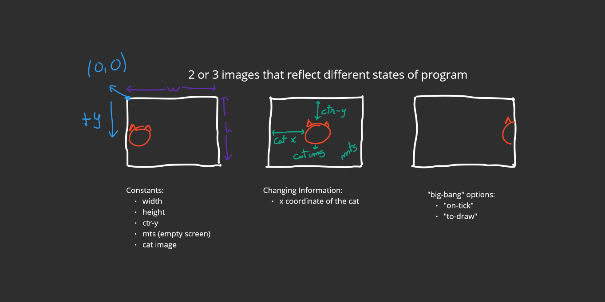
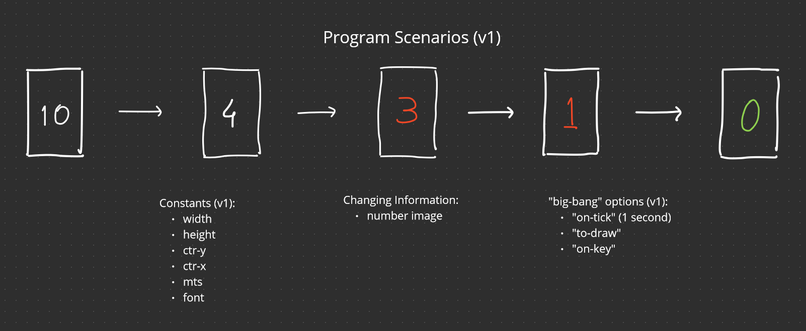
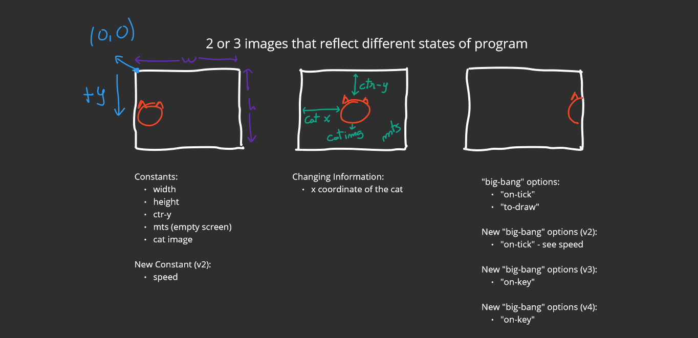

# 3a: How To Design Worlds

## Module Overview

Learning Goals

- Be able to explain the inherent structure of interactive graphical programs.
- Be able to use the How to Design Worlds (HtDW) recipe to design interactive programs with atomic world state.
- Be able to read and write big-bang expressions.

## Interactive Programs

Graphic quality is something that requires a great deal of math sophistication and a great deal of programming power, therefore the graphics of our programs are going to be simple. But the basic structure of our programs is really going to be like the same structure of the more sophisticated versions.

## The Big-Bang Mechanism

[bigBangMechanism.rkt](https://github.com/squxq/How-to-Code-Simple-Data/blob/week-03/course/week-03/bigBangMechanism/bigBangMechanism.rkt)

The mechanism that supports interactive programs is called big-bang.

Simple interactive programs have classical interactive behavior. Some underlying state is changing (changing state). There’s a changing image on the screen (changing display). Pressing some key does something or perhaps clicking the mouse might do something (keyboard and/or mouse affects behavior).

A data definition to tell us what numbers like 0, 3, 6 mean - what they represent.

```racket
;; ==================
;; Data Definitions:

;; Cat in Number
;; interp. x coordinate of cat

;; Examples
(define C1 0)

;; Template
(define (fn-for-cat c)
  (... c))

;; Template rules used:
;; - atomic non-distinct: Number
```

A function that given current x-coordinate of the cat produces the next one.

```racket
(define SPEED 3)

;; =====================
;; Function Definitions:

;; Cat -> Cat
;; increase cat x position by SPEED

;; Tests:
(check-expect (next-cat 0) SPEED)
(check-expect (next-cat 100) (+ 100 SPEED))

;; Stub:
(define (next-cat c) 1)

;; <Used template from Cat.>

(define (next-cat c)
  (+ c SPEED))
```

A function that puts the image of the cat at the right place on the empty scene (MTS).

```racket
;; Cat -> Image
;; add CAT-IMG to MTS at proper x coordinate and CTR-Y

;; Stub:
(define (render-cat c) MTS)

;; Tests:
(check-expect (render-cat 100)
              (place-image CAT-IMG 100 CTR-Y MTS))

;; <Used template from Cat.>

(define (render-cat c)
  (place-image CAT-IMG c CTR-Y MTS))

; The value of CAT-IMG is an image of the cat
; The value of MTS is a blank background (empty scene)
; The value of CTR-Y is half-way down MTS on the y-axis
```

So there are the data definition and two functions. One function, “next-cat”, can advance the cat’s x position by three each time (0, 3, 6, etc.). The other function, “render-cat”, takes us from a cat to the image of the cat at the appropriate position on the background called MTS.

To wire “render-cat” and “next-cat” together we use a DrRacket expression called “big-bang”.

```racket
(big-bang 0                      ; Cat
          (on-tick next-cat)     ; Cat -> Cat
          (to-draw render-cat))  ; Cat -> Image
```

The first argument to “big bang” is an expression that evaluates what “big bang” calls the initial world state, in this case, it is represented by the Cat type. Each time the clock ticks, call “next-cat” with the current world state to get the next world state. Each time the clock ticks, call “render-cat” with the current world state to draw the current world state.

One other point to make about “big-bang” it’s polymorphic, so it works for any type of world state. The key thing is that the world state always has to be the same type. “big-bang” is a user interface framework, in other words, a tool that integrates a bunch of functionalities to get an entire user interface. “big-bang” is starting with an initial world state and then it’s coordinating, calling functions to produce the combined behavior of the interactive program.

## Domain Analysis

[domainAnalysis.no-image.rkt](https://github.com/squxq/How-to-Code-Simple-Data/blob/week-03/course/week-03/domainAnalysis/domainAnalysis.no-image.rkt)

[domainAnalysis.rkt](https://github.com/squxq/How-to-Code-Simple-Data/blob/week-03/course/week-03/domainAnalysis/domainAnalysis.rkt)

[domainAnalysis.png](https://github.com/squxq/How-to-Code-Simple-Data/blob/week-03/course/week-03/domainAnalysis/domainAnalysis.png)

The HtDW (how to design worlds) recipe is a process that lets us systematically design interactive programs, or what the “big-bang” calls world programs.

World program design is divided into two phases, each of which has sub-parts:

1. Domain analysis (use a piece of paper!)
    1. Sketch program scenarios
    2. Identify constant information
    3. Identify changing information
    4. Identify big-bang options
2. Build the actual program
    1. Constants (based on 1.2 above)
    2. Data definitions using [HtDD](https://courses.edx.org/courses/course-v1:UBCx+HtC1x+2T2017/77860a93562d40bda45e452ea064998b/#HtDD) (based on 1.3 above)
    3. Functions using [HtDF](https://courses.edx.org/courses/course-v1:UBCx+HtC1x+2T2017/77860a93562d40bda45e452ea064998b/#HtDF)
        1. main first (based on 1.3, 1.4 and 2.2 above)
        2. wish list entriesfor big-bang handlers
    4. Work through wish list until done

> Use the How to Design Worlds recipe to design an interactive
program in which a cat starts at the left edge of the display
and then walks across the screen to the right. When the cat
reaches the right edge it should just keep going right off
the screen.

Once your design is complete revise it to add a new feature,
which is that pressing the space key should cause the cat to
go back to the left edge of the screen. When you do this, go
all the way back to your domain analysis and incorporate the
new feature.

To help you get started, here is a picture of a cat (open the image file), which we
have taken from the 2nd edition of the How to Design Programs
book on which this course is based.
> 

Domain Analysis:



## Program Through Main Function

[programThroughMainFunction.no-image.rkt](https://github.com/squxq/How-to-Code-Simple-Data/blob/week-03/course/week-03/programThroughMainFunction/programThroughMainFunction.no-image.rkt)

[programThroughMainFunction.rkt](https://github.com/squxq/How-to-Code-Simple-Data/blob/week-03/course/week-03/programThroughMainFunction/programThroughMainFunction.rkt)

Templates are not a beginner’s approach to programming. I will be solving the previous section’s problem.

The first line of the program should be a short summary of the program:

```racket
(require 2htdp/image)
(require 2htdp/universe)

;; A cat that walks from left to right across the screen.
```

Using named constants provides a single point of control - changing “HEIGHT” also changes “CTR-Y”:

```racket
;; =================
;; Constants:

(define WIDTH 600)
(define HEIGHT 400)

(define CTR-Y (/ HEIGHT 2))

(define MTS (empty-scene WIDTH HEIGHT))

(define CAT_IMG (square 0 "solid" "white")) ; open image file
```

The fact that I can look at the analysis and look at the code and understand where everything in the analysis showed up in the code is called traceability. Traceability is the ability to see where each analysis element winds up in the resulting program.

There are only two kinds of programs in the world: programs that change and programs that nobody uses. Any program that has users will have to change. Over time, users want new features, better performance, etc. Being easy to change is one of the most important properties a program should have.

```racket
;; =================
;; Data definitions:

;; Cat is Natural
;; interp. x position of the cat in screen coordinates

;; Examples:
(define C1 0)           ; left edge
(define C2 (/ WIDTH 2)) ; middle
(define C3 WIDTH)       ; right edge

;; Template
#;
(define (fn-for-cat c)
  (... c))

;; Template rules used:
;; - atomic non-distinct: Natural
```

A wish-list entry has a signature, purpose, !!! and a stub. It is a promise to come back and finish this function later. In bigger programs, I can have 10s or 100s of pending wish list entries, so it pays to be disciplined about writing down what I need to do later. The stubs in wish list entries can allow programs to at least partially run. The “!!!” marker in stubs makes it easy to find pending wishes.

```racket
;; =================
;; Functions:

;; Cat -> Cat
;; start the world with ...
;; 
(define (main c)
  (big-bang c                   ; Cat
            (on-tick   advance-cat)     ; Cat -> Cat
            (to-draw   render)))   ; Cat -> Image

;; Cat -> Cat
;; produce the next cat, by advancing it 1 pixel to right
;; !!!
(define (advance-cat c) 0)

;; Cat -> Image
;; render the cat image at appropriate place on MTS 
;; !!!
(define (render c) MTS)
```

## Working Through the Wish List

[workingThroughWishList.no-image.rkt](https://github.com/squxq/How-to-Code-Simple-Data/blob/week-03/course/week-03/workingThroughWishList/workingThroughWishList.no-image.rkt)

[workingThroughWishList.rkt](https://github.com/squxq/How-to-Code-Simple-Data/blob/week-03/course/week-03/workingThroughWishList/workingThroughWishList.rkt)

Time spent on examples isn’t a delay. It is time spent figuring out how the function needs to work. I will pay back shortly. The big benefit on having a systematic process is it lets me work on one thing at a time.

Because we have a process, some parts of our work don’t necessarily end up as specific sub-parts of the final program. The domain analysis itself isn’t in the program. It’s something we wrote on a piece of paper, but it was part of the process.

For people who design design methods, meta-design, is one of the things they work on: how can there be elements of the design that get me there even though they disappear in the final artifact?

```racket
(require 2htdp/image)
(require 2htdp/universe)

;; A cat that walks from left to right across the screen.

;; =================
;; Constants:

(define WIDTH 600)
(define HEIGHT 400)

(define CTR-Y (/ HEIGHT 2))

(define MTS (empty-scene WIDTH HEIGHT))

(define CAT_IMG (square 0 "solid" "white")) ; open image file

;; =================
;; Data definitions:

;; Cat is Natural
;; interp. x position of the cat in screen coordinates

;; Examples:
(define C1 0)           ; left edge
(define C2 (/ WIDTH 2)) ; middle
(define C3 WIDTH)       ; right edge

;; Template
#;
(define (fn-for-cat c)
  (... c))

;; Template rules used:
;; - atomic non-distinct: Natural

;; =================
;; Functions:

;; Cat -> Cat
;; start the world with (main 0)
;; 
(define (main c)
  (big-bang c                           ; Cat
            (on-tick   advance-cat)     ; Cat -> Cat
            (to-draw   render)))        ; Cat -> Image

;; Cat -> Cat
;; produce the next cat, by advancing it 1 pixel to right

;; Stub:
#;
(define (advance-cat c) 0)

;; Tests:
(check-expect (advance-cat 3) 4)

;; <Used template from Cat.>
(define (advance-cat c)
  (+ c 1))

;; Cat -> Image
;; render the cat image at appropriate place on MTS 

;; Stub:
#;
(define (render c) MTS)

;; Tests:
(check-expect (render 4)
              (place-image CAT_IMG 4 CTR-Y MTS))

;; <Used template from Cat.>
(define (render c)
  (place-image CAT_IMG c CTR-Y MTS))
```

### Question 42: Countdown Animation

[countdown-animation-starter.no-image.rkt](https://github.com/squxq/How-to-Code-Simple-Data/blob/week-03/course/week-03/workingThroughWishList/countdown-animation-starter.no-image.rkt)

[countdown-animation-starter.png](https://github.com/squxq/How-to-Code-Simple-Data/blob/week-03/course/week-03/workingThroughWishList/countdown-animation-starter.png)

> Design an animation of a simple countdown.
> 
> 
> Your program should display a simple countdown, that starts at ten, and
> decreases by one each clock tick until it reaches zero, and stays there.
> 
> To make your countdown progress at a reasonable speed, you can use the
> rate option to on-tick. If you say, for example,
> (on-tick advance-countdown 1) then big-bang will wait 1 second between
> calls to advance-countdown.
> 
> Remember to follow the HtDW recipe! Be sure to do a proper domain
> analysis before starting to work on the code file.
> 
> Once you are finished the simple version of the program, you can improve
> it by reseting the countdown to ten when you press the spacebar.
> 



```racket
;; A countdown that starts at ten then decreases by 1 each second until it reaches 0 and stays there

;; =====================
;; Constants

(define WIDTH 150)
(define HEIGHT (* WIDTH (/ 3 2)))

(define CTR-X (/ WIDTH 2))
(define CTR-Y (/ HEIGHT 2))

(define MTS (empty-scene WIDTH HEIGHT))

(define FONT 48)

;; =====================
;; Data Definitions

;; Time is Natural[0, 10]
;; interp. seconds before countdown is over (reaches 0 seconds)
;;       - [4, 10]: the color of the time image is black
;;       - [1, 3]: the color of the time image is red
;;       - 0: the color of the time image is green 

;; Examples
(define T0 0)  ; end of the countdown and green color
(define T1 1)  ; end of the red color
(define T2 3)  ; start of the red color
(define T3 4)  ; middle of the countdown and end of the black color
(define T4 10) ; start of the countdown and start of the black color

;; Template
#;
(define (fn-for-time t)
  (... t))

;; Template rules used:
;;  - atomic non-distinct: Natural[0, 10]

;; =====================
;; Function Definitions

;; Time -> Time
;; start the world with (main T4) = (main 10)
;;
(define (main t)
  (big-bang t                   ; Time
    (on-tick next-time 1)       ; Time -> Time
    (to-draw render-time)       ; Time -> Image
    (on-key handle-key-time)))  ; Time KeyEvent -> Time

;; Time -> Time
;; produce the next time natural number, subtracting 1 from given time if it is not 0

;; Stub:
#;
(define (next-time t) 0)

;; Tests:
(check-expect (next-time T4) (- T4 1)) ; start of the countdown
(check-expect (next-time T3) (- T3 1)) ; middle of the countdown
(check-expect (next-time T0) T0) ; end of the countdown

;; <Took the template from Time.>
(define (next-time t)
  (if (not (= t 0))
      (- t 1)
      t))

;; Time -> Image
;; produce time image with given time and place it on MTS at (CTR-X, CTR-y)
;;       - [4, 10]: the color of the time image is black
;;       - [1, 3]: the color of the time image is red
;;       - 0: the color of the time image is green 

;; Stub:
#;
(define (render-time t) (square 0 "solid" "white"))

;; Tests:
(check-expect (render-time T4)
              (place-image (text (number->string T4) FONT "black") CTR-X CTR-Y MTS))
(check-expect (render-time T3)
              (place-image (text (number->string T3) FONT "black") CTR-X CTR-Y MTS))
(check-expect (render-time T2)
              (place-image (text (number->string T2) FONT "red") CTR-X CTR-Y MTS))
(check-expect (render-time T1)
              (place-image (text (number->string T1) FONT "red") CTR-X CTR-Y MTS))
(check-expect (render-time T0)
              (place-image (text (number->string T0) FONT "green") CTR-X CTR-Y MTS))

;; <Took template from Time.>
(define (render-time t)
  (cond [(and (> t 3) (< t 11))
         (place-image (text (number->string t) FONT "black") CTR-X CTR-Y MTS)]
        [(and (> t 0) (< t 4))
         (place-image (text (number->string t) FONT "red") CTR-X CTR-Y MTS)]
        [else
         (place-image (text (number->string t) FONT "green") CTR-X CTR-Y MTS)]))

;; Time KeyEvent -> Time
;; reset countdown to time 10 when space key is pressed

;; Stub:
#;
(define (handle-key-time t ke) 10)

;; Tests:
(check-expect (handle-key-time T4 " ") T4)
(check-expect (handle-key-time T3 " ") T4)
(check-expect (handle-key-time T3 "r") T3)
(check-expect (handle-key-time T0 " ") T4)
(check-expect (handle-key-time T0 "r") T0)

;; <Used template from Time.>
(define (handle-key-time t ke)
  (cond [(key=? ke " ") T4]
        [else t]))
```

### Question 43: Traffic Light

[traffic-light-starter.no-image.rkt](https://github.com/squxq/How-to-Code-Simple-Data/blob/week-03/course/week-03/workingThroughWishList/traffic-light-starter.no-image.rkt)

[traffic-light-starter.rkt](https://github.com/squxq/How-to-Code-Simple-Data/blob/week-03/course/week-03/workingThroughWishList/traffic-light-starter.rkt)

[traffic-light-starter.png](https://github.com/squxq/How-to-Code-Simple-Data/blob/week-03/course/week-03/workingThroughWishList/traffic-light-starter.png)

> Design an animation of a traffic light.
> 
> 
> Your program should show a traffic light that is red, then green,
> then yellow, then red etc. For this program, your changing world
> state data definition should be an enumeration.
> 
> Here is what your program might look like if the initial world
> state was the red traffic light:
> (open image file)
> Next:
> (open image file)
> Next:
> (open image file)
> Next is red, and so on.
> 
> To make your lights change at a reasonable speed, you can use the
> rate option to on-tick. If you say, for example, (on-tick next-color 1)
> then big-bang will wait 1 second between calls to next-color.
> 
> Remember to follow the HtDW recipe! Be sure to do a proper domain
> analysis before starting to work on the code file.
> 
> Note: If you want to design a slightly simpler version of the program,
> you can modify it to display a single circle that changes color, rather
> than three stacked circles.
> 


```racket
;; A traffic light that cycles between red, green and yellow lights each second

;; =====================
;; Constants

(define WIDTH 100)
(define HEIGHT (* WIDTH 3))

(define CIRCLE_RADIUS (* WIDTH (/ 2 5)))
(define MTS (overlay (overlay
                      (above (overlay (circle CIRCLE_RADIUS "outline" "red")
                                              (square WIDTH "solid" "transparent"))
                                     (overlay (circle CIRCLE_RADIUS "outline" "yellow")
                                              (square WIDTH "solid" "transparent"))
                                     (overlay (circle CIRCLE_RADIUS "outline" "green")
                                              (square WIDTH "solid" "transparent")))
                                     (rectangle WIDTH HEIGHT "solid" "black"))
                     (empty-scene WIDTH HEIGHT)))

(define CIRCLE_X (/ WIDTH 2))

(define CIRCLE_0_Y (/ HEIGHT 6))
(define CIRCLE_1_Y (/ HEIGHT 2))
(define CIRCLE_2_Y (* HEIGHT (/ 5 6)))

;; =====================
;; Data Definitions:

;; TrafficLight is one of:
;; - "red"
;; - "green"
;; - "yellow"
;; interp. represents the 3 options of traffic lights

;; <Examples are redundant for enumerations.>

;; Template
(define (fn-for-traffic-light tl)
  (cond [(string=? tl "red") (...)]
        [(string=? tl "green") (...)]
        [else (...)]))

;; Template rules used:
;; - one of: 3 cases
;; - atomic distinct: "red"
;; - atomic distinct: "green"
;; - atomic distinct: "yellow"

;; =====================
;; Function Definitions

;; TrafficLight -> TrafficLight
;; start the world with (main "red") or (main "green") or (main "yellow")
;;
(define (main tl)
  (big-bang tl               ; TrafficLight
    (on-tick next-color 1)     ; TrafficLight -> TrafficLight
    (to-draw render-color))) ; TrafficLight -> Image

;; TrafficLight -> TrafficLight
;; produce the next color in order: red -> green -> yellow -> ...

;; Stub:
#;
(define (next-color tl) "red")

;; Tests:
(check-expect (next-color "red") "green")
(check-expect (next-color "green") "yellow")
(check-expect (next-color "yellow") "red")

;; <Took template from TrafficLight>
(define (next-color tl)
  (cond [(string=? tl "red") "green"]
        [(string=? tl "green") "yellow"]
        [else "red"]))

;; TrafficLight -> Image
;; produce filled circle of current traffic light and outlined circles of the innactive traffic lights

;; Stub:
#;
(define (render-color tl) (circle 0 "solid" "white"))

;; Tests:
(check-expect (render-color "red")
              (place-image (circle CIRCLE_RADIUS "solid" "red")
                           CIRCLE_X CIRCLE_0_Y MTS))
(check-expect (render-color "green")
              (place-image (circle CIRCLE_RADIUS "solid" "green")
                           CIRCLE_X CIRCLE_2_Y MTS))
(check-expect (render-color "yellow")
              (place-image (circle CIRCLE_RADIUS "solid" "yellow")
                           CIRCLE_X CIRCLE_1_Y MTS))

;; <Took template from TrafficLight>
(define (render-color tl)
  (cond [(string=? tl "red")
         (place-image (circle CIRCLE_RADIUS "solid" "red")
                           CIRCLE_X CIRCLE_0_Y MTS)]
        [(string=? tl "green")
         (place-image (circle CIRCLE_RADIUS "solid" "green")
                           CIRCLE_X CIRCLE_2_Y MTS)]
        [else (place-image (circle CIRCLE_RADIUS "solid" "yellow")
                           CIRCLE_X CIRCLE_1_Y MTS)]))
```

## Improving a World Program - Add SPEED

[improvingWorldProgramSPEED.no-image.rkt](https://github.com/squxq/How-to-Code-Simple-Data/blob/week-03/course/week-03/improvingWorldProgram/improvingWorldProgramSPEED.no-image.rkt)

[improvingWorldProgramSPEED.png](https://github.com/squxq/How-to-Code-Simple-Data/blob/week-03/course/week-03/improvingWorldProgram/improvingWorldProgramSPEED.png)

> Extend the program so that the cat moves at a specific set rate: SPEED.
> 

Making a change to the previous program, and giving it some better functionality, will show how the careful design that we did is going to help make that change easy to manage.


The analysis is a model of the program. Because it correctly describes the structure of the program but has less detail, we can plan out work on the program by marking up the analysis.

```racket
(define SPEED 3)
```

Using constants in “check-expects” usually make the example more clear, they also make it more correct in that it continues to work when the constant changes.

```racket
;; Cat -> Cat
;; produce the next cat, by advancing it SPEED pixel(s) to right
(check-expect (advance-cat 3) (+ 3 SPEED))

;(define (advance-cat c) 0) ;stub

;<use template from Cat>

(define (advance-cat c)
  (+ c SPEED))
```

Programs always change, because people want them to be better all the time. And so that means we want it to be easy to change programs. Working hard to make the structure of the program match the structure of the analysis made it really ease to go back and make this change.

The ability to work on programs by reasoning about them at a model level is one of the things that really separates program designers of people who write code that just happens to work.

Good designers are able to use a wide variety of models when working on programs. Some models are simple informal models like this one. Some are complex and quite mathematical. Most are somewhere in between.

## Improving a World Program - Add Key Handler

[improvingWorldProgramHandler.no-image.rkt](https://github.com/squxq/How-to-Code-Simple-Data/blob/week-03/course/week-03/improvingWorldProgram/improvingWorldProgramHandler.no-image.rkt)

[improvingWorldProgramHandler.png](https://github.com/squxq/How-to-Code-Simple-Data/blob/week-03/course/week-03/improvingWorldProgram/improvingWorldProgramHandler.png)

We are making another change to the cat program: when the Space key is pressed, the cat resets back to the edge of the box. Another technical point we’ll see in this recipe is how to use the “on-key” option in “big-bang” and how to template a function that operates on what’s called a large enumeration.

> Extend the program so that pressing the space key causes the cat to jump back to the left edge of the window.
> 


```racket
(define (main c)
  (big-bang c                             ; Cat
            (on-tick   advance-cat)       ; Cat -> Cat
            (to-draw   render)            ; Cat -> Image
            (on-key    handle-key)))      ; Cat KeyEvent -> Cat
```

After updating “big-bang” according to the analysis, we need to write down a wish-list entry.

```racket
;; Cat KeyEvent -> Cat
;; reset cat to left edge when space key is pressed
;; !!!
;; Stub:
(define (handle-key c ke) 0)
```

“KeyEvent” is a primitive type in Racket, and it is what’s called a large enumeration. There is one distinct value in “KeyEvent” for each of the many different keys I can press on the keyboard.

```racket
;; KeyEvent is one of:
;;  - "a"
;;  - "b"
;;   ...
;;  - " "
;;  - "\r"
;;   ...
;;  - "up"
;;  - "down"
;;   ...
;; interp. represents keyboard events
```

DrRacket uses simple strings to be those distinct values. This is an example of white-box testing: we will base the tests on our knowledge of how the function is coded, not just what it is supposed to do.

```racket
;; Tests:
(check-expect (handle-key 10 " ") 0)
(check-expect (handle-key 10 "a") 10)
(check-expect (handle-key 0 " ") 0)
(check-expect (handle-key 0 "a") 0)
```

The normal rule for templating enumerations would produce a “cond” with very many cases. For large enumerations the template will have “cond” clauses for all the particular cases, and an “else” clause for everything else.

```racket
;; Template
#;
(define (handle-key c ke)
  (cond [(key=? ke " ") (... c)]
        [else (... c)]))

(define (handle-key c ke)
  (cond [(key=? ke " ") 0]
        [else c]))
```

The white-box test takes advantage of knowing the “cond” has just two cases.

### Question 44: Add Mouse Handler

[improvingWorldProgramMouse.no-image.rkt](https://github.com/squxq/How-to-Code-Simple-Data/blob/week-03/course/week-03/improvingWorldProgram/improvingWorldProgramMouse.no-image.rkt)

[improvingWorldProgramMouse.png](https://github.com/squxq/How-to-Code-Simple-Data/blob/week-03/course/week-03/improvingWorldProgram/improvingWorldProgramMouse.png)

> Extend the program so that by clicking the mouse the cat goes to the current x position of the mouse.
> 



```racket
;; Cat -> Cat
;; start the world with (main 0)
;; 
(define (main c)
  (big-bang c                             ; Cat
            (on-tick   advance-cat)       ; Cat -> Cat
            (to-draw   render)            ; Cat -> Image
            (on-key    handle-key)        ; Cat KeyEvent -> Cat
            (on-mouse  handle-mouse)))    ; Cat Integer Integer MouseEvent -> Cat
```

```racket
;; MouseEvent is one of:
;;  - "button-down"
;;  - "button-up"
;;  - "drag"
;;  - "move"
;;  - "enter"
;;  - "leave"
;; interp. represents mouse events
```

```racket
;; Cat Integer Integer MouseEvent -> Cat
;; move cat to x position of the mouse when mouse is clicked

;; Stub:
#;
(define (handle-mouse c x y me) 0)

;; Tests:
(check-expect (handle-mouse 10 354 201 "button-down") 354)
(check-expect (handle-mouse 10 0 201 "button-down") 0)
(check-expect (handle-mouse 10 354 201 "button-up") 10)
(check-expect (handle-mouse 10 0 201 "button-up") 10)

;; Template
#;
(define (handle-mouse c x y me)
  (cond [(mouse=? me "button-down") (... c x y)]
        [else
         (... c x y)]))

(define (handle-mouse c x y me)
  (cond [(mouse=? me "button-down") x]
        [else c]))
```