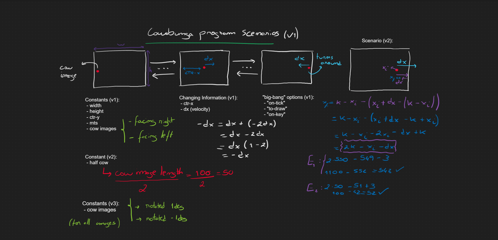
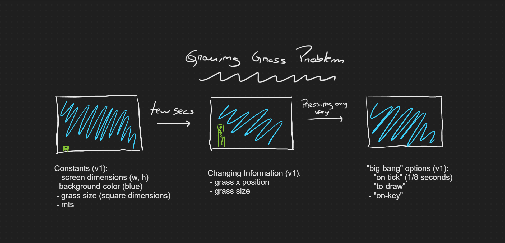
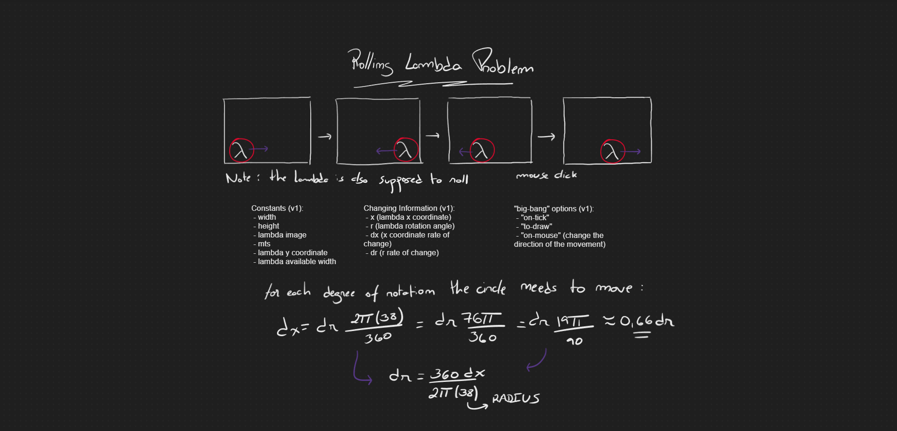
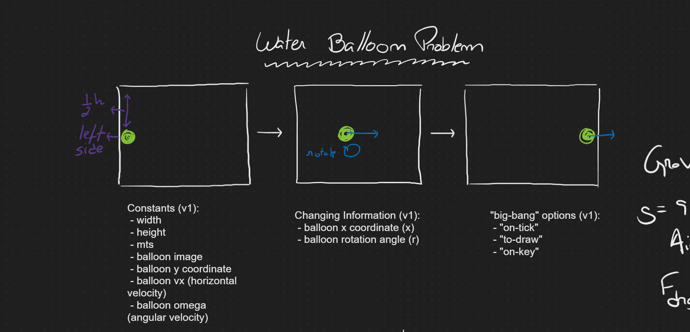
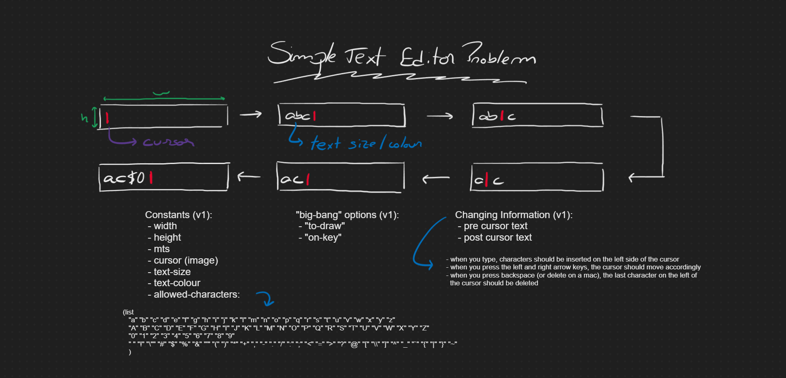

# 3b: Compound Data

## Module Overview

Learning Goals:

- Be able to identify domain information that should be represented as compound data.
- Be able to read and write define-struct definitions.
- Be able to design functions that consume and/or produce compound data.
- Be able to design world programs that use compound world state.

## define-struct

[defineStruct.rkt](https://github.com/squxq/How-to-Code-Simple-Data/blob/week-03b/course/week-03b/defineStruct/defineStruct.rkt)

All of the data types we have seen so far have been atomic, in each case, a single data value really consists of just one value. Sometimes we want to represent different kinds of information, where two or more values naturally belong together, for example: x, y position of an object moving on the screen.

To form a structure definition:

$$
(define-struct\ <name>\ (<name>...))\\
(define-struct\ pos\ (x\ y))\\
pos>structure\ name\\
x\ y>field\ names
$$

A structure definition defines:

$$
constructor:\ make-<structure-name>\\
selector(s):\ <structure-name>-<field-name>\\
predicate:\ <structure-name>?
$$

(define-struct pos (x y)) defines:

$$
contructor:\ make-pos\\
selectors:\ pos-x\ \ pos-y\\
predicate:\ pos?
$$

```racket
(define-struct pos (x y))

(define P1 (make-pos 3 6))
(define P2 (make-pos 2 8))

(pos-x P1)
; outputs 3

(pos-y P2)
; outputs 8

(pos? P1)
; outputs true

(pos? "hello")
; outputs false
```

### Question 45: Compound Evaluation

[compound-evaluation-starter.no-image.rkt](https://github.com/squxq/How-to-Code-Simple-Data/blob/week-03b/course/week-03b/defineStruct/compound-evaluation-starter.no-image.rkt)

> Given the following definitions:
> 
> 
> (define-struct census-data (city population))
> 
> (define (count-newborn cd)
> (make-census-data
> (census-data-city cd)
> (add1 (census-data-population cd))))
> 
> Write down the evaluation steps for the following expression.
> 
> (count-newborn (make-census-data "Vancouver" 603502))
> 

```racket
(define-struct census-data (city population))

(define (count-newborn cd)
  (make-census-data
   (census-data-city cd)
   (add1 (census-data-population cd))))

;; Expression
(count-newborn (make-census-data "Vancouver" 603502))

;; Step 1:
(make-census-data
 (census-data-city
  (make-census-data
   "Vancouver"
   603502))
 (add1
  (census-data-population
   (make-census-data
    "Vancouver"
    603502))))

;; Step 2:
(make-census-data
 "Vancouver"
 (add1
  (census-data-population
   (make-census-data
    "Vancouver"
    603502))))

;; Step 3:
(make-census-data
 "Vancouver"
 (add1 603502))

;; Step 4 - definition:
(make-census-data "Vancouver" 603503)
```

## Compound Data Definitions

[compoundDataDefinitions.no-image.rkt](https://github.com/squxq/How-to-Code-Simple-Data/blob/week-03b/course/week-03b/compoundDataDefinitions/compoundDataDefinitions.no-image.rkt)

> Design a data definition to represent hockey players, including both
their first and last names.
> 

This problem has two or more values that naturally belong together.

```racket
(define-struct player (fn ln))
;; Player is (make-player String String)
;; interp. (make-player fn ln) is a hockey player with
;;         fn is the first name
;;         ln is the last name

;; Examples
(define P1 (make-player "Bobby" "Orr"))
(define P2 (make-player "Wayne" "Gretzky"))
```

If a function is operating on a “Player”, it has the first name (”fn”) and the last name (”ln”) to work with. 

```racket
;; Template
(define (fn-for-player p)
  (... (player-fn p)    ; String
       (player-ln p)))  ; String

;; Template rules used:
;; - compound rule: 2 fields
```

### Question 46: Movie

[movie-starter.no-image.rkt](https://github.com/squxq/How-to-Code-Simple-Data/blob/week-03b/course/week-03b/compoundDataDefinitions/movie-starter.no-image.rkt)

> Design a data definition to represent a movie, including
> 
> 
> title, budget, and year released.
> 
> To help you to create some examples, find some interesting movie facts below:
> "Titanic" - budget: 200000000 released: 1997
> "Avatar" - budget: 237000000 released: 2009
> "The Avengers" - budget: 220000000 released: 2012
> 
> However, feel free to resarch more on your own!
> 

```racket
;; =================
;; Data definitions:

(define-struct movie (title budget release))
;; Movie is (make-movie String Number Natural)
;; interp. (make-movie title budget release) is a movie with:
;;         title is the movie's title
;;         budget is the movie's budget
;;         release is the movie's release date

;; Examples:
(define M0 (make-movie "Titanic" 200000000 1997))
(define M1 (make-movie "Avatar" 237000000 2009))
(define M0 (make-movie "The Avengers" 220000000 2012))

;; Template
(define (fn-for-movie m)
  (... (movie-title m)     ; String
       (movie-budget m)    ; Number
       (movie-release m))) ; Natural

;; Template rules used:
;; - compound rule: 3 fields
```

> You have a list of movies you want to watch, but you like to watch your
rentals in chronological order. Design a function that consumes two movies
and produces the title of the most recently released movie.
> 
> 
> Note that the rule for templating a function that consumes two compound data
> parameters is for the template to include all the selectors for both
> parameters.
> 

```racket
;; Movie Movie -> String
;; produce the title of the movie that was released more recently

;; Stub:
#;
(define (most-recent-movie m0 m1) "")

;; Tests
(check-expect (most-recent-movie M0 M1) (movie-title M1))
(check-expect (most-recent-movie M1 M2) (movie-title M2))
(check-expect (most-recent-movie M2 M0) (movie-title M2))

;; <Took template from Movie>
(define (most-recent-movie m0 m1)
  (cond [(> (movie-release m0) (movie-release m1)) (movie-title m0)]
        [(< (movie-release m0) (movie-release m1)) (movie-title m1)]))
```

### Question 47: Student

[student-starter.no-image.rkt](https://github.com/squxq/How-to-Code-Simple-Data/blob/week-03b/course/week-03b/compoundDataDefinitions/student-starter.no-image.rkt)

> Design a data definition to help a teacher organize their next field trip.
On the trip, lunch must be provided for all students. For each student, track
their name, their grade (from 1 to 12), and whether or not they have allergies.
> 

```racket
;; =================
;; Data definitions:

(define-struct student (name grade allergies))
;; Student is (make-student String Natural[1, 12] Boolean)
;; interp. (make-student name grade allergies) is a student with:
;;         name is the student's name
;;         grande is the student's name
;;         allergies is true if the student has allergies, else false

;; Examples:
(define S0 (make-student "John" 8 true))
(define S1 (make-student "Jane" 12 false))

;; Template:
(define (fn-for-student s)
  (... (student-name s)        ; String
       (student-grade s)       ; Natural[1, 12]
       (student-allergies s))) ; Boolean

;; Template rules used:
;; - compound rule: 3 fields
```

> To plan for the field trip, if students are in grade 6 or below, the teacher
is responsible for keeping track of their allergies. If a student has allergies,
and is in a qualifying grade, their name should be added to a special list.
Design a function to produce true if a student name should be added to this list.
> 

```racket
;; Student -> Boolean
;; produce true if a student has allergies and is in grade 6 or below

;; Stub:
#;
(define (allergies? s) false)

;; Tests:
(check-expect (allergies? S0) true)
(check-expect (allergies? S1) false)
(check-expect (allergies? S2) true)
(check-expect (allergies? S3) false)
(check-expect (allergies? S4) false)

;; <Took template from Student>
(define (allergies? s)
  (and (< (student-grade s) 7) (student-allergies s)))
```

### Question 48: Trip

[trip-starter.no-image.rkt](https://github.com/squxq/How-to-Code-Simple-Data/blob/week-03b/course/week-03b/compoundDataDefinitions/trip-starter.no-image.rkt)

> Design a data definition to help travelers plan their next trip.
A trip should specify an origin, destination, mode of transport and
duration (in days).
> 

```racket
;; =================
;; Data definitions:

(define-struct trip (origin destination transport duration))
;; Trip is (make-trip String String String Natural)
;; interp. (make-trip origin destination transport duration)
;;         origin is the trip's origin
;;         destination is the trip's destination
;;         transport is the trip's mode of transport
;;         duration is the trip's duration in days

;; Examples:
(define T0 (make-trip "Boston" "Vancouver" "plane" 6))
(define T0 (make-trip "Yellowstone National Park" "Crater Lake National Park" "car" 14))

;; Template:
(define (fn-for-trip t)
  (... (trip-origin t)      ; String
       (trip-destination t) ; String
       (trip-transport t)   ; String
       (trip-duration t)))  ; Natural

;; Template rules used:
;; - compound rule: 4 cases
```

> You have just found out that you have to use all your days off work
on your next vacation before they expire at the end of the year.
Comparing two options for a trip, you want to take the one that
lasts the longest. Design a function that compares two trips and
returns the trip with the longest duration.
> 
> 
> Note that the rule for templating a function that consumes two
> compound data parameters is for the template to include all
> the selectors for both parameters.
> 

```racket
;; =================
;; Functions:

;; Trip Trip -> Trip
;; return the trip with the longest duration

;; Stub:
#;
(define (longest-trip t0 t1) T0)

;; Tests:
(check-expect (longest-trip T0 T1) T1)
(check-expect (longest-trip T1 T0) T1)
(check-expect (longest-trip T0 T0) T0)

;; Template
#;
(define (longest-trip t0 t1)
  (... (trip-origin t0)
       (trip-destination t0)
       (trip-transport t0)
       (trip-duration t0)
       (trip-origin t1)
       (trip-destination t1)
       (trip-transport t1)
       (trip-duration t1)))

(define (longest-trip t0 t1)
  (cond [(> (trip-duration t0) (trip-duration t1)) t0]
        [(< (trip-duration t0) (trip-duration t1)) t1]
        [else t0]))
```

## HtDW With Compound Data

[cowabunga-starter.no-image.rkt](https://github.com/squxq/How-to-Code-Simple-Data/blob/week-03b/course/week-03b/HtDWCompoundData/cowabunga-starter.no-image.rkt)

[cowabunga-starter.rkt](https://github.com/squxq/How-to-Code-Simple-Data/blob/week-03b/course/week-03b/HtDWCompoundData/cowabunga-starter.rkt)

[cowabunga-starter.png](https://github.com/squxq/How-to-Code-Simple-Data/blob/week-03b/course/week-03b/HtDWCompoundData/cowabunga-starter.png)

> As we learned in the cat world programs, cats have a mind of their own. When they
reach the edge they just keep walking out of the window.
> 
> 
> Cows on the other hand are docile creatures. They stay inside the fence, walking
> back and forth nicely.
> 
> Design a world program with the following behaviour:
> 
> - A cow walks back and forth across the screen.
> - When it gets to an edge it changes direction and goes back the other way
> - When you start the program it should be possible to control how fast a
> walker your cow is.
> - Pressing space makes it change direction right away.
> 
> To help you here are two pictures of the right and left sides of a lovely cow that
> was raised for us at Brown University.
> 
> (open image file)     (open image file)
> 
> Once your program works here is something you can try for fun. If you rotate the
> images of the cow slightly, and you vary the image you use as the cow moves, you
> can make it appear as if the cow is waddling as it walks across the screen.
> 
> Also, to make it look better, arrange for the cow to change direction when its
> nose hits the edge of the window, not the center of its body.
> 

Domain Analysis:



```racket
;; A cow that walks back and forth in the screen limits

;; ======================
;; Constants

(define WIDTH 600)
(define HEIGHT (* WIDTH (/ 2 3)))

(define CTR-Y (/ HEIGHT 2))

(define MTS (empty-scene WIDTH HEIGHT))

(define RIGHT_COW (rectangle 20 10 "solid" "black")) ; open image file
(define RIGHT_COW_POSITIVE (rotate 1 RIGHT_COW))
(define RIGHT_COW_NEGATIVE (rotate -1 RIGHT_COW))

(define LEFT_COW (rectangle 10 20 "solid" "black")) ; open image file
(define LEFT_COW_POSITIVE (rotate 1 LEFT_COW))
(define LEFT_COW_NEGATIVE (rotate -1 LEFT_COW))

(define HALF_COW 50)

;; ======================
;; Data Definitions

(define-struct cow (x dx))
;; Cow is (make-cow Natural[HALF_COW, WIDTH - HALF_COW] Integer != 0)
;; interp. (make-cow x dx) is a cow with x coordinate and dx velocity:
;;         x is the center x coordinate of the cow in pixels
;;         dx is the cow's velocity, change of pixels per tick
;;         dx can be positive which means the cow moves from left to right
;;         dx can also be negative which means the cow moves from right to left

;; Examples:
(define C0 (make-cow HALF_COW 3))       ; a cow at position 0 that moves left to right
(define C1 (make-cow 200 10))    ; a cow at position 200 that moves left to right
(define C2 (make-cow 100 -4))    ; a cow at position 100 that moves right to left
(define C3 (make-cow (- WIDTH HALF_COW) -10)) ; a cow at position WIDTH that moves right to left

;; Template:
(define (fn-for-cow c)
  (... (cow-x c)         ; Natural[HALF_COW, WIDTH - HALF_COW]
       (cow-dx c)))      ; Integer != 0

;; Template rules used:
;; - compound rule: 2 fields

;; ======================
;; Function Definitions:

;; Cow -> Cow
;; Start the world with (main (make-cow HALF_COW 3)) = (main (make-cow 50 3))
;;`
(define (main c)
  (big-bang c                  ; Cow
    (on-tick next-cow)         ; Cow -> Cow
    (to-draw render-cow)       ; Cow -> Image
    (on-key handle-key-cow)))  ; Cow KeyEvent -> Cow

;; Number -> Number
;; change sign of given number

;; Stub:
#;
(define (change-sign n) 0)

;; Tests:
(check-expect (change-sign 5) -5)
(check-expect (change-sign -123) 123)

;; Template:
#;
(define (change-sign n)
  (... n))

(define (change-sign n)
  (* n -1))

;; Cow -> Cow
;; add to the cow x coordinate dx pixels, in order to move it

;; Stub:
#;
(define (next-cow c) (make-cow 0 3))

;; Tests:
;; when HALF_COW < x + dx < WIDHT - HALF_COW
(check-expect (next-cow C0) (make-cow (+ HALF_COW 3) 3))
(check-expect (next-cow C1) (make-cow 210 10))
(check-expect (next-cow C2) (make-cow 96 -4))
(check-expect (next-cow C3) (make-cow (- (- WIDTH HALF_COW) 10) -10))

;; when there is need to change the direction
(check-expect (next-cow (make-cow 548 3)) (make-cow 549 -3))
(check-expect (next-cow (make-cow 549 3)) (make-cow 548 -3))
(check-expect (next-cow (make-cow 51 -3)) (make-cow 52 3))

;; <Used template from Cow>
(define (next-cow c)
  (cond [(and (> (+ (cow-x c) (cow-dx c)) HALF_COW)
              (< (+ (cow-x c) (cow-dx c)) (- WIDTH HALF_COW)))
         (make-cow (+ (cow-x c) (cow-dx c)) (cow-dx c))]
        [(> (+ (cow-x c) (cow-dx c)) (- WIDTH HALF_COW))
         (make-cow (- (* 2 (- WIDTH HALF_COW)) (cow-x c) (cow-dx c)) (change-sign (cow-dx c)))]
        [else
         (make-cow (- (* 2 HALF_COW) (cow-x c) (cow-dx c)) (change-sign (cow-dx c)))]))

;; Cow -> Image
;; produce the correct image of the cow given its direction:
;;         if dx > 0 it moves from left to right
;;         else if dx < 0 it moves from right to left
;; rotate the image correctly:
;;         if x = 2k, k being an Integer, the cow rotates to a positive angle (1deg)
;;         if x = 2k + 1, k being an Integer, the cow rotates to a negative angle (-1deg)

;; Stub:
#;
(define (render-cow c) (square 0 "solid" "white"))

;; Tests:
;; changing the image
(check-expect (render-cow C0) (place-image RIGHT_COW_POSITIVE (cow-x C0) CTR-Y MTS))
(check-expect (render-cow C1) (place-image RIGHT_COW_POSITIVE (cow-x C1) CTR-Y MTS))
(check-expect (render-cow C2) (place-image LEFT_COW_POSITIVE (cow-x C2) CTR-Y MTS))
(check-expect (render-cow C3) (place-image LEFT_COW_POSITIVE (cow-x C3) CTR-Y MTS))

;; rotating the image
(check-expect (render-cow (make-cow 121 3)) (place-image RIGHT_COW_NEGATIVE 121 CTR-Y MTS))
(check-expect (render-cow (make-cow 121 -10)) (place-image LEFT_COW_NEGATIVE 121 CTR-Y MTS))

;; <Took template from Cow>
(define (render-cow c)
  (if (> (cow-dx c) 0)
       (if (even? (cow-x c))
           (place-image RIGHT_COW_POSITIVE (cow-x c) CTR-Y MTS)
           (place-image RIGHT_COW_NEGATIVE (cow-x c) CTR-Y MTS))
       (if (even? (cow-x c))
           (place-image LEFT_COW_POSITIVE (cow-x c) CTR-Y MTS)
           (place-image LEFT_COW_NEGATIVE (cow-x c) CTR-Y MTS))))

;; Cow KeyEvent -> Cow
;; change the cow direction when the spacebar

;; Stub:
#;
(define (handle-key-cow c) (make-cow 0 3))

;; Tests:
(check-expect (handle-key-cow C0 " ") (make-cow HALF_COW -3))
(check-expect (handle-key-cow C0 "a") C0)
(check-expect (handle-key-cow C1 " ") (make-cow 200 -10))
(check-expect (handle-key-cow C2 " ") (make-cow 100 4))
(check-expect (handle-key-cow C3 " ") (make-cow (- WIDTH HALF_COW) 10))

;; Template:
#;
(define (handle-key-cow c ke)
  (cond [(key=? ke " ") (... (cow-x c) (cow-dx c))]
        [else 
         (... (cow-x c) (cow-dx c))]))

(define (handle-key-cow c ke)
  (cond [(key=? ke " ") (make-cow (cow-x c) (change-sign (cow-dx c)))]
        [else c]))
```

### Question 49: Spinning

[spinning-starter.no-image.rkt](https://github.com/squxq/How-to-Code-Simple-Data/blob/week-03b/course/week-03b/HtDWCompoundData/spinning-starter.no-image.rkt)

[spinning-starter.rkt](https://github.com/squxq/How-to-Code-Simple-Data/blob/week-03b/course/week-03b/HtDWCompoundData/spinning-starter.rkt)

[spinning-starter.png](https://github.com/squxq/How-to-Code-Simple-Data/blob/week-03b/course/week-03b/HtDWCompoundData/spinning-starter.png)

> Design a world program as follows:

The world starts off with a small square at the center of the screen. As time
passes, the square stays fixed at the center, but increases in size and rotates
at a constant speed.Pressing the spacebar resets the world so that the square
is small and unrotated.

Starting display:
(open image file)
After a few seconds:
(open image file)
After a few more seconds:
(open image file)
Immediately after pressing the spacebar:
(open image file)
NOTE 1: Remember to follow the HtDW recipe! Be sure to do a proper domain
analysis before starting to work on the code file.

NOTE 2: The rotate function requires an angle in degrees as its first
argument. By that it means Number[0, 360). As time goes by the box may end up
spinning more than once, for example, you may get to a point where it has spun
362 degrees, which rotate won't accept. One solution to that is to use the
remainder function as follows:

(rotate (remainder ... 360) (text "hello" 30 "black"))

where ... can be an expression that produces any positive number of degrees
and remainder will produce a number in [0, 360).

Remember that you can lookup the documentation of rotate if you need to know
more about it.

NOTE 3: There is a way to do this without using compound data. But you should
design the compound data based solution.
> 

Domain Analysis:


```racket
;; A square that rotates while it increases it size overtime

;; ======================
;; Constants:

(define WIDTH 1000)
(define HEIGHT WIDTH)

(define X (/ WIDTH 2)) ; if WIDTH = 2k, k being an Integer
(define Y (/ HEIGHT 2)) ; if HEIGHT = 2k, k being an Integer

(define SQUARE_COLOR "red")

(define MTS (empty-scene WIDTH HEIGHT))

;; ======================
;; Data Definitions:

(define-struct square_ (os or s r ds dr))
;; Square is (make-square_ Natural Number[0, 360] Natural Number[0, 360] Natural Number)
;; interp. (make-square_ s r) is a square with:
;;         os, the square's original side length
;;         or, the square's original rotation angle
;;         s, the square's initial side length
;;         r, the square's initial rotation angle
;;         ds, the square's speed rate of change
;;         dr, the square's rotation rate of change

;; Examples:
(define S0 (make-square_ 10 0 10 0 3 3))       ; square just created
(define S1 (make-square_ 10 0 381 237 3 3))    ; previous square after some time
(define S2 (make-square_ 15 120 15 120 10 2))  ; square just created
(define S3 (make-square_ 15 120 743 032 10 2)) ; previous square after some time
(define S4 (make-square_ 15 120 327 438 10 2)) ; square with more than 360deg rotation

;; Template:
#;
(define (fn-for-square_ s)
  (... (square_-os s)      ; Natural
       (square_-or s)      ; Number[0, 360]
       (square_-s s)       ; Natural
       (square_-r s)       ; Number[0, 360]
       (square_-ds s)      ; Natural
       (square_-dr s)))    ; Number

;; Template rules used:
;; - compound rule: 6 fields

;; ======================
;; Function Definitions:

;; Natural Number[0, 360] Natural Number -> Square
;; return a Square with given data

;; Stub:
#;
(define (create-square s r ds dr) (make-square_ 10 0 10 0 3 3))

;; Tests:
(check-expect (create-square 10 0 3 3) S0)
(check-expect (create-square 15 120 10 2) S2)

;; Template:
#;
(define (create-square s r ds dr)
  (... s r ds dr))

(define (create-square s r ds dr)
  (make-square_ s r s r ds dr))

;; Square -> Square
;; Start the world with: (main (create-square 10 0 3 3))
;;
(define (main s)
  (big-bang s                    ; Square
    (on-tick next-square)        ; Square -> Square
    (to-draw render-square)      ; Square -> Image
    (on-key handle-key-square))) ; Square KeyEvent -> Square

;; Square -> Square
;; produce the next square size, s, and rotation, r, based on square's rates of change, ds and dr

;; Stub:
#;
(define (next-square s) S0)

;; Tests:
(check-expect (next-square S0)
              (make-square_ (square_-os S0) (square_-or S0)
                           (+ (square_-s S0) (square_-ds S0))
                           (+ (square_-r S0) (square_-dr S0))
                           (square_-ds S0) (square_-dr S0)))
(check-expect (next-square S1)
              (make-square_ (square_-os S1) (square_-or S1)
                           (+ (square_-s S1) (square_-ds S1))
                           (+ (square_-r S1) (square_-dr S1))
                           (square_-ds S1) (square_-dr S1)))
(check-expect (next-square S2)
              (make-square_ (square_-os S2) (square_-or S2)
                           (+ (square_-s S2) (square_-ds S2))
                           (+ (square_-r S2) (square_-dr S2))
                           (square_-ds S2) (square_-dr S2)))
(check-expect (next-square S3)
              (make-square_ (square_-os S3) (square_-or S3)
                           (+ (square_-s S3) (square_-ds S3))
                           (+ (square_-r S3) (square_-dr S3))
                           (square_-ds S3) (square_-dr S3)))
(check-expect (next-square S4)
              (make-square_ (square_-os S4) (square_-or S4)
                           (+ (square_-s S4) (square_-ds S4))
                           (remainder (+ (square_-r S4) (square_-dr S4)) 360)
                           (square_-ds S4) (square_-dr S4)))

;; Template:
;; <Used template from Square>
(define (next-square s)
  (if (<= (+ (square_-r s) (square_-dr s)) 360)
      (make-square_ (square_-os s) (square_-or s)
                           (+ (square_-s s) (square_-ds s))
                           (+ (square_-r s) (square_-dr s))
                           (square_-ds s) (square_-dr s))
      (make-square_ (square_-os s) (square_-or s)
                           (+ (square_-s s) (square_-ds s))
                           (remainder (+ (square_-r s) (square_-dr s)) 360)
                           (square_-ds s) (square_-dr s))))

;; Square -> Image
;; produce the respective square image, with the square's size, s, and rotation, r

;; Stub:
#;
(define (render-square s) (square 0 "solid" "red"))

;; Tests:
(check-expect (render-square S0)
              (place-image (rotate (square_-r S0)
                                   (square (square_-s S0) "solid" SQUARE_COLOR)) X Y MTS))
(check-expect (render-square S1)
              (place-image (rotate (square_-r S1)
                                   (square (square_-s S1) "solid" SQUARE_COLOR)) X Y MTS))
(check-expect (render-square S2)
              (place-image (rotate (square_-r S2)
                                   (square (square_-s S2) "solid" SQUARE_COLOR)) X Y MTS))
(check-expect (render-square S3)
              (place-image (rotate (square_-r S3) 
                                   (square (square_-s S3) "solid" SQUARE_COLOR)) X Y MTS))

;; Template:
;; <Used template from Square>
(define (render-square s)
  (place-image (rotate (square_-r s)
                       (square (square_-s s) "solid" SQUARE_COLOR)) X Y MTS))

;; Square KeyEvent -> Square
;; if the space bar is pressed

;; Stub:
#;
(define (handle-key-square s ke) S0)

;; Tests:
(check-expect (handle-key-square S1 " ") S0)
(check-expect (handle-key-square S1 "r") S1)
(check-expect (handle-key-square S3 " ") S2)
(check-expect (handle-key-square S3 "r") S3)

;; Template:
#;
(define (handle-key-square s ke)
  (cond [(key=? ke " ") (square_-os s) (square_-or s) (square_-s s)
                        (square_-r s) (square_-ds s) (square_-dr s)]
        [else (square_-os s) (square_-or s) (square_-s s)
              (square_-r s) (square_-ds s) (square_-dr s)]))

(define (handle-key-square s ke)
  (cond [(key=? ke " ") (create-square (square_-os s) (square_-or s) (square_-ds s) (square_-dr s))]
        [else s]))
```

### Question 50: Growing Grass

[growing-grass-starter.no-image.rkt](https://github.com/squxq/How-to-Code-Simple-Data/blob/week-03b/course/week-03b/HtDWCompoundData/growing-grass-starter.no-image.rkt)

[growing-grass-starter.rkt](https://github.com/squxq/How-to-Code-Simple-Data/blob/week-03b/course/week-03b/HtDWCompoundData/growing-grass-starter.rkt)

[growing-grass-starter.png](https://github.com/squxq/How-to-Code-Simple-Data/blob/week-03b/course/week-03b/HtDWCompoundData/growing-grass-starter.png)

> Design a world program as follows:

The world starts off with a piece of grass waiting to grow. As time passes,
the grass grows upwards. Pressing any key cuts the current strand of
grass to 0, allowing a new piece to grow to the right of it.

Starting display:

(open image file)

After a few seconds:

(open image file)

After a few more seconds:

(open image file)

Immediately after pressing any key:

(open image file)

A few more seconds after pressing any key:

(open image file)

NOTE 1: Remember to follow the HtDW recipe! Be sure to do a proper domain
analysis before starting to work on the code file.
> 

Domain Analysis:



```racket
;; A yard with grass that is constantly growing and needs to be cut

;; =====================
;; Constants:

(define WIDTH 800)
(define HEIGHT (/ WIDTH 2))

(define GRASS_SIZE (/ HEIGHT 20))

(define BG (rectangle WIDTH HEIGHT "solid" "Deep Sky Blue"))

(define MTS (overlay BG (empty-scene WIDTH HEIGHT)))

;; =====================
;; Data Definitions:

(define-struct grass (x s))
;; Grass is (make-grass Natural[0, WIDTH] Natural[0, HEIGHT])
;; interp. (make-grass (x s)) is a grass strand:
;;         x is the grass current x position which changes when cut
;;         s is the grass size up
;;         both x and s are multiples of GRASS_SIZE

;; Examples:
(define G0 (make-grass (* GRASS_SIZE 0) (* GRASS_SIZE 0)))
(define G1 (make-grass (* GRASS_SIZE 2) (* GRASS_SIZE 10)))

;; Template:
#;
(define (fn-for-grass g)
  (... (grass-x g)       ; Natural[0, WIDTH]
       (grass-s g)))     ; Natural[0, HEIGHT]

;; Template rules used:
;; - compound rule: 2 fields

;; =====================
;; Function Definitions:

;; Grass -> Grass
;; start the world with: (main (make-grass 0 0))
;;
(define (main g)
  (big-bang g               ; Grass
    (on-tick next-grass (/ 1 8))    ; Grass -> Grass
    (to-draw render-grass)  ; Grass -> Image
    (on-key handle-key-grass)))   ; Grass KeyEvent -> Grass

;; Grass -> Grass
;; produce the next grass expansion up

;; Stub:
#;
(define (next-grass g) G0)

;; Tests:
(check-expect (next-grass G0)
              (make-grass (grass-x G0) (+ (grass-s G0) GRASS_SIZE)))
(check-expect (next-grass G1)
              (make-grass (grass-x G1) (+ (grass-s G1) GRASS_SIZE)))

;; Template:
;; <Used template from Grass>
(define (next-grass g)
  (make-grass (grass-x g) (+ (grass-s g) GRASS_SIZE)))

;; Grass -> Image
;; produce the given grass strand image

;; Stub:
#;
(define (render-grass g) GRASS)

;; Tests:
(check-expect (render-grass G0)
              (place-image (rectangle GRASS_SIZE (grass-s G0) "solid" "green")
                           (grass-x G0) HEIGHT MTS))

;; Template:
;; <Used template from Grass>
(define (render-grass g)
  (place-image (rectangle GRASS_SIZE (grass-s g) "solid" "green")
                           (grass-x g) HEIGHT MTS))

;; Grass KeyEvent -> Grass
;; when any key is pressed cut the grass, grass-s = 0 and increse the grass x position

;; Stub:
#;
(define (handle-key-grass g ke) G0)

;; Tests:
(check-expect (handle-key-grass G0 " ") (make-grass (+ GRASS_SIZE (grass-x G0)) 0))
(check-expect (handle-key-grass G0 "r") (make-grass (+ GRASS_SIZE (grass-x G0)) 0))
(check-expect (handle-key-grass G1 " ") (make-grass (+ GRASS_SIZE (grass-x G1)) 0))

;; Template:
#;
(define (handle-key-grass g ke)
  (cond [(key=? ke " ") (... (grass-x g) (grass-s g))]
        [else 
         (... (grass-x g) (grass-s g))]))

(define (handle-key-grass g ke)
  (make-grass (+ GRASS_SIZE (grass-x g)) 0))
```

### Question 51: Tracker

[tracker-starter.no-image.rkt](https://github.com/squxq/How-to-Code-Simple-Data/blob/week-03b/course/week-03b/HtDWCompoundData/tracker-starter.no-image.rkt)

[tracker-starter.png](https://github.com/squxq/How-to-Code-Simple-Data/blob/week-03b/course/week-03b/HtDWCompoundData/tracker-starter.png)

> Design a world program that displays the current (x, y) position
of the mouse at that current position. So as the mouse moves the
numbers in the (x, y) display changes and its position changes.
> 

Domain Analysis:


```racket
;; A program that displays the current mouse position on the screen (x, y) coordinates

;; Constants:
(define WIDTH 1600)
(define HEIGHT (* WIDTH (/ 9 16)))

(define MTS (empty-scene WIDTH HEIGHT))
(define DISPLAY (rectangle 120 40 "outline" "black"))
(define DISPLAY_OFFSET 22)

(define FONT 20)
(define TEXT_COLOR "black")

;; Data Definitions:

(define-struct position (x y))
;; Position is (make-position Natural[0, WIDTH] Natural[0, HEIGHT])
;; interp. (make-position x y) is the mouse's position at a current time
;;         x is the mouse's x coordinate
;;         y is the mouse's y coordinate

;; Examples:
(define P0 (make-position 120 120))
(define P1 (make-position 349 50))

;; Template:
#;
(define (fn-for-position p)
  (... (position-x p)
       (position-y p)))

;; Template rules used:
;; - compound rule: 2 fields

;; Function Definitions:

;; Position -> Position
;; start the world with: (main (make-position 0 0))

(define (main p)
  (big-bang p                           ; Position
    (to-draw render-position)           ; Position -> Image
    (on-mouse handle-mouse-position)))  ; Position Natural[0, WIDTH] Natural[0, HEIGHT] MouseEvent -> Position

;; Position -> Image
;; produce display image with given position

;; Stub:
#;
(define (render-position) (make-position 0 0))

;; Tests:
(check-expect (render-position P0)
              (place-image (overlay
                (text (string-append (number->string (position-x P0)) ", " (number->string (position-x P0)))
                              FONT TEXT_COLOR) DISPLAY)
                           (position-x P0) (- (position-y P0) DISPLAY_OFFSET) MTS))
(check-expect (render-position P1)
              (place-image (overlay
                (text (string-append (number->string (position-x P1)) ", " (number->string (position-x P1)))
                              FONT TEXT_COLOR) DISPLAY)
                           (position-x P1) (- (position-y P1) DISPLAY_OFFSET) MTS))

;; Template:
;; <Used template from Position>
(define (render-position p)
  (place-image (overlay
                (text (string-append (number->string (position-x p)) ", " (number->string (position-x p)))
                              FONT TEXT_COLOR) DISPLAY)
                           (position-x p) (- (position-y p) DISPLAY_OFFSET) MTS))

;; Position Natural[0, WIDTH] Natural[0, HEIGHT] MouseEvent -> Position
;; create a new mouse position after any motion within the screen

;; Stub:
#;
(define (handle-mouse-position p x y me) (make-position 0 0))

;; Tests:
(check-expect (handle-mouse-position P0 729 820 "move") (make-position 729 820))
(check-expect (handle-mouse-position P0 729 820 "button-down") P0)
(check-expect (handle-mouse-position P1 1359 240 "move") (make-position 1359 240))

;; Template:
#;
(define (handle-mouse-position p x y me)
  (cond [(key=? me "move") (... x y (position-x p) (position-y p))]
        [else (... x y (position-x p) (position-y p))]))

(define (handle-mouse-position p x y me)
  (cond [(mouse=? me "move") (make-position x y)]
        [else p]))
```

### Question 52: Rolling Lambda

[rolling-lambda-starter.no-image.rkt](https://github.com/squxq/How-to-Code-Simple-Data/blob/week-03b/course/week-03b/HtDWCompoundData/rolling-lambda-starter.no-image.rkt)

[rolling-lambda-starter.rkt](https://github.com/squxq/How-to-Code-Simple-Data/blob/week-03b/course/week-03b/HtDWCompoundData/rolling-lambda-starter.rkt)

[rolling-lambda-starter.png](https://github.com/squxq/How-to-Code-Simple-Data/blob/week-03b/course/week-03b/HtDWCompoundData/rolling-lambda-starter.png)

> Design a world program as follows:

The world starts off with a lambda on the left hand side of the screen. As
time passes, the lambda will roll towards the right hand side of the screen.
Clicking the mouse changes the direction the lambda is rolling (ie from
left -> right to right -> left). If the lambda hits the side of the window
it should also change direction.

Starting display (rolling to the right):

(open image file)

After a few seconds (rolling to the right):
      (open image file)
After a few more seconds (rolling to the right):
               (open image file)
A few seconds after clicking the mouse (rolling to the left):

     (open image file)

NOTE 1: Remember to follow the HtDW recipe! Be sure to do a proper domain
analysis before starting to work on the code file.

NOTE 2: DO THIS PROBLEM IN STAGES.

FIRST

Just make the lambda slide back and forth across the screen without rolling.
> 
> 
> SECOND
> 
> Make the lambda spin as it slides, but don't worry about making the spinning
> be just exactly right to make it look like its rolling. Just have it
> spinning and sliding back and forth across the screen.
> 
> FINALLY
> 
> Work out the math you need to in order to make the lambda look like it is
> actually rolling.  Remember that the circumference of a circle is 2*pi*radius,
> so that for each degree of rotation the circle needs to move:
> 
>    2*pi*radius
>    -----------
>        360
> 
> Also note that the rotate function requires an angle in degrees as its
> first argument. [By that it means Number[0, 360). As time goes by the lambda
> may end up spinning more than once, for example, you may get to a point
> where it has spun 362 degrees, which rotate won't accept. One solution to
> that is to  use the modulo function as follows:
> 
> (rotate (modulo ... 360) LAMBDA)
> 
> where ... can be an expression that produces any positive number of degrees
> and remainder will produce a number in [0, 360).
> 
> Remember that you can lookup the documentation of modulo if you need to know
> more about it.
> 



```racket
;; A lambda that rolls back and fourth across the screen

;; ======================
;; Constants:
(define WIDTH 1600)
(define HEIGHT (* WIDTH (/ 9 16)))

(define LAMBDA (circle 20 "solid" "blue")) ; open image file
(define MTS (empty-scene WIDTH HEIGHT))

(define RADIUS 38)            ; Lambda's radius
(define Y (- HEIGHT RADIUS))  ; Lambda's Y coordinate

;; Lambda's Available WIDTH: Natural[RADIUS, (- WIDTH RADIUS)]

;; ======================
;; Data Definitions:
(define-struct lambda_ (x r dx dr))
;; Lambda is (make-lambda_ Natural[RADIUS, WIDTH - RADIUS] Integer Integer Integer)
;; interp. (make-lambda_ x r dx dr) is a lambda object that rolls on the screen:
;;         x is the lambda's x coordinate
;;         r is the lambda's rotation angle
;;         dx is the lambda's x coordinate rate of change
;;         dr is the lambda's rotation angle rate of change

;; Examples:
(define L0 (make-lambda_ RADIUS 0 3 3))
(define L1 (make-lambda_ (+ RADIUS 2) 238 -10 -2))
(define L2 (make-lambda_ (- WIDTH 3) 742 12 5))

;; Template:
#;
(define (fn-for-lambda_ l)
  (... (lambda_-x l)       ; Natural[RADIUS, WIDTH - RADIUS]
       (lambda_-r l)       ; Integer
       (lambda_-dx l)      ; Integer
       (lambda_-dr l)))    ; Integer

;; Template rules used:
;; - compound data: 4 fields

;; ======================
;; Function Definitions:

;; Lambda -> Lambda
;; start the world with: (main (create-lambda 38 3))

(define (main l)
  (big-bang l                         ; Lambda
    (on-tick next-lambda)             ; Lambda -> Lambda
    (to-draw render-lambda)           ; Lambda -> Image
    (on-mouse handle-mouse-lambda)))  ; Lambda Integer Integer MouseEvent -> Lambda

;; Lambda -> Lambda
;; produce the next lambda with correct x coordinate and rotation angle

;; Stub:
#;
(define (next-lambda l) L0)

;; Tests:
;; RADIUS < x + dx < WIDTH - RADIUS
(check-expect (next-lambda L0)
              (make-lambda_ (+ (lambda_-x L0) (lambda_-dx L0)) (+ (lambda_-r L0) (lambda_-dr L0))
                            (lambda_-dx L0) (lambda_-dr L0)))
;; x + dx < RADIUS || x + dx > WIDTH - RADIUS
(check-expect (next-lambda L1) (make-lambda_ (- (* 2 RADIUS) (lambda_-x L1) (lambda_-dx L1)) (lambda_-r L1) (opposite-sign (lambda_-dx L1)) (opposite-sign (lambda_-dr L1))))
(check-expect (next-lambda L2) (make-lambda_ (- (* 2 (- WIDTH RADIUS)) (lambda_-x L2) (lambda_-dx L2)) (lambda_-r L2) (opposite-sign (lambda_-dx L2)) (opposite-sign (lambda_-dr L2))))

;; Template:
;; <Used template from Lambda>

(define (next-lambda l)
  (cond [(and (> (+ (lambda_-x l) (lambda_-dx l)) RADIUS)
              (< (+ (lambda_-x l) (lambda_-dx l)) (- WIDTH RADIUS)))
         (make-lambda_ (+ (lambda_-x l) (lambda_-dx l)) (+ (lambda_-r l) (lambda_-dr l))
                (lambda_-dx l) (lambda_-dr l))]
        [(> (+ (lambda_-x l) (lambda_-dx l)) (- WIDTH RADIUS))
         (make-lambda_ (- (* 2 (- WIDTH RADIUS)) (lambda_-x l) (lambda_-dx l)) (lambda_-r l) (opposite-sign (lambda_-dx l)) (opposite-sign (lambda_-dr l)))]
        [else (make-lambda_ (- (* 2 RADIUS) (lambda_-x l) (lambda_-dx l)) (lambda_-r l) (opposite-sign (lambda_-dx l)) (opposite-sign (lambda_-dr l)))]))

;; Lambda -> Image
;; produce the corresponding image for the given lambda

;; Stub:
#;
(define (render-lambda l) LAMBDA)

;; Tests:
(check-expect (render-lambda L0)
              (place-image (rotate (opposite-sign (remainder (lambda_-r L0) 360)) LAMBDA) (lambda_-x L0) Y MTS))
(check-expect (render-lambda L1)
              (place-image (rotate (opposite-sign (remainder (lambda_-r L1) 360)) LAMBDA) (lambda_-x L1) Y MTS))
(check-expect (render-lambda L2)
              (place-image (rotate (opposite-sign (remainder (lambda_-r L2) 360)) LAMBDA) (lambda_-x L2) Y MTS))

;; Template:
;; <Used template from Lambda>

(define (render-lambda l)
  (place-image (rotate (opposite-sign (remainder (lambda_-r l) 360)) LAMBDA) (lambda_-x l) Y MTS))

;; Lambda Integer Integer MouseEvent -> Lambda
;; change the direction of the lambda after "button-down"

;; Stub:
#;
(define (handle-mouse-lambda l x y me) L0)

;; Tests:
(check-expect (handle-mouse-lambda L0 0 0 "button-down")  ; me = "button-down" 
              (make-lambda_ (lambda_-x L0) (lambda_-r L0) (opposite-sign (lambda_-dx L0)) (opposite-sign (lambda_-dr L0))))
(check-expect (handle-mouse-lambda L1 0 0 "button-down")  ; me = "button-down" 
              (make-lambda_ (lambda_-x L1) (lambda_-r L1) (opposite-sign (lambda_-dx L1)) (opposite-sign (lambda_-dr L1))))
(check-expect (handle-mouse-lambda L2 0 0 "button-down")  ; me = "button-down" 
              (make-lambda_ (lambda_-x L2) (lambda_-r L2) (opposite-sign (lambda_-dx L2)) (opposite-sign (lambda_-dr L2))))
(check-expect (handle-mouse-lambda L0 0 0 "move") L0)     ; me != "button-down"

;; Template:
#;
(define (handle-mouse-lambda l x y me)
  (cond [(mouse=? me "button-down") (... (lambda_-x l) (lambda_-r l) (lambda_-dx l) (lambda_-dr l) x y)]
        [else
         (... (lambda_-x l) (lambda_-r l) (lambda_-dx l) (lambda_-dr l) x y)]))

(define (handle-mouse-lambda l x y me)
  (cond [(mouse=? me "button-down")
         (make-lambda_ (lambda_-x l) (lambda_-r l) (opposite-sign (lambda_-dx l)) (opposite-sign (lambda_-dr l)))]
        [else l]))

;; Number -> Number
;; produce the opposite sign number of the given number

;; Stub:
#;
(define (opposite-sign n) 0)

;; Tests:
(check-expect (opposite-sign 1237) -1237)  ; n > 0
(check-expect (opposite-sign 0) 0)         ; n = 0
(check-expect (opposite-sign -423) 423)    ; n < 0

;; Template:
#;
(define (opposite-sign n)
  (... n))

(define (opposite-sign n)
  (* n -1))

;; Natural[RADIUS, WIDTH - RADIUS] Integer -> Lambda
;; produce a lambda with given initial position and velocity

;; Stub:
#;
(define (create-lambda x dx) L0)

;; Template:
#;
(define (create-lambda x dx)
  (... x dx))

(define (create-lambda x dx)
  (make-lambda_ x 0 dx (round (/ (* dx 360) (* 2 pi RADIUS)))))
```

### Question 53: Water Balloon

[water-balloon-starter.no-image.rkt](https://github.com/squxq/How-to-Code-Simple-Data/blob/week-03b/course/week-03b/HtDWCompoundData/water-balloon-starter.no-image.rkt)

[water-balloon-starter.rkt](https://github.com/squxq/How-to-Code-Simple-Data/blob/week-03b/course/week-03b/HtDWCompoundData/water-balloon-starter.rkt)

[water-balloon-starter.png](https://github.com/squxq/How-to-Code-Simple-Data/blob/week-03b/course/week-03b/HtDWCompoundData/water-balloon-starter.png)

> In this problem, we will design an animation of throwing a water balloon.
> 
> 
> When the program starts the water balloon should appear on the left side
> of the screen, half-way up.  Since the balloon was thrown, it should
> fly across the screen, rotating in a clockwise fashion. Pressing the
> space key should cause the program to start over with the water balloon
> back at the left side of the screen.
> 
> NOTE: Please include your domain analysis at the top in a comment box.
> 
> Use the following images to assist you with your domain analysis:
> 
> 1)
> (open image file)
> 2)
> (open image file)
> 3)
> (open image file)
> 4)
> 
> (open image file)
> 
> Here is an image of the water balloon:
> (define WATER-BALLOON (circle 20 "solid" "green")) ; open image file
> 
> NOTE: The rotate function wants an angle in degrees as its first
> argument. By that it means Number[0, 360). As time goes by your balloon
> may end up spinning more than once, for example, you may get to a point
> where it has spun 362 degrees, which rotate won't accept.
> 
> The solution to that is to use the modulo function as follows:
> 
> (rotate (modulo ... 360) (text "hello" 30 "black"))
> 
> where ... should be replaced by the number of degrees to rotate.
> 
> NOTE: It is possible to design this program with simple atomic data,
> but we would like you to use compound data.
> 



```racket
;; Animation of throwing a water balloon

;; =================
;; Constants:

;; Screen:
(define WIDTH 1600)
(define HEIGHT (* WIDTH (/ 9 16)))

;; Image and Background:
;(define WATER-BALLOON (circle 20 "solid" "green")) ; open image file
(define MTS (empty-scene WIDTH HEIGHT))

(define X0 0)
(define Y0 (/ HEIGHT 2))
(define R0 0)

;; =================
;; Data definitions:

(define-struct balloon (x vx θ ω))
;; Balloon is (make-balloon Natural[0, WIDTH] Number Integer(-360, 0] Number)
;; interp. (make-balloon x vx θ ω) is a balloon with:
;;         x is the balloon's x coordinate on the screen
;;         vx is the balloon's horizontal velocity
;;         θ is the balloon's angular distance
;;         ω is the balloon's angular velocity

;; Examples:
(define B0 (make-balloon X0 5 R0 5))
(define B1 (make-balloon 458 3 -234 32))
(define B2 (make-balloon 1247 5.5 -123 8.9))

;; Template
#;
(define (fn-for-balloon b)
  (... (balloon-x b)       ; Natural[0, WIDTH]
       (balloon-vx b)      ; Number
       (balloon-θ b)       ; Integer(-360, 0]
       (balloon-ω b)))     ; Number

;; Template rules used:
;; - compound rule: 4 fields

;; =================
;; Functions:

;; Balloon -> Balloon
;; start the world with: (main (make-balloon 0 5 0 5))
;; 
(define (main b)
  (big-bang b                                   ; Balloon
            (on-tick   next-balloon)            ; Balloon -> Balloon
            (to-draw   render-balloon)          ; Balloon -> Image
            (on-key    handle-key-balloon)))    ; Balloon KeyEvent -> Balloon

;; Balloon -> Balloon
;; produce the next balloon position and rotation on the screen given its current data

;; Stub:
#;
(define (next-balloon b) B0)

;; Tests:
(check-expect (next-balloon B0)
              (make-balloon (+ (balloon-x B0) (balloon-vx B0)) (balloon-vx B0) (round (- (balloon-θ B0) (balloon-ω B0))) (balloon-ω B0)))
(check-expect (next-balloon B1)
              (make-balloon (+ (balloon-x B1) (balloon-vx B1)) (balloon-vx B1) (round (- (balloon-θ B1) (balloon-ω B1))) (balloon-ω B1)))
(check-expect (next-balloon B2)
              (make-balloon (+ (balloon-x B2) (balloon-vx B2)) (balloon-vx B2) (round (- (balloon-θ B2) (balloon-ω B2))) (balloon-ω B2)))

;; <Used template from Balloon>

(define (next-balloon b)
  (make-balloon (+ (balloon-x b) (balloon-vx b)) (balloon-vx b) (remainder (round (- (balloon-θ b) (balloon-ω b))) 360) (balloon-ω b)))

;; Balloon -> Image
;; render a balloon image to the screen given current balloon position and rotation

;; Stub:
#;
(define (render-balloon b) (square 0 "solid" "white"))

;; Tests:
(check-expect (render-balloon B0)
              (place-image (rotate (balloon-θ B0) WATER-BALLOON) (balloon-x B0) Y0 MTS))
(check-expect (render-balloon B1)
              (place-image (rotate (balloon-θ B1) WATER-BALLOON) (balloon-x B1) Y0 MTS))
(check-expect (render-balloon B2)
              (place-image (rotate (balloon-θ B2) WATER-BALLOON) (balloon-x B2) Y0 MTS))

;; <Used template from Balloon>

(define (render-balloon b)
  (place-image (rotate (balloon-θ b) WATER-BALLOON) (balloon-x b) Y0 MTS))

;; Balloon KeyEvent -> Balloon
;; handle key press reseting the animation to its initial position when key pressed is " " (space) 

;; Stub:
#;
(define (handle-key-balloon b) B0)

;; Tests:
(check-expect (handle-key-balloon B0 " ") B0)
(check-expect (handle-key-balloon B1 " ") (make-balloon X0 (balloon-vx B1) R0 (balloon-ω B1)))
(check-expect (handle-key-balloon B1 "r") B1)
(check-expect (handle-key-balloon B2 " ") (make-balloon X0 (balloon-vx B2) R0 (balloon-ω B2)))

;; Template:
#;
(define (handle-key-balloon b ke)
  (cond [(key=? ke " ") (... (balloon-x b) (balloon-vx b) (balloon-θ b) (balloon-ω b))]
        [else (... (balloon-x b) (balloon-vx b) (balloon-θ b) (balloon-ω b))]))

(define (handle-key-balloon b ke)
  (cond [(key=? ke " ") (make-balloon X0 (balloon-vx b) R0 (balloon-ω b))]
        [else b]))
```

### Question 54: Simple Text Editor

[simple-text-editor-starter.no-image.rkt](https://github.com/squxq/How-to-Code-Simple-Data/blob/week-03b/course/week-03b/HtDWCompoundData/simple-text-editor-starter.no-image.rkt)

[simple-text-editor-starter.png](https://github.com/squxq/How-to-Code-Simple-Data/blob/week-03b/course/week-03b/HtDWCompoundData/simple-text-editor-starter.png)

> In this problem, you will be designing a simple one-line text editor.

 The constants and data definitions are provided for you, so make sure
 to take a look through them after completing your own Domain Analysis.

 Your text editor should have the following functionality:
 - when you type, characters should be inserted on the left side of the cursor
 - when you press the left and right arrow keys, the cursor should move accordingly
> 
> 
>  - when you press backspace (or delete on a mac), the last character on the left of
>    the cursors should be deleted
> 



```racket
(require 2htdp/image)
(require 2htdp/universe)

;; A simple editor

;; Constants
;; =========

(define WIDTH 1600)
(define HEIGHT 20)
(define MTS (empty-scene WIDTH HEIGHT))

(define CURSOR (rectangle 2 14 "solid" "red"))

(define TEXT-SIZE 14)
(define TEXT-COLOUR "black")

(define ALLOWED-CHARACTERS
  (list
   "a" "b" "c" "d" "e" "f" "g" "h" "i" "j" "k" "l" "m" "n" "o" "p" "q" "r" "s" "t" "u" "v" "w" "x" "y" "z"
   "A" "B" "C" "D" "E" "F" "G" "H" "I" "J" "K" "L" "M" "N" "O" "P" "Q" "R" "S" "T" "U" "V" "W" "X" "Y" "Z"
   "0" "1" "2" "3" "4" "5" "6" "7" "8" "9"
   " " "!" "\"" "#" "$" "%" "&" "'" "(" ")" "*" "+" "," "-" "." "/" ":" ";" "<" "=" ">" "?" "@" "[" "\\" "]" "^" "_" "`" "{" "|" "}" "~"
   ))

;; Data Definitions
;; ================

(define-struct editor (pre post))
;; Editor is (make-editor String String)
;; interp. pre is the text before the cursor, post is the text after

;; Examples:
(define E0 (make-editor "" ""))
(define E1 (make-editor "a" ""))
(define E2 (make-editor "" "b"))

;; Template:
#;
(define (fn-for-editor e)
  (... (editor-pre e)       ; String
       (editor-post e)))    ; String

;; Template rules used:
;; - compound rule: 2 fields

;; Function Definitions
;; ====================

;; Editor -> Editor
;; start the world with: (main (make-editor "" ""))

(define (main e)
  (big-bang e                       ; Editor
    (to-draw render-editor)         ; Editor -> Image
    (on-key handle-key-editor)))    ; Editor KeyEvent -> Editor

;; Editor -> Image
;; render editor on the screen

;; Stub:
#;
(define (render-editor e) (square 0 "solid" "white"))

;; Tests:
(check-expect (render-editor E0)
              (overlay/align "left" "middle"
                             (beside (rectangle 2 HEIGHT "solid" "transparent")
                                     (text (editor-pre E0) TEXT-SIZE TEXT-COLOUR) CURSOR (text (editor-post E0) TEXT-SIZE TEXT-COLOUR)
                                     (rectangle 2 HEIGHT "solid" "transparent")) MTS))
(check-expect (render-editor E1)
              (overlay/align "left" "middle"
                             (beside (rectangle 2 HEIGHT "solid" "transparent")
                                     (text (editor-pre E1) TEXT-SIZE TEXT-COLOUR) CURSOR (text (editor-post E1) TEXT-SIZE TEXT-COLOUR)
                                     (rectangle 2 HEIGHT "solid" "transparent")) MTS))
(check-expect (render-editor E2)
              (overlay/align "left" "middle"
                             (beside (rectangle 2 HEIGHT "solid" "transparent")
                                     (text (editor-pre E2) TEXT-SIZE TEXT-COLOUR) CURSOR (text (editor-post E2) TEXT-SIZE TEXT-COLOUR)
                                     (rectangle 2 HEIGHT "solid" "transparent")) MTS))

;; <Used template from Editor>

(define (render-editor e)
  (overlay/align "left" "middle"
                 (beside (rectangle 2 HEIGHT "solid" "transparent")
                         (text (editor-pre e) TEXT-SIZE TEXT-COLOUR) CURSOR (text (editor-post e) TEXT-SIZE TEXT-COLOUR)
                         (rectangle 2 HEIGHT "solid" "transparent")) MTS))

;; Editor KeyEvent -> Editor
;; handle key presses on the editor:
;;        any letter or number should be inserted on the left side of the cursor
;;        left and arrow keys move the cursor accordingly
;;        backspace (or delete on a mac) the last character on the left of the cursor is deleted

;; Stub: 
#;
(define (handle-key-editor e ke) E0)

;; Tests:
(check-expect (handle-key-editor E0 "a") (make-editor "a" ""))
(check-expect (handle-key-editor (make-editor "a" "") "left") (make-editor "" "a"))
(check-expect (handle-key-editor (make-editor "" "a") "right") (make-editor "a" ""))
(check-expect (handle-key-editor (make-editor "a" "") "\b") (make-editor "" ""))
(check-expect (handle-key-editor E0 "\u007F") (make-editor "" ""))

(check-expect (handle-key-editor E1 "r") (make-editor "ar" ""))
(check-expect (handle-key-editor (make-editor "ar" "") "left") (make-editor "a" "r"))
(check-expect (handle-key-editor (make-editor "a" "r") "right") (make-editor "ar" ""))
(check-expect (handle-key-editor (make-editor "ar" "") "\b") (make-editor "a" ""))
(check-expect (handle-key-editor (make-editor "ar" "") "right") (make-editor "ar" ""))

(check-expect (handle-key-editor E2 "2") (make-editor "2" "b"))
(check-expect (handle-key-editor (make-editor "2" "b") "left") (make-editor "" "2b"))
(check-expect (handle-key-editor (make-editor "" "2b") "right") (make-editor "2" "b"))
(check-expect (handle-key-editor (make-editor "2" "b") "\b") (make-editor "" "b"))
(check-expect (handle-key-editor (make-editor "" "2b") "left") (make-editor "" "2b"))

;; Template:
#;
(define (handle-key-editor e ke)
  (cond [(key=? ke "left") (... (editor-pre e) (editor-post e))]
        [(key=? ke "right") (... (editor-pre e) (editor-post e))]
        [(key=? ke "\u007F") (... (editor-pre e) (editor-post e))]
        [else (... (editor-pre e) (editor-post e))]))

(define (handle-key-editor e ke)
  (cond [(and (key=? ke "left") (> (string-length (editor-pre e)) 0))
         (make-editor (substring (editor-pre e) 0 (- (string-length (editor-pre e)) 1))
                      (string-append (substring (editor-pre e) (- (string-length (editor-pre e)) 1) (string-length (editor-pre e))) (editor-post e)))]
        [(and (key=? ke "right") (> (string-length (editor-post e)) 0))
         (make-editor (string-append (editor-pre e) (substring (editor-post e) 0 1))
                      (substring (editor-post e) 1 (string-length (editor-post e))))]
        [(and (key=? ke "\b") (> (string-length (editor-pre e)) 0))
         (make-editor (substring (editor-pre e) 0 (- (string-length (editor-pre e)) 1))
                      (editor-post e))]
        [(member ke ALLOWED-CHARACTERS)
         (make-editor (string-append (editor-pre e) ke) (editor-post e))]
        [else e]))
```

## Quiz

[quiz.no-image.rkt](https://github.com/squxq/How-to-Code-Simple-Data/blob/week-03b/course/week-03b/quiz/quiz.no-image.rkt)

[quiz.png](https://github.com/squxq/How-to-Code-Simple-Data/blob/week-03b/course/week-03b/quiz/quiz.png)

This project will have 3 phases:

- In step one, you will design a solution to a given problem.
- In step two, you will watch an assessment tutorial video (found in the next tab).
- In step three, you will do a self-assessment of your solution.

> Design a World Program with Compound Data. You can be as creative as you like, but keep it simple. Above all, follow the recipes! You must also stay within the scope of the first part of the course. Do not use language features we have not seen in the videos.
> 
> 
> If you need inspiration, you can choose to create a program that allows you to click on a spot on the screen to create a flower, which then grows over time. If you click again the first flower is replaced by a new one at the new position.
> 
> You should do all your design work in DrRacket. Following the step-by-step recipe in DrRacket will help you be sure that you have a quality solution.
> 


```racket
;; A yard where we can plant flowers in different spots and watch them grow

;; =====================
;; Constants:

(define WIDTH 1600)
(define HEIGHT (* WIDTH (/ 9 16)))

(define MTS (overlay (rectangle WIDTH HEIGHT "solid" "Deep Sky Blue") (empty-scene WIDTH HEIGHT)))

(define STEM-COLOR "lawn green")
(define SMALL-PETAL (square 20 "solid" "deep pink"))
(define LARGE-PETAL (above SMALL-PETAL (beside SMALL-PETAL SMALL-PETAL SMALL-PETAL) SMALL-PETAL))

;; =====================
;; Data Definitions:

;; Size is one of:
;;  - Natural[1, 3]
;;  - "small petal"
;;  - "large petal"
;; interp. Natural[1, 3] represents the size of a flower's stem when it's growing in block units (20x20 squares),
;;         "small petal" is the under-developed petal that uses 1 unit (stem's size is 4 units)
;;         "large petal" is the fully-developed petal which assumes a "+" shape 3 by 3 units (stem's size is 4 units)

;; Examples:
(define S0 1)               ; 20x20 stem
(define S1 2)               ; 20x40 stem
(define S2 3)               ; 20x60 stem
(define S3 "small petal")   ; 20x80 stem / 20x20 petal
(define S4 "large petal")   ; 20x80 stem / 60x60 petal (Area = 5 * 20x20)

;; Template:
#;
(define (fn-for-size s)
  (cond [(number? s) (... s)]
        [(and (string? s) (string=? s "small petal")) (...)]
        [(string=? s "large petal") (...)]))

;; Template rules used:
;; - one of: 3 cases
;; - atomic non-distinct: Natural[1, 3]
;; - atomic distinct: "small petal"
;; - atomic distinct: "large petal"

(define-struct flower (x y s))
;; Flower is (make-flower Natural[0, WIDTH] Natural[0, HEIGHT] Size)
;; interp. (make-flower x y s) is a flower with:
;;         x is the flower's x coordinate
;;         y is the flower's y coordinate
;;         s is the flower's size (stem and petal)

;; Examples:
(define F0 (make-flower (/ WIDTH 2) (/ HEIGHT 2) 1))
(define F1 (make-flower (/ WIDTH 3) (/ HEIGHT 4) 3))
(define F2 (make-flower 324 874 "small petal"))
(define F3 (make-flower 1469 438 "large petal"))

;; Template:
#;
(define (fn-for-flower f)
  (... (flower-x f)
       (flower-y f)
       (cond [(number? (flower-s f)) (... (flower-s f))]
        [(and (string? (flower-s f)) (string=? (flower-s f) "small petal")) (...)]
        [(string=? (flower-s f) "large petal") (...)])))

;; Template rules used:
;; - compound rule: 3 fields

;; =====================
;; Function Definitions:

;; Flower -> Flower
;; start the world with: (main (make-flower 800 450 1))

(define (main f)
  (big-bang f                         ; Flower
    (on-tick grow-flower (/ 1 4))     ; Flower -> Flower
    (to-draw render-flower)           ; Flower -> Image
    (on-mouse new-flower)))           ; Flower Integer Integer MouseEvent -> Flower

;; Flower -> Flower
;; produce the next growing stage of the current flower (if not fully developed - "large petal")

;; Stub:
#;
(define (grow-flower f) F0)

;; Tests:
(check-expect (grow-flower F0) (make-flower (flower-x F0) (flower-y F0) 2))
(check-expect (grow-flower F1) (make-flower (flower-x F1) (flower-y F1) "small petal"))
(check-expect (grow-flower F2) (make-flower (flower-x F2) (flower-y F2) "large petal"))
(check-expect (grow-flower F3) F3)

;; Template:
;; <Used template from Flower>

(define (grow-flower f)
  (make-flower (flower-x f) (flower-y f)
       (cond [(and (number? (flower-s f)) (< (flower-s f) 3)) (+ (flower-s f) 1)]
        [(and (number? (flower-s f)) (= (flower-s f) 3)) "small petal"]
        [(string? (flower-s f)) "large petal"])))

;; Flower -> Image
;; produce an image of the flower in its current position and growing stage

;; Stub:
#;
(define (render-flower f) STEM)

;; Tests:
(check-expect (render-flower F0) (place-image (rectangle 20 20 "solid" STEM-COLOR) (flower-x F0) (flower-y F0) MTS))
(check-expect (render-flower F1) (place-image (rectangle 20 60 "solid" STEM-COLOR) (flower-x F1) (- (flower-y F1) 20) MTS))
(check-expect (render-flower F2) (place-image (above SMALL-PETAL (rectangle 20 80 "solid" STEM-COLOR)) (flower-x F2) (- (flower-y F2) 40) MTS))
(check-expect (render-flower F3) (place-image (above LARGE-PETAL (rectangle 20 80 "solid" STEM-COLOR)) (flower-x F3) (- (flower-y F3) 60) MTS))

;; Template:
;; <Used template from Flower>

(define (render-flower f)
  (cond [(number? (flower-s f)) (place-image (rectangle 20 (* (flower-s f) 20) "solid" STEM-COLOR) (flower-x f) (- (flower-y f) (- (/ (* (flower-s f) 20) 2) 10)) MTS)]
                     [(and (string? (flower-s f)) (string=? (flower-s f) "small petal")) (place-image (above SMALL-PETAL (rectangle 20 80 "solid" STEM-COLOR)) (flower-x f) (- (flower-y f) 40) MTS)]
                     [(string=? (flower-s f) "large petal") (place-image (above LARGE-PETAL (rectangle 20 80 "solid" STEM-COLOR)) (flower-x f) (- (flower-y f) 60) MTS)]))

;; Flower Integer Integer MouseEvent -> Flower
;; when mouse is pressed ("button-down") create a new flower at mouse position

;; Stub:
#;
(define (new-flower f x y me) F0)

;; Tests:
(check-expect (new-flower F0 749 85 "button-down") (make-flower 749 85 1))
(check-expect (new-flower F0 749 85 "move") F0)
(check-expect (new-flower F1 0 0 "button-down") (make-flower 0 0 1))
(check-expect (new-flower F2 1495 547 "button-down") (make-flower 1495 547 1))
(check-expect (new-flower F3 (/ WIDTH 2) (/ HEIGHT 2) "button-down") (make-flower (/ WIDTH 2) (/ HEIGHT 2) 1))

;; Template:
#;
(define (new-flower f x y me)
  (cond [(mouse=? me "button-down") (x y (...
                                          (flower-x f)
                                          (flower-y f)
                                          (cond [(number? (flower-s f)) (... (flower-s f))]
                                                [(and (string? (flower-s f)) (string=? (flower-s f) "small petal")) (...)]
                                                [(string=? (flower-s f) "large petal") (...)])))]
        [else f]))

(define (new-flower f x y me)
  (cond [(mouse=? me "button-down") (make-flower x y 1)]
        [else f]))
```

For this quiz you will be asked to design a world program using the 
HtDW and other recipes. Your solution will be assessed according to the 
following rubric:

1. Is the program safe?The program file should be set to beginning
student language and there should be no require declarations other than
(require 2htdp/image) and (require 2htdp/universe). If the program is in a language other than BSL, then it gets 0 points for the rest of the
rubric.
2. Is the program "commit ready"? The file should be neat and tidy, no tests or code should be commented out other than stubs and templates and all scratch work should be removed.
3. Are all HtDW elements complete and do they have high internal quality? All HtDW elements should be present, well formed, and have high internal
quality. The file must include Constants, Data Definitions and
Functions. The Constants section must be complete, there must be a main
function that is correct and operates on a compound type. The main
function must have all necessary big-bang options, and for each option,
the handler must be present in the file.
4. Are all HtDD elements complete and do they have high internal quality? Examine the Data Definition for the world state. All elements of HtDD must be
present and have high internal quality. This includes a structure
definition, type comment, interpretation, examples and the template.
5. Are all HtDF elements complete and do they have high internal quality?Choose either the to-draw, on-key or on-mouse handler. All elements of HtDF
must be present and have high internal quality. This includes the
Signature, Purpose, Stub, Examples/Tests, Template and the Function
Body.
6. Does the design satisfy the problem requirements? The program must be a World Program, operate on Compound Data, and be within the scope of the course.