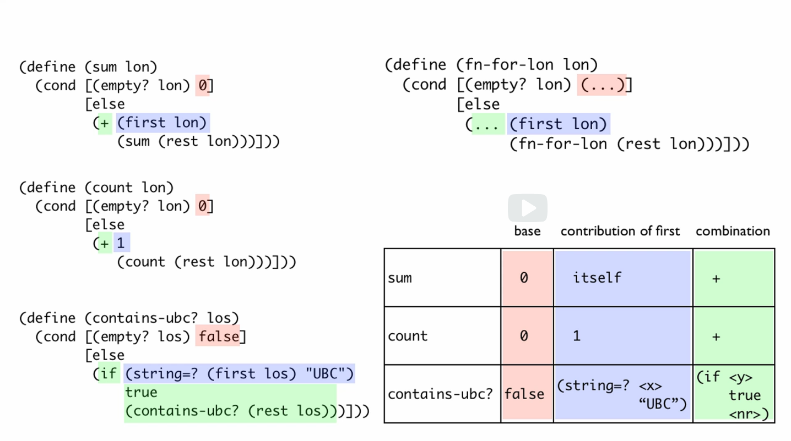

# 4a: Self Reference

## Module Overview

We are going to explore one of the most beautiful concepts in Computer Science: well-formed self-reference. But what it will allow us to do is represent arbitrarily large amounts of information. We can represent a single city name, but not all the cities on the Weird Sisters Summer 2013 Tour. Arbitrary-sized information is information that we don't know the size of in advance. A program that can display any number of cows is operating with abitrary-sized information.

Learning Goals:

- Be able to use list mechanisms to construct and destruct lists.
- Be able to identify problem domain information of arbitrary size that should be represented using lists and lists of structures.
- Be able to use the HtDD, HtDF and Data Driven Templates recipes with such data.
- Be able to explain what makes a self-referential data definition
well formed and identify whether a particular self-referential data
definition is well-formed.
- Be able to design functions that consume and produce lists and lists of structures.
- Be able to predict and identify the correspondence between
self-references in a data definition and natural recursions in functions that operate on the data.

## Introduction to Arbitrary Sized Data

All of the data definitions we have worked with have been called fixed size. This week we’re going to add to our repertoire, working with arbitrary-sized data: the kind of data we use when we want to represent an unknown amount of information.

## List Mechanisms

[listMechanisms.rkt](https://github.com/squxq/How-to-Code-Simple-Data/blob/week-04a/course/week-04a/listMechanisms/listMechanisms.rkt)

The simplest form of arbitrary-size data is a list of values. The primitive data that BSL gives us is called “lists”. Here’s the value given by BSL to represent empty lists:

```racket
; an empty list of any type of value
empty
; outputs empty
```

To form a list that isn’t empty:

```racket
; a list with "Flames" on the front of an empty list
(cons "Flames" empty) ; a list of 1 element
; outputs (cons "Flames" empty)

(cons "Leafs" (cons "Flames" empty)) ; a list of 2 elements
; outputs (cons "Leafs" (cons "Flames" empty))
```

List values use “cons” notation.

```racket
(cons (string-append "C" "anucks") empty)
; outputs (cons "Canucks" empty)
```

Expressions that produce lists can be formed out of non-value expressions but list values are formed out of values only, no other expressions.

```racket
(cons 10 (cons 9 (cons 10 empty))) ; a list of 3 elements
; ouputs (cons 10 (cons 9 (cons 10 empty)))

(cons (square 10 "solid" "blue") (cons (triangle 20 "solid" "green") empty))
; (cons (square 10 "solid" "blue") (cons (triangle 20 "solid" "green") empty))
```

“cons” can be used to produce lists with more than one type of data, but we will not do that.

```racket
(define L1 (cons "Flames" empty))
(define L2 (cons 10 (cons 9 (cons 10 empty))))
(define L3 (cons (square 10 "solid" "blue") 
           (cons (triangle 20 "solid" "green") empty)))
```

“first” consumes a list with at least one element and produces the first element of the list:

```racket
(first L1)
; outputs "Flames"

(first L2)
; outputs 10

(first L3)
; outputs (square 10 "solid" "blue")  
```

“rest” consumes a list with at least one element and produces the list after the the first element:

```racket
(rest L1)
; outputs empty

(rest L2)
; outputs (cons 9 (cons 10 empty))

(rest L3)
; outputs (cons (triangle 20 "solid" "green") empty)
```

How do I get the second element of “L2”? BSL has a primitive called “second” and one called “third”. Without using those.

```racket
(first (rest L2)) ; get the second element of L2
; outputs 9

(first (rest (rest L2))) ; get the third element of L2
; outputs 10
```

There is one more primitive that BSL gives to work with lists: the predicate “empty?”.

```racket
(empty? empty)
; outputs true

(empty? L1)
; outputs false

(empty? 1)
; outputs false
```

$$
cons\ \ \ \ a\ two\ argument\ constructor\\
first\ \ \ \ selects\ the\ first\ element\ of\ a\ list\\
rest\ \ \ \ selects\ the\ elements\ after\ the\ first\\
empty?\ \ \ \ produce\ true\ if\ argument\ is\ the\ empty\ list
$$

## List Data Definition

[listDataDefinition.no-image.rkt](https://github.com/squxq/How-to-Code-Simple-Data/blob/week-04a/course/week-04a/listDataDefinition/listDataDefinition.no-image.rkt)

> Imagine that you are designing a program that will keep track of
your favorite Quidditch teams. ([http://iqasport.org/](http://iqasport.org/)).

Design a data definition to represent a list of Quidditch teams.
> 

Getting an idea of how the information will look:

```racket
;Information:
;UBC
;McGill
;Team Who Must Not Be Named

;Data:
;"UBC"
;"McGill"
;"Team Who Must Not Be Named"
;
;empty
;
;(cons "UBC"
;      (cons "McGill" empty))
```

The actual data definition:

```racket
;; Data Definitions:

;; ListOfString is one of:
;;  - empty
;;  - (cons String ListOfString) ; self reference
;; interp. a list of strings

;; Examples:
(define LOS0 empty)
(define LOS1 (cons "McGill" empty))
(define LOS2 (cons "UBC" (cons "McGill" empty)))

;; Template:
(define (fn-for-los los)
  (cond [(empty? los) (...)]
        [else (... (first los)                  ; String
                   (fn-for-los (rest los)))]))  ; ListOfString

;; Template rules used:
;; one of: 2 cases
;; atomic distinct: empty
;; compound rule: (cons String ListOfString)
```

Note:

```racket
;; ListOfString is one of:
;;  - empty
;;  - (cons String ListOfString)
```

This is what is called self-reference. Self-reference lets us match arbitrarily long lists.

## Function Operating on List

[functionOperatingOnList.no-image.rkt](https://github.com/squxq/How-to-Code-Simple-Data/blob/week-04a/course/week-04a/functionOperatingOnList/functionOperatingOnList.no-image.rkt)

> We want to know whether your list of favorite Quidditch teams includes
UBC! Design a function that consumes ListOfString and produces true if
the list includes "UBC".
> 

```racket
;; Function Definitions:

;; ListOfString -> Boolean
;; produce true if los includes "UBC"

;; Stub:
#;
(define (contains-ubc? los) false)

;; Tests:
(check-expect (contains-ubc? LOS0) false)
(check-expect (contains-ubc? LOS1) false)
(check-expect (contains-ubc? LOS2) true)
(check-expect (contains-ubc? LOS3) true)

;; Template:
;; <Used template from ListOfString>

(define (contains-ubc? los)
  (cond [(empty? los) false]
        [else (if (string=? (first los) "UBC")
                  true
                  (contains-ubc? (rest los)))])) ; recursion
```

### Question 55: Problem 1

[problem-01.no-image.rkt](https://github.com/squxq/How-to-Code-Simple-Data/blob/week-04a/course/week-04a/functionOperatingOnList/problem-01.no-image.rkt)

> Consider the following Data Definition for ListOfNumber:

We would like to design a function that consumes a list of numbers and produces true if that list contains a negative number.
> 

```racket
;; Data Definitions:

;; ListOfNumber is one of:
;; - empty
;; - (cons Number ListOfNumber)
;; interp. a list of numbers

;; Examples:
(define LON0 empty)
(define LON1 (cons 1 empty))
(define LON2 (cons 2 (cons -1 empty)))
(define LON3 (cons -4 (cons 10 empty)))

;; Template:
#;
(define (fn-for-lon lon)
  (cond [(empty? lon) (...)]
        [else (...
               (first lon)                 ; Number
               (fn-for-lon (rest lon)))])) ; ListOfNumber

;; Template rules used:
;; - one of: 2 cases
;; - atomic distinct: empty
;; - compound rule: (cons Number ListOfNumber)
;; - [coming soon]

;; Function Definitions:

;; ListOfNumber -> Boolean
;; produce true if the given list of numbers contains a negative number

;; Stub:
#;
(define (contains-negative? lon) false)

;; Tests:
(check-expect (contains-negative? LON0) false)
(check-expect (contains-negative? LON1) false)
(check-expect (contains-negative? LON2) true)
(check-expect (contains-negative? LON3) true)

;; Template:
;; <Used template from ListOfNumber>

(define (contains-negative? lon)
  (cond [(empty? lon) false]
        [else (if (< (first lon) 0)
               true
               (contains-negative? (rest lon)))]))
```

### Question 56: Total String Length

[total-string-length-starter.no-image.rkt](https://github.com/squxq/How-to-Code-Simple-Data/blob/week-04a/course/week-04a/functionOperatingOnList/total-string-length-starter.no-image.rkt)

> Remember the data definition for a list of strings we designed in Lecture 5c:
(if this data definition does not look familiar, please review the lecture).
> 
> 
> Design a function that consumes a list of strings and determines the total
> number of characters (single letters) in the list. Call it total-string-length.
> 

```racket
;; ==========
;; Constants:

(define ALLOWED-CHARACTERS
  (list
   "a" "b" "c" "d" "e" "f" "g" "h" "i" "j" "k" "l" "m" "n" "o" "p" "q" "r" "s" "t" "u" "v" "w" "x" "y" "z"
   "A" "B" "C" "D" "E" "F" "G" "H" "I" "J" "K" "L" "M" "N" "O" "P" "Q" "R" "S" "T" "U" "V" "W" "X" "Y" "Z"
   ))

;; =================
;; Data definitions:

;Remember the data definition for a list of strings we designed in Lecture 5c:
;(if this data definition does not look familiar, please review the lecture)

;; ListOfString is one of: 
;;  - empty
;;  - (cons String ListOfString)
;; interp. a list of strings

;; Examples:
(define LS0 empty) 
(define LS1 (cons "a" empty))
(define LS2 (cons "a" (cons "b" empty)))
(define LS3 (cons "c" (cons "b" (cons "a" empty))))
(define LS4 (cons "Hello how are you" (cons "Hi, im fine what about you?" empty)))
(define LS5 (cons "lorem ipsum" (cons "3475623485jsdhfakjs dfjaQ#$!%# !w" empty)))

;; Template:
#;
(define (fn-for-los los) 
  (cond [(empty? los) (...)]
        [else
         (... (first los)
              (fn-for-los (rest los)))]))

;; Template rules used: 
;; - one of: 2 cases
;; - atomic distinct: empty
;; - compound: (cons String ListOfString)
;; - atomic non-distinct: (first los) is  String
;; - self-reference: (rest los) is ListOfString

;; =====================
;; Function Definitions:

;; ListOfString -> Natural
;; produce the total number of characters (single letters) in all the strings in given list of strings

;; Stub:
#;
(define (total-string-length los) 0)

;; Tests:
(check-expect (total-string-length LS0) 0)
(check-expect (total-string-length LS1) 1)
(check-expect (total-string-length LS2) 2)
(check-expect (total-string-length LS3) 3)
(check-expect (total-string-length LS4) 34)
(check-expect (total-string-length LS5) 25)

;; Template:
;; <Used template from ListOfString>

(define (total-string-length los) 
  (cond [(empty? los) 0]
        [else
         (+ (count-characters (first los))
              (total-string-length (rest los)))]))

;; ========
;; Helpers:

;; String -> Boolean
;; produce true if given character is allowed (defined in constants)

;; Stub:
#;
(define (is-allowed-char? char) false)

;; Tests:
(check-expect (is-allowed-char? "a") true)
(check-expect (is-allowed-char? "R") true)
(check-expect (is-allowed-char? "?") false)
(check-expect (is-allowed-char? "0") false)

;; Template:
#;
(define (is-allowed-char? char)
  (... char))

(define (is-allowed-char? char)
  (member char ALLOWED-CHARACTERS))

;; String -> Natural
;; produce the number of allowed characters in given string

;; Stub:
#;
(define (count-characters str) 0)

;; Tests:
(check-expect (count-characters "") 0)
(check-expect (count-characters "Hello, World! 123") 10)
(check-expect (count-characters "!@!$@$345730") 0)
(check-expect (count-characters "ljkashdfkjashdf") 15)

;; Template:
#;
(define (count-characters str)
  (... str))

(define (count-characters str)
  (cond [(= (string-length str) 0) 0]
        [else (if (is-allowed-char? (substring str 0 1))
             (+ 1 (count-characters (substring str 1)))
             (count-characters (substring str 1)))]))
```

### Question 57: Yell All

[yell-all-starter.no-image.rkt](https://github.com/squxq/How-to-Code-Simple-Data/blob/week-04a/course/week-04a/functionOperatingOnList/yell-all-starter.no-image.rkt)

> Remember the data definition for a list of strings we designed in Lecture 5c:
(if this data definition does not look familiar, please review the lecture)
Design a function that consumes a list of strings and "yells" each word by
> 
> 
> adding "!" to the end of each string.
> 

```racket
;; =================
;; Data definitions:

;Remember the data definition for a list of strings we designed in Lecture 5c:
;(if this data definition does not look familiar, please review the lecture)  

;; ListOfString is one of: 
;;  - empty
;;  - (cons String ListOfString)
;; interp. a list of strings

(define LS0 empty) 
(define LS1 (cons "a" empty))
(define LS2 (cons "a" (cons "b" empty)))
(define LS3 (cons "c" (cons "b" (cons "a" empty))))

#;
(define (fn-for-los los) 
  (cond [(empty? los) (...)]
        [else
         (... (first los)
              (fn-for-los (rest los)))]))

;; Template rules used: 
;; - one of: 2 cases
;; - atomic distinct: empty
;; - compound: (cons String ListOfString)
;; - self-reference: (rest los) is ListOfString

;; =====================
;; Function Definitions:

;; ListOfString -> ListOfString
;; append "!" to the end of each string in the given list of strings

;; Stub:
#;
(define (yell-all los) "!")

;; Tests:
(check-expect (yell-all LS0) LS0)
(check-expect (yell-all LS1) (cons "a!" empty))
(check-expect (yell-all LS2) (cons "a!" (cons "b!" empty)))
(check-expect (yell-all LS3) (cons "c!" (cons "b!" (cons "a!" empty))))

;; Template:
;; <Used template from ListOfString>

(define (yell-all los) 
  (cond [(empty? los) empty]
        [else
         (cons (string-append (first los) "!")
              (yell-all (rest los)))]))
```

## Revising the Recipes for Lists

[revisingRecipesLists.no-image.rkt](https://github.com/squxq/How-to-Code-Simple-Data/blob/week-04a/course/week-04a/revisingRecipesLists/revisingRecipesLists.no-image.rkt)

The type comment has two key properties. The way we derive the template preserves those properties, so that we end up with functions that work properly, even though they call themselves.

Arbitrary doesn’t mean random, it just means we don’t know ahead of time. Whenever we need data to be of arbitrary size, we want to use self-reference in the type comment. Why does this self-reference work out? The key thing is this is what is called a well-formed self-referential data definition.

It’s well-formed because it has the self-reference case (that’s what lets it get longer and longer) but it also has the non-self-referential case, or the base (that’s what lets it stop).

```racket
; An arbitrary amount of information
; requires arbitrary-sized data.

;; ListOfString is one of:
;;  - empty                       ; base case
;;  - (cons String ListOfString)  ; self-reference
;; interp. a list of strings
```

$$
Well\ formed\ self-reference:\\
\ -\ at\ least\ one\ base\ case\\
\ -\ at\ least\ one\ self-reference\ case
$$

Examples should include base and self-reference cases.

```racket
;; Examples:
(define LOS0 empty)
(define LOS1 (cons "McGill" empty))
(define LOS2 (cons "UBC" (cons "McGill" empty)))
(define LOS3 (cons "McGill" (cons "UBC" empty)))
```

When it comes to the template:

```racket
;; Template:
(define (fn-for-los los)
  (cond [(empty? los) (...)]
        [else (... (first los)                  ; String
                   (fn-for-los (rest los)))]))  ; ListOfString - natural recursion

;; Template rules used:
;; - one of: 2 cases
;; - atomic distinct: empty
;; - compound rule: (cons String ListOfString)
;; - self-reference: (rest los) is ListOfString
```

We knew that “(first los)” produces a value of type String and ”(rest los)” produces a value of type “ListOfString”. The self-reference template rule puts a natural recursion in the template that corresponds to the self-reference in the type comment.

This is what is called a natural recursion. It’s a recursion that shows up exactly where in the type comment, we have a self-reference.

In the function definition tests have a base case example/test(s) first, because:

- base case tends to be simpler;
- non-base cases tend to rely on it.

```racket
;; Function Definitions:

;; ListOfString -> Boolean
;; produce true if los includes "UBC"

;; Stub:
#;
(define (contains-ubc? los) false)

;; Tests:
(check-expect (contains-ubc? LOS0) false)
(check-expect (contains-ubc? LOS1) false)
(check-expect (contains-ubc? LOS2) true)
(check-expect (contains-ubc? LOS3) true)
```

Another general guideline for functions operating on a list is to be sure to have one or more tests in which the list is at least two elements long.

When it comes to the function template and definition: when we are using a data definition template with natural recursion be sure to rename the function definition and any natural recursions.

```racket
;; Template:
;; <Used template from ListOfString>

(define (contains-ubc? los)
  (cond [(empty? los) false]
        [else (if (string=? (first los) "UBC")
                  true
                  (contains-ubc? (rest los)))])) ; recursion
```

## Designing with Lists

[designingLists.no-image.rkt](https://github.com/squxq/How-to-Code-Simple-Data/blob/week-04a/course/week-04a/designingLists/designingLists.no-image.rkt)

> You've been asked to design a program having to do with all the owls
in the owlery.

(A) Design a data definition to represent the weights of all the owls.
    For this problem call it ListOfNumber.
(B) Design a function that consumes the weights of owls and produces
    the total weight of all the owls.
(C) Design a function that consumes the weights of owls and produces
    the total number of owls.
> 

```racket
;; =====================
;; Data Definitions:

;; ListOfNumber is one of:
;; - empty
;; - (cons Number ListOfNumber)
;; interp. a list of numbers representing an owl weight in ounces

;; Examples:
(define LON0 empty)
(define LON1 (cons 32 empty))
(define LON2 (cons 95 (cons 57 empty)))

;; Template:
#;
(define (fn-for-lon lon)
  (cond [(empty? lon) (...)]
        [else (...
               (first lon) ; Number
               (fn-for-lon (rest lon)))])) ; ListOfNumber

;; Template rules used:
;; - one of: 2 cases
;; - atomic distinct: empty
;; - compound rule: (cons Number ListOfNumber)
;; - self-reference: (rest los) is ListOfNumber

;; =====================
;; Function Definitions:

;; ListOfNumber (v1-Number) -> Number
;; produce the sum of all numbers in given list of numbers (v1: with starting sum, sum = 0)

;; Stub:
#;
(define (total-weight lon) 0)

;; Tests:
(check-expect (total-weight-v2 LON0) 0)
(check-expect (total-weight-v2 LON1) 32)
(check-expect (total-weight-v2 LON2) (+ 95 57))

;; Template:
;; <Used template from ListOfNumber>
#;
(define (total-weight lon s)
  (cond [(empty? lon) s]
        [else (total-weight (rest lon) (+ s (first lon)))]))

;; or

(define (total-weight-v2 lon)
  (cond [(empty? lon) 0]
        [else (+ (first lon) (total-weight-v2 (rest lon)))]))

;; ListOfNumber (v1: Number) -> Number
;; produce the count of all elements in given list of numbers (v1: with starting count, count = 0)

;; Stub:
#;
(define (total-count lon) 0)

;; Tests:
(check-expect (total-count-v2 LON0) 0)
(check-expect (total-count-v2 LON1) 1)
(check-expect (total-count-v2 LON2) 2)

;; Note:
; Tests on lists at least two elements long are good for
; catching mistakes in not using the natural recursion properly.
;; End of Note 

;; Template:
;; <Used template from ListOfNumber>
#;
(define (total-count lon c)
  (cond [(empty? lon) c]
        [else (total-count (rest lon) (+ c 1))]))

;; or

(define (total-count-v2 lon)
  (cond [(empty? lon) 0]
        [else (+ 1 (total-count-v2 (rest lon)))]))
```

### Question 58: Double All

[double-all-starter.no-image.rkt](https://github.com/squxq/How-to-Code-Simple-Data/blob/week-04a/course/week-04a/designingLists/double-all-starter.no-image.rkt)

> Remember the data definition for a list of numbers we designed in Lecture 5f:
(if this data definition does not look familiar, please review the lecture)
Design a function that consumes a list of numbers and doubles every number
in the list. Call it double-all.
> 

```racket
;; =================
;; Data definitions:

;Remember the data definition for a list of numbers we designed in Lecture 5f:
;(if this data definition does not look familiar, please review the lecture)

;; ListOfNumber is one of:
;;  - empty
;;  - (cons Number ListOfNumber)
;; interp. a list of numbers
(define LON1 empty)
(define LON2 (cons 60 (cons 42 empty)))
#;
(define (fn-for-lon lon)
  (cond [(empty? lon) (...)]
        [else
         (... (first lon)
              (fn-for-lon (rest lon)))]))

;; Template rules used:
;;  - one of: 2 cases
;;  - atomic distinct: empty
;;  - compound: (cons Number ListOfNumber)
;;  - self-reference: (rest lon) is ListOfNumber

;; =================
;; Functions:

;; ListOfNumber -> ListOfNumber
;; produce the double of all elements present in the given list

;; Stub:
#;
(define (double-all lon) LON1)

;; Tests:
(check-expect (double-all LON1) empty)
(check-expect (double-all LON2) (cons 120 (cons 84 empty)))
(check-expect (double-all (cons 091374 (cons -4325 (cons 5532 empty))))
              (cons (* 091374 2) (cons (* -4325 2) (cons (* 5532 2) empty))))

;; Template:
;; <Used template from ListOfNumber>

(define (double-all lon)
  (cond [(empty? lon) empty]
        [else
         (cons (* (first lon) 2)
              (double-all (rest lon)))]))
```

### Question 59: Boolean List

[boolean-list-starter.no-image.rkt](https://github.com/squxq/How-to-Code-Simple-Data/blob/week-04a/course/week-04a/designingLists/boolean-list-starter.no-image.rkt)

> Design a data definition to represent a list of booleans. Call it ListOfBoolean.
> 

```racket
;; =================
;; Data definitions:

;; ListOfBoolean is one of:
;; - empty
;; - (cons Boolean ListOfBoolean)
;; interp. a list of booleans

;; Examples:
(define LOB0 empty)
(define LOB1 (cons false empty))
(define LOB2 (cons true (cons false empty)))
(define LOB3 (cons true (cons true (cons true empty))))

;; Template:
(define (fn-for-lob lob)
  (cond [(empty? lob) (...)]
        [else (...
         (first lob)                 ; Boolean
         (fn-for-lob (rest lob)))])) ; ListOfBoolean

;; Template rules used:
;; - one of: 2 cases
;; - atomic distinct: empty
;; - compound rule: (cons Boolean ListOfBoolean)
;; - self-reference: (rest lob) is ListOfBoolean
```

> Design a function that consumes a list of boolean values and produces true
if every value in the list is true. If the list is empty, your function
should also produce true. Call it all-true?
> 

```racket
;; =================
;; Functions:

;; ListOfBoolean -> Boolean
;; produce true if all elements in list of booleans are true; else false

;; Stub:
#;
(define (all-true? lob) false)

;; Tests:
(check-expect (all-true? LOB0) true)
(check-expect (all-true? LOB1) false)
(check-expect (all-true? LOB2) false)
(check-expect (all-true? LOB3) true)

;; Template:
;; <Used template from ListOfBoolean>

(define (all-true? lob)
  (cond [(empty? lob) true]
        [else (if (first lob)
          (all-true? (rest lob))
          false
         )]))
```

### Question 60: Largest

[largest-starter.no-image.rkt](https://github.com/squxq/How-to-Code-Simple-Data/blob/week-04a/course/week-04a/designingLists/largest-starter.no-image.rkt)

> Remember the data definition for a list of numbers we designed in Lecture 5f:
(if this data definition does not look familiar, please review the lecture)
Design a function that consumes a list of numbers and produces the largest number
in the list. You may assume that all numbers in the list are greater than 0. If
the list is empty, produce 0.
> 

```racket
;; =================
;; Data definitions:

;Remember the data definition for a list of numbers we designed in Lecture 5f:
;(if this data definition does not look familiar, please review the lecture)

;; ListOfNumber is one of:
;;  - empty
;;  - (cons Number ListOfNumber)
;; interp. a list of numbers

;; Examples:
(define LON1 empty)
(define LON2 (cons 60 (cons 42 empty)))
(define LON3 (cons 60 (cons 42 (cons 132 empty))))

;; Template:
#;
(define (fn-for-lon lon)
  (cond [(empty? lon) (...)]
        [else
         (... (first lon)
              (fn-for-lon (rest lon)))]))

;; Template rules used:
;;  - one of: 2 cases
;;  - atomic distinct: empty
;;  - compound: (cons Number ListOfNumber)
;;  - self-reference: (rest lon) is ListOfNumber

;; =====================
;; Function Definitions:

;; ListOfNumber -> Number
;; produce the largest number in the given list of numbers

;; Stub:
#;
(define (largest lon) 0)

;; Tests:
(check-expect (largest LON1) 0)
(check-expect (largest LON2) 60)
(check-expect (largest LON3) 132)

;; Template:
;; <Used template from ListOfNumber>

(define (largest lon)
  (cond [(empty? lon) 0]
        [else (if (> (first lon) (largest (rest lon)))
              (first lon)
              (largest (rest lon)))]))
```

### Question 61: Image List

[image-list-starter.no-image.rkt](https://github.com/squxq/How-to-Code-Simple-Data/blob/week-04a/course/week-04a/designingLists/image-list-starter.no-image.rkt)

> Design a data definition to represent a list of images. Call it ListOfImage.
> 

```racket
;; =================
;; Data definitions:

;; ListOfImage is one of:
;; - empty
;; - (cons Image ListOfImage)
;; interp. a list of images

;; Examples:
(define LOI0 empty)
(define LOI1 (cons (square 10 "solid" "green") empty))
(define LOI2 (cons (square 10 "solid" "green") (cons (circle 34 "solid" "blue") empty)))
(define LOI3 (cons (square 10 "solid" "green")
                   (cons (rectangle 34 54 "solid" "blue")
                         (cons (triangle 90 "solid" "red") empty))))

;; Template:
#;
(define (fn-for-loi loi)
  (cond [(empty? loi) (...)]
        [else (...
               (first loi)                   ; Image
               (fn-for-loi (rest loi)))]))   ; ListOfImage

;; Template rules used:
;; - one of: 2 cases
;; - atomic distinct: empty
;; - compound rule: (cons Image ListOfImage)
;; - self-reference: (rest loi) is ListOfImage
```

> Design a function that consumes a list of images and produces a number
that is the sum of the areas of each image. For area, just use the image's
width times its height.
> 

```racket
;; =====================
;; Function Definitions:

;; ListOfImage -> Number
;; produce the total area (width x height) of all images in given list of images

;; Stub:
#;
(define (total-area loi) 0)

;; Tests:
(check-expect (total-area LOI0) 0)
(check-expect (total-area LOI1) (* 10 10))
(check-expect (total-area LOI2) (+ (* 10 10)
                                   (* (image-width (circle 34 "solid" "blue")) (image-height (circle 34 "solid" "blue")))))
(check-expect (total-area LOI3) (+ (* 10 10) (* 34 54)
                                   (* (image-width (triangle 90 "solid" "red")) (image-height (triangle 90 "solid" "red")))))

;; Template:
;; <Used template from ListOfImage>

(define (total-area loi)
  (cond [(empty? loi) 0]
        [else (+
               (* (image-width (first loi)) (image-height (first loi)))
               (total-area (rest loi)))]))
```

## Positions in List Templates

[positionsListTemplates.png](https://github.com/squxq/How-to-Code-Simple-Data/blob/week-04a/course/week-04a/positionsListTemplates/positionsListTemplates.png)

This module is a step back from the details of the functions operating on lists that have been designed, with the purpose of exploring a more abstract way of looking at those functions. A view of those functions that is less detailed but still captures the essential structure and tells something important about what the functions do.



The red spot is called “base” because what is sitting in the red spot is the base case result of this function - what the function produces in the base case.

The blue is called the contribution of the first to the overall result. Each first element of the list, when it is its turn to be first, contributes itself to the overall result.

How does that contribution work? That’s what combination means. It refers to how the final function combines the contribution of the first with the result of the natural recursion.

Because we have been working systematically with well-formed type comments, which produced templates in a well-defined way, so that a lot of our functions that operate on lists and other arbitrary size data have a common form, it’s going to be possible for us to write similar functions in one line of code.