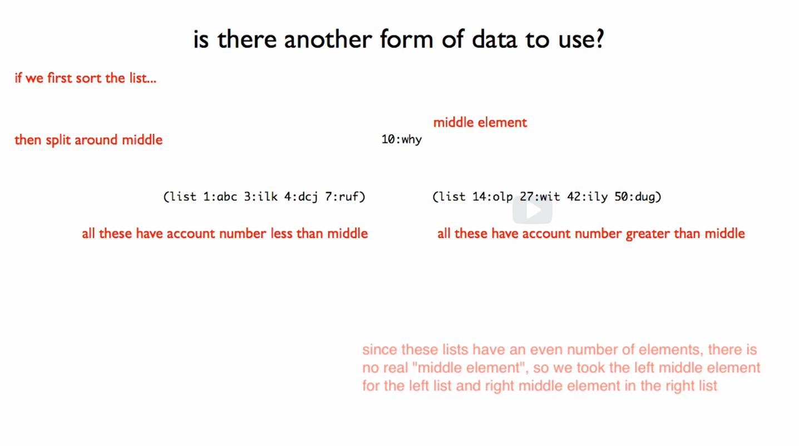
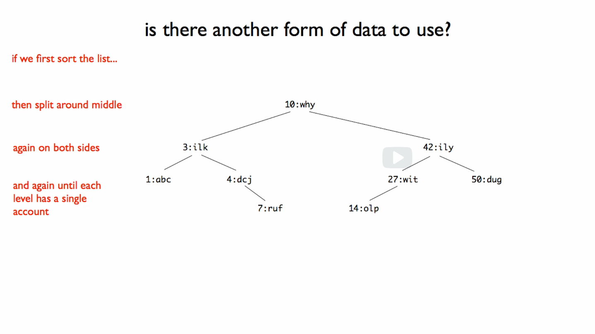

# 06: Binary Search Trees

## Module Overview

We will investigate how the structure of data affects performance, especially when it comes to the time required to find an element in a large data store.

Learning Goals:

- Be able to reason informally about the time required to search data.
- Be able to identify problem domain information that should be represented using binary search trees.
- Be able to check whether a given tree conforms to the binary search tree invariants.
- Be able to use the design recipes to design with binary search trees.

## List Abbreviations

[listAbbreviations.rkt](https://github.com/squxq/How-to-Code-Simple-Data/blob/week-06/course/week-06/listAbbreviations/listAbbreviations.rkt)

To make a list of 3 items we would:

```racket
(cons "a" (cons "b" (cons "c" empty)))
;; outputs (cons "a" (cons "b" (cons "c" empty)))
```

With list abbreviations we can write it more compactly as:

```racket
(list "a" "b" "c")
;; outputs (list "a" "b" "c")
```

Lists created with the “list” primitive are exactly list lists created with “cons”. “list” is a primitive for constructing lists, and it is a notation used to present list values.

```racket
(list (+ 1 2) (+ 3 4) (+ 5 6))
;; outputs (list 3 7 11)
```

To add one element to a list use “cons”:

```racket
(define L1 (list "b" "c"))
(define L2 (list "d" "e" "f"))

(cons "a" L1) ; produce new list by adding "a" to front of L1
;; outputs (list "a" "b" "c")

(list "a" L1) ; produce new list with "a" as first element and L1 as second element
;; outputs (list "a" (list "b" "c"))

(list L1 L2)
;; outputs (list (list "b" "c") (list "d" "e" "f"))
```

“append” combines its arguments together into a single list:

```racket
(append L1 L2)
;; outputs (list "b" "c" "d" "e" "f")

(cons "a" (cons "b" (cons "c" empty)))
(list "a" "b" "c")
;; these two lists are still the same
```

## List Of Account

[listAccount.no-image.rkt](https://github.com/squxq/How-to-Code-Simple-Data/blob/week-06/course/week-06/listAccount/listAccount.no-image.rkt)

We have a number of account numbers and names, given an account number we have to look up the name:

```racket
;; Somewhere we have something like:
(define-struct account (number name))

(list (make-account 1 "abc") (make-account 4 "dcj") (make-account 3 "ilk")   (make-account 7 "ruf"))

;; To make more entries fit on the screen we are reformatting how we show it,
;; but the underlying data is still of the form (list (make-account 1 "abc") ...)

; (list 1:abc 4:dcj 3:ilk 7:ruf)
```

The data definition that would describe how that data represents an arbitrary number of such accounts is this:

```racket
(define-struct account (num name))
;; Accounts is one of:
;;  - empty
;;  - (cons (make-account Natural String) Accounts)
;; interp. a list of accounts, where each 
;;           num  is an account number 
;;           name is the person's first name

;; Examples:
(define ACS1 empty)
(define ACS2
  (list (make-account 1 "abc") (make-account 4 "dcj") (make-account 3 "ilk")   (make-account 7 "ruf")))

;; Template:
#;
(define (fn-for-accounts accs)
  (cond [(empty? accs) (...)]
        [else
         (... (account-num  (first accs)) ;Natural
              (account-name (first accs)) ;String
              (fn-for-accounts (rest accs)))]))
```

### Question 73: Problem 1

[problem-01.no-image.rkt](https://github.com/squxq/How-to-Code-Simple-Data/blob/week-06/course/week-06/listAccount/problem-01.no-image.rkt)

> Complete the design of the lookup-name function below. Note that because this is a search function it will sometimes 'fail'. This happens if it is called with an account number that does not exist in the accounts list it is provided. If this happens the function should produce false. The signature for such a function is written in a special way as shown below.
> 

```racket
;; Accounts Natural -> String or false
;; Try to find account with given number in accounts. If found produce name, otherwise produce false.

;; Stub:
#;
(define (lookup accs n) "")

;; Tests:
(check-expect (lookup ACS1 6) false)
(check-expect (lookup ACS2 2) false)
(check-expect (lookup ACS2 4) "dcj")
(check-expect (lookup ACS2 7) "ruf")

;; Template: <used template from Accounts>
#;
(define (fn-for-accounts accs n)
  (cond [(empty? accs) (... n)]
        [else
         (... n (account-num  (first accs))
              (account-name (first accs))
              (fn-for-accounts (rest accs) (... n)))]))

(define (lookup accs n)
  (cond [(empty? accs) false]
        [else
         (if (= (account-num (first accs)) n)
             (account-name (first accs))
             (lookup (rest accs) n))]))
```

## Binary Search Trees

[binarySearchTrees-01.png](https://github.com/squxq/How-to-Code-Simple-Data/blob/week-06/course/week-06/binarySearchTrees/binarySearchTrees-01.png)

[binarySearchTrees-02.png](https://github.com/squxq/How-to-Code-Simple-Data/blob/week-06/course/week-06/binarySearchTrees/binarySearchTrees-02.png)

[binarySearchTrees-03.png](https://github.com/squxq/How-to-Code-Simple-Data/blob/week-06/course/week-06/binarySearchTrees/binarySearchTrees-03.png)

[binarySearchTrees-04.png](https://github.com/squxq/How-to-Code-Simple-Data/blob/week-06/course/week-06/binarySearchTrees/binarySearchTrees-04.png)

Last module we looked at how to represent information about an arbitrary number of accounts using a list, where each account has a number and account name.


It seems that we ought to be able to do better. One idea would be to sort the list by account number.


Sorting alone is not going to help. Here is another idea:

- If we first sort the list;
- We will take the middle of the list and we will split the list around the middle;
- On the left-hand side we put everything that came before the middle (all accounts have account number less than the middle account number);
- On the right-hand side we put everything that came after the middle (all accounts have account number greater than the middle account number);
    
    
    
- We repeat the last 3 actions for each sub-list until we get to the point where there’s no lists left, where at each level all we have is a single account number and name.
    
    
    

This is a “binary search tree”. “10:why” and “3:ilk” are 2 of 9 nodes in the tree. At each level:

- All accounts in left sub-tree have account number less than root;
- All accounts in right sub-tree have account number greater than root.

This rule is an invariant: it’s true over the whole tree, or it doesn’t vary over the tree (thus, invariant).

At each step we don’t find what we’re looking for, we eliminate half of the tree. When searching a list, it gets smaller only by 1 at each recursive call. A binary search tree gets smaller by 1/2 at each recursive call. On average we would have to look at log(n) tree nodes (the tree gets smaller by 1/2 each time we fail in our search).

### Question 74: Problem 1

[problem-01.no-image.rkt](https://github.com/squxq/How-to-Code-Simple-Data/blob/week-06/course/week-06/binarySearchTrees/problem-01.no-image.rkt)

[problem-01.rkt](https://github.com/squxq/How-to-Code-Simple-Data/blob/week-06/course/week-06/binarySearchTrees/problem-01.rkt)

> Food for thought:

(open image file)

    A) If all binary search trees looked like the one above, will we gain anything from using them instead of lists?

    B) Can we do anything to those trees if we want to improve the performance of searching for a node?
> 

```racket
;A) No difference between operating on a binary search tree like the one above or the ordinary list.

;B) This is because the root (1:a) is poorly chosen. Choosing the median node of a list (2:b / 3:c)
;   would result in a more efficient BST model that properly optimize the performance (runtime) of the function.
```

## A Data Definition for BSTs

[dataDefinitionBSTs.no-image.rkt](https://github.com/squxq/How-to-Code-Simple-Data/blob/week-06/course/week-06/dataDefinitionBSTs/dataDefinitionBSTs.no-image.rkt)

[dataDefinitionBSTs.rkt](https://github.com/squxq/How-to-Code-Simple-Data/blob/week-06/course/week-06/dataDefinitionBSTs/dataDefinitionBSTs.rkt)

[dataDefinitionBSTs.png](https://github.com/squxq/How-to-Code-Simple-Data/blob/week-06/course/week-06/dataDefinitionBSTs/dataDefinitionBSTs.png)

> Design a data definition to represent binary search trees. As a reminder,
here is one example BST:

(open image file)
> 

The information we are trying to represent is this binary search tree, which has a number, n, of what are called nodes:


4 parts that naturally go together: use compound data. What allows us to create arbitrary-sized data? Was it the “cons”? Was it a “list”? It was self-reference, so we’ll need two self-reference cycles in this data definition, along with the compound.

```racket
;; =================
;; Data Definitions:

(define-struct node (key val l r))
;; BST (Binary Search Tree) is one of:
;; - false
;; - (make-node Integer String BST BST)
;; interp. false means no BST, or empty BST
;;         key is the node key
;;         val is the node val
;;         l and r are left and right subtrees
;; INVARIANT: for a given node:
;;     key is > all keys in its (l)eft child
;;     key is < all keys in its (r)ight child
;;     the same key never appears twice in the tree

;; Examples:
(define BST0 false)
(define BST1 (make-node 1 "abc" false false))
(define BST4 (make-node 4 "dcj" false (make-node 7 "ruf" false false)))
(define BST3 (make-node 3 "ilk" BST1 BST4))
(define BST27 (make-node 27 "wit" (make-node 14 "olp" false false) false))
(define BST50 (make-node 50 "dug" false false))
(define BST42 (make-node 42 "ily" BST27 BST50))
(define BST10 (make-node 10 "why" BST3 BST42))

;; Template:
#;
(define (fn-for-bst t)
  (cond [(false? t) (...)]
        [else
         (... (node-key t)                 ; Integer
              (node-val t)                 ; String
              (fn-for-bst (node-l t))      ; BST
              (fn-for-bst (node-r t)))]))  ; BST

;; Template rules used:
;; - one of: 2 cases
;; - atomic distinct: false
;; - compound: (make-node Integer String BST BST)
;; - self-reference: (node-l t) is BST
;; - self-reference: (node-r t) is BST
```

## Lookup in BSTs

[lookupBSTs.no-image.rkt](https://github.com/squxq/How-to-Code-Simple-Data/blob/week-06/course/week-06/lookupBSTs/lookupBSTs.no-image.rkt)

[lookupBSTs.rkt](https://github.com/squxq/How-to-Code-Simple-Data/blob/week-06/course/week-06/lookupBSTs/lookupBSTs.rkt)

> Consider the following data definition for a binary search tree:
> 

```racket
;; Data definitions:

(define-struct node (key val l r))
;; A BST (Binary Search Tree) is one of:
;;  - false
;;  - (make-node Integer String BST BST)
;; interp. false means no BST, or empty BST
;;         key is the node key
;;         val is the node val
;;         l and r are left and right subtrees
;; INVARIANT: for a given node:
;;     key is > all keys in its l(eft)  child
;;     key is < all keys in its r(ight) child
;;     the same key never appears twice in the tree

; (open image file)

;; Examples:
(define BST0 false)
(define BST1 (make-node 1 "abc" false false))
(define BST4 (make-node 4 "dcj" false (make-node 7 "ruf" false false)))
(define BST3 (make-node 3 "ilk" BST1 BST4))
(define BST42 
  (make-node 42 "ily"
             (make-node 27 "wit" (make-node 14 "olp" false false) false)
             (make-node 50 "dug" false false)))
(define BST10
  (make-node 10 "why" BST3 BST42))

;; Template:
#;
(define (fn-for-bst t)
  (cond [(false? t) (...)]
        [else
         (... (node-key t)    ;Integer
              (node-val t)    ;String
              (fn-for-bst (node-l t))
              (fn-for-bst (node-r t)))]))

;; Template rules used:
;;  - one of: 2 cases
;;  - atomic-distinct: false
;;  - compound: (make-node Integer String BST BST)
;;  - self reference: (node-l t) has type BST
;;  - self reference: (node-r t) has type BST
```

> Complete the design of the lookup-key function below. Note that because this is a search function it will sometimes 'fail'. This happens if it is called with an key that does not exist in the BST it is provided. If this happens the function should produce false. The signature for such a function is written in a special way as shown below.
> 

```racket
;; BST Natural -> String or false
;; Try to find node with given key, if found produce value; if not found produce false.

;; Stub:

(define (lookup-key t k) "")
```

In creating tests for functions operating on lists it was often sufficient to check “two deep” into the self-reference. Here we have two self-reference cases, and need tests to check whether they are both working properly.

```racket
;; Tests:
(check-expect (lookup-key BST0 99) false)
(check-expect (lookup-key BST1 1) "abc")
(check-expect (lookup-key BST1 0) false)   ; L fail
(check-expect (lookup-key BST1 99) false)  ; R fail
(check-expect (lookup-key BST10 1) "abc")  ; L L succeed
(check-expect (lookup-key BST10 4) "dcj")  ; L R succeed
(check-expect (lookup-key BST10 27) "wit") ; R L succeed 
(check-expect (lookup-key BST10 50) "dug")  ; R R succeed

;; Template: <used template from BST, and additional atomic parameter k>
#;
(define (lookup-key t k)
  (cond [(false? t) (... k)]
        [else
         (... k
              (node-key t)
              (node-val t)
              (lookup-key (node-l t) (... k))
              (lookup-key (node-r t) (... k)))]))

(define (lookup-key t k)
  (cond [(false? t) false]
        [else
         (cond [(= k (node-key t)) (node-val t)]
               [(< k (node-key t)) (lookup-key (node-l t) k)]
               [(> k (node-key t)) (lookup-key (node-r t) k)])]))
```

Our rules for forming types are based on some solid theory in computer science. Our rules for forming templates are based on some solid theory in computer science. Because of the very strict way in which we’ve templated so far, functions based on our templates will easily traverse all our data structures. 

### Question 75: Count Nodes

[count-nodes-starter.no-image.rkt](https://github.com/squxq/How-to-Code-Simple-Data/blob/week-06/course/week-06/lookupBSTs/count-nodes-starter.no-image.rkt)

[count-nodes-starter.rkt](https://github.com/squxq/How-to-Code-Simple-Data/blob/week-06/course/week-06/lookupBSTs/count-nodes-starter.rkt)

> Design the function count-nodes, which consumes BST and produces a
natural number which is the total number of nodes in the BST. An
empty tree (false) has 0 nodes.
> 

```racket
;; Data definitions:

(define-struct node (key val l r))
;; A BST (Binary Search Tree) is one of:
;;  - false
;;  - (make-node Integer String BST BST)
;; interp. false means no BST, or empty BST
;;         key is the node key
;;         val is the node val
;;         l and r are left and right subtrees
;; INVARIANT: for a given node:
;;     key is > all keys in its l(eft)  child
;;     key is < all keys in its r(ight) child
;;     the same key never appears twice in the tree

;; Examples:
(define BST0 false)
(define BST1 (make-node 1 "abc" false false))
(define BST4 (make-node 4 "dcj" false (make-node 7 "ruf" false false)))
(define BST3 (make-node 3 "ilk" BST1 BST4))
(define BST42 
  (make-node 42 "ily"
             (make-node 27 "wit" (make-node 14 "olp" false false) false)
             false))
(define BST10 (make-node 10 "why" BST3 BST42))

;(open image file)

;; Template:
#;
(define (fn-for-bst t)
  (cond [(false? t) (...)]
        [else
         (... (node-key t)    ;Integer
              (node-val t)    ;String
              (fn-for-bst (node-l t))
              (fn-for-bst (node-r t)))]))

;; Template rules used:
;;  - one of: 2 cases
;;  - atomic-distinct: false
;;  - compound: (make-node Integer String BST BST)
;;  - self reference: (node-l t) has type BST
;;  - self reference: (node-r t) has type BST

;; Function Definitions:

;; BST -> Natural
;; produce the total number of nodes in the given binary search tree, t

;; Stub:
#;
(define (count-nodes t) 0)

;; Tests:
(check-expect (count-nodes BST0) 0)
(check-expect (count-nodes BST1) 1)
(check-expect (count-nodes BST4) 2)
(check-expect (count-nodes BST3) 4)
(check-expect (count-nodes BST42) 3)
(check-expect (count-nodes BST10) 8)

;; Template: <used template from BST>

(define (count-nodes t)
  (cond [(false? t) 0]
        [else
         (+ (count-nodes (node-l t))
            (count-nodes (node-r t)) 1)]))
```

### Question 76: Sum Keys

[sum-keys-starter.no-image.rkt](https://github.com/squxq/How-to-Code-Simple-Data/blob/week-06/course/week-06/lookupBSTs/sum-keys-starter.no-image.rkt)

[sum-keys-starter.rkt](https://github.com/squxq/How-to-Code-Simple-Data/blob/week-06/course/week-06/lookupBSTs/sum-keys-starter.rkt)

> Design a function that consumes a BST and produces the sum of all
the keys in the BST.
> 

```racket
;; Data definitions:

(define-struct node (key val l r))
;; A BST (Binary Search Tree) is one of:
;;  - false
;;  - (make-node Integer String BST BST)
;; interp. false means no BST, or empty BST
;;         key is the node key
;;         val is the node val
;;         l and r are left and right subtrees
;; INVARIANT: for a given node:
;;     key is > all keys in its l(eft)  child
;;     key is < all keys in its r(ight) child
;;     the same key never appears twice in the tree

;; Examples:
(define BST0 false)
(define BST1 (make-node 1 "abc" false false))
(define BST4 (make-node 4 "dcj" false (make-node 7 "ruf" false false)))
(define BST3 (make-node 3 "ilk" BST1 BST4))
(define BST42 
  (make-node 42 "ily"
             (make-node 27 "wit" (make-node 14 "olp" false false) false)
             false))
(define BST10 (make-node 10 "why" BST3 BST42))

;(open image file)

;; Template:
#;
(define (fn-for-bst t)
  (cond [(false? t) (...)]
        [else
         (... (node-key t)    ;Integer
              (node-val t)    ;String
              (fn-for-bst (node-l t))
              (fn-for-bst (node-r t)))]))

;; Template rules used:
;;  - one of: 2 cases
;;  - atomic-distinct: false
;;  - compound: (make-node Integer String BST BST)
;;  - self reference: (node-l t) has type BST
;;  - self reference: (node-r t) has type BST

;; Function Definitions:

;; BST -> Integer
;; produce the sum of all keys in the give nbinary search tree, t

;; Stub:
#;
(define (sum-all-keys t) 0)

;;  Tests:
(check-expect (sum-all-keys BST0) 0)
(check-expect (sum-all-keys BST1) 1)
(check-expect (sum-all-keys BST4) 11)
(check-expect (sum-all-keys BST3) 15)
(check-expect (sum-all-keys BST42) 83)
(check-expect (sum-all-keys BST10) 108)

;; Template: <used template from BST>

(define (sum-all-keys t)
  (cond [(false? t) 0]
        [else
         (+ (node-key t) (sum-all-keys (node-l t))
            (sum-all-keys (node-r t)))]))
```

### Question 77: Height

[height-starter.no-image.rkt](https://github.com/squxq/How-to-Code-Simple-Data/blob/week-06/course/week-06/lookupBSTs/height-starter.no-image.rkt)

[height-starter.rkt](https://github.com/squxq/How-to-Code-Simple-Data/blob/week-06/course/week-06/lookupBSTs/height-starter.rkt)

> Design the function height, that consumes a BST and produces its height. Note that
the height of a BST is one plus the height of its highest child. You will want to
use the BSL max function in your solution. The height of a false tree is 0. The
height of (make-node 1 "a" false false) is 1.
> 

```racket
;; Data definitions:

(define-struct node (key val l r))
;; A BST (Binary Search Tree) is one of:
;;  - false
;;  - (make-node Integer String BST BST)
;; interp. false means no BST, or empty BST
;;         key is the node key
;;         val is the node val
;;         l and r are left and right subtrees
;; INVARIANT: for a given node:
;;     key is > all keys in its l(eft)  child
;;     key is < all keys in its r(ight) child
;;     the same key never appears twice in the tree

;; Examples:
(define BST0 false)
(define BST1 (make-node 1 "abc" false false))
(define BST4 (make-node 4 "dcj" false (make-node 7 "ruf" false false)))
(define BST3 (make-node 3 "ilk" BST1 BST4))
(define BST42 
  (make-node 42 "ily"
             (make-node 27 "wit" (make-node 14 "olp" false false) false)
             false))
(define BST10 (make-node 10 "why" BST3 BST42))

;(open image file)

;; Template:
#;
(define (fn-for-bst t)
  (cond [(false? t) (...)]
        [else
         (... (node-key t)    ;Integer
              (node-val t)    ;String
              (fn-for-bst (node-l t))
              (fn-for-bst (node-r t)))]))

;; Template rules used:
;;  - one of: 2 cases
;;  - atomic-distinct: false
;;  - compound: (make-node Integer String BST BST)
;;  - self reference: (node-l t) has type BST
;;  - self reference: (node-r t) has type BST

;; Function Definitions:

;; BST -> Natural
;; produce the height (maximum depth of any leaf node from the root node)
;;         of given binary search tree, t

;; Stub:
#;
(define (height t) 0)

;; Tests:
(check-expect (height BST0) 0)
(check-expect (height BST1) 1)
(check-expect (height BST4) 2)
(check-expect (height BST3) 3)
(check-expect (height BST42) 3)
(check-expect (height BST10) 4)

;; Template: <used template from BST>

(define (height t)
  (cond [(false? t) 0]
        [else
         (+ (max (height (node-l t)) (height (node-r t))) 1)]))
```

### Question 78: Insert

[insert-starter.no-image.rkt](https://github.com/squxq/How-to-Code-Simple-Data/blob/week-06/course/week-06/lookupBSTs/insert-starter.no-image.rkt)

[insert-starter.rkt](https://github.com/squxq/How-to-Code-Simple-Data/blob/week-06/course/week-06/lookupBSTs/insert-starter.rkt)

> Design a function that consumes an Integer, String and BST, and adds a node
that has the given key and value to the tree. The node should be inserted in
the proper place in the tree. The function can assume there is not already
an entry for that number in the tree. The function should produce the new BST.

Do not worry about keeping the tree balanced. We will come back to this later.
> 

```racket
;; Data definitions:

(define-struct node (key val l r))
;; A BST (Binary Search Tree) is one of:
;;  - false
;;  - (make-node Integer String BST BST)
;; interp. false means no BST, or empty BST
;;         key is the node key
;;         val is the node val
;;         l and r are left and right subtrees
;; INVARIANT: for a given node:
;;     key is > all keys in its l(eft)  child
;;     key is < all keys in its r(ight) child
;;     the same key never appears twice in the tree

;; Examples:
(define BST0 false)
(define BST1 (make-node 1 "abc" false false))
(define BST4 (make-node 4 "dcj" false (make-node 7 "ruf" false false)))
(define BST3 (make-node 3 "ilk" BST1 BST4))
(define BST42 
  (make-node 42 "ily"
             (make-node 27 "wit" (make-node 14 "olp" false false) false)
             false))
(define BST10 (make-node 10 "why" BST3 BST42))

;(open image file)

;; Template:
#;
(define (fn-for-bst t)
  (cond [(false? t) (...)]
        [else
         (... (node-key t)    ;Integer
              (node-val t)    ;String
              (fn-for-bst (node-l t))
              (fn-for-bst (node-r t)))]))

;; Template rules used:
;;  - one of: 2 cases
;;  - atomic-distinct: false
;;  - compound: (make-node Integer String BST BST)
;;  - self reference: (node-l t) has type BST
;;  - self reference: (node-r t) has type BST

;; Function Definitions:

;; Integer String BST -> BST
;; add a node that has the given key, key, and value, val, to the given binary search tree, t
;; ASSUME: there is not already an entry for that number in the tree

;; Stub:
#;
(define (insert-node key val t) false)

;; Tests:
(check-expect (insert-node 3 "smt" BST0)
  (make-node 3 "smt" false false))
(check-expect (insert-node 3 "smt" BST1)
  (make-node 1 "abc" false (make-node 3 "smt" false false)))
(check-expect (insert-node 3 "smt" BST4)
  (make-node 4 "dcj" (make-node 3 "smt" false false) (make-node 7 "ruf" false false)))
(check-expect (insert-node 5 "new" BST3)
  (make-node 3 "ilk" BST1 (make-node 4 "dcj" false (make-node 7 "ruf" (make-node 5 "new" false false) false))))
(check-expect (insert-node 2 "ano" BST42)
  (make-node 42 "ily" (make-node 27 "wit" (make-node 14 "olp" (make-node 2 "ano" false false) false) false) false))
(check-expect (insert-node 2 "ano" BST10)
  (make-node 10 "why" (make-node 3 "ilk" (make-node 1 "abc" false (make-node 2 "ano" false false)) BST4) BST42))

;; Template: <used template from BST and added Integer parameter key and String parameter val>
#;
(define (insert-node key val t)
  (cond [(false? t) (... key val)]
        [else
         (... key
              val
              (node-key t)
              (node-val t)
              (insert-node (... key) (... val) (node-l t))
              (insert-node (... key) (... val) (node-r t)))]))

(define (insert-node key val t)
  (cond [(false? t) (make-node key val false false)]
        [else
         (cond [(< key (node-key t))
                (make-node (node-key t) (node-val t) (insert-node key val (node-l t)) (node-r t))]
               [(> key (node-key t))
                (make-node (node-key t) (node-val t) (node-l t) (insert-node key val (node-r t)))])]))
```

### Question 79: Balance Factor

[balance-factor-starter.no-image.rkt](https://github.com/squxq/How-to-Code-Simple-Data/blob/week-06/course/week-06/lookupBSTs/balance-factor-starter.no-image.rkt)

[balance-factor-starter.rkt](https://github.com/squxq/How-to-Code-Simple-Data/blob/week-06/course/week-06/lookupBSTs/balance-factor-starter.rkt)

> As discussed in lecture, for optimal lookup time we want a BST to be balanced.
The oldest approach to this is called AVL self-balancing trees and was invented in 1962.
The remainder of this problem set is based on AVL trees.

An individual node is balanced when the height of its left and right branches differ
by no more than 1. A tree is balanced when all its nodes are balanced.

a) Design the function balance-factor that consumes a node and produces its balance factor,
which is defined as the height of its left child minus the height of its right child.

b) Use your function in part a) to design the function balanced?, which consumes a BST and
produces true if the tree is balanced.

Once you have the function, use it to compare what happens with the following two sequences
of insertions:

(insert 4 "a"
        (insert 5 "a"
                (insert 6 "a"
                        (insert 7 "a"
                                (insert 8 "a" false)))))
> 
> 
> 
> (insert 4 "a"
>         (insert 5 "a"
>                 (insert 8 "a"
>                         (insert 7 "a"
>                                 (insert 6 "a" false)))))
> 

```racket
;; Data definitions:

(define-struct node (key val l r))
;; A BST (Binary Search Tree) is one of:
;;  - false
;;  - (make-node Integer String BST BST)
;; interp. false means no BST, or empty BST
;;         key is the node key
;;         val is the node val
;;         l and r are left and right subtrees
;; INVARIANT: for a given node:
;;     key is > all keys in its l(eft)  child
;;     key is < all keys in its r(ight) child
;;     the same key never appears twice in the tree

;; Examples:
(define BST0 false)
(define BST1 (make-node 1 "abc" false false))
(define BST4 (make-node 4 "dcj" false (make-node 7 "ruf" false false)))
(define BST3 (make-node 3 "ilk" BST1 BST4))
(define BST42 
  (make-node 42 "ily"
             (make-node 27 "wit" (make-node 14 "olp" false false) false)
             false))
(define BST10 (make-node 10 "why" BST3 BST42))

;(open image file)

;; Template:
#;
(define (fn-for-bst t)
  (cond [(false? t) (...)]
        [else
         (... (node-key t)    ;Integer
              (node-val t)    ;String
              (fn-for-bst (node-l t))
              (fn-for-bst (node-r t)))]))

;; Template rules used:
;;  - one of: 2 cases
;;  - atomic-distinct: false
;;  - compound: (make-node Integer String BST BST)
;;  - self reference: (node-l t) has type BST
;;  - self reference: (node-r t) has type BST

;; Function Definitions:

;; BST -> Natural
;; produce the height (maximum depth of any leaf node from the root node)
;;         of given binary search tree, t

;; Stub:
#;
(define (height t) 0)

;; Tests:
(check-expect (height BST0) 0)
(check-expect (height BST1) 1)
(check-expect (height BST4) 2)
(check-expect (height BST3) 3)
(check-expect (height BST42) 3)
(check-expect (height BST10) 4)

;; Template: <used template from BST>

(define (height t)
  (cond [(false? t) 0]
        [else
         (+ (max (height (node-l t)) (height (node-r t))) 1)]))

;; Integer String BST -> BST
;; add a node that has the given key, key, and value, val, to the given binary search tree, t
;; ASSUME: there is not already an entry for that number in the tree

;; Stub:
#;
(define (insert-node key val t) false)

;; Tests:
(check-expect (insert-node 3 "smt" BST0)
  (make-node 3 "smt" false false))
(check-expect (insert-node 3 "smt" BST1)
  (make-node 1 "abc" false (make-node 3 "smt" false false)))
(check-expect (insert-node 3 "smt" BST4)
  (make-node 4 "dcj" (make-node 3 "smt" false false) (make-node 7 "ruf" false false)))
(check-expect (insert-node 5 "new" BST3)
  (make-node 3 "ilk" BST1 (make-node 4 "dcj" false (make-node 7 "ruf" (make-node 5 "new" false false) false))))
(check-expect (insert-node 2 "ano" BST42)
  (make-node 42 "ily" (make-node 27 "wit" (make-node 14 "olp" (make-node 2 "ano" false false) false) false) false))
(check-expect (insert-node 2 "ano" BST10)
  (make-node 10 "why" (make-node 3 "ilk" (make-node 1 "abc" false (make-node 2 "ano" false false)) BST4) BST42))

;; Template: <used template from BST and added Integer parameter key and String parameter val>
#;
(define (insert-node key val t)
  (cond [(false? t) (... key val)]
        [else
         (... key
              val
              (node-key t)
              (node-val t)
              (insert-node (... key) (... val) (node-l t))
              (insert-node (... key) (... val) (node-r t)))]))

(define (insert-node key val t)
  (cond [(false? t) (make-node key val false false)]
        [else
         (cond [(< key (node-key t))
                (make-node (node-key t) (node-val t) (insert-node key val (node-l t)) (node-r t))]
               [(> key (node-key t))
                (make-node (node-key t) (node-val t) (node-l t) (insert-node key val (node-r t)))])]))

;; (make-node Integer String BST BST) -> Integer
;; produce the balance factor (height of its left child minus the height of its right child)
;;         of the given node, n

;; Stub:
#;
(define (balance-factor n) 0)

;; Tests:
(check-expect (balance-factor BST1) 0)
(check-expect (balance-factor BST4) -1)
(check-expect (balance-factor BST3) -1)
(check-expect (balance-factor BST42) 2)
(check-expect (balance-factor BST10) 0)

;; Template:
#;
(define (balance-factor n)
  (... (node-key n)
       (node-val n)
       (node-l n)
       (node-r n)))

(define (balance-factor n)
  (- (height (node-l n)) (height (node-r n))))

;; BST -> Boolean
;; produce true if the tree is balanced (if all of its nodes are balanced)
;;         an individual node is balanced when the height of its left and right branch differ by no more than 1
;;         otherwise produce false

;; Stub:
#;
(define (balanced? t) false)

;; Tests:
(check-expect (balanced? BST0) true)
(check-expect (balanced? BST1) true)
(check-expect (balanced? BST4) true)
(check-expect (balanced? BST3) true)
(check-expect (balanced? BST42) false)
(check-expect (balanced? BST10) false)

;; Template: <used template from BST>

(define (balanced? t)
  (cond [(false? t) true]
        [else
         (and (<= (abs (balance-factor t)) 1) (balanced? (node-l t)) (balanced? (node-r t)))]))

;Once you have the function, use it to compare what happens with the following two sequences
;of insertions:
;
;
;(insert 4 "a" 
;        (insert 5 "a"
;                (insert 6 "a" 
;                        (insert 7 "a" 
;                                (insert 8 "a" false)))))
;        
;        
;(insert 4 "a" 
;        (insert 5 "a"
;                (insert 8 "a" 
;                        (insert 7 "a" 
;                                (insert 6 "a" false))))) 

;; Insertion 0:
(define I0 (insert-node 4 "a" 
        (insert-node 5 "a"
                (insert-node 6 "a" 
                        (insert-node 7 "a" 
                                (insert-node 8 "a" false))))))
I0
;; outputs (make-node 8 "a" (make-node 7 "a" (make-node 6 "a" (make-node 5 "a" (make-node 4 "a" #false #false) #false) #false) #false) #false)
(height I0)
;; ouputs 5
(balanced? I0)
;; outputs false

;; Insertion 1:
(define I1 (insert-node 4 "a" 
        (insert-node 5 "a"
                (insert-node 8 "a" 
                        (insert-node 7 "a" 
                                (insert-node 6 "a" false))))))
I1
;; ouputs (make-node 6 "a" (make-node 5 "a" (make-node 4 "a" #false #false) #false) (make-node 7 "a" #false (make-node 8 "a" #false #false)))
(height I1)
;; outputs 3
(balanced? I1)
;; outputs false
```

## Rendering BSTs

[renderingBSTs.no-image.rkt](https://github.com/squxq/How-to-Code-Simple-Data/blob/week-06/course/week-06/renderingBSTs/renderingBSTs.no-image.rkt)

[renderingBSTs.rkt](https://github.com/squxq/How-to-Code-Simple-Data/blob/week-06/course/week-06/renderingBSTs/renderingBSTs.rkt)

> Consider the following data definition for a binary search tree:
> 

```racket
;; Data definitions:

(define-struct node (key val l r))
;; A BST (Binary Search Tree) is one of:
;;  - false
;;  - (make-node Integer String BST BST)
;; interp. false means no BST, or empty BST
;;         key is the node key
;;         val is the node val
;;         l and r are left and right subtrees
;; INVARIANT: for a given node:
;;     key is > all keys in its l(eft)  child
;;     key is < all keys in its r(ight) child
;;     the same key never appears twice in the tree

; (open image file)

;; Examples:
(define BST0 false)
(define BST1 (make-node 1 "abc" false false))
(define BST4 (make-node 4 "dcj" false (make-node 7 "ruf" false false)))
(define BST3 (make-node 3 "ilk" BST1 BST4))
(define BST42 
  (make-node 42 "ily"
             (make-node 27 "wit" (make-node 14 "olp" false false) false)
             (make-node 50 "dug" false false)))
(define BST10
  (make-node 10 "why" BST3 BST42))

;; Template:
#;
(define (fn-for-bst t)
  (cond [(false? t) (...)]
        [else
         (... (node-key t)    ;Integer
              (node-val t)    ;String
              (fn-for-bst (node-l t))
              (fn-for-bst (node-r t)))]))

;; Template rules used:
;;  - one of: 2 cases
;;  - atomic-distinct: false
;;  - compound: (make-node Integer String BST BST)
;;  - self reference: (node-l t) has type BST
;;  - self reference: (node-r t) has type BST
```

> Design a function that consumes a bst and produces a SIMPLE
rendering of that bst. Emphasis on SIMPLE. You might want to
skip the lines for example.
> 

```racket
;; Constants:

(define TEXT-SIZE 14)
(define TEXT-COLOR "black")

(define KEY-VAL-SEPARATOR ":")

(define VSPACE (rectangle 1 10 "solid" "white"))
(define HSPACE (rectangle 10 1 "solid" "white"))

(define MTTREE (rectangle 20 10 "solid" "white"))

;; Functions:

;; BST -> Image
;; produce a simple rendering of the given binary search tree

;; Stub:
#;
(define (render-bst t) empty-image)

;; Tests:
(check-expect (render-bst false) MTTREE)
(check-expect (render-bst BST1)
              (above (text (string-append "1" KEY-VAL-SEPARATOR "abc") TEXT-SIZE TEXT-COLOR)
                     VSPACE
                     (beside (render-bst false)
                             HSPACE
                             (render-bst false))))
(check-expect (render-bst BST4)
              (above (text (string-append "4" KEY-VAL-SEPARATOR "dcj") TEXT-SIZE TEXT-COLOR)
                     VSPACE
                     (beside (render-bst false)
                             HSPACE
                             (render-bst (make-node 7 "ruf" false false)))))
(check-expect (render-bst BST3)
              (above (text (string-append "3" KEY-VAL-SEPARATOR "ilk") TEXT-SIZE TEXT-COLOR)
                     VSPACE
                     (beside (render-bst BST1)
                             HSPACE
                             (render-bst BST4))))

;; Template: <used template from BST>

(define (render-bst t)
  (cond [(false? t) MTTREE]
        [else
         (above (text (string-append (number->string (node-key t)) KEY-VAL-SEPARATOR (node-val t))
                    TEXT-SIZE TEXT-COLOR)
                VSPACE
                (beside (render-bst (node-l t)) HSPACE (render-bst (node-r t))))]))
```

### Question 80: Render BST with Lines

[render-bst-w-lines-starter.no-image.rkt](https://github.com/squxq/How-to-Code-Simple-Data/blob/week-06/course/week-06/renderingBSTs/render-bst-w-lines-starter.no-image.rkt)

[render-bst-w-lines-starter.rkt](https://github.com/squxq/How-to-Code-Simple-Data/blob/week-06/course/week-06/renderingBSTs/render-bst-w-lines-starter.rkt)

> Given the following data definition for a binary search tree,
design a function that consumes a bst and produces a SIMPLE
rendering of that bst including lines between nodes and their
subnodes.

To help you get started, we've added some sketches below of
one way you could include lines to a bst.
> 

```racket
;; Constants

(define TEXT-SIZE  14)
(define TEXT-COLOR "BLACK")

(define KEY-VAL-SEPARATOR ":")

(define MTTREE (rectangle 20 1 "solid" "white"))

;; Data definitions:

(define-struct node (key val l r))
;; A BST (Binary Search Tree) is one of:
;;  - false
;;  - (make-node Integer String BST BST)
;; interp. false means no BST, or empty BST
;;         key is the node key
;;         val is the node val
;;         l and r are left and right subtrees
;; INVARIANT: for a given node:
;;     key is > all keys in its l(eft)  child
;;     key is < all keys in its r(ight) child
;;     the same key never appears twice in the tree

;(open image file)

;; Examples:
(define BST0 false)
(define BST1 (make-node 1 "abc" false false))
(define BST7 (make-node 7 "ruf" false false)) 
(define BST4 (make-node 4 "dcj" false (make-node 7 "ruf" false false)))
(define BST3 (make-node 3 "ilk" BST1 BST4))
(define BST42 
  (make-node 42 "ily"
             (make-node 27 "wit" (make-node 14 "olp" false false) false)
             (make-node 50 "dug" false false)))
(define BST10
  (make-node 10 "why" BST3 BST42))
(define BST100 
  (make-node 100 "large" BST10 false))

;; Template:
#;
(define (fn-for-bst t)
  (cond [(false? t) (...)]
        [else
         (... (node-key t)    ;Integer
              (node-val t)    ;String
              (fn-for-bst (node-l t))
              (fn-for-bst (node-r t)))]))

;; Template rules used:
;;  - one of: 2 cases
;;  - atomic-distinct: false
;;  - compound: (make-node Integer String BST BST)
;;  - self reference: (node-l t) has type BST
;;  - self reference: (node-r t) has type BST
```

> Here is a sketch of one way the lines could work. What
this sketch does is allows us to see the structure of
the functions pretty clearly. We'll have one helper for
the key value image, and one helper to draw the lines.
Each of those produces a rectangular image of course.

(open image file)

And here is a sketch of the helper that draws the lines:
(open image file)
where lw means width of left subtree image and
      rw means width of right subtree image
> 

```racket
;; Functions:

;; BST -> Image
;; produce a rendering of the given binary search tree, t

;; Stub:
#;
(define (render-bst t) empty-image)

;; Tests:
(check-expect (render-bst BST0) MTTREE)
(check-expect (render-bst BST1)
              (above (text "1:abc" TEXT-SIZE TEXT-COLOR)
                     (render-subnodes MTTREE MTTREE)))
(check-expect (render-bst BST4)
              (above (text "4:dcj" TEXT-SIZE TEXT-COLOR)
                     (render-subnodes MTTREE
                                      (render-bst BST7))))
(check-expect (render-bst BST3)
              (above (text "3:ilk" TEXT-SIZE TEXT-COLOR)
                     (render-subnodes (render-bst BST1)
                                      (render-bst BST4))))
(check-expect (render-bst BST42)
              (above (text "42:ily" TEXT-SIZE TEXT-COLOR)
                     (render-subnodes (render-bst (make-node 27 "wit" (make-node 14 "olp" false false) false))
                                      (render-bst (make-node 50 "dug" false false)))))
(check-expect (render-bst BST10)
              (above (text "10:why" TEXT-SIZE TEXT-COLOR)
                     (render-subnodes (render-bst BST3)
                                      (render-bst BST42))))
(check-expect (render-bst BST100)
              (above (text "100:large" TEXT-SIZE TEXT-COLOR)
                     (render-subnodes (render-bst BST10)
                                      MTTREE)))

;; Template: <used template from BST>

(define (render-bst t)
  (cond [(false? t) MTTREE]
        [else
         (above (key-val-image (node-key t) (node-val t))
                (render-subnodes (render-bst (node-l t)) (render-bst (node-r t))))]))

;; Integer String -> Image
;; produce the key-value image given the key, key, and the value, val

;; Stub:
#;
(define (key-val-image key val) empty-image)

;; Tests:
(check-expect (key-val-image 1 "abc")
              (text "1:abc" TEXT-SIZE TEXT-COLOR))
(check-expect (key-val-image 4 "dcj")
              (text "4:dcj" TEXT-SIZE TEXT-COLOR))
(check-expect (key-val-image 3 "ilk")
              (text "3:ilk" TEXT-SIZE TEXT-COLOR))
(check-expect (key-val-image 42 "ily")
              (text "42:ily" TEXT-SIZE TEXT-COLOR))
(check-expect (key-val-image 10 "why")
              (text "10:why" TEXT-SIZE TEXT-COLOR))
(check-expect (key-val-image 100 "large")
              (text "100:large" TEXT-SIZE TEXT-COLOR))

;; Template:
#;
(define (key-val-image key val)
  (... key val))

(define (key-val-image key val)
  (text (string-append (number->string key) KEY-VAL-SEPARATOR val) TEXT-SIZE TEXT-COLOR))

;; Image Image -> Image
;; render given subnodes, sn1 and sn2

;; Stub:
#;
(define (render-subnodes sn1 sn2) empty-image)

;; Tests:
(check-expect (render-subnodes MTTREE MTTREE)
              (above (draw-lines MTTREE MTTREE) (beside MTTREE MTTREE)))
(check-expect (render-subnodes MTTREE (render-bst BST7))
              (above (draw-lines MTTREE (render-bst BST7)) (beside MTTREE (render-bst BST7))))
(check-expect (render-subnodes (render-bst BST1) (render-bst BST4))
              (above (draw-lines (render-bst BST1) (render-bst BST4))
                     (beside (render-bst BST1) (render-bst BST4))))
(check-expect (render-subnodes (render-bst (make-node 27 "wit" (make-node 14 "olp" false false) false))
                               (render-bst (make-node 50 "dug" false false)))
              (above (draw-lines (render-bst (make-node 27 "wit" (make-node 14 "olp" false false) false))
                                 (render-bst (make-node 50 "dug" false false)))
                     (beside (render-bst (make-node 27 "wit" (make-node 14 "olp" false false) false))
                             (render-bst (make-node 50 "dug" false false)))))
(check-expect (render-subnodes (render-bst BST3) (render-bst BST42))
              (above (draw-lines (render-bst BST3) (render-bst BST42))
                     (beside (render-bst BST3) (render-bst BST42))))
(check-expect (render-subnodes (render-bst BST10) MTTREE)
              (above (draw-lines (render-bst BST10) MTTREE) (beside (render-bst BST10) MTTREE)))

;; Template:
#;
(define (render-subnodes sn1 sn2)
  (... sn1 sn2))

(define (render-subnodes sn1 sn2)
  (above (draw-lines sn1 sn2) (beside sn1 sn2)))

;; Image Image -> Image
;; produce the correct arguments based on the two given images, sn1 and sn2, for render-lines

;; Stub:
#;
(define (draw-lines sn1 sn2) empty-image)

;; Tests:
(check-expect (draw-lines MTTREE MTTREE) (render-lines 0 0))
(check-expect (draw-lines MTTREE (render-bst BST7))
              (render-lines 0 (image-width (render-bst BST7))))
(check-expect (draw-lines (render-bst BST10) MTTREE)
              (render-lines (image-width (render-bst BST10)) 0))
(check-expect (draw-lines (render-bst BST1) (render-bst BST4))
              (render-lines (image-width (render-bst BST1)) (image-width (render-bst BST4))))

;; Template:
#;
(define (draw-lines sn1 sn2)
  (... sn1 sn2))

(define (draw-lines sn1 sn2)
  (cond [(and (image=? sn1 MTTREE) (image=? sn2 MTTREE)) (render-lines 0 0)]
        [(image=? sn1 MTTREE) (render-lines 0 (image-width sn2))]
        [(image=? sn2 MTTREE) (render-lines (image-width sn1) 0)]
        [else (render-lines (image-width sn1) (image-width sn2))]))

;; Natural Natural -> Image
;; render the lines connecting the parent node to its 2 child nodes with the given widths of the child nodes, n1 and n2

;; Stub:
#;
(define (render-lines n1 n2) empty-image)

;; Tests:
(check-expect (render-lines 0 0) empty-image)
(check-expect (render-lines 0 (image-width (render-bst BST7)))
              (add-line (rectangle (image-width (render-bst BST7)) (/ (image-width (render-bst BST7)) 4) "solid" "white")
                        (/ (image-width (render-bst BST7)) 2)  0
                        (image-width (render-bst BST7))  (/ (image-width (render-bst BST7)) 4)
                        "black"))
(check-expect (render-lines (image-width (render-bst BST10)) 0)
              (add-line (rectangle (image-width (render-bst BST10)) (/ (image-width (render-bst BST10)) 4) "solid" "white")
                        (/ (image-width (render-bst BST10)) 2)  0
                        0         (/ (image-width (render-bst BST10)) 4)
                        "black"))
(check-expect (render-lines (image-width (render-bst BST1)) (image-width (render-bst BST4)))
              (add-line (add-line (rectangle (+ (image-width (render-bst BST4)) (image-width (render-bst BST1)))
                                             (/ (+ (image-width (render-bst BST4)) (image-width (render-bst BST1))) 4) "solid" "white")
                                  (/ (+ (image-width (render-bst BST4)) (image-width (render-bst BST1))) 2) 0
                                  (/ (image-width (render-bst BST4)) 2) (/ (+ (image-width (render-bst BST4)) (image-width (render-bst BST1))) 4) "black")
                        (/ (+ (image-width (render-bst BST4)) (image-width (render-bst BST1))) 2)  0
                        (+ (image-width (render-bst BST4)) (/ (image-width (render-bst BST1)) 2))  (/ (+ (image-width (render-bst BST4)) (image-width (render-bst BST1))) 4)
                        "black"))

;; Template:
#;
(define (render-lines n1 n2)
  (... n1 n2))

(define (render-lines n1 n2)
  (cond [(and (= n1 0) (= n2 0)) empty-image]
        [(= n1 0) (add-line (rectangle n2 (/ n2 4) "solid" "white")
                            (/ n2 2) 0
                            n2 (/ n2 4)
                            "black")]
        [(= n2 0) (add-line (rectangle n1 (/ n1 4) "solid" "white")
                            (/ n1 2) 0
                            0 (/ n1 4)
                            "black")]
        [else (add-line (add-line (rectangle (+ n2 n1) (/ (+ n2 n1) 4) "solid" "white")
                                  (/ (+ n2 n1) 2) 0
                                  (/ n2 2) (/ (+ n2 n1) 4)
                                  "black")
                        (/ (+ n2 n1) 2) 0
                        (+ n2 (/ n1 2)) (/ (+ n2 n1) 4)
                        "black")]))
```