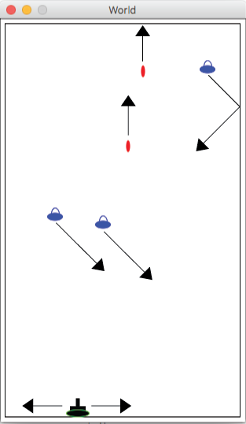
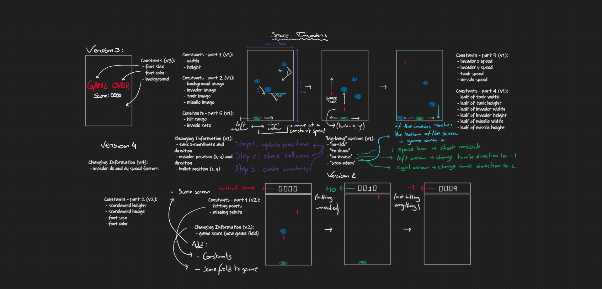

# Final Project: Space Invaders

[space-invaders-starter.rkt](https://github.com/squxq/How-to-Code-Simple-Data/blob/master/final-project/space-invaders-starter.rkt)

[final-project-domain-analysis.png](https://github.com/squxq/How-to-Code-Simple-Data/blob/master/final-project/final-project-domain-analysis.png)

[final-project-preview.png](https://github.com/squxq/How-to-Code-Simple-Data/blob/master/final-project/final-project-preview.png)

In this final project, I will complete the design of the classic arcade game Space Invaders.

There are many different versions of Space Invaders. For this project, my Space Invaders game should have the following behavior:

- The tank should move right and left at the bottom of the screen when I press the arrow keys. If I press the left arrow key, it will continue to move left at a constant speed until you press the right arrow key.
- The tank should fire missiles straight up from its current position when I press the space bar.
- The invaders should appear randomly along the top of the screen and move at a 45-degree angle. When they hit a wall they will bounce off and continue at a 45-degree angle in the other direction.
- When an invader reaches the bottom of the screen, the game is over.

This is an example of what the game should look like during play. The arrows have been added to show how the different parts of the game:



There are notable addictions that distinguish my game from others:

- Space Invaders move at different random speeds, within a constrain, horizontally and vertically;
- Space Invaders move in different random directions;
- When the game is over - an invader reaches the bottom of the screen - a GAME OVER screen is shown;
- The game includes a score field that is incremented as the player hits invaders, and decremented when the player’s missiles don’t hit any invader and go off the screen;
- There are difficulty constants in the “Constants” section (SPAWNING-DIFFICULTY; SPEED-DIFFICULTY), right at the beginning, which change how the game spawns invaders and their velocities. Disclaimer: these constants are very sensitive.

Domain Analysis:



Project Code:

```racket
;; Space Invaders

;; ==========
;; Constants:

(define WIDTH  300)
(define HEIGHT 500)

(define INVADER-X-SPEED 1.5)  ;speeds (not velocities) in pixels per tick
(define INVADER-Y-SPEED 1.5)
(define TANK-SPEED 2)
(define MISSILE-SPEED 10)

(define HIT-RANGE 10)

(define INVADE-RATE 100)

(define BORDER_WIDTH 10)

(define BACKGROUND (empty-scene WIDTH HEIGHT))

(define INVADER
  (overlay/xy (ellipse 10 15 "outline" "blue")              ;cockpit cover
              -5 6
              (ellipse 20 10 "solid"   "blue")))            ;saucer

(define TANK
  (overlay/xy (overlay (ellipse 28 8 "solid" "black")       ;tread center
                       (ellipse 30 10 "solid" "green"))     ;tread outline
              5 -14
              (above (rectangle 5 10 "solid" "black")       ;gun
                     (rectangle 20 10 "solid" "black"))))   ;main body

(define MISSILE (ellipse 5 15 "solid" "red"))

(define TANK-WIDTH/2 (/ (image-width TANK) 2))
(define TANK-HEIGHT/2 (/ (image-height TANK) 2))
(define INVADER-WIDTH/2 (/ (image-width INVADER) 2))
(define INVADER-HEIGHT/2 (/ (image-height INVADER) 2))
(define MISSILE-WIDTH/2 (/ (image-width MISSILE) 2))
(define MISSILE-HEIGHT/2 (/ (image-height MISSILE) 2))

(define SCOREBOARD-HEIGHT 50)
(define SCOREBOARD (rectangle WIDTH SCOREBOARD-HEIGHT "solid" "white"))
(define SCORE-FONT-SIZE 34)
(define SCORE-FONT-COLOR "black")

(define HITTING-POINTS 10)
(define MISSING-POINTS -1)

(define GAME-OVER-FONT-SIZE 44)
(define GAME-OVER-FONT-COLOR "red")
(define GAME-OVER-BACKGROUND (empty-scene WIDTH (+ HEIGHT SCOREBOARD-HEIGHT)))

(define SPAWNING-DIFFICULTY 3)
(define SPEED-DIFFICULTY 9)

;; =================
;; Data Definitions:

(define-struct tank (x dir))
;; Tank is (make-tank Natural[TANK-WIDTH/2, WIDTH - TANK-WIDTH/2] Integer[-1, 1]\[0])
;; interp. the tank location is x, HEIGHT - TANK-HEIGHT/2 in screen coordinates
;;         the tank moves TANK-SPEED pixels per clock tick left if dir = -1, right if dir = 1

;; Examples:
(define T0 (make-tank (/ WIDTH 2) 1)) ; center going right
(define T1 (make-tank 50 1))          ; going right
(define T2 (make-tank 50 -1))         ; going left

;; Template:
#;
(define (fn-for-tank t)
  (... (tank-x t)     ; Natural[TANK-WIDTH/2, WIDTH - TANK-WIDTH/2]
       (tank-dir t))) ; Integer[-1, 1]\[0]

;; Template rules used:
;; - compound: 2 fields

(define-struct invader (x y dir dx dy))
;; Invader is (make-invader Natural[INVADER-WIDTH/2, WIDTH - INVADER-WIDTH/2] Integer[-2 * INVADER-HEIGHT/2, HEIGHT - INVADER-HEIGHT/2] Integer[-1, 1]\[0] Number[0.5, 1.5] Number[0.5, 1.5])
;; interp. the invader is at (x, y) in screen coordinates
;;         the invader moves along x by dx * INVADER-X-SPEED pixels per clock tick left if dir = -1, right if dir = 1
;;         the invader moves along y by dy * INVADER-Y-SPEED pixels per clock tick

;; Examples:
(define I1 (make-invader 150 100 1 0.5 1.2))                          ; not landed, moving right
(define I2 (make-invader 150 (- HEIGHT INVADER-HEIGHT/2) -1 0.7 0.5)) ; landed, moving left
(define I3 (make-invader 150 150 1 1.4 0.8))                          ; not landed, moving left

;; Template:
#;
(define (fn-for-invader i)
  (... (invader-x i)     ; Natural[INVADER-WIDTH/2, WIDTH - INVADER-WIDTH/2]
       (invader-y i)     ; Integer[-2 * INVADER-HEIGHT/2, HEIGHT - INVADER-HEIGHT/2]
       (invader-dir i)   ; Integer[-1, 1]\[0]
       (invader-dx i)    ; Number[0.5, 1.5]
       (invader-dy i)))  ; Number[0.5, 1.5]

;; Template rules used:
;; - compound: 5 fields

;; ListOfInvader is one of:
;; - empty
;; - (cons Invader ListOfInvader)
;; interp. a list of invaders

;; Examples:
(define LOI0 empty)
(define LOI1 (list I1))
(define LOI2 (list I1 I2))
(define LOI3 (list I1 I2 I3))

;; Template:
#;
(define (fn-for-loi loi)
  (cond [(empty? loi) (...)]
        [else
         (... (fn-for-invader (first loi)) ; Invader
              (fn-for-loi (rest loi)))]))  ; ListOfInvader

;; Template rules used:
;; - one of: 2 cases
;; - atomic distinct: empty
;; - compound: (cons Invader ListOfInvader)
;; - reference: (first loi) is Invader
;; - self-reference: (rest loi) is ListOfInvader

(define-struct missile (x y))
;; Missile is (make-missile Natural[TANK-WIDTH/2, WIDTH - TANK-WIDTH/2] Integer[-2 * MISSILE-HEIGHT/2, HEIGHT - TANK-HEIGHT/2])
;; interp. the missile's location is (x, y) in screen coordinates

;; Examples:
(define M1 (make-missile 150 300))                               ;not hit I1
(define M2 (make-missile (invader-x I1) (+ (invader-y I1) 10)))  ;exactly hit I1, 10 is the HIT-RANGE
(define M3 (make-missile (invader-x I1) (+ (invader-y I1)  5)))  ;> hit U1, 5 is less than HIT-RANGE

;; Template:
#;
(define (fn-for-missile m)           ; Natural[TANK-WIDTH/2, WIDTH - TANK-WIDTH/2]
  (... (missile-x m) (missile-y m))) ; Integer[-2 * MISSILE-HEIGHT/2, HEIGHT - TANK-HEIGHT/2]

;; Template rules used:
;; - compound: 2 fields

;; ListOfMissile is one of:
;; - empty
;; - (cons Missile ListOfMissile)
;; interp. a list of missiles

;; Examples:
(define LOM0 empty)
(define LOM1 (list M1))
(define LOM2 (list M1 M2))
(define LOM3 (list M1 M2 M3))

;; Template:
#;
(define (fn-for-lom lom)
  (cond [(empty? lom) (...)]
        [else
         (... (fn-for-missile (first lom)) ; Missile
              (fn-for-lom (rest lom)))]))  ; ListOfMissile

;; Template rules used:
;; - one of: 2 cases
;; - atomic distinct: empty
;; - compound: (cons Missile ListOfMissile)
;; - reference: (first lom) is Missile
;; - self-reference: (rest lom) is ListOfMissile

(define-struct game (invaders missiles tank score))
;; Game is (make-game  ListOfInvader ListOfMissile Tank Natural[0, 9999])
;; interp. the current state of a space invaders game
;;         with the current invaders, missiles, tank and score

;; Examples:
(define G0 (make-game empty empty T0 0))
(define G1 (make-game empty empty T1 0))
(define G2 (make-game (list I1) (list M1) T1 0))
(define G3 (make-game (list I1 I2) (list M1 M2) T1 0))
(define G4 (make-game (list I1 I2) (list M1 M2) T1 90))

;; To start the game:
(define G-MAIN (make-game empty empty (make-tank (/ WIDTH 2) 0) 0))

;; Template:
#;
(define (fn-for-game g)
  (... (fn-for-loi (game-invaders g))
       (fn-for-lom (game-missiles g))
       (fn-for-tank (game-tank g))
       (game-score g)))

;; Template rules used:
;; - compound: 4 fields

;; =====================
;; Function Definitions:

;; Game -> Game
;; start the world with: (main G-MAIN)

(define (main g)
  (big-bang g                             ; Game
    (on-tick update-game)                 ; Game -> Game
    (to-draw render-game)                 ; Game -> Image
    (on-key on-key-game)                  ; Game KeyEvent -> Game
    (stop-when stop-game game-over)))     ; Game -> Boolean

;; Game -> Game
;; produce next position of the game (invaders, missiles and tank)

;; Stub:
#;
(define (update-game g) G0)

;; Tests:
(check-expect (update-game G0)
              (make-game empty empty (update-tank T0 (tank-dir T0)) 0))
(check-expect (update-game G1)
              (make-game empty empty (update-tank T1 (tank-dir T1)) 0))
(check-expect (update-game G2)
              (make-game (list (make-invader (+ (invader-x I1) (* (invader-dx I1) INVADER-X-SPEED (invader-dir I1)))
                                             (+ (invader-y I1) (* (invader-dy I1) INVADER-Y-SPEED)) (invader-dir I1) (invader-dx I1) (invader-dy I1)))
                         (list (make-missile (missile-x M1) (- (missile-y M1) MISSILE-SPEED)))
                         (update-tank T1 (tank-dir T1)) 0))
(check-expect (update-game G3)
              (make-game (list (make-invader (+ (invader-x I2) (* (invader-dx I2) INVADER-X-SPEED (invader-dir I2)))
                                             (+ (invader-y I2) (* (invader-dy I2) INVADER-Y-SPEED)) (invader-dir I2) (invader-dx I2) (invader-dy I2)))
                         (list (make-missile (missile-x M1) (- (missile-y M1) MISSILE-SPEED)))
                         (update-tank T1 (tank-dir T1)) 10))

;; Template: <used template from Game>

(define (update-game g)
  (update-game-layer g (update-missiles (game-missiles g))))

;; Game ListOfMissile -> Game
;; given a state of a game at a certain time, g, and an updated list of missiles, lom, produce an updated game

;; Stub:
#;
(define (update-game-layer g lom) g)

;; Tests:
(check-expect (update-game-layer G0 empty)
              (make-game (update-invaders (game-invaders G0)) empty (update-tank T0 (tank-dir T0))
                         (update-score-missiles (game-score G0) (game-missiles G0) empty)))
(check-expect (update-game-layer G1 empty)
              (make-game (update-invaders (game-invaders G1)) empty (update-tank T1 (tank-dir T1))
                         (update-score-missiles (game-score G1) (game-missiles G1) empty)))
(check-expect (update-game-layer G2 (game-missiles G2))
              (make-game (update-invaders (game-invaders G2)) (game-missiles G2) (update-tank T1 (tank-dir T1))
                         (update-score-missiles (game-score G2) (game-missiles G2) (game-missiles G2))))
(check-expect (update-game-layer G3 (list M1))
              (make-game (update-invaders (game-invaders G3)) (list M1) (update-tank T1 (tank-dir T1))
                         (update-score-missiles (game-score G3) (game-missiles G3) (list M1))))
(check-expect (update-game-layer G3 empty)
              (make-game (update-invaders (game-invaders G3)) empty (update-tank T1 (tank-dir T1))
                         (update-score-missiles (game-score G3) (game-missiles G3) empty)))

;; Template:
#;
(define (update-game-layer g lom)
  (... (fn-for-game g)
       (fn-for-lom lom)))

(define (update-game-layer g lom)
  (collisions (make-game (update-invaders (game-invaders g)) lom
                         (update-tank (game-tank g) (tank-dir (game-tank g)))
                         (update-score-missiles (game-score g) (game-missiles g) lom))))

;; Game -> Game
;; given a state of a game at a certain time, g, produce a game with filtered collisions and possible new invaders

;; Stub:
#;
(define (collisions g) g)

;; Tests: 
(check-expect (collisions G0) G0)
(check-expect (collisions G1) G1)
(check-expect (collisions G2) G2)
(check-expect (collisions G3)
              (make-game (list I2) (list M1) (game-tank G3) 10))

;; Template: <used template from Game>

(define (collisions g)
  (collisions-layer g (collisions-invaders (game-invaders g) (game-missiles g))))

;; Game ListOfInvader -> Game
;; given a state of a game at a certain time, g, and a new filtered list of invaders (have not been hit), loi, produce an updated game with no collisions

;; Stub:
#;
(define (collisions-layer g loi) g)

;; Tests:
(check-expect (collisions-layer G0 empty) G0)
(check-expect (collisions-layer G1 empty) G1)
(check-expect (collisions-layer G2 (game-invaders G2)) G2)
(check-expect (collisions-layer G3 (list I2))
              (make-game (list I2) (list M1) T1 10))

;; Template:
#;
(define (collisions-layer g loi)
  (... (fn-for-game g)
       (fn-for-loi loi)))

(define (collisions-layer g loi)
  (make-game (create-invader loi (random INVADE-RATE))
             (collisions-missiles (game-missiles g) (game-invaders g))
             (game-tank g) (update-score-invaders (game-score g) (game-invaders g) loi)))

;; ListOfInvader ListOfMissile -> ListOfInvader
;; filter the given list of invaders, loi, for any invader that has been hit by a missile in given list of missiles, lom
;;        "hit" means: comparing the horizontal and vertical distances between the invader and the first missile
;;                     to certain thresholds (half of the invader's width and an acceptable range on the y-axis)

;; Stub:
#;
(define (collisions-invaders loi lom) loi)

;; Tests:
(check-expect (collisions-invaders empty empty) empty)
(check-expect (collisions-invaders (list I1 I2) empty) (list I1 I2))
(check-expect (collisions-invaders empty (list M1)) empty)
(check-expect (collisions-invaders (list I1) (list M1)) (list I1))
(check-expect (collisions-invaders (list I1 I2) (list M1 M2)) (list I2))

;; Template: <used template from ListOfInvader>
#;
(define (collisions-invaders loi lom)
  (cond [(empty? loi) (... (fn-for-lom lom))]
        [else
         (... (fn-for-lom lom)
              (fn-for-invader (first loi))
              (collisions-invaders (rest loi) (... (fn-for-lom lom))))]))

(define (collisions-invaders loi lom)
  (cond [(empty? loi) empty]
        [else
         (if (not (invader-collides? (first loi) lom))
             (cons (first loi) (collisions-invaders (rest loi) lom))
             (collisions-invaders (rest loi) lom))]))

;; Invader ListOfMissile -> Boolean
;; check if given invader, i, collides with any of the elements in the given list of missiles, lom

;; Stub:
#;
(define (invader-collides? i lom) false)

;; Tests:
(check-expect (invader-collides? I1 empty) false)
(check-expect (invader-collides? I2 (list M1)) false)
(check-expect (invader-collides? I1 (list M1 M2)) true)

;; Template: <used template from ListOfMissile>
#;
(define (fn-for-lom i lom)
  (cond [(empty? lom) (... (fn-for-invader i))]
        [else
         (... (fn-for-invader i)
              (fn-for-missile (first lom))
              (fn-for-lom (... (fn-for-invader i)) (rest lom)))]))

(define (invader-collides? i lom)
  (cond [(empty? lom) false]
        [else
         (or (and (<= (abs (- (invader-x i) (missile-x (first lom)))) INVADER-WIDTH/2)
                  (<= (abs (- (missile-y (first lom)) (invader-y i))) HIT-RANGE))
             (invader-collides? i (rest lom)))]))

;; ListOfMissile ListOfInvader -> ListOfMissile
;; filter the given list of missiles, lom, for any missile that has hit an invader in the given list of invaders, loi
;;        "hit" means: comparing the horizontal and vertical distances between the missile and the first invader
;;                     to certain thresholds (half of the invader's width and an acceptable range on the y-axis)

;; Stub:
#;
(define (collisions-missiles lom loi) lom)

;; Tests:
(check-expect (collisions-missiles empty empty) empty)
(check-expect (collisions-missiles (list M1 M2) empty) (list M1 M2))
(check-expect (collisions-missiles empty (list I1)) empty)
(check-expect (collisions-missiles (list M1) (list I1)) (list M1))
(check-expect (collisions-missiles (list M1 M2) (list I1 I2)) (list M1))

;; Template: <used template from ListOfMissile>
#;
(define (collisions-missiles lom loi)
  (cond [(empty? lom) (... (fn-for-loi loi))]
        [else
         (... (fn-for-loi loi)
              (fn-for-missile (first lom))
              (collisions-missiles (rest lom) (... (fn-for-loi loi))))]))

(define (collisions-missiles lom loi)
  (cond [(empty? lom) empty]
        [else
         (if (not (missile-collides? (first lom) loi))
             (cons (first lom) (collisions-missiles (rest lom) loi))
             (collisions-missiles (rest lom) loi))]))

;; Missile ListOfInvader -> Boolean
;; check if given missile, m, collides with any of the elements in the given list of invaders, loi

;; Stub:
#;
(define (missile-collides? m loi) false)

;; Tests:
(check-expect (missile-collides? M1 empty) false)
(check-expect (missile-collides? M2 (list I1)) true)
(check-expect (missile-collides? M1 (list I1 I2)) false)

;; Template: <used template from ListOfInvader>
#;
(define (missile-collides? m loi)
  (cond [(empty? loi) (... (fn-for-missile m))]
        [else
         (... (fn-for-missile m)
              (fn-for-invader (first loi))
              (missile-collides? (... (fn-for-missile m)) (rest loi)))]))

(define (missile-collides? m loi)
  (cond [(empty? loi) false]
        [else
         (or (and (<= (abs (- (missile-x m) (invader-x (first loi)))) INVADER-WIDTH/2)
                  (<= (abs (- (invader-y (first loi)) (missile-y m))) HIT-RANGE))
             (missile-collides? m (rest loi)))]))

;; ListOfInvader -> ListOfInvader
;; produce next iteration of the position of all invaders in given list of invaders, loi

;; Stub:
#;
(define (update-invaders loi) loi)

;; Tests:
(check-expect (update-invaders empty) empty)
(check-expect (update-invaders (list I1))
              (list (make-invader (+ (invader-x I1) (* (invader-dx I1) INVADER-X-SPEED (invader-dir I1)))
                                  (+ (invader-y I1) (* (invader-dy I1) INVADER-Y-SPEED)) (invader-dir I1) (invader-dx I1) (invader-dy I1))))
(check-expect (update-invaders (list I1 I2))
              (list (make-invader (+ (invader-x I1) (* (invader-dx I1) INVADER-X-SPEED (invader-dir I1)))
                                  (+ (invader-y I1) (* (invader-dy I1) INVADER-Y-SPEED)) (invader-dir I1) (invader-dx I1) (invader-dy I1))
                    (make-invader (+ (invader-x I2) (* (invader-dx I2) INVADER-X-SPEED (invader-dir I2)))
                                  (+ (invader-y I2) (* (invader-dy I2) INVADER-Y-SPEED)) (invader-dir I2) (invader-dx I2) (invader-dy I2))))

;; Template: <used template from ListOfInvader>

(define (update-invaders loi)
  (cond [(empty? loi) empty]
        [else
         (cons (update-invader (first loi))
               (update-invaders (rest loi)))]))

;; Invader -> Invader
;; produce the next position of a given invader, i

;; Stub:
#;
(define (update-invader i) i)

;; Tests:
(check-expect (update-invader I1)
              (make-invader (+ (invader-x I1) (* (invader-dx I1) INVADER-X-SPEED (invader-dir I1)))
                            (+ (invader-y I1) (* (invader-dy I1) INVADER-Y-SPEED)) (invader-dir I1) (invader-dx I1) (invader-dy I1)))
(check-expect (update-invader I2)
              (make-invader (+ (invader-x I2) (* (invader-dx I2) INVADER-X-SPEED (invader-dir I2)))
                            (+ (invader-y I2) (* (invader-dy I2) INVADER-Y-SPEED)) (invader-dir I2) (invader-dx I2) (invader-dy I2)))
(check-expect (update-invader (make-invader (- WIDTH INVADER-WIDTH/2 0.8) 150 1 0.6 0.8))
              (out-of-border (- WIDTH INVADER-WIDTH/2 0.8) 1 (+ 150 (* 0.8 INVADER-Y-SPEED)) (- WIDTH INVADER-WIDTH/2) 0.6 0.8))
(check-expect (update-invader (make-invader (+ INVADER-WIDTH/2 1) 150 -1 1.4 0.7))
              (make-invader (- (* 2 INVADER-WIDTH/2) (+ INVADER-WIDTH/2 1) (* 1.4 INVADER-X-SPEED -1))
                            (+ 150 (* 0.7 INVADER-Y-SPEED))
                            (* -1 -1)
                            1.4 0.7))

;; Template: <used template from Invader>

(define (update-invader i)
  (update-invader-layer (invader-x i) (invader-dir i)
                        (+ (invader-x i) (* (invader-dx i) INVADER-X-SPEED (invader-dir i)))
                        (+ (invader-y i) (* (invader-dy i) INVADER-Y-SPEED))
                        (invader-dx i) (invader-dy i)))

;; Natural[INVADER-WIDTH/2, WIDTH - INVADER-WIDTH/2] Integer[-1, 1] Natural Natural Number[0.5, 1.5] Number[0.5, 1.5] -> Invader
;; produce the next position of an invader given:
;;         its current x position, x
;;         its current direction, dir
;;         its possible next x coordinate, next-x
;;         its possible next y coordinate, next-y
;;         its dx value, dx
;;         its dy value, dy

;; Stub:
#;
(define (update-invader-layer x dir next-x next-y dx dy) I1)

;; Tests:
(check-expect (update-invader-layer 150 1 (+ 150 (* 0.6 INVADER-X-SPEED 1)) 160 0.6 0.8)
              (make-invader (+ 150 (* 0.6 INVADER-X-SPEED 1)) 160 1 0.6 0.8))
(check-expect (update-invader-layer (- WIDTH INVADER-WIDTH/2 1) 1 (+ WIDTH INVADER-WIDTH/2 1) 160 1.2 0.7)
              (out-of-border (- WIDTH INVADER-WIDTH/2 1) 1 160 (- WIDTH INVADER-WIDTH/2) 1.2 0.7))
(check-expect (update-invader-layer (+ INVADER-WIDTH/2 1) -1 (- INVADER-WIDTH/2 1) 160 1.0 1.5)
              (out-of-border (+ INVADER-WIDTH/2 1) -1 160 INVADER-WIDTH/2 1.0 1.5))

;; Template:
#;
(define (update-invader-layer x dir next-x next-y dx dy)
  (... x dir next-x next-y dx dy))

(define (update-invader-layer x dir next-x next-y dx dy)
  (cond [(and (>= next-x INVADER-WIDTH/2) (<= next-x (- WIDTH INVADER-WIDTH/2)))
         (make-invader next-x next-y dir dx dy)]
        [(< next-x INVADER-WIDTH/2)
         (out-of-border x dir next-y INVADER-WIDTH/2 dx dy)]
        [(> next-x (- WIDTH INVADER-WIDTH/2))
         (out-of-border x dir next-y (- WIDTH INVADER-WIDTH/2) dx dy)]))

;; Natural[INVADER-WIDTH/2, WIDTH - INVADER-WIDTH/2] Integer[-1, 1] Natural (INVADER-WIDTH/2 || WIDTH - INVADER-WIDTH/2) Number[0.5, 1.5] Number[0.5, 1.5] -> Invader
;; produce the next position of an invader whose predicted position is out of bounds
;;         either less than INVADER-WIDTH/2
;;         or greater than WIDTH - INVADER-WIDTH/2

;; Stub:
#;
(define (out-of-border x dir next-y border dx dy) I1)

;; Tests:
(check-expect (out-of-border (- WIDTH INVADER-WIDTH/2 1) 1 160 (- WIDTH INVADER-WIDTH/2) 0.6 0.8)
              (make-invader (- (* 2 (- WIDTH INVADER-WIDTH/2))
                               (- WIDTH INVADER-WIDTH/2 1) (* 0.6 INVADER-X-SPEED 1)) 160 -1 0.6 0.8))
(check-expect (out-of-border (+ INVADER-WIDTH/2 1) -1 160 INVADER-WIDTH/2 1.2 0.7)
              (make-invader (- (* 2 INVADER-WIDTH/2)
                               (+ INVADER-WIDTH/2 1) (* 1.2 INVADER-X-SPEED -1)) 160 1 1.2 0.7))

;; Template:
#;
(define (out-of-border x dir next-y border dx dy)
  (... x dir next-y border dx dy))

(define (out-of-border x dir next-y border dx dy)
  (make-invader (- (* 2 border) x (* dx INVADER-X-SPEED dir))
                next-y (* dir -1) dx dy))

;; ListOfMissile -> ListOfMissile
;; produce next iteration of the position of all missiles in given list of missiles, lom

;; Stub:
#;
(define (update-missiles lom) lom)

;; Tests:
(check-expect (update-missiles empty) empty)
(check-expect (update-missiles (list M1))
              (list (make-missile (missile-x M1) (- (missile-y M1) MISSILE-SPEED))))
(check-expect (update-missiles (list M1 M2))
              (list (make-missile (missile-x M1) (- (missile-y M1) MISSILE-SPEED))
                    (make-missile (missile-x M2) (- (missile-y M2) MISSILE-SPEED))))
(check-expect (update-missiles (list M1 M2 (make-missile (/ WIDTH 2) -6)))
              (list (make-missile (missile-x M1) (- (missile-y M1) MISSILE-SPEED))
                    (make-missile (missile-x M2) (- (missile-y M2) MISSILE-SPEED))))

;; Template: <used template from ListOfMissile>

(define (update-missiles lom)
  (cond [(empty? lom) empty]
        [(< (- (missile-y (first lom)) MISSILE-SPEED) (- 0 (* MISSILE-HEIGHT/2 2)))
         (update-missiles (rest lom))]
        [else
         (cons (update-missile (first lom))
               (update-missiles (rest lom)))]))

;; Missile -> Missile
;; produce the next position of a given missile, m

;; Stub:
#;
(define (update-missile m) m)

;; Tests:
(check-expect (update-missile M1)
              (make-missile (missile-x M1) (- (missile-y M1) MISSILE-SPEED)))
(check-expect (update-missile M2)
              (make-missile (missile-x M2) (- (missile-y M2) MISSILE-SPEED)))

;; Template: <used template from Missile>

(define (update-missile m)
  (make-missile (missile-x m) (- (missile-y m) MISSILE-SPEED)))

;; Natural[0, 9999] ListOfInvader ListOfInvader -> Natural[0, 9999]
;; given a score, s, an old list of invaders, loi, and a new list of invaders, new-loi, produce the new score
;; ASSUME: the length of new-loi is always smaller or equal than the lenght of loi

;; Stub:
#;
(define (update-score-invaders s loi new-loi) s)

;; Tests:
(check-expect (update-score-invaders 0 (list I1) (list I1)) 0)
(check-expect (update-score-invaders 0 (list I1) empty) 10)
(check-expect (update-score-invaders 347 (list I1 I2) empty) 367)

;; Template:
#;
(define (update-score-invaders s loi new-loi)
  (... s
       (fn-for-loi loi)
       (fn-for-loi new-loi)))

(define (update-score-invaders s loi new-loi)
  (+ s (* (- (length loi) (length new-loi)) HITTING-POINTS)))

;; Natural[0, 9999] ListOfMissile ListOfMissile -> Natural[0, 9999]
;; given a score, s, an old list of missiles, lom, and a new list of missiles, new-lom, produce the new score
;; ASSUME: the length of new-lom is always smaller or equal than the lenght of lom

;; Stub:
#;
(define (update-score-missiles s loi new-loi) s)

;; Tests:
(check-expect (update-score-missiles 0 (list M1) (list M1)) 0)
(check-expect (update-score-missiles 0 (list M1) empty) 0)
(check-expect (update-score-missiles 347 (list M1 M2) empty) 345)

;; Template:
#;
(define (update-score-missiles s lom new-lom)
  (... s
       (fn-for-lom lom)
       (fn-for-lom new-lom)))

(define (update-score-missiles s lom new-lom)
  (if (>= (+ s (* (- (length lom) (length new-lom)) MISSING-POINTS)) 0)
      (+ s (* (- (length lom) (length new-lom)) MISSING-POINTS))
      0))

;; ListOfInvader Natural[0, INVADE-RATE) -> ListOfInvader
;; create invader and add it to given list of invaders, loi
;;        if the given random number is less than SPAWNING_DIFFICULTY
;;        this is used to only create an invader 3/100 times every clock tick

;; Stub:
#;
(define (create-invader loi r) loi)

;; Tests:
(check-random (create-invader empty 84) empty)
(check-random (create-invader empty 0)
              (cons (make-invader (+ (random (- WIDTH (* INVADER-WIDTH/2 2))) INVADER-WIDTH/2)
                                      (- 0 (* INVADER-HEIGHT/2 2)) (invader-direction (random 2)) (/ (+ 5 (random SPEED-DIFFICULTY)) 10) (/ (+ 5 (random SPEED-DIFFICULTY)) 10)) empty))
(check-random (create-invader (list I1 I2) 2)
              (cons (make-invader (+ (random (- WIDTH (* INVADER-WIDTH/2 2))) INVADER-WIDTH/2)
                                      (- 0 (* INVADER-HEIGHT/2 2)) (invader-direction (random 2)) (/ (+ 5 (random SPEED-DIFFICULTY)) 10) (/ (+ 5 (random SPEED-DIFFICULTY)) 10)) (list I1 I2)))

;; Template:
#;
(define (create-invader loi r)
  (... r
       (fn-for-loi loi)))

(define (create-invader loi r)
  (if (< r SPAWNING-DIFFICULTY)
      (cons (make-invader (+ (random (- WIDTH (* INVADER-WIDTH/2 2))) INVADER-WIDTH/2)
                          (- 0 (* INVADER-HEIGHT/2 2)) (invader-direction (random 2)) (/ (+ 5 (random SPEED-DIFFICULTY)) 10) (/ (+ 5 (random SPEED-DIFFICULTY)) 10)) loi)
      loi))

;; Natural[0, 1] -> (Integer =1 || =-1)
;; given a random natural number 0 or 1, n, produce either 1 or -1

;; Stub:
#;
(define (invader-direction n) n)

;; Tests:
(check-expect (invader-direction 0) -1)
(check-expect (invader-direction 1) 1)

;; Template:
#;
(define (invader-direction n)
  (... n))

(define (invader-direction n)
  (if (= n 1) 1 -1))

;; Game -> Image
;; render the invaders, the missiles and the tank on the screen

;; Stub:
#;
(define (render-game g) empty-image)

;; Tests:
(check-expect (render-game G0)
              (above (render-score (game-score G0))
                     (place-image TANK (/ WIDTH 2) (- HEIGHT TANK-HEIGHT/2) BACKGROUND)))
(check-expect (render-game G1)
              (above (render-score (game-score G1))
                     (place-image TANK 50 (- HEIGHT TANK-HEIGHT/2) BACKGROUND)))
(check-expect (render-game G2)
              (above (render-score (game-score G2))
                     (place-image INVADER 150 100
                           (place-image MISSILE 150 300
                                        (place-image TANK 50 (- HEIGHT TANK-HEIGHT/2) BACKGROUND)))))
(check-expect (render-game G3)
              (above (render-score (game-score G3))
                     (place-image INVADER 150 100
                           (place-image INVADER 150 (- HEIGHT INVADER-HEIGHT/2)
                                        (place-image MISSILE 150 300
                                                     (place-image MISSILE (invader-x I1) (+ (invader-y I1) 10)
                                                                  (place-image TANK 50 (- HEIGHT TANK-HEIGHT/2) BACKGROUND)))))))

;; Template: <used template from Game>

(define (render-game g)
  (above (render-score (game-score g))
         (overlay (place-image TANK (tank-x (game-tank g)) (- HEIGHT TANK-HEIGHT/2)
                               (rectangle WIDTH HEIGHT "solid" "transparent"))
                  (render-invaders (game-invaders g)) (render-missiles (game-missiles g))
                  BACKGROUND)))

;; ListOfInvader -> Image
;; render a given list of invaders, loi, in the given screen coordinates

;; Stub:
#;
(define (render-invaders loi) empty-image)

;; Tests:
(check-expect (render-invaders empty) (rectangle WIDTH HEIGHT "solid" "transparent"))
(check-expect (render-invaders (list I1))
              (place-image INVADER 150 100 (rectangle WIDTH HEIGHT "solid" "transparent")))
(check-expect (render-invaders (list I1 I2))
              (place-image INVADER 150 100 (place-image INVADER 150 (- HEIGHT INVADER-HEIGHT/2) (rectangle WIDTH HEIGHT "solid" "transparent"))))

;; Template: <used template from ListOfInvader>

(define (render-invaders loi)
  (cond [(empty? loi) (rectangle WIDTH HEIGHT "solid" "transparent")]
        [else
         (place-image INVADER (invader-x (first loi)) (invader-y (first loi))
                      (render-invaders (rest loi)))]))

;; ListOfMissile -> Image
;; render a given list of missiles, lom, in the given screen coordinates

;; Stub:
#;
(define (render-missiles lom) empty-image)

;; Tests:
(check-expect (render-missiles empty) (rectangle WIDTH HEIGHT "solid" "transparent"))
(check-expect (render-missiles (list M1))
              (place-image MISSILE 150 300 (rectangle WIDTH HEIGHT "solid" "transparent")))
(check-expect (render-missiles (list M1 M2))
              (place-image MISSILE 150 300 (place-image MISSILE (invader-x I1) (+ (invader-y I1) 10) (rectangle WIDTH HEIGHT "solid" "transparent"))))

;; Template: <used template from ListOfMissile>

(define (render-missiles lom)
  (cond [(empty? lom) (rectangle WIDTH HEIGHT "solid" "transparent")]
        [else
         (place-image MISSILE (missile-x (first lom)) (missile-y (first lom))
                      (render-missiles (rest lom)))]))

;; Natural[0, 9999] -> Image
;; produce a scoreboard with the given score, s

;; Stub:
#;
(define (render-score s) empty-image)

;; Tests:
(check-expect (render-score 0)
              (overlay/align "center" "center" (text "0000" SCORE-FONT-SIZE SCORE-FONT-COLOR)
                       SCOREBOARD))
(check-expect (render-score 89)
              (overlay/align "center" "center" (text "0089" SCORE-FONT-SIZE SCORE-FONT-COLOR)
                       SCOREBOARD))
(check-expect (render-score 457)
              (overlay/align "center" "center" (text "0457" SCORE-FONT-SIZE SCORE-FONT-COLOR)
                       SCOREBOARD))
(check-expect (render-score 9999)
              (overlay/align "center" "center" (text "9999" SCORE-FONT-SIZE SCORE-FONT-COLOR)
                       SCOREBOARD))

;; Template:
#;
(define (render-score s)
  (... s))

(define (render-score s)
  (overlay (text (create-score (number->string s)) SCORE-FONT-SIZE SCORE-FONT-COLOR)
           SCOREBOARD))

;; String -> String
;; given a string of a score number, s, produce its correct display form always containing 4 characters
;; ASSUME: the given string will always consist of number characters: [0, 9]; and its length will always be within [1, 4]

;; Stub:
#;
(define (create-score s) "0000")

;; Tests:
(check-expect (create-score "0") "0000")
(check-expect (create-score "1") "0001")
(check-expect (create-score "84") "0084")
(check-expect (create-score "479") "0479")
(check-expect (create-score "9999") "9999")

;; Template:
#;
(define (create-score s)
  (... s))

(define (create-score s)
  (string-append (make-string (- 4 (string-length s)) #\0) s))

;; Game KeyEvent -> Game
;; produce a new missile when " " (space bar) is pressed
;;         a new x position for the game's tank when "arrow-left" or "arrow-right" are pressed
;;         the current state of the game when any other key is pressed

;; Stub:
#;
(define (on-key-game g ke) g)

;; Tests:
(check-expect (on-key-game G0 " ")
              (make-game empty (list (make-missile (tank-x (game-tank G0)) (- HEIGHT TANK-HEIGHT/2))) T0 0))
(check-expect (on-key-game G1 "left")
              (make-game empty empty (make-tank (+ (tank-x (game-tank G1)) -2) -1) 0))
(check-expect (on-key-game G2 " ")
              (make-game (list I1)
                         (cons (make-missile (tank-x (game-tank G2)) (- HEIGHT TANK-HEIGHT/2)) (list M1)) T1 0))
(check-expect (on-key-game G3 "right")
              (make-game (list I1 I2)
                         (list M1 M2)
                         (make-tank (+ (tank-x (game-tank G3)) 2) 1) 0))
(check-expect (on-key-game G2 "r") G2)

;; Template:
#;
(define (on-key-game g ke)
  (cond [(key=? " " ke) (... (fn-for-game g))]
        [(key=? "left" ke) (... (fn-for-game g))]
        [(key=? "right" ke) (... (fn-for-game g))]
        [else (... (fn-for-game g))]))

(define (on-key-game g ke)
  (cond [(key=? " " ke)
         (make-game (game-invaders g)
                    (shoot-missile (game-missiles g) (game-tank g))
                    (game-tank g)
                    (game-score g))]
        [(key=? "left" ke)
         (make-game (game-invaders g) (game-missiles g)
                    (update-tank (game-tank g) -1)
                    (game-score g))]
        [(key=? "right" ke)
         (make-game (game-invaders g) (game-missiles g)
                    (update-tank (game-tank g) 1)
                    (game-score g))]
        [else g]))

;; ListOfMissile Tank -> ListOfMissile
;; shoot a missile (create a new element Missile and add it to the given list, lom) at x coordinate of the given tank, t

;; Stub:
#;
(define (shoot-missile lom t) lom)

;; Tests:
(check-expect (shoot-missile empty T0)
              (cons (make-missile (tank-x T0) (- HEIGHT TANK-HEIGHT/2)) empty))
(check-expect (shoot-missile (list M1) T1)
              (cons (make-missile (tank-x T1) (- HEIGHT TANK-HEIGHT/2)) (list M1)))
(check-expect (shoot-missile (list M1 M2) T2)
              (cons (make-missile (tank-x T2) (- HEIGHT TANK-HEIGHT/2)) (list M1 M2)))

;; Template: <used template from Tank>
#;
(define (shoot-missile lom t)
  (... (tank-x t)
       (tank-dir t)
       (fn-for-lom lom)))

(define (shoot-missile lom t)
  (cons (make-missile (tank-x t) (- HEIGHT TANK-HEIGHT/2)) lom))

;; Tank Integer[-1, 1] -> Tank
;; given a tank, t, and a direction, dir, produce the next tank position according to the screen limits

;; Stub:
#;
(define (update-tank t dir) t)

;; Tests:
(check-expect (update-tank T0 1)
              (make-tank (+ (tank-x T0) (* TANK-SPEED 1)) 1))
(check-expect (update-tank T0 -1)
              (make-tank (+ (tank-x T0) (* TANK-SPEED -1)) -1))
(check-expect (update-tank T1 -1)
              (make-tank (+ (tank-x T1) (* TANK-SPEED -1)) -1))
(check-expect (update-tank T2 1)
              (make-tank (+ (tank-x T2) (* TANK-SPEED 1)) 1))
(check-expect (update-tank (make-tank (+ TANK-WIDTH/2 1) -1) -1)
              (make-tank TANK-WIDTH/2 0))
(check-expect (update-tank (make-tank (- (- WIDTH TANK-WIDTH/2) 1) 1) 1)
              (make-tank (- WIDTH TANK-WIDTH/2) 0))

;; Template:
#;
(define (update-tank t dir)
  (... t dir))

(define (update-tank t dir)
  (update-tank-layer (tank-x t) dir (+ (tank-x t) (* TANK-SPEED dir))))

;; Natural[TANK-WIDTH/2, WIDTH - TANK-WIDTH/2] Integer[-1, 1] Natural
;; produce the next tank position given, its current x position, x,
;;         its direction, dir,
;;         its possible next x-coordinate, next-x  

;; Stub:
#;
(define (update-tank-layer x dir next-x) T0)

;; Tests:
(check-expect (update-tank-layer 150 1 152)
              (make-tank 152 1))
(check-expect (update-tank-layer (- WIDTH TANK-WIDTH/2 1) 1 (+ (- WIDTH TANK-WIDTH/2 1) (* TANK-SPEED 1)))
              (make-tank (- WIDTH TANK-WIDTH/2) 0))
(check-expect (update-tank-layer (+ TANK-WIDTH/2 1) -1 (+ (+ TANK-WIDTH/2 1) (* TANK-SPEED -1)))
              (make-tank TANK-WIDTH/2 0))

;; Template:
#;
(define (update-tank-layer x dir next-x)
  (... x dir next-x))

(define (update-tank-layer x dir next-x)
  (cond [(and (>= next-x TANK-WIDTH/2) (<= next-x (- WIDTH TANK-WIDTH/2)))
         (make-tank next-x dir)]
        [(< next-x TANK-WIDTH/2)
         (make-tank TANK-WIDTH/2 0)]
        [(> next-x (- WIDTH TANK-WIDTH/2))
         (make-tank (- WIDTH TANK-WIDTH/2) 0)]))

;; Game -> Boolean
;; return true if a single invader's y-coordinate is HEIGHT - INVADER-HEIGHT/2

;; Stub:
#;
(define (stop-game g) false)

;; Tests:
(check-expect (stop-game G0) false)
(check-expect (stop-game G1) false)
(check-expect (stop-game G2) false)
(check-expect (stop-game G3) true)

;; Template: <used template from Game>

(define (stop-game g)
  (check-invaders-y (game-invaders g)))

;; ListOfInvader -> Boolean
;; given a list of integer, loi, and return false if all its invader's y coordinate is less than HEIGHT - INVADER-HEIGHT/2

;; Stub:
#;
(define (check-invaders-y loi) loi)

;; Tests:
(check-expect (check-invaders-y empty) false)
(check-expect (check-invaders-y (list I1)) false)
(check-expect (check-invaders-y (list I1 I2)) true)

;; Template: <used template from ListOfInvader>

(define (check-invaders-y loi)
  (cond [(empty? loi) false]
        [else
         (or (>= (invader-y (first loi)) (- HEIGHT INVADER-HEIGHT/2))
             (check-invaders-y (rest loi)))]))

;; Game -> Image
;; produce the game over screen given a state of a game, g

;; Stub:
#;
(define (game-over g) empty-image)

;; Tests:
(check-expect (game-over G0)
              (place-image (above (text "GAME OVER" GAME-OVER-FONT-SIZE GAME-OVER-FONT-COLOR) (text (string-append "SCORE: "
                                  (create-score (number->string (game-score G0)))) SCORE-FONT-SIZE SCORE-FONT-COLOR))
                           (/ WIDTH 2) (/ (+ HEIGHT SCOREBOARD-HEIGHT) 2) GAME-OVER-BACKGROUND))
(check-expect (game-over G4)
              (place-image (above (text "GAME OVER" GAME-OVER-FONT-SIZE GAME-OVER-FONT-COLOR) (text (string-append "SCORE: "
                                  (create-score (number->string (game-score G4)))) SCORE-FONT-SIZE SCORE-FONT-COLOR))
                           (/ WIDTH 2) (/ (+ HEIGHT SCOREBOARD-HEIGHT) 2) GAME-OVER-BACKGROUND))

;; Template: <used template from Game>

(define (game-over g)
  (place-image (above (text "GAME OVER" GAME-OVER-FONT-SIZE GAME-OVER-FONT-COLOR) (text (string-append "SCORE: "
                      (create-score (number->string (game-score g)))) SCORE-FONT-SIZE SCORE-FONT-COLOR))
               (/ WIDTH 2) (/ (+ HEIGHT SCOREBOARD-HEIGHT) 2) GAME-OVER-BACKGROUND))
```

The project will be evaluated based on the following criteria:

1. Is the program safe? The program file should be set to beginning student language and there
should be no “require” declarations other than (require 2htdp/image) and
(require 2htdp/universe). If the program is in a language other than BSL (or ISL), then it gets 0 points for the rest of the rubric. If your file contains placed images, then the transfer of the file through edX will not work and the file will not be able to be graded.
2. Is the program "commit ready"?The file should be neat and tidy, no tests or code should be commented out other than stubs and templates and all scratch work should be removed.
3. Are all HtDW elements complete and do they have high internal quality? All HtDW elements should be present, well formed, and have high internal quality. The file must include Constants, Data Definitions and Functions. The Constants section must be complete, there must be a main
function that is correct and operates on a compound type. The main function must have all necessary big-bang options, and for each option, the handler must be present in the file.
4. Are all HtDF elements complete and do they have high internal quality?Choose either the to-draw, on-key or on-tick handler. All elements of HtDF must be present and have high internal quality. This includes the Signature, Purpose, Stub, Examples/Tests, Template and the Function
Body.
5. Does the design satisfy the problem requirements? The program must be be a working Space Invaders game, operating on the compound data definitions provided. If your game is not working, you will receive zero marks for this criterion.